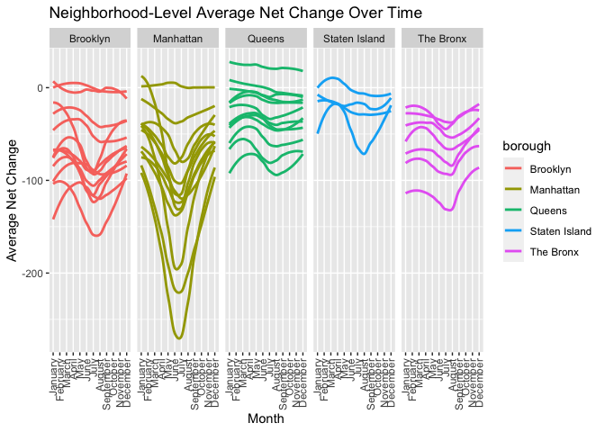

p8105_mtp_lvr2115
================
Laura Robles-Torres
2023-10-18

# Introduction

The data being imported and cleaned are from Change of Address (COAs)
forms received by the United States Post Office in New York City between
2018 and 2022. They include the total number of COAs to and from each
NYC zip code for each month of those 5 years. These COAs are filed by
people who are moving to ensure that mail is delivered to their new
address. There is another dataset being worked on that includes zipcode,
neighborhood, and county data for New York City.

## Problem 1

Given that in some cases the borough name and the county name differ, a
dataset with neighborhood data called `zipcodes` is imported and tidied.
A new variable `borough` is created in this dataset to accurately
reflect where borough each zipcode is located in.

``` r
zipcodes = 
  read_csv("./zip codes.csv") |> #import dataset
  janitor::clean_names() |> #clean var names
  mutate(
    borough = recode(county_name, 
                     "Bronx" = "The Bronx",
                     "Kings" = "Brooklyn",
                     "New York" = "Manhattan",
                     "Richmond" = "Staten Island") #create borough var based on county
)
```

    ## Rows: 324 Columns: 7
    ## ── Column specification ────────────────────────────────────────────────────────
    ## Delimiter: ","
    ## chr (4): County Name, County Code, File Date, Neighborhood
    ## dbl (3): State FIPS, County FIPS, ZipCode
    ## 
    ## ℹ Use `spec()` to retrieve the full column specification for this data.
    ## ℹ Specify the column types or set `show_col_types = FALSE` to quiet this message.

Given that the data from COAs for each year is in a different Excel
sheet, each sheet is exported and cleaned before being combined via
`bind_rows` into a dataset called `combined_coa`. Variables
`total_perm_in` and `total_perm_out`indicate the total number of
permanent address changes going into and out of each zip code,
respectively. A new variable called `net_change`is created in each
annual dataset that subtracts each `total_perm_out` from each
`total_perm_in` value to reflect the increase or decrease in COAs that
month and year. Additionally, a `year` variable is created by separating
`month` into year, number of the corresponding month, and day.

``` r
coa_2018 = 
  readxl::read_excel("./USPS CHANGE OF ADDRESS NYC.xlsx", sheet = "2018") |> #import dataset
  janitor::clean_names() |> #clean var names
  separate(month, into = c("year", "month_num", "day"), convert = TRUE) |> #create year var
   mutate(
    net_change = total_perm_in - total_perm_out) #Create net_change var 

coa_2019 = 
  readxl::read_excel("./USPS CHANGE OF ADDRESS NYC.xlsx", sheet = "2019") |> #import dataset
  janitor::clean_names() |> #clean var names
  separate(month, into = c("year", "month_num", "day"), convert = TRUE) |> #create year var
   mutate(
    net_change = total_perm_in - total_perm_out) #Create net_change var 

coa_2020 = 
  readxl::read_excel("./USPS CHANGE OF ADDRESS NYC.xlsx", sheet = "2020") |> #import dataset
  janitor::clean_names() |> #clean var names
  separate(month, into = c("year", "month_num", "day"), convert = TRUE) |> #create year var
   mutate(
    net_change = total_perm_in - total_perm_out) #Create net_change var 

coa_2021 = 
  readxl::read_excel("./USPS CHANGE OF ADDRESS NYC.xlsx", sheet = "2021") |> #import dataset
  janitor::clean_names() |> #clean var names
  separate(month, into = c("year", "month_num", "day"), convert = TRUE) |> #create year var
   mutate(
    net_change = total_perm_in - total_perm_out) #Create net_change var 

coa_2022 = 
  readxl::read_excel("./USPS CHANGE OF ADDRESS NYC.xlsx", sheet = "2022") |> #import dataset
  janitor::clean_names() |> #clean var names
  separate(month, into = c("year", "month_num", "day"), convert = TRUE) |> #create year var
   mutate(
    net_change = total_perm_in - total_perm_out) #Create net_change var 
```

Then, all of the annual datasets for COAs data from years 2018 and 2022
were bound together and the variable `zipcode` was re-named to
`zip_code` to match `zipcodes` and allow for merging.

``` r
combined_coa =
    bind_rows(coa_2018, coa_2019, coa_2020,coa_2021,coa_2022) |>
  rename("zip_code"="zipcode") #combine COA data from all sheets belonging to different years
```

Merging `combined_coa` with `zipcodes`:

``` r
merged_coazips = 
  left_join(zipcodes, combined_coa, by="zip_code") |> #merge COA with zipcode datasets 
  select(everything(), -county_name, -state_fips, -file_date, -day, -starts_with("county")) 
```

    ## Warning in left_join(zipcodes, combined_coa, by = "zip_code"): Detected an unexpected many-to-many relationship between `x` and `y`.
    ## ℹ Row 1 of `x` matches multiple rows in `y`.
    ## ℹ Row 88 of `y` matches multiple rows in `x`.
    ## ℹ If a many-to-many relationship is expected, set `relationship =
    ##   "many-to-many"` to silence this warning.

``` r
str(merged_coazips) 
```

    ## tibble [12,168 × 9] (S3: tbl_df/tbl/data.frame)
    ##  $ zip_code      : num [1:12168] 10451 10451 10451 10451 10451 ...
    ##  $ neighborhood  : chr [1:12168] "High Bridge and Morrisania" "High Bridge and Morrisania" "High Bridge and Morrisania" "High Bridge and Morrisania" ...
    ##  $ borough       : chr [1:12168] "The Bronx" "The Bronx" "The Bronx" "The Bronx" ...
    ##  $ year          : int [1:12168] 2018 2018 2018 2018 2018 2018 2018 2018 2018 2018 ...
    ##  $ month_num     : int [1:12168] 1 2 3 4 5 6 7 8 9 10 ...
    ##  $ city          : chr [1:12168] "BRONX" "BRONX" "BRONX" "BRONX" ...
    ##  $ total_perm_out: num [1:12168] 263 197 219 207 240 220 215 238 209 219 ...
    ##  $ total_perm_in : num [1:12168] 193 172 204 180 228 249 264 277 268 217 ...
    ##  $ net_change    : num [1:12168] -70 -25 -15 -27 -12 29 49 39 59 -2 ...

The final tidy dataset `merged_coazips` has 12168 observations and 9
variables and tells us about the net change in COAs for a given year
from years 2018 to 2022.

In the merged dataset total, there are 320 zipcodes found and 43 unique
neighborhoods.

This table shows the most common values of city in the borough of
Manhattan.

``` r
merged_coazips |> 
  filter(borough %in% c("Manhattan")) |>
  group_by(borough) |> 
  count(city) |> 
  mutate(rank = min_rank(desc(n))) |> 
  arrange(desc(n)) |>
  knitr::kable()
```

| borough   | city             |    n | rank |
|:----------|:-----------------|-----:|-----:|
| Manhattan | NEW YORK         | 3477 |    1 |
| Manhattan | BRONX            |   60 |    2 |
| Manhattan | BROOKLYN         |   59 |    3 |
| Manhattan | NA               |   57 |    4 |
| Manhattan | CANAL STREET     |    4 |    5 |
| Manhattan | ROOSEVELT ISL    |    4 |    5 |
| Manhattan | ROOSEVELT ISLAND |    4 |    5 |
| Manhattan | BOWLING GREEN    |    1 |    8 |
| Manhattan | BROOKLYN HEIGHTS |    1 |    8 |
| Manhattan | NYC              |    1 |    8 |
| Manhattan | SECHEDATY        |    1 |    8 |
| Manhattan | WALL STREET      |    1 |    8 |

This table shows the most common values of city in the borough of
Queens.

``` r
merged_coazips |> 
  filter(borough %in% c("Queens")) |>
  group_by(borough) |> 
  count(city) |> 
  mutate(rank = min_rank(desc(n))) |> 
  arrange(desc(n)) |>
  knitr::kable()
```

| borough | city                |   n | rank |
|:--------|:--------------------|----:|-----:|
| Queens  | JAMAICA             | 372 |    1 |
| Queens  | FLUSHING            | 309 |    2 |
| Queens  | ASTORIA             | 230 |    3 |
| Queens  | QUEENS VILLAGE      | 165 |    4 |
| Queens  | BAYSIDE             | 135 |    5 |
| Queens  | LONG ISLAND CITY    | 120 |    6 |
| Queens  | EAST ELMHURST       | 117 |    7 |
| Queens  | OZONE PARK          | 116 |    8 |
| Queens  | FRESH MEADOWS       | 107 |    9 |
| Queens  | FAR ROCKAWAY        | 102 |   10 |
| Queens  | LITTLE NECK         |  79 |   11 |
| Queens  | RIDGEWOOD           |  70 |   12 |
| Queens  | FLORAL PARK         |  68 |   13 |
| Queens  | ELMHURST            |  63 |   14 |
| Queens  | KEW GARDENS         |  62 |   15 |
| Queens  | BELLEROSE           |  60 |   16 |
| Queens  | BROOKLYN            |  60 |   16 |
| Queens  | COLLEGE POINT       |  60 |   16 |
| Queens  | CORONA              |  60 |   16 |
| Queens  | HOWARD BEACH        |  60 |   16 |
| Queens  | REGO PARK           |  60 |   16 |
| Queens  | FOREST HILLS        |  59 |   22 |
| Queens  | HOLLIS              |  59 |   22 |
| Queens  | ROSEDALE            |  59 |   22 |
| Queens  | WOODHAVEN           |  59 |   22 |
| Queens  | WOODSIDE            |  59 |   22 |
| Queens  | CAMBRIA HEIGHTS     |  58 |   27 |
| Queens  | MASPETH             |  58 |   27 |
| Queens  | MIDDLE VILLAGE      |  58 |   27 |
| Queens  | SAINT ALBANS        |  57 |   30 |
| Queens  | ARVERNE             |  56 |   31 |
| Queens  | JACKSON HEIGHTS     |  56 |   31 |
| Queens  | WHITESTONE          |  55 |   33 |
| Queens  | RICHMOND HILL       |  54 |   34 |
| Queens  | GLEN OAKS           |  52 |   35 |
| Queens  | SUNNYSIDE           |  51 |   36 |
| Queens  | ROCKAWAY BEACH      |  49 |   37 |
| Queens  | SOUTH OZONE PARK    |  49 |   37 |
| Queens  | BREEZY POINT        |  47 |   39 |
| Queens  | SOUTH RICHMOND HILL |  47 |   39 |
| Queens  | ROCKAWAY PARK       |  40 |   41 |
| Queens  | DOUGLASTON          |  39 |   42 |
| Queens  | OAKLAND GARDENS     |  38 |   43 |
| Queens  | SPRINGFIELD GARDENS |  30 |   44 |
| Queens  | LAURELTON           |  28 |   45 |
| Queens  | LONG IS CITY        |  19 |   46 |
| Queens  | BRIARWOOD           |  16 |   47 |
| Queens  | NA                  |  16 |   47 |
| Queens  | ROCKAWAY POINT      |  13 |   49 |
| Queens  | BELLE HARBOR        |  11 |   50 |
| Queens  | GLENDALE            |  11 |   50 |
| Queens  | S RICHMOND HL       |   9 |   52 |
| Queens  | QUEENS VLG          |   8 |   53 |
| Queens  | S OZONE PARK        |   8 |   53 |
| Queens  | BAYSIDE HILLS       |   6 |   55 |
| Queens  | BROAD CHANNEL       |   5 |   56 |
| Queens  | BEECHHURST          |   4 |   57 |
| Queens  | KEW GARDENS HILLS   |   4 |   57 |
| Queens  | NEPONSIT            |   4 |   57 |
| Queens  | AUBURNDALE          |   2 |   60 |
| Queens  | BELLEROSE MANOR     |   2 |   60 |
| Queens  | SPRNGFLD GDNS       |   2 |   60 |
| Queens  | CALVERTON           |   1 |   63 |
| Queens  | CAMBRIA HTS         |   1 |   63 |
| Queens  | JACKSON HTS         |   1 |   63 |
| Queens  | MIDDLE VLG          |   1 |   63 |
| Queens  | NEW YORK CITY       |   1 |   63 |
| Queens  | ST ALBANS           |   1 |   63 |

There are 60 months between 2018 and 2022, but many ZIP codes have fewer
than 60 observations; most of these are also missing neighborhood
values. Discuss why this might be the case, using a few concrete
examples as illustration.

## Problem 2

This table shows the average of net_change in each borough and year.

``` r
merged_coazips |>
  group_by(year, borough) |>
  summarize(mean_net_change = mean(net_change)) |>
  knitr::kable(digits = 2)
```

    ## `summarise()` has grouped output by 'year'. You can override using the
    ## `.groups` argument.

| year | borough       | mean_net_change |
|-----:|:--------------|----------------:|
| 2018 | Brooklyn      |          -46.18 |
| 2018 | Manhattan     |          -39.80 |
| 2018 | Queens        |          -25.71 |
| 2018 | Staten Island |           -9.85 |
| 2018 | The Bronx     |          -46.30 |
| 2019 | Brooklyn      |          -51.68 |
| 2019 | Manhattan     |          -52.54 |
| 2019 | Queens        |          -28.09 |
| 2019 | Staten Island |           -9.12 |
| 2019 | The Bronx     |          -48.02 |
| 2020 | Brooklyn      |         -110.67 |
| 2020 | Manhattan     |         -127.70 |
| 2020 | Queens        |          -46.55 |
| 2020 | Staten Island |          -10.54 |
| 2020 | The Bronx     |          -72.65 |
| 2021 | Brooklyn      |          -76.84 |
| 2021 | Manhattan     |          -39.47 |
| 2021 | Queens        |          -43.30 |
| 2021 | Staten Island |          -22.55 |
| 2021 | The Bronx     |          -66.10 |
| 2022 | Brooklyn      |          -55.38 |
| 2022 | Manhattan     |          -46.18 |
| 2022 | Queens        |          -29.28 |
| 2022 | Staten Island |          -16.30 |
| 2022 | The Bronx     |          -53.19 |
|   NA | Brooklyn      |              NA |
|   NA | Manhattan     |              NA |
|   NA | Queens        |              NA |
|   NA | Staten Island |              NA |
|   NA | The Bronx     |              NA |

This table shows, across all observed data, the five lowest values of
net_change. This table should include ZIP code, neighborhood, and the
year and month.

``` r
merged_coazips |>
  group_by(zip_code) |>
  filter(min_rank(net_change) < 6) |>
  arrange(net_change) |>
  knitr::kable()
```

| zip_code | neighborhood                  | borough       | year | month_num | city                | total_perm_out | total_perm_in | net_change |
|---------:|:------------------------------|:--------------|-----:|----------:|:--------------------|---------------:|--------------:|-----------:|
|    10022 | Gramercy Park and Murray Hill | Manhattan     | 2020 |         5 | NEW YORK            |           1257 |           274 |       -983 |
|    10009 | Lower East Side               | Manhattan     | 2020 |         7 | NEW YORK            |           1480 |           561 |       -919 |
|    10016 | Gramercy Park and Murray Hill | Manhattan     | 2020 |         6 | NEW YORK            |           1690 |           783 |       -907 |
|    10016 | Gramercy Park and Murray Hill | Manhattan     | 2020 |         7 | NEW YORK            |           1772 |           917 |       -855 |
|    10009 | Lower East Side               | Manhattan     | 2020 |         6 | NEW YORK            |           1245 |           441 |       -804 |
|    10009 | Lower East Side               | Manhattan     | 2020 |         8 | NEW YORK            |           1481 |           703 |       -778 |
|    10016 | Gramercy Park and Murray Hill | Manhattan     | 2020 |         9 | NEW YORK            |           1582 |           818 |       -764 |
|    10016 | Gramercy Park and Murray Hill | Manhattan     | 2020 |         8 | NEW YORK            |           1619 |           903 |       -716 |
|    10003 | Lower East Side               | Manhattan     | 2020 |         5 | NEW YORK            |           1057 |           394 |       -663 |
|    10016 | Gramercy Park and Murray Hill | Manhattan     | 2020 |         5 | NEW YORK            |           1169 |           506 |       -663 |
|    10009 | Lower East Side               | Manhattan     | 2020 |         9 | NEW YORK            |           1166 |           541 |       -625 |
|    10009 | Lower East Side               | Manhattan     | 2020 |         5 | NEW YORK            |            915 |           302 |       -613 |
|    10025 | Upper West Side               | Manhattan     | 2020 |         6 | NEW YORK            |           1340 |           732 |       -608 |
|    10019 | Chelsea and Clinton           | Manhattan     | 2020 |        10 | NEW YORK            |           1251 |           661 |       -590 |
|    10003 | Lower East Side               | Manhattan     | 2020 |         6 | NEW YORK            |           1167 |           584 |       -583 |
|    10003 | Lower East Side               | Manhattan     | 2020 |         7 | NEW YORK            |           1331 |           752 |       -579 |
|    10025 | Upper West Side               | Manhattan     | 2020 |         7 | NEW YORK            |           1484 |           909 |       -575 |
|    10128 | Upper East Side               | Manhattan     | 2020 |         6 | NEW YORK            |           1231 |           658 |       -573 |
|    10011 | Chelsea and Clinton           | Manhattan     | 2020 |         6 | NEW YORK            |           1132 |           560 |       -572 |
|    10128 | Upper East Side               | Manhattan     | 2020 |         7 | NEW YORK            |           1329 |           757 |       -572 |
|    11201 | Northwest Brooklyn            | Brooklyn      | 2020 |         6 | BROOKLYN            |           1447 |           876 |       -571 |
|    11201 | Northwest Brooklyn            | Manhattan     | 2020 |         6 | BROOKLYN            |           1447 |           876 |       -571 |
|    10010 | Gramercy Park and Murray Hill | Manhattan     | 2020 |         6 | NEW YORK            |            891 |           326 |       -565 |
|    10011 | Chelsea and Clinton           | Manhattan     | 2020 |         7 | NEW YORK            |           1208 |           657 |       -551 |
|    10019 | Chelsea and Clinton           | Manhattan     | 2020 |         8 | NEW YORK            |           1394 |           854 |       -540 |
|    10128 | Upper East Side               | Manhattan     | 2020 |         8 | NEW YORK            |           1359 |           823 |       -536 |
|    11211 | Greenpoint                    | Brooklyn      | 2020 |         6 | BROOKLYN            |           1185 |           652 |       -533 |
|    10025 | Upper West Side               | Manhattan     | 2020 |         8 | NEW YORK            |           1560 |          1028 |       -532 |
|    11201 | Northwest Brooklyn            | Brooklyn      | 2020 |         7 | BROOKLYN            |           1554 |          1046 |       -508 |
|    11201 | Northwest Brooklyn            | Manhattan     | 2020 |         7 | BROOKLYN            |           1554 |          1046 |       -508 |
|    10011 | Chelsea and Clinton           | Manhattan     | 2020 |         5 | NEW YORK            |            874 |           371 |       -503 |
|    10002 | Lower East Side               | Manhattan     | 2020 |         8 | NEW YORK            |           1034 |           534 |       -500 |
|    10001 | Chelsea and Clinton           | Manhattan     | 2020 |         7 | NEW YORK            |           1078 |           585 |       -493 |
|    10019 | Chelsea and Clinton           | Manhattan     | 2020 |         7 | NEW YORK            |           1385 |           896 |       -489 |
|    10019 | Chelsea and Clinton           | Manhattan     | 2020 |         9 | NEW YORK            |           1272 |           785 |       -487 |
|    11101 | Northwest Queens              | Queens        | 2020 |         7 | LONG ISLAND CITY    |           1188 |           704 |       -484 |
|    10028 | Upper East Side               | Manhattan     | 2020 |         8 | NEW YORK            |           1132 |           652 |       -480 |
|    10036 | Chelsea and Clinton           | Manhattan     | 2020 |         7 | NEW YORK            |           1009 |           537 |       -472 |
|    10003 | Lower East Side               | Manhattan     | 2020 |         8 | NEW YORK            |           1251 |           785 |       -466 |
|    10019 | Chelsea and Clinton           | Manhattan     | 2021 |         3 | NEW YORK            |           1249 |           795 |       -454 |
|    10011 | Chelsea and Clinton           | Manhattan     | 2020 |         8 | NEW YORK            |           1212 |           767 |       -445 |
|    10023 | Upper West Side               | Manhattan     | 2020 |         7 | NEW YORK            |           1373 |           931 |       -442 |
|    10023 | Upper West Side               | Manhattan     | 2020 |         6 | NEW YORK            |           1185 |           747 |       -438 |
|    10022 | Gramercy Park and Murray Hill | Manhattan     | 2020 |         8 | NEW YORK            |            957 |           520 |       -437 |
|    11201 | Northwest Brooklyn            | Brooklyn      | 2020 |         5 | BROOKLYN            |           1004 |           569 |       -435 |
|    11201 | Northwest Brooklyn            | Manhattan     | 2020 |         5 | BROOKLYN            |           1004 |           569 |       -435 |
|    10011 | Chelsea and Clinton           | Manhattan     | 2020 |        10 | NEW YORK            |           1087 |           659 |       -428 |
|    11216 | Central Brooklyn              | Brooklyn      | 2020 |         8 | BROOKLYN            |           1152 |           728 |       -424 |
|    10003 | Lower East Side               | Manhattan     | 2020 |         9 | NEW YORK            |           1056 |           632 |       -424 |
|    10028 | Upper East Side               | Manhattan     | 2020 |         6 | NEW YORK            |            893 |           471 |       -422 |
|    11221 | Bushwick and Williamsburg     | Brooklyn      | 2020 |         8 | BROOKLYN            |           1257 |           836 |       -421 |
|    11238 | Central Brooklyn              | Brooklyn      | 2020 |         8 | BROOKLYN            |           1256 |           843 |       -413 |
|    10001 | Chelsea and Clinton           | Manhattan     | 2020 |         6 | NEW YORK            |            894 |           483 |       -411 |
|    10128 | Upper East Side               | Manhattan     | 2020 |         9 | NEW YORK            |           1039 |           630 |       -409 |
|    10002 | Lower East Side               | Manhattan     | 2020 |         6 | NEW YORK            |            841 |           433 |       -408 |
|    10025 | Upper West Side               | Manhattan     | 2020 |         9 | NEW YORK            |           1195 |           791 |       -404 |
|    10010 | Gramercy Park and Murray Hill | Manhattan     | 2018 |         7 | NEW YORK            |            873 |           472 |       -401 |
|    10025 | Upper West Side               | Manhattan     | 2019 |         7 | NEW YORK            |           1190 |           792 |       -398 |
|    10036 | Chelsea and Clinton           | Manhattan     | 2020 |         8 | NEW YORK            |            989 |           594 |       -395 |
|    10010 | Gramercy Park and Murray Hill | Manhattan     | 2020 |         8 | NEW YORK            |            839 |           446 |       -393 |
|    10024 | Upper West Side               | Manhattan     | 2020 |         6 | NEW YORK            |            960 |           567 |       -393 |
|    11221 | Bushwick and Williamsburg     | Brooklyn      | 2020 |         9 | BROOKLYN            |           1086 |           694 |       -392 |
|    10022 | Gramercy Park and Murray Hill | Manhattan     | 2020 |         7 | NEW YORK            |            871 |           479 |       -392 |
|    11206 | Bushwick and Williamsburg     | Brooklyn      | 2020 |         9 | BROOKLYN            |            953 |           562 |       -391 |
|    11206 | Bushwick and Williamsburg     | Brooklyn      | 2020 |         8 | BROOKLYN            |           1106 |           716 |       -390 |
|    10001 | Chelsea and Clinton           | Manhattan     | 2020 |         9 | NEW YORK            |           1009 |           619 |       -390 |
|    11101 | Northwest Queens              | Queens        | 2020 |         9 | LONG ISLAND CITY    |            981 |           592 |       -389 |
|    10010 | Gramercy Park and Murray Hill | Manhattan     | 2020 |         7 | NEW YORK            |            871 |           483 |       -388 |
|    11101 | Northwest Queens              | Queens        | 2020 |         8 | LONG ISLAND CITY    |           1168 |           780 |       -388 |
|    10024 | Upper West Side               | Manhattan     | 2020 |         8 | NEW YORK            |           1164 |           777 |       -387 |
|    10012 | Greenwich Village and Soho    | Manhattan     | 2020 |         6 | NEW YORK            |            620 |           235 |       -385 |
|    10012 | Greenwich Village and Soho    | Manhattan     | 2020 |         7 | NEW YORK            |            689 |           304 |       -385 |
|    11221 | Bushwick and Williamsburg     | Brooklyn      | 2020 |         7 | BROOKLYN            |           1167 |           785 |       -382 |
|    10036 | Chelsea and Clinton           | Manhattan     | 2020 |         6 | NEW YORK            |            791 |           410 |       -381 |
|    10018 | Chelsea and Clinton           | Manhattan     | 2020 |         3 | NEW YORK            |            530 |           152 |       -378 |
|    10031 | Inwood and Washington Heights | Manhattan     | 2020 |         7 | NEW YORK            |            756 |           379 |       -377 |
|    10022 | Gramercy Park and Murray Hill | Manhattan     | 2020 |         9 | NEW YORK            |            830 |           458 |       -372 |
|    10018 | Chelsea and Clinton           | Manhattan     | 2020 |         8 | NEW YORK            |            638 |           270 |       -368 |
|    11217 | Northwest Brooklyn            | Brooklyn      | 2020 |         7 | BROOKLYN            |            897 |           530 |       -367 |
|    10027 | Central Harlem                | Manhattan     | 2020 |         6 | NEW YORK            |            682 |           320 |       -362 |
|    10031 | Inwood and Washington Heights | Manhattan     | 2020 |         8 | NEW YORK            |            766 |           404 |       -362 |
|    10014 | Greenwich Village and Soho    | Manhattan     | 2020 |         5 | NEW YORK            |            636 |           275 |       -361 |
|    10021 | Upper East Side               | Manhattan     | 2020 |         7 | NEW YORK            |            862 |           504 |       -358 |
|    10010 | Gramercy Park and Murray Hill | Manhattan     | 2020 |         5 | NEW YORK            |            591 |           237 |       -354 |
|    10017 | Gramercy Park and Murray Hill | Manhattan     | 2020 |         6 | NEW YORK            |            614 |           262 |       -352 |
|    10014 | Greenwich Village and Soho    | Manhattan     | 2020 |         6 | NEW YORK            |            778 |           427 |       -351 |
|    11211 | Greenpoint                    | Brooklyn      | 2022 |         7 | BROOKLYN            |            764 |           417 |       -347 |
|    10018 | Chelsea and Clinton           | Manhattan     | 2020 |         7 | NEW YORK            |            614 |           267 |       -347 |
|    10028 | Upper East Side               | Manhattan     | 2020 |         5 | NEW YORK            |            660 |           314 |       -346 |
|    10002 | Lower East Side               | Manhattan     | 2020 |         7 | NEW YORK            |            892 |           548 |       -344 |
|    10024 | Upper West Side               | Manhattan     | 2020 |         7 | NEW YORK            |            971 |           630 |       -341 |
|    10024 | Upper West Side               | Manhattan     | 2020 |         5 | NEW YORK            |            713 |           374 |       -339 |
|    11216 | Central Brooklyn              | Brooklyn      | 2020 |         7 | BROOKLYN            |           1009 |           671 |       -338 |
|    10028 | Upper East Side               | Manhattan     | 2020 |         7 | NEW YORK            |            926 |           588 |       -338 |
|    11101 | Northwest Queens              | Queens        | 2020 |         6 | LONG ISLAND CITY    |            925 |           587 |       -338 |
|    11215 | Northwest Brooklyn            | Brooklyn      | 2020 |         6 | BROOKLYN            |            978 |           641 |       -337 |
|    10023 | Upper West Side               | Manhattan     | 2020 |         9 | NEW YORK            |           1168 |           831 |       -337 |
|    11238 | Central Brooklyn              | Brooklyn      | 2020 |         6 | BROOKLYN            |            960 |           625 |       -335 |
|    10027 | Central Harlem                | Manhattan     | 2020 |         7 | NEW YORK            |            760 |           425 |       -335 |
|    10023 | Upper West Side               | Manhattan     | 2020 |         8 | NEW YORK            |           1350 |          1016 |       -334 |
|    11226 | Flatbush                      | Brooklyn      | 2020 |         8 | BROOKLYN            |            942 |           609 |       -333 |
|    10023 | Upper West Side               | Manhattan     | 2020 |         5 | NEW YORK            |            853 |           520 |       -333 |
|    10036 | Chelsea and Clinton           | Manhattan     | 2020 |         9 | NEW YORK            |            873 |           541 |       -332 |
|    11237 | Bushwick and Williamsburg     | Brooklyn      | 2020 |         7 | BROOKLYN            |            714 |           386 |       -328 |
|    11221 | Bushwick and Williamsburg     | Brooklyn      | 2020 |         6 | BROOKLYN            |            964 |           639 |       -325 |
|    11206 | Bushwick and Williamsburg     | Brooklyn      | 2020 |         5 | BROOKLYN            |            685 |           364 |       -321 |
|    10012 | Greenwich Village and Soho    | Manhattan     | 2020 |         8 | NEW YORK            |            695 |           376 |       -319 |
|    10065 | Upper East Side               | Manhattan     | 2020 |         6 | NEW YORK            |            676 |           358 |       -318 |
|    10013 | Greenwich Village and Soho    | Manhattan     | 2020 |         7 | CANAL STREET        |            679 |           363 |       -316 |
|    10128 | Upper East Side               | Manhattan     | 2020 |         5 | NEW YORK            |            747 |           431 |       -316 |
|    10036 | Chelsea and Clinton           | Manhattan     | 2020 |         5 | NEW YORK            |            610 |           295 |       -315 |
|    10014 | Greenwich Village and Soho    | Manhattan     | 2020 |         7 | NEW YORK            |            786 |           475 |       -311 |
|    11215 | Northwest Brooklyn            | Brooklyn      | 2020 |         8 | BROOKLYN            |           1234 |           924 |       -310 |
|    11221 | Bushwick and Williamsburg     | Brooklyn      | 2020 |        10 | BROOKLYN            |            866 |           557 |       -309 |
|    10028 | Upper East Side               | Manhattan     | 2020 |         9 | NEW YORK            |            878 |           569 |       -309 |
|    10014 | Greenwich Village and Soho    | Manhattan     | 2020 |         8 | NEW YORK            |            851 |           545 |       -306 |
|    10029 | East Harlem                   | Manhattan     | 2020 |         6 | NEW YORK            |            688 |           382 |       -306 |
|    10001 | Chelsea and Clinton           | Manhattan     | 2020 |         8 | NEW YORK            |           1015 |           710 |       -305 |
|    11237 | Bushwick and Williamsburg     | Brooklyn      | 2020 |         8 | BROOKLYN            |            822 |           521 |       -301 |
|    10032 | Inwood and Washington Heights | Manhattan     | 2020 |         6 | NEW YORK            |            637 |           336 |       -301 |
|    10001 | Chelsea and Clinton           | Manhattan     | 2020 |         5 | NEW YORK            |            592 |           293 |       -299 |
|    10018 | Chelsea and Clinton           | Manhattan     | 2020 |         6 | NEW YORK            |            502 |           203 |       -299 |
|    11206 | Bushwick and Williamsburg     | Brooklyn      | 2020 |         7 | BROOKLYN            |            954 |           657 |       -297 |
|    10002 | Lower East Side               | Manhattan     | 2020 |         5 | NEW YORK            |            667 |           370 |       -297 |
|    10027 | Central Harlem                | Manhattan     | 2020 |         8 | NEW YORK            |            860 |           563 |       -297 |
|    11385 | West Central Queens           | Queens        | 2020 |         8 | RIDGEWOOD           |            923 |           629 |       -294 |
|    10017 | Gramercy Park and Murray Hill | Manhattan     | 2020 |         8 | NEW YORK            |            626 |           333 |       -293 |
|    10027 | Central Harlem                | Manhattan     | 2020 |         3 | NEW YORK            |            567 |           274 |       -293 |
|    10021 | Upper East Side               | Manhattan     | 2020 |         6 | NEW YORK            |            862 |           573 |       -289 |
|    10002 | Lower East Side               | Manhattan     | 2020 |         9 | NEW YORK            |            817 |           531 |       -286 |
|    11226 | Flatbush                      | Brooklyn      | 2020 |         9 | BROOKLYN            |            844 |           559 |       -285 |
|    11226 | Flatbush                      | Brooklyn      | 2020 |         7 | BROOKLYN            |            890 |           606 |       -284 |
|    10032 | Inwood and Washington Heights | Manhattan     | 2020 |         7 | NEW YORK            |            630 |           346 |       -284 |
|    11373 | West Queens                   | Queens        | 2020 |        12 | ELMHURST            |            663 |           381 |       -282 |
|    10024 | Upper West Side               | Manhattan     | 2020 |        10 | NEW YORK            |            787 |           506 |       -281 |
|    10013 | Greenwich Village and Soho    | Manhattan     | 2020 |         6 | NEW YORK            |            585 |           308 |       -277 |
|    10032 | Inwood and Washington Heights | Manhattan     | 2021 |         5 | NEW YORK            |            558 |           281 |       -277 |
|    10038 | Lower Manhattan               | Manhattan     | 2020 |         9 | NEW YORK            |            565 |           288 |       -277 |
|    11101 | Northwest Queens              | Queens        | 2020 |        10 | LONG ISLAND CITY    |            880 |           603 |       -277 |
|    11238 | Central Brooklyn              | Brooklyn      | 2020 |         9 | BROOKLYN            |           1068 |           792 |       -276 |
|    10018 | Chelsea and Clinton           | Manhattan     | 2020 |         9 | NEW YORK            |            572 |           297 |       -275 |
|    11237 | Bushwick and Williamsburg     | Brooklyn      | 2020 |         6 | BROOKLYN            |            590 |           316 |       -274 |
|    10038 | Lower Manhattan               | Manhattan     | 2020 |         5 | NEW YORK            |            454 |           180 |       -274 |
|    11355 | North Queens                  | Queens        | 2021 |         1 | FLUSHING            |            730 |           457 |       -273 |
|    10012 | Greenwich Village and Soho    | Manhattan     | 2020 |        11 | NEW YORK            |            491 |           219 |       -272 |
|    10022 | Gramercy Park and Murray Hill | Manhattan     | 2020 |         6 | NEW YORK            |            714 |           442 |       -272 |
|    10022 | Gramercy Park and Murray Hill | Manhattan     | 2020 |        12 | NEW YORK            |            643 |           371 |       -272 |
|    11206 | Bushwick and Williamsburg     | Brooklyn      | 2020 |        10 | BROOKLYN            |            672 |           402 |       -270 |
|    11207 | East New York and New Lots    | Brooklyn      | 2021 |         1 | BROOKLYN            |            683 |           413 |       -270 |
|    10032 | Inwood and Washington Heights | Manhattan     | 2020 |         9 | NEW YORK            |            517 |           247 |       -270 |
|    10032 | Inwood and Washington Heights | Manhattan     | 2020 |        10 | NEW YORK            |            486 |           216 |       -270 |
|    10038 | Lower Manhattan               | Manhattan     | 2020 |         6 | NEW YORK            |            507 |           238 |       -269 |
|    10467 | Bronx Park and Fordham        | The Bronx     | 2021 |         6 | BRONX               |            599 |           331 |       -268 |
|    11226 | Flatbush                      | Brooklyn      | 2020 |         6 | BROOKLYN            |            785 |           517 |       -268 |
|    10012 | Greenwich Village and Soho    | Manhattan     | 2020 |         5 | NEW YORK            |            440 |           173 |       -267 |
|    11211 | Greenpoint                    | Brooklyn      | 2020 |        10 | BROOKLYN            |            923 |           657 |       -266 |
|    10029 | East Harlem                   | Manhattan     | 2020 |         7 | NEW YORK            |            683 |           417 |       -266 |
|    11373 | West Queens                   | Queens        | 2021 |         1 | ELMHURST            |            713 |           447 |       -266 |
|    11216 | Central Brooklyn              | Brooklyn      | 2020 |         9 | BROOKLYN            |            927 |           662 |       -265 |
|    10456 | High Bridge and Morrisania    | The Bronx     | 2021 |         3 | BRONX               |            532 |           268 |       -264 |
|    10021 | Upper East Side               | Manhattan     | 2020 |        10 | NEW YORK            |            646 |           382 |       -264 |
|    10031 | Inwood and Washington Heights | Manhattan     | 2020 |         6 | NEW YORK            |            568 |           306 |       -262 |
|    11208 | East New York and New Lots    | Brooklyn      | 2021 |         1 | BROOKLYN            |            671 |           410 |       -261 |
|    11211 | Greenpoint                    | Brooklyn      | 2022 |         8 | BROOKLYN            |            666 |           406 |       -260 |
|    11385 | West Central Queens           | Queens        | 2020 |        10 | RIDGEWOOD           |            671 |           412 |       -259 |
|    11211 | Greenpoint                    | Brooklyn      | 2020 |         5 | BROOKLYN            |            736 |           478 |       -258 |
|    11211 | Greenpoint                    | Brooklyn      | 2020 |         9 | BROOKLYN            |           1104 |           846 |       -258 |
|    10013 | Greenwich Village and Soho    | Manhattan     | 2020 |         5 | NEW YORK            |            498 |           240 |       -258 |
|    10027 | Central Harlem                | Manhattan     | 2018 |         5 | NEW YORK            |            622 |           364 |       -258 |
|    10027 | Central Harlem                | Manhattan     | 2020 |         5 | NEW YORK            |            504 |           246 |       -258 |
|    11355 | North Queens                  | Queens        | 2021 |         9 | FLUSHING            |            582 |           325 |       -257 |
|    11220 | Sunset Park                   | Brooklyn      | 2018 |         1 | BROOKLYN            |            531 |           275 |       -256 |
|    11373 | West Queens                   | Queens        | 2020 |         8 | ELMHURST            |            724 |           468 |       -256 |
|    10017 | Gramercy Park and Murray Hill | Manhattan     | 2020 |         7 | NEW YORK            |            556 |           301 |       -255 |
|    10038 | Lower Manhattan               | Manhattan     | 2020 |         7 | NEW YORK            |            585 |           330 |       -255 |
|    11226 | Flatbush                      | Brooklyn      | 2020 |        10 | BROOKLYN            |            787 |           533 |       -254 |
|    11216 | Central Brooklyn              | Brooklyn      | 2020 |         6 | BROOKLYN            |            804 |           551 |       -253 |
|    10075 | Upper East Side               | Manhattan     | 2020 |         6 | NEW YORK            |            458 |           205 |       -253 |
|    10462 | Southeast Bronx               | The Bronx     | 2020 |         8 | BRONX               |            620 |           369 |       -251 |
|    11233 | Central Brooklyn              | Brooklyn      | 2020 |         8 | BROOKLYN            |            652 |           402 |       -250 |
|    10038 | Lower Manhattan               | Manhattan     | 2020 |         8 | NEW YORK            |            594 |           345 |       -249 |
|    11373 | West Queens                   | Queens        | 2020 |         9 | ELMHURST            |            688 |           439 |       -249 |
|    11220 | Sunset Park                   | Brooklyn      | 2021 |         1 | BROOKLYN            |            594 |           346 |       -248 |
|    11214 | Southwest Brooklyn            | Brooklyn      | 2021 |         1 | BROOKLYN            |            612 |           365 |       -247 |
|    10013 | Greenwich Village and Soho    | Manhattan     | 2020 |         8 | NEW YORK            |            634 |           387 |       -247 |
|    11373 | West Queens                   | Queens        | 2022 |         1 | ELMHURST            |            558 |           313 |       -245 |
|    10021 | Upper East Side               | Manhattan     | 2020 |         8 | NEW YORK            |            810 |           566 |       -244 |
|    10029 | East Harlem                   | Manhattan     | 2020 |         8 | NEW YORK            |            690 |           447 |       -243 |
|    11377 | West Queens                   | Queens        | 2020 |         7 | WOODSIDE            |            699 |           456 |       -243 |
|    10029 | East Harlem                   | Manhattan     | 2020 |         9 | NEW YORK            |            654 |           412 |       -242 |
|    11377 | West Queens                   | Queens        | 2021 |         1 | FLUSHING            |            698 |           457 |       -241 |
|    11385 | West Central Queens           | Queens        | 2020 |         7 | FLUSHING            |            747 |           506 |       -241 |
|    11225 | Flatbush                      | Brooklyn      | 2020 |         7 | BROOKLYN            |            644 |           404 |       -240 |
|    11215 | Northwest Brooklyn            | Brooklyn      | 2020 |         5 | BROOKLYN            |            682 |           443 |       -239 |
|    11385 | West Central Queens           | Queens        | 2020 |        12 | RIDGEWOOD           |            677 |           438 |       -239 |
|    10033 | Inwood and Washington Heights | Manhattan     | 2020 |         7 | NEW YORK            |            498 |           260 |       -238 |
|    11368 | West Queens                   | Queens        | 2021 |         3 | CORONA              |            498 |           260 |       -238 |
|    11385 | West Central Queens           | Queens        | 2020 |        11 | RIDGEWOOD           |            655 |           417 |       -238 |
|    11237 | Bushwick and Williamsburg     | Brooklyn      | 2020 |         5 | BROOKLYN            |            502 |           265 |       -237 |
|    11238 | Central Brooklyn              | Brooklyn      | 2020 |         7 | BROOKLYN            |           1056 |           819 |       -237 |
|    10021 | Upper East Side               | Manhattan     | 2020 |         5 | NEW YORK            |            525 |           289 |       -236 |
|    11237 | Bushwick and Williamsburg     | Brooklyn      | 2020 |         9 | BROOKLYN            |            666 |           431 |       -235 |
|    10467 | Bronx Park and Fordham        | The Bronx     | 2021 |         1 | BRONX               |            692 |           459 |       -233 |
|    10013 | Greenwich Village and Soho    | Manhattan     | 2020 |         9 | NEW YORK            |            577 |           344 |       -233 |
|    11208 | East New York and New Lots    | Brooklyn      | 2021 |         3 | BROOKLYN            |            603 |           373 |       -230 |
|    11222 | Greenpoint                    | Brooklyn      | 2020 |         6 | BROOKLYN            |            730 |           500 |       -230 |
|    10017 | Gramercy Park and Murray Hill | Manhattan     | 2020 |         9 | NEW YORK            |            515 |           287 |       -228 |
|    11103 | Northwest Queens              | Queens        | 2020 |         7 | ASTORIA             |            541 |           315 |       -226 |
|    11217 | Northwest Brooklyn            | Brooklyn      | 2020 |         9 | BROOKLYN            |            818 |           593 |       -225 |
|    10014 | Greenwich Village and Soho    | Manhattan     | 2020 |         9 | NEW YORK            |            745 |           520 |       -225 |
|    10005 | Lower Manhattan               | Manhattan     | 2020 |         7 | NEW YORK            |            521 |           297 |       -224 |
|    10033 | Inwood and Washington Heights | Manhattan     | 2020 |         6 | NEW YORK            |            427 |           203 |       -224 |
|    10458 | Bronx Park and Fordham        | The Bronx     | 2020 |         8 | BRONX               |            494 |           271 |       -223 |
|    11220 | Sunset Park                   | Brooklyn      | 2021 |         3 | BROOKLYN            |            607 |           384 |       -223 |
|    10029 | East Harlem                   | Manhattan     | 2019 |         7 | NEW YORK            |            605 |           382 |       -223 |
|    11217 | Northwest Brooklyn            | Brooklyn      | 2020 |         8 | BROOKLYN            |            876 |           656 |       -220 |
|    11218 | Borough Park                  | Brooklyn      | 2021 |        12 | BROOKLYN            |            447 |           227 |       -220 |
|    10105 | NA                            | Manhattan     | 2019 |         3 | NEW YORK            |            231 |            11 |       -220 |
|    11103 | Northwest Queens              | Queens        | 2020 |         8 | ASTORIA             |            586 |           366 |       -220 |
|    11220 | Sunset Park                   | Brooklyn      | 2021 |         2 | BROOKLYN            |            449 |           230 |       -219 |
|    11222 | Greenpoint                    | Brooklyn      | 2020 |         7 | BROOKLYN            |            820 |           601 |       -219 |
|    10462 | Southeast Bronx               | The Bronx     | 2021 |         9 | BRONX               |            561 |           343 |       -218 |
|    11215 | Northwest Brooklyn            | Brooklyn      | 2020 |         9 | BROOKLYN            |           1039 |           821 |       -218 |
|    10033 | Inwood and Washington Heights | Manhattan     | 2020 |         8 | NEW YORK            |            521 |           303 |       -218 |
|    10462 | Southeast Bronx               | The Bronx     | 2021 |         8 | BRONX               |            536 |           319 |       -217 |
|    11220 | Sunset Park                   | Brooklyn      | 2020 |        12 | BROOKLYN            |            476 |           259 |       -217 |
|    11238 | Central Brooklyn              | Brooklyn      | 2020 |         5 | BROOKLYN            |            674 |           457 |       -217 |
|    10065 | Upper East Side               | Manhattan     | 2020 |         5 | NEW YORK            |            416 |           199 |       -217 |
|    11377 | West Queens                   | Queens        | 2020 |         8 | WOODSIDE            |            727 |           511 |       -216 |
|    10031 | Inwood and Washington Heights | Manhattan     | 2021 |         6 | NEW YORK            |            530 |           315 |       -215 |
|    10467 | Bronx Park and Fordham        | The Bronx     | 2022 |         5 | BRONX               |            461 |           247 |       -214 |
|    10065 | Upper East Side               | Manhattan     | 2020 |         9 | NEW YORK            |            553 |           339 |       -214 |
|    11374 | West Central Queens           | Queens        | 2021 |         5 | REGO PARK           |            453 |           239 |       -214 |
|    10462 | Southeast Bronx               | The Bronx     | 2021 |         1 | BRONX               |            608 |           395 |       -213 |
|    10005 | Lower Manhattan               | Manhattan     | 2020 |         6 | NEW YORK            |            413 |           200 |       -213 |
|    10031 | Inwood and Washington Heights | Manhattan     | 2020 |         9 | NEW YORK            |            573 |           360 |       -213 |
|    10458 | Bronx Park and Fordham        | The Bronx     | 2021 |         3 | BRONX               |            516 |           304 |       -212 |
|    11377 | West Queens                   | Queens        | 2021 |         3 | WOODSIDE            |            715 |           504 |       -211 |
|    11230 | Borough Park                  | Brooklyn      | 2020 |        10 | BROOKLYN            |            522 |           312 |       -210 |
|    11106 | Northwest Queens              | Queens        | 2020 |         7 | ASTORIA             |            523 |           313 |       -210 |
|    10456 | High Bridge and Morrisania    | The Bronx     | 2020 |         6 | BRONX               |            434 |           225 |       -209 |
|    10462 | Southeast Bronx               | The Bronx     | 2021 |         6 | BRONX               |            523 |           314 |       -209 |
|    11215 | Northwest Brooklyn            | Brooklyn      | 2020 |         7 | BROOKLYN            |           1054 |           845 |       -209 |
|    11368 | West Queens                   | Queens        | 2020 |         8 | CORONA              |            505 |           296 |       -209 |
|    10040 | Inwood and Washington Heights | Manhattan     | 2020 |         8 | NEW YORK            |            448 |           240 |       -208 |
|    10467 | Bronx Park and Fordham        | The Bronx     | 2020 |        11 | BRONX               |            493 |           286 |       -207 |
|    11216 | Central Brooklyn              | Brooklyn      | 2020 |        11 | BROOKLYN            |            635 |           428 |       -207 |
|    11377 | West Queens                   | Queens        | 2022 |         6 | WOODSIDE            |            438 |           231 |       -207 |
|    11217 | Northwest Brooklyn            | Brooklyn      | 2020 |         6 | BROOKLYN            |            665 |           459 |       -206 |
|    11368 | West Queens                   | Queens        | 2020 |         1 | CORONA              |            406 |           200 |       -206 |
|    10467 | Bronx Park and Fordham        | The Bronx     | 2020 |         9 | BRONX               |            575 |           370 |       -205 |
|    11207 | East New York and New Lots    | Brooklyn      | 2020 |        10 | BROOKLYN            |            541 |           336 |       -205 |
|    11208 | East New York and New Lots    | Brooklyn      | 2020 |        12 | BROOKLYN            |            507 |           302 |       -205 |
|    11236 | Canarsie and Flatlands        | Brooklyn      | 2021 |         7 | BROOKLYN            |            473 |           268 |       -205 |
|    11218 | Borough Park                  | Brooklyn      | 2020 |         9 | BROOKLYN            |            588 |           384 |       -204 |
|    10466 | Northeast Bronx               | The Bronx     | 2021 |         3 | BRONX               |            483 |           281 |       -202 |
|    10456 | High Bridge and Morrisania    | The Bronx     | 2020 |         9 | BRONX               |            445 |           244 |       -201 |
|    11208 | East New York and New Lots    | Brooklyn      | 2021 |         5 | BROOKLYN            |            461 |           260 |       -201 |
|    11214 | Southwest Brooklyn            | Brooklyn      | 2021 |         7 | BROOKLYN            |            506 |           305 |       -201 |
|    10468 | Bronx Park and Fordham        | The Bronx     | 2020 |         8 | BRONX               |            428 |           228 |       -200 |
|    11233 | Central Brooklyn              | Brooklyn      | 2020 |        10 | BROOKLYN            |            499 |           299 |       -200 |
|    10453 | Central Bronx                 | The Bronx     | 2021 |         4 | BRONX               |            390 |           192 |       -198 |
|    11207 | East New York and New Lots    | Brooklyn      | 2020 |        11 | BROOKLYN            |            500 |           302 |       -198 |
|    11103 | Northwest Queens              | Queens        | 2021 |         1 | ASTORIA             |            516 |           318 |       -198 |
|    11204 | Borough Park                  | Brooklyn      | 2020 |        10 | BROOKLYN            |            401 |           204 |       -197 |
|    10033 | Inwood and Washington Heights | Manhattan     | 2020 |         9 | NEW YORK            |            462 |           265 |       -197 |
|    10065 | Upper East Side               | Manhattan     | 2020 |         7 | NEW YORK            |            641 |           444 |       -197 |
|    10457 | Central Bronx                 | The Bronx     | 2021 |         3 | BRONX               |            462 |           266 |       -196 |
|    11106 | Northwest Queens              | Queens        | 2020 |         6 | ASTORIA             |            451 |           255 |       -196 |
|    11213 | Central Brooklyn              | Brooklyn      | 2020 |         7 | BROOKLYN            |            543 |           348 |       -195 |
|    10017 | Gramercy Park and Murray Hill | Manhattan     | 2020 |        11 | NEW YORK            |            528 |           333 |       -195 |
|    10026 | Central Harlem                | Manhattan     | 2020 |         8 | NEW YORK            |            488 |           293 |       -195 |
|    11368 | West Queens                   | Queens        | 2020 |        10 | CORONA              |            475 |           280 |       -195 |
|    11207 | East New York and New Lots    | Brooklyn      | 2020 |         7 | BROOKLYN            |            592 |           398 |       -194 |
|    11214 | Southwest Brooklyn            | Brooklyn      | 2020 |        10 | BROOKLYN            |            510 |           317 |       -193 |
|    10468 | Bronx Park and Fordham        | The Bronx     | 2021 |         1 | BRONX               |            437 |           245 |       -192 |
|    10458 | Bronx Park and Fordham        | The Bronx     | 2020 |         7 | BRONX               |            454 |           263 |       -191 |
|    10458 | Bronx Park and Fordham        | The Bronx     | 2021 |         5 | BRONX               |            427 |           236 |       -191 |
|    10075 | Upper East Side               | Manhattan     | 2020 |         9 | NEW YORK            |            459 |           268 |       -191 |
|    11213 | Central Brooklyn              | Brooklyn      | 2020 |         8 | BROOKLYN            |            586 |           396 |       -190 |
|    11225 | Flatbush                      | Brooklyn      | 2020 |         5 | BROOKLYN            |            471 |           281 |       -190 |
|    10006 | Lower Manhattan               | Manhattan     | 2018 |         7 | NEW YORK            |            274 |            84 |       -190 |
|    11102 | Northwest Queens              | Queens        | 2020 |        10 | ASTORIA             |            504 |           315 |       -189 |
|    11219 | Borough Park                  | Brooklyn      | 2021 |         3 | BROOKLYN            |            386 |           198 |       -188 |
|    10065 | Upper East Side               | Manhattan     | 2020 |         8 | NEW YORK            |            669 |           481 |       -188 |
|    11102 | Northwest Queens              | Queens        | 2020 |         8 | ASTORIA             |            561 |           374 |       -187 |
|    11102 | Northwest Queens              | Queens        | 2020 |         9 | ASTORIA             |            523 |           336 |       -187 |
|    11368 | West Queens                   | Queens        | 2018 |         2 | CORONA              |            388 |           201 |       -187 |
|    10453 | Central Bronx                 | The Bronx     | 2020 |         7 | BRONX               |            385 |           199 |       -186 |
|    10456 | High Bridge and Morrisania    | The Bronx     | 2021 |         1 | BRONX               |            528 |           342 |       -186 |
|    11355 | North Queens                  | Queens        | 2021 |         7 | FLUSHING            |            519 |           334 |       -185 |
|    10456 | High Bridge and Morrisania    | The Bronx     | 2021 |        10 | BRONX               |            393 |           209 |       -184 |
|    10466 | Northeast Bronx               | The Bronx     | 2022 |         8 | BRONX               |            391 |           207 |       -184 |
|    11218 | Borough Park                  | Brooklyn      | 2020 |         6 | BROOKLYN            |            524 |           340 |       -184 |
|    11233 | Central Brooklyn              | Brooklyn      | 2021 |         5 | BROOKLYN            |            501 |           317 |       -184 |
|    10005 | Lower Manhattan               | Manhattan     | 2020 |         5 | NEW YORK            |            324 |           140 |       -184 |
|    10033 | Inwood and Washington Heights | Manhattan     | 2020 |        10 | NEW YORK            |            385 |           201 |       -184 |
|    10457 | Central Bronx                 | The Bronx     | 2021 |         6 | BRONX               |            389 |           206 |       -183 |
|    11432 | Jamaica                       | Queens        | 2020 |        12 | JAMAICA             |            401 |           218 |       -183 |
|    11213 | Central Brooklyn              | Brooklyn      | 2019 |         8 | BROOKLYN            |            539 |           357 |       -182 |
|    11213 | Central Brooklyn              | Brooklyn      | 2020 |         9 | BROOKLYN            |            502 |           320 |       -182 |
|    11214 | Southwest Brooklyn            | Brooklyn      | 2020 |        12 | BROOKLYN            |            429 |           247 |       -182 |
|    11222 | Greenpoint                    | Brooklyn      | 2020 |         9 | BROOKLYN            |            860 |           678 |       -182 |
|    11236 | Canarsie and Flatlands        | Brooklyn      | 2020 |        12 | BROOKLYN            |            446 |           264 |       -182 |
|    10457 | Central Bronx                 | The Bronx     | 2019 |         2 | BRONX               |            389 |           208 |       -181 |
|    11207 | East New York and New Lots    | Brooklyn      | 2021 |         2 | BROOKLYN            |            477 |           296 |       -181 |
|    11103 | Northwest Queens              | Queens        | 2021 |         4 | ASTORIA             |            454 |           273 |       -181 |
|    11432 | Jamaica                       | Queens        | 2021 |        12 | JAMAICA             |            368 |           187 |       -181 |
|    11231 | Northwest Brooklyn            | Brooklyn      | 2020 |         7 | BROOKLYN            |            563 |           383 |       -180 |
|    10040 | Inwood and Washington Heights | Manhattan     | 2020 |         7 | NEW YORK            |            377 |           197 |       -180 |
|    11213 | Central Brooklyn              | Brooklyn      | 2020 |         6 | BROOKLYN            |            492 |           313 |       -179 |
|    11225 | Flatbush                      | Brooklyn      | 2020 |        10 | BROOKLYN            |            501 |           322 |       -179 |
|    11233 | Central Brooklyn              | Brooklyn      | 2021 |         3 | BROOKLYN            |            546 |           367 |       -179 |
|    10458 | Bronx Park and Fordham        | The Bronx     | 2021 |         1 | BRONX               |            497 |           321 |       -176 |
|    11203 | Flatbush                      | Brooklyn      | 2020 |        10 | BROOKLYN            |            399 |           224 |       -175 |
|    11231 | Northwest Brooklyn            | Brooklyn      | 2020 |         6 | BROOKLYN            |            535 |           361 |       -174 |
|    11103 | Northwest Queens              | Queens        | 2020 |         9 | ASTORIA             |            487 |           313 |       -174 |
|    11355 | North Queens                  | Queens        | 2018 |         6 | FLUSHING            |            549 |           375 |       -174 |
|    11223 | Southern Brooklyn             | Brooklyn      | 2022 |         2 | BROOKLYN            |            370 |           197 |       -173 |
|    11225 | Flatbush                      | Brooklyn      | 2020 |         9 | BROOKLYN            |            538 |           365 |       -173 |
|    11105 | Northwest Queens              | Queens        | 2020 |        12 | ASTORIA             |            428 |           255 |       -173 |
|    11212 | Central Brooklyn              | Brooklyn      | 2020 |         8 | BROOKLYN            |            396 |           224 |       -172 |
|    11230 | Borough Park                  | Brooklyn      | 2020 |         8 | BROOKLYN            |            565 |           393 |       -172 |
|    11355 | North Queens                  | Queens        | 2021 |         3 | FLUSHING            |            524 |           352 |       -172 |
|    11372 | West Queens                   | Queens        | 2020 |        11 | JACKSON HEIGHTS     |            352 |           180 |       -172 |
|    11219 | Borough Park                  | Brooklyn      | 2021 |         6 | BROOKLYN            |            362 |           191 |       -171 |
|    11375 | West Central Queens           | Queens        | 2020 |         8 | FOREST HILLS        |            611 |           440 |       -171 |
|    11204 | Borough Park                  | Brooklyn      | 2020 |        11 | BROOKLYN            |            353 |           184 |       -169 |
|    11208 | East New York and New Lots    | Brooklyn      | 2020 |        10 | BROOKLYN            |            478 |           309 |       -169 |
|    11218 | Borough Park                  | Brooklyn      | 2020 |         7 | BROOKLYN            |            529 |           360 |       -169 |
|    11222 | Greenpoint                    | Brooklyn      | 2020 |         5 | BROOKLYN            |            522 |           353 |       -169 |
|    11225 | Flatbush                      | Brooklyn      | 2020 |         6 | BROOKLYN            |            540 |           371 |       -169 |
|    10452 | High Bridge and Morrisania    | The Bronx     | 2020 |         8 | BRONX               |            349 |           181 |       -168 |
|    11106 | Northwest Queens              | Queens        | 2021 |         2 | LONG IS CITY        |            430 |           262 |       -168 |
|    10453 | Central Bronx                 | The Bronx     | 2020 |        12 | BRONX               |            360 |           193 |       -167 |
|    10468 | Bronx Park and Fordham        | The Bronx     | 2021 |         2 | BRONX               |            386 |           219 |       -167 |
|    11214 | Southwest Brooklyn            | Brooklyn      | 2021 |        10 | BROOKLYN            |            442 |           275 |       -167 |
|    11106 | Northwest Queens              | Queens        | 2020 |         8 | ASTORIA             |            557 |           390 |       -167 |
|    10457 | Central Bronx                 | The Bronx     | 2020 |        10 | BRONX               |            399 |           233 |       -166 |
|    10452 | High Bridge and Morrisania    | The Bronx     | 2020 |        11 | BRONX               |            335 |           170 |       -165 |
|    10452 | High Bridge and Morrisania    | The Bronx     | 2020 |        12 | BRONX               |            351 |           186 |       -165 |
|    10457 | Central Bronx                 | The Bronx     | 2021 |         4 | BRONX               |            417 |           252 |       -165 |
|    11209 | Southwest Brooklyn            | Brooklyn      | 2020 |         9 | BROOKLYN            |            551 |           386 |       -165 |
|    11217 | Northwest Brooklyn            | Brooklyn      | 2020 |        10 | BROOKLYN            |            616 |           451 |       -165 |
|    10075 | Upper East Side               | Manhattan     | 2020 |         8 | NEW YORK            |            466 |           301 |       -165 |
|    11102 | Northwest Queens              | Queens        | 2020 |        11 | ASTORIA             |            433 |           268 |       -165 |
|    11106 | Northwest Queens              | Queens        | 2020 |         9 | ASTORIA             |            490 |           326 |       -164 |
|    11375 | West Central Queens           | Queens        | 2021 |         7 | FOREST HILLS        |            631 |           467 |       -164 |
|    10314 | Mid-Island                    | Staten Island | 2021 |         5 | STATEN ISLAND       |            526 |           362 |       -164 |
|    10026 | Central Harlem                | Manhattan     | 2020 |         7 | NEW YORK            |            417 |           254 |       -163 |
|    10452 | High Bridge and Morrisania    | The Bronx     | 2020 |         6 | BRONX               |            341 |           179 |       -162 |
|    11375 | West Central Queens           | Queens        | 2020 |         9 | FOREST HILLS        |            530 |           368 |       -162 |
|    10468 | Bronx Park and Fordham        | The Bronx     | 2020 |         6 | BRONX               |            364 |           203 |       -161 |
|    10006 | Lower Manhattan               | Manhattan     | 2019 |        12 | NEW YORK            |            224 |            63 |       -161 |
|    10075 | Upper East Side               | Manhattan     | 2020 |         5 | NEW YORK            |            324 |           163 |       -161 |
|    11105 | Northwest Queens              | Queens        | 2021 |         1 | ASTORIA             |            434 |           273 |       -161 |
|    11218 | Borough Park                  | Brooklyn      | 2022 |         7 | BROOKLYN            |            457 |           297 |       -160 |
|    11230 | Borough Park                  | Brooklyn      | 2021 |         5 | BROOKLYN            |            467 |           307 |       -160 |
|    11235 | Southern Brooklyn             | Brooklyn      | 2021 |         6 | BROOKLYN            |            557 |           397 |       -160 |
|    11233 | Central Brooklyn              | Brooklyn      | 2019 |         7 | BROOKLYN            |            574 |           415 |       -159 |
|    11372 | West Queens                   | Queens        | 2021 |         1 | JACKSON HEIGHTS     |            469 |           310 |       -159 |
|    10453 | Central Bronx                 | The Bronx     | 2020 |         8 | BRONX               |            369 |           211 |       -158 |
|    10461 | Southeast Bronx               | The Bronx     | 2020 |         6 | BRONX               |            399 |           241 |       -158 |
|    10453 | Central Bronx                 | The Bronx     | 2020 |        10 | BRONX               |            355 |           198 |       -157 |
|    11219 | Borough Park                  | Brooklyn      | 2019 |         7 | BROOKLYN            |            343 |           186 |       -157 |
|    11222 | Greenpoint                    | Brooklyn      | 2020 |        10 | BROOKLYN            |            795 |           638 |       -157 |
|    10468 | Bronx Park and Fordham        | The Bronx     | 2020 |         4 | BRONX               |            346 |           190 |       -156 |
|    11209 | Southwest Brooklyn            | Brooklyn      | 2021 |         7 | BROOKLYN            |            500 |           344 |       -156 |
|    11236 | Canarsie and Flatlands        | Brooklyn      | 2021 |         3 | BROOKLYN            |            469 |           313 |       -156 |
|    10466 | Northeast Bronx               | The Bronx     | 2020 |        10 | BRONX               |            379 |           224 |       -155 |
|    11219 | Borough Park                  | Brooklyn      | 2019 |         6 | BROOKLYN            |            332 |           177 |       -155 |
|    10034 | Inwood and Washington Heights | Manhattan     | 2020 |         7 | NEW YORK            |            329 |           174 |       -155 |
|    11223 | Southern Brooklyn             | Brooklyn      | 2021 |         3 | BROOKLYN            |            422 |           268 |       -154 |
|    11219 | Borough Park                  | Brooklyn      | 2021 |         7 | BROOKLYN            |            367 |           214 |       -153 |
|    11219 | Borough Park                  | Brooklyn      | 2022 |         2 | BROOKLYN            |            310 |           157 |       -153 |
|    10040 | Inwood and Washington Heights | Manhattan     | 2021 |         4 | NEW YORK            |            316 |           163 |       -153 |
|    11432 | Jamaica                       | Queens        | 2021 |         9 | JAMAICA             |            390 |           238 |       -152 |
|    11209 | Southwest Brooklyn            | Brooklyn      | 2019 |         7 | BROOKLYN            |            508 |           357 |       -151 |
|    11209 | Southwest Brooklyn            | Brooklyn      | 2020 |         8 | BROOKLYN            |            609 |           458 |       -151 |
|    11375 | West Central Queens           | Queens        | 2021 |         1 | FOREST HILLS        |            500 |           349 |       -151 |
|    11419 | Southwest Queens              | Queens        | 2021 |        10 | SOUTH RICHMOND HILL |            313 |           162 |       -151 |
|    11205 | Northwest Brooklyn            | Brooklyn      | 2020 |         5 | BROOKLYN            |            341 |           191 |       -150 |
|    11223 | Southern Brooklyn             | Brooklyn      | 2020 |        12 | BROOKLYN            |            372 |           222 |       -150 |
|    11204 | Borough Park                  | Brooklyn      | 2022 |         1 | BROOKLYN            |            326 |           177 |       -149 |
|    11209 | Southwest Brooklyn            | Brooklyn      | 2020 |         7 | BROOKLYN            |            560 |           411 |       -149 |
|    11375 | West Central Queens           | Queens        | 2020 |        11 | FOREST HILLS        |            487 |           338 |       -149 |
|    11223 | Southern Brooklyn             | Brooklyn      | 2021 |         8 | BROOKLYN            |            355 |           207 |       -148 |
|    11236 | Canarsie and Flatlands        | Brooklyn      | 2021 |         1 | BROOKLYN            |            442 |           294 |       -148 |
|    10472 | Southeast Bronx               | The Bronx     | 2019 |         8 | BRONX               |            354 |           207 |       -147 |
|    11212 | Central Brooklyn              | Brooklyn      | 2020 |        10 | BROOKLYN            |            376 |           229 |       -147 |
|    11212 | Central Brooklyn              | Brooklyn      | 2020 |        11 | BROOKLYN            |            352 |           205 |       -147 |
|    10452 | High Bridge and Morrisania    | The Bronx     | 2021 |         3 | BRONX               |            394 |           248 |       -146 |
|    11204 | Borough Park                  | Brooklyn      | 2018 |         7 | BROOKLYN            |            359 |           213 |       -146 |
|    11204 | Borough Park                  | Brooklyn      | 2018 |         8 | BROOKLYN            |            404 |           258 |       -146 |
|    11223 | Southern Brooklyn             | Brooklyn      | 2022 |         9 | BROOKLYN            |            320 |           174 |       -146 |
|    11230 | Borough Park                  | Brooklyn      | 2021 |         1 | BROOKLYN            |            507 |           361 |       -146 |
|    10040 | Inwood and Washington Heights | Manhattan     | 2018 |         7 | NEW YORK            |            350 |           204 |       -146 |
|    10075 | Upper East Side               | Manhattan     | 2020 |        10 | NEW YORK            |            393 |           247 |       -146 |
|    11102 | Northwest Queens              | Queens        | 2021 |         3 | ASTORIA             |            498 |           352 |       -146 |
|    11105 | Northwest Queens              | Queens        | 2020 |        11 | ASTORIA             |            390 |           244 |       -146 |
|    11372 | West Queens                   | Queens        | 2020 |         9 | JACKSON HEIGHTS     |            432 |           286 |       -146 |
|    11236 | Canarsie and Flatlands        | Brooklyn      | 2021 |         4 | BROOKLYN            |            427 |           282 |       -145 |
|    11236 | Canarsie and Flatlands        | Brooklyn      | 2021 |         5 | BROOKLYN            |            404 |           259 |       -145 |
|    10034 | Inwood and Washington Heights | Manhattan     | 2020 |        10 | NEW YORK            |            278 |           133 |       -145 |
|    11105 | Northwest Queens              | Queens        | 2020 |         6 | ASTORIA             |            385 |           240 |       -145 |
|    11372 | West Queens                   | Queens        | 2020 |        10 | JACKSON HEIGHTS     |            381 |           236 |       -145 |
|    10040 | Inwood and Washington Heights | Manhattan     | 2020 |         6 | NEW YORK            |            330 |           186 |       -144 |
|    10040 | Inwood and Washington Heights | Manhattan     | 2020 |         9 | NEW YORK            |            347 |           203 |       -144 |
|    11372 | West Queens                   | Queens        | 2020 |         8 | JACKSON HEIGHTS     |            452 |           308 |       -144 |
|    10463 | Kingsbridge and Riverdale     | The Bronx     | 2021 |         2 | BRONX               |            386 |           244 |       -142 |
|    10035 | East Harlem                   | Manhattan     | 2020 |         8 | NEW YORK            |            341 |           199 |       -142 |
|    10463 | Kingsbridge and Riverdale     | Manhattan     | 2021 |         2 | BRONX               |            386 |           244 |       -142 |
|    11205 | Northwest Brooklyn            | Brooklyn      | 2020 |         9 | BROOKLYN            |            478 |           337 |       -141 |
|    11235 | Southern Brooklyn             | Brooklyn      | 2020 |        12 | BROOKLYN            |            510 |           369 |       -141 |
|    11105 | Northwest Queens              | Queens        | 2020 |        10 | ASTORIA             |            420 |           279 |       -141 |
|    11432 | Jamaica                       | Queens        | 2020 |        11 | JAMAICA             |            395 |           254 |       -141 |
|    10034 | Inwood and Washington Heights | Manhattan     | 2020 |        12 | NEW YORK            |            277 |           137 |       -140 |
|    11374 | West Central Queens           | Queens        | 2021 |         1 | REGO PARK           |            387 |           247 |       -140 |
|    11432 | Jamaica                       | Queens        | 2021 |        10 | JAMAICA             |            329 |           190 |       -139 |
|    10466 | Northeast Bronx               | The Bronx     | 2020 |         3 | BRONX               |            409 |           271 |       -138 |
|    11203 | Flatbush                      | Brooklyn      | 2021 |         9 | BROOKLYN            |            339 |           201 |       -138 |
|    11212 | Central Brooklyn              | Brooklyn      | 2021 |         1 | BROOKLYN            |            463 |           325 |       -138 |
|    11203 | Flatbush                      | Brooklyn      | 2021 |         3 | BROOKLYN            |            393 |           256 |       -137 |
|    11229 | Southern Brooklyn             | Brooklyn      | 2020 |         9 | BROOKLYN            |            459 |           322 |       -137 |
|    10026 | Central Harlem                | Manhattan     | 2020 |        10 | NEW YORK            |            347 |           210 |       -137 |
|    10472 | Southeast Bronx               | The Bronx     | 2020 |         8 | BRONX               |            355 |           219 |       -136 |
|    10034 | Inwood and Washington Heights | Manhattan     | 2021 |         3 | NEW YORK            |            301 |           165 |       -136 |
|    10469 | Northeast Bronx               | The Bronx     | 2018 |         8 | BRONX               |            426 |           291 |       -135 |
|    10472 | Southeast Bronx               | The Bronx     | 2021 |         3 | BRONX               |            384 |           249 |       -135 |
|    11203 | Flatbush                      | Brooklyn      | 2020 |         7 | BROOKLYN            |            418 |           283 |       -135 |
|    10461 | Southeast Bronx               | The Bronx     | 2018 |         7 | BRONX               |            450 |           316 |       -134 |
|    10469 | Northeast Bronx               | The Bronx     | 2021 |        10 | BRONX               |            354 |           220 |       -134 |
|    11104 | Northwest Queens              | Queens        | 2020 |         9 | SUNNYSIDE           |            350 |           216 |       -134 |
|    10472 | Southeast Bronx               | The Bronx     | 2021 |         7 | BRONX               |            288 |           155 |       -133 |
|    10473 | Southeast Bronx               | The Bronx     | 2021 |         1 | BRONX               |            388 |           255 |       -133 |
|    10461 | Southeast Bronx               | The Bronx     | 2020 |        12 | BRONX               |            362 |           230 |       -132 |
|    10461 | Southeast Bronx               | The Bronx     | 2021 |         6 | BRONX               |            409 |           277 |       -132 |
|    10035 | East Harlem                   | Manhattan     | 2020 |         7 | NEW YORK            |            320 |           188 |       -132 |
|    11230 | Borough Park                  | Brooklyn      | 2020 |         9 | BROOKLYN            |            518 |           387 |       -131 |
|    10461 | Southeast Bronx               | The Bronx     | 2022 |         6 | BRONX               |            369 |           239 |       -130 |
|    10472 | Southeast Bronx               | The Bronx     | 2018 |         8 | BRONX               |            369 |           239 |       -130 |
|    10026 | Central Harlem                | Manhattan     | 2020 |         9 | NEW YORK            |            381 |           251 |       -130 |
|    10030 | Central Harlem                | Manhattan     | 2020 |         8 | NEW YORK            |            282 |           152 |       -130 |
|    11419 | Southwest Queens              | Queens        | 2022 |         1 | S RICHMOND HL       |            272 |           142 |       -130 |
|    11235 | Southern Brooklyn             | Brooklyn      | 2021 |         4 | BROOKLYN            |            483 |           354 |       -129 |
|    11235 | Southern Brooklyn             | Brooklyn      | 2018 |        12 | BROOKLYN            |            426 |           298 |       -128 |
|    10314 | Mid-Island                    | Staten Island | 2022 |         7 | STATEN ISLAND       |            472 |           344 |       -128 |
|    10463 | Kingsbridge and Riverdale     | The Bronx     | 2021 |         6 | BRONX               |            477 |           350 |       -127 |
|    11203 | Flatbush                      | Brooklyn      | 2020 |         9 | BROOKLYN            |            375 |           248 |       -127 |
|    11229 | Southern Brooklyn             | Brooklyn      | 2020 |        12 | BROOKLYN            |            395 |           268 |       -127 |
|    10463 | Kingsbridge and Riverdale     | Manhattan     | 2021 |         6 | BRONX               |            477 |           350 |       -127 |
|    10463 | Kingsbridge and Riverdale     | The Bronx     | 2021 |         1 | BRONX               |            445 |           319 |       -126 |
|    11235 | Southern Brooklyn             | Brooklyn      | 2021 |         3 | BROOKLYN            |            551 |           425 |       -126 |
|    10463 | Kingsbridge and Riverdale     | Manhattan     | 2021 |         1 | BRONX               |            445 |           319 |       -126 |
|    11419 | Southwest Queens              | Queens        | 2021 |         6 | SOUTH RICHMOND HILL |            271 |           146 |       -125 |
|    10030 | Central Harlem                | Manhattan     | 2020 |        10 | NEW YORK            |            258 |           134 |       -124 |
|    11229 | Southern Brooklyn             | Brooklyn      | 2019 |         8 | BROOKLYN            |            386 |           263 |       -123 |
|    10034 | Inwood and Washington Heights | Manhattan     | 2021 |         2 | NEW YORK            |            249 |           126 |       -123 |
|    10150 | NA                            | Manhattan     | 2021 |        12 | NEW YORK            |            123 |             0 |       -123 |
|    11354 | North Queens                  | Queens        | 2021 |        10 | FLUSHING            |            389 |           266 |       -123 |
|    11419 | Southwest Queens              | Queens        | 2018 |        10 | SOUTH RICHMOND HILL |            275 |           152 |       -123 |
|    11374 | West Central Queens           | Queens        | 2020 |        10 | REGO PARK           |            359 |           237 |       -122 |
|    11421 | Southwest Queens              | Queens        | 2021 |         1 | WOODHAVEN           |            291 |           169 |       -122 |
|    10469 | Northeast Bronx               | The Bronx     | 2020 |         9 | BRONX               |            388 |           267 |       -121 |
|    11212 | Central Brooklyn              | Brooklyn      | 2020 |         6 | BROOKLYN            |            334 |           213 |       -121 |
|    11212 | Central Brooklyn              | Brooklyn      | 2020 |        12 | BROOKLYN            |            366 |           245 |       -121 |
|    10005 | Lower Manhattan               | Manhattan     | 2022 |         5 | NEW YORK            |            220 |           100 |       -120 |
|    10466 | Northeast Bronx               | The Bronx     | 2019 |         7 | BRONX               |            373 |           254 |       -119 |
|    10469 | Northeast Bronx               | The Bronx     | 2021 |         1 | BRONX               |            450 |           331 |       -119 |
|    10172 | NA                            | Manhattan     | 2020 |        11 | NEW YORK            |            119 |             0 |       -119 |
|    11354 | North Queens                  | Queens        | 2020 |         3 | FLUSHING            |            385 |           266 |       -119 |
|    10469 | Northeast Bronx               | The Bronx     | 2020 |        12 | BRONX               |            414 |           297 |       -117 |
|    11210 | Flatbush                      | Brooklyn      | 2019 |         7 | BROOKLYN            |            329 |           212 |       -117 |
|    11231 | Northwest Brooklyn            | Brooklyn      | 2020 |         8 | BROOKLYN            |            563 |           446 |       -117 |
|    11419 | Southwest Queens              | Queens        | 2019 |         8 | S RICHMOND HL       |            259 |           142 |       -117 |
|    10314 | Mid-Island                    | Staten Island | 2019 |         8 | STATEN ISLAND       |            433 |           316 |       -117 |
|    10455 | Hunts Point and Mott Haven    | The Bronx     | 2020 |        12 | BRONX               |            220 |           104 |       -116 |
|    11691 | Rockaways                     | Queens        | 2021 |         3 | FAR ROCKAWAY        |            282 |           166 |       -116 |
|    10030 | Central Harlem                | Manhattan     | 2020 |         9 | NEW YORK            |            276 |           162 |       -114 |
|    11205 | Northwest Brooklyn            | Brooklyn      | 2020 |         7 | BROOKLYN            |            465 |           352 |       -113 |
|    11234 | Canarsie and Flatlands        | Brooklyn      | 2020 |        10 | BROOKLYN            |            404 |           291 |       -113 |
|    11421 | Southwest Queens              | Queens        | 2018 |         7 | WOODHAVEN           |            245 |           132 |       -113 |
|    11354 | North Queens                  | Queens        | 2020 |         5 | FLUSHING            |            342 |           230 |       -112 |
|    10026 | Central Harlem                | Manhattan     | 2020 |         5 | NEW YORK            |            311 |           200 |       -111 |
|    10026 | Central Harlem                | Manhattan     | 2020 |         6 | NEW YORK            |            363 |           252 |       -111 |
|    10035 | East Harlem                   | Manhattan     | 2020 |         9 | NEW YORK            |            311 |           200 |       -111 |
|    11104 | Northwest Queens              | Queens        | 2020 |         8 | SUNNYSIDE           |            357 |           246 |       -111 |
|    11210 | Flatbush                      | Brooklyn      | 2021 |         8 | BROOKLYN            |            265 |           155 |       -110 |
|    10005 | Lower Manhattan               | Manhattan     | 2021 |         1 | NEW YORK            |            312 |           202 |       -110 |
|    10460 | Central Bronx                 | The Bronx     | 2018 |         7 | BRONX               |            324 |           215 |       -109 |
|    11249 | NA                            | Brooklyn      | 2020 |         7 | BROOKLYN            |            641 |           532 |       -109 |
|    10030 | Central Harlem                | Manhattan     | 2020 |        12 | NEW YORK            |            223 |           114 |       -109 |
|    11104 | Northwest Queens              | Queens        | 2020 |         7 | SUNNYSIDE           |            322 |           213 |       -109 |
|    11104 | Northwest Queens              | Queens        | 2020 |        12 | SUNNYSIDE           |            298 |           189 |       -109 |
|    11356 | North Queens                  | Queens        | 2021 |         9 | COLLEGE POINT       |            215 |           106 |       -109 |
|    11691 | Rockaways                     | Queens        | 2021 |         6 | FAR ROCKAWAY        |            306 |           197 |       -109 |
|    11229 | Southern Brooklyn             | Brooklyn      | 2020 |         7 | BROOKLYN            |            380 |           272 |       -108 |
|    11229 | Southern Brooklyn             | Brooklyn      | 2021 |         7 | BROOKLYN            |            416 |           308 |       -108 |
|    11231 | Northwest Brooklyn            | Brooklyn      | 2020 |         5 | BROOKLYN            |            334 |           226 |       -108 |
|    10460 | Central Bronx                 | The Bronx     | 2019 |         9 | BRONX               |            305 |           198 |       -107 |
|    10006 | Lower Manhattan               | Manhattan     | 2020 |         7 | NEW YORK            |            191 |            84 |       -107 |
|    11691 | Rockaways                     | Queens        | 2020 |        12 | FAR ROCKAWAY        |            265 |           158 |       -107 |
|    10473 | Southeast Bronx               | The Bronx     | 2020 |        10 | BRONX               |            275 |           169 |       -106 |
|    11205 | Northwest Brooklyn            | Brooklyn      | 2022 |         6 | BROOKLYN            |            301 |           195 |       -106 |
|    11418 | Southwest Queens              | Queens        | 2022 |         8 | RICHMOND HILL       |            220 |           114 |       -106 |
|    11434 | Jamaica                       | Queens        | 2021 |         3 | JAMAICA             |            374 |           268 |       -106 |
|    11210 | Flatbush                      | Brooklyn      | 2020 |         9 | BROOKLYN            |            283 |           178 |       -105 |
|    11354 | North Queens                  | Queens        | 2021 |         5 | FLUSHING            |            375 |           270 |       -105 |
|    11228 | Southwest Brooklyn            | Brooklyn      | 2020 |        12 | BROOKLYN            |            227 |           123 |       -104 |
|    10007 | Lower Manhattan               | Manhattan     | 2020 |         6 | NEW YORK            |            198 |            94 |       -104 |
|    10035 | East Harlem                   | Manhattan     | 2021 |         1 | NEW YORK            |            270 |           166 |       -104 |
|    11354 | North Queens                  | Queens        | 2020 |         8 | FLUSHING            |            485 |           381 |       -104 |
|    11358 | North Queens                  | Queens        | 2021 |         3 | FLUSHING            |            334 |           230 |       -104 |
|    11234 | Canarsie and Flatlands        | Brooklyn      | 2022 |         6 | BROOKLYN            |            357 |           254 |       -103 |
|    10030 | Central Harlem                | Manhattan     | 2021 |         7 | NEW YORK            |            259 |           156 |       -103 |
|    11249 | NA                            | Brooklyn      | 2020 |         9 | BROOKLYN            |            624 |           522 |       -102 |
|    10460 | Central Bronx                 | The Bronx     | 2022 |         7 | BRONX               |            251 |           150 |       -101 |
|    10039 | Central Harlem                | Manhattan     | 2020 |         7 | NEW YORK            |            187 |            86 |       -101 |
|    11356 | North Queens                  | Queens        | 2021 |        11 | COLLEGE POINT       |            178 |            77 |       -101 |
|    11374 | West Central Queens           | Queens        | 2020 |         9 | REGO PARK           |            341 |           240 |       -101 |
|    11374 | West Central Queens           | Queens        | 2021 |         9 | REGO PARK           |            344 |           243 |       -101 |
|    11418 | Southwest Queens              | Queens        | 2022 |        10 | RICHMOND HILL       |            203 |           102 |       -101 |
|    10305 | Stapleton and St. George      | Staten Island | 2021 |        10 | STATEN ISLAND       |            253 |           152 |       -101 |
|    10473 | Southeast Bronx               | The Bronx     | 2022 |         7 | BRONX               |            241 |           141 |       -100 |
|    11228 | Southwest Brooklyn            | Brooklyn      | 2018 |         7 | BROOKLYN            |            211 |           111 |       -100 |
|    11231 | Northwest Brooklyn            | Brooklyn      | 2020 |        10 | BROOKLYN            |            455 |           355 |       -100 |
|    10004 | Lower Manhattan               | Manhattan     | 2020 |        12 | NEW YORK            |            162 |            62 |       -100 |
|    10037 | Central Harlem                | Manhattan     | 2021 |         1 | NEW YORK            |            200 |           100 |       -100 |
|    10314 | Mid-Island                    | Staten Island | 2021 |         7 | STATEN ISLAND       |            483 |           384 |        -99 |
|    10314 | Mid-Island                    | Staten Island | 2021 |        11 | STATEN ISLAND       |            469 |           370 |        -99 |
|    10460 | Central Bronx                 | The Bronx     | 2021 |         6 | BRONX               |            265 |           167 |        -98 |
|    11234 | Canarsie and Flatlands        | Brooklyn      | 2021 |         6 | BROOKLYN            |            387 |           289 |        -98 |
|    10111 | NA                            | Manhattan     | 2021 |         8 | NEW YORK            |             98 |             0 |        -98 |
|    11378 | West Queens                   | Queens        | 2021 |         6 | MASPETH             |            203 |           105 |        -98 |
|    11234 | Canarsie and Flatlands        | Brooklyn      | 2021 |         2 | BROOKLYN            |            310 |           213 |        -97 |
|    10006 | Lower Manhattan               | Manhattan     | 2020 |         6 | NEW YORK            |            171 |            74 |        -97 |
|    10282 | NA                            | Manhattan     | 2020 |         8 | NEW YORK            |            180 |            83 |        -97 |
|    10454 | Hunts Point and Mott Haven    | The Bronx     | 2020 |        10 | BRONX               |            204 |           108 |        -96 |
|    11205 | Northwest Brooklyn            | Brooklyn      | 2019 |         8 | BROOKLYN            |            333 |           237 |        -96 |
|    11210 | Flatbush                      | Brooklyn      | 2020 |        11 | BROOKLYN            |            271 |           175 |        -96 |
|    11210 | Flatbush                      | Brooklyn      | 2021 |         7 | BROOKLYN            |            309 |           213 |        -96 |
|    10004 | Lower Manhattan               | Manhattan     | 2020 |         6 | NEW YORK            |            144 |            48 |        -96 |
|    11420 | Southwest Queens              | Queens        | 2018 |         9 | SOUTH OZONE PARK    |            244 |           148 |        -96 |
|    11421 | Southwest Queens              | Queens        | 2019 |         9 | WOODHAVEN           |            250 |           154 |        -96 |
|    10460 | Central Bronx                 | The Bronx     | 2018 |        10 | BRONX               |            325 |           230 |        -95 |
|    10460 | Central Bronx                 | The Bronx     | 2022 |         1 | BRONX               |            232 |           137 |        -95 |
|    11232 | Sunset Park                   | Brooklyn      | 2020 |        11 | BROOKLYN            |            203 |           108 |        -95 |
|    11361 | Northeast Queens              | Queens        | 2022 |         8 | BAYSIDE             |            216 |           121 |        -95 |
|    11691 | Rockaways                     | Queens        | 2022 |         7 | FAR ROCKAWAY        |            260 |           165 |        -95 |
|    10473 | Southeast Bronx               | The Bronx     | 2022 |         8 | BRONX               |            299 |           205 |        -94 |
|    10037 | Central Harlem                | Manhattan     | 2020 |         7 | NEW YORK            |            208 |           114 |        -94 |
|    11421 | Southwest Queens              | Queens        | 2021 |         9 | WOODHAVEN           |            238 |           144 |        -94 |
|    11232 | Sunset Park                   | Brooklyn      | 2020 |         8 | BROOKLYN            |            244 |           151 |        -93 |
|    11418 | Southwest Queens              | Queens        | 2019 |         5 | RICHMOND HILL       |            219 |           126 |        -93 |
|    11418 | Southwest Queens              | Queens        | 2020 |         9 | RICHMOND HILL       |            195 |           102 |        -93 |
|    11435 | Jamaica                       | Queens        | 2020 |        11 | BRIARWOOD           |            299 |           206 |        -93 |
|    11691 | Rockaways                     | Queens        | 2021 |         4 | FAR ROCKAWAY        |            289 |           196 |        -93 |
|    11691 | Rockaways                     | Queens        | 2021 |         7 | FAR ROCKAWAY        |            278 |           185 |        -93 |
|    10459 | Hunts Point and Mott Haven    | The Bronx     | 2020 |         8 | BRONX               |            236 |           144 |        -92 |
|    11232 | Sunset Park                   | Brooklyn      | 2020 |         7 | BROOKLYN            |            250 |           158 |        -92 |
|    11367 | Central Queens                | Queens        | 2021 |        10 | FLUSHING            |            253 |           161 |        -92 |
|    11418 | Southwest Queens              | Queens        | 2021 |         9 | RICHMOND HILL       |            205 |           113 |        -92 |
|    11435 | Jamaica                       | Queens        | 2020 |        12 | BRIARWOOD           |            308 |           216 |        -92 |
|    11435 | Jamaica                       | Queens        | 2021 |         3 | JAMAICA             |            398 |           306 |        -92 |
|    11228 | Southwest Brooklyn            | Brooklyn      | 2021 |         9 | BROOKLYN            |            206 |           115 |        -91 |
|    10282 | NA                            | Manhattan     | 2020 |         7 | NEW YORK            |            144 |            53 |        -91 |
|    11435 | Jamaica                       | Queens        | 2020 |         6 | JAMAICA             |            308 |           217 |        -91 |
|    11435 | Jamaica                       | Queens        | 2021 |         2 | BRIARWOOD           |            272 |           181 |        -91 |
|    10035 | East Harlem                   | Manhattan     | 2020 |        11 | NEW YORK            |            224 |           134 |        -90 |
|    10037 | Central Harlem                | Manhattan     | 2020 |         9 | NEW YORK            |            194 |           104 |        -90 |
|    11109 | NA                            | Queens        | 2020 |         7 | LONG IS CITY        |            239 |           149 |        -90 |
|    10459 | Hunts Point and Mott Haven    | The Bronx     | 2020 |         5 | BRONX               |            256 |           167 |        -89 |
|    11234 | Canarsie and Flatlands        | Brooklyn      | 2021 |         8 | BROOKLYN            |            375 |           286 |        -89 |
|    10037 | Central Harlem                | Manhattan     | 2021 |         4 | NEW YORK            |            190 |           101 |        -89 |
|    11356 | North Queens                  | Queens        | 2018 |        11 | COLLEGE POINT       |            194 |           105 |        -89 |
|    11365 | Central Queens                | Queens        | 2021 |        10 | FRESH MEADOWS       |            260 |           171 |        -89 |
|    10454 | Hunts Point and Mott Haven    | The Bronx     | 2019 |         7 | BRONX               |            205 |           117 |        -88 |
|    11228 | Southwest Brooklyn            | Brooklyn      | 2021 |         4 | BROOKLYN            |            204 |           116 |        -88 |
|    11232 | Sunset Park                   | Brooklyn      | 2020 |         9 | BROOKLYN            |            217 |           129 |        -88 |
|    11412 | Jamaica                       | Queens        | 2021 |         9 | SAINT ALBANS        |            187 |            99 |        -88 |
|    11421 | Southwest Queens              | Queens        | 2021 |         8 | WOODHAVEN           |            210 |           122 |        -88 |
|    10039 | Central Harlem                | Manhattan     | 2020 |         9 | NEW YORK            |            191 |           104 |        -87 |
|    11356 | North Queens                  | Queens        | 2022 |         2 | COLLEGE POINT       |            157 |            70 |        -87 |
|    11367 | Central Queens                | Queens        | 2019 |         6 | FLUSHING            |            259 |           172 |        -87 |
|    11369 | West Queens                   | Queens        | 2019 |         9 | EAST ELMHURST       |            192 |           105 |        -87 |
|    11416 | Southwest Queens              | Queens        | 2022 |         7 | OZONE PARK          |            146 |            59 |        -87 |
|    11420 | Southwest Queens              | Queens        | 2020 |         9 | JAMAICA             |            233 |           146 |        -87 |
|    11423 | Jamaica                       | Queens        | 2020 |         7 | HOLLIS              |            173 |            86 |        -87 |
|    11249 | NA                            | Brooklyn      | 2022 |        10 | BROOKLYN            |            295 |           209 |        -86 |
|    10282 | NA                            | Manhattan     | 2020 |         9 | NEW YORK            |            144 |            58 |        -86 |
|    11356 | North Queens                  | Queens        | 2019 |         8 | COLLEGE POINT       |            206 |           120 |        -86 |
|    11369 | West Queens                   | Queens        | 2021 |         2 | EAST ELMHURST       |            186 |           100 |        -86 |
|    10304 | Stapleton and St. George      | Staten Island | 2019 |        10 | STATEN ISLAND       |            248 |           162 |        -86 |
|    10465 | Southeast Bronx               | The Bronx     | 2022 |         8 | BRONX               |            279 |           194 |        -85 |
|    11434 | Jamaica                       | Queens        | 2020 |        12 | JAMAICA             |            316 |           231 |        -85 |
|    10473 | Southeast Bronx               | The Bronx     | 2020 |        12 | BRONX               |            261 |           177 |        -84 |
|    11104 | Northwest Queens              | Queens        | 2020 |        10 | SUNNYSIDE           |            287 |           203 |        -84 |
|    11358 | North Queens                  | Queens        | 2021 |        10 | FLUSHING            |            258 |           174 |        -84 |
|    11369 | West Queens                   | Queens        | 2018 |         3 | EAST ELMHURST       |            183 |            99 |        -84 |
|    10305 | Stapleton and St. George      | Staten Island | 2020 |         8 | STATEN ISLAND       |            247 |           163 |        -84 |
|    11228 | Southwest Brooklyn            | Brooklyn      | 2021 |         2 | BROOKLYN            |            218 |           135 |        -83 |
|    10039 | Central Harlem                | Manhattan     | 2020 |         8 | NEW YORK            |            191 |           108 |        -83 |
|    11423 | Jamaica                       | Queens        | 2022 |         4 | HOLLIS              |            140 |            57 |        -83 |
|    11434 | Jamaica                       | Queens        | 2019 |         2 | JAMAICA             |            338 |           255 |        -83 |
|    11249 | NA                            | Brooklyn      | 2022 |         8 | BROOKLYN            |            362 |           280 |        -82 |
|    11378 | West Queens                   | Queens        | 2021 |         8 | MASPETH             |            199 |           117 |        -82 |
|    10451 | High Bridge and Morrisania    | The Bronx     | 2021 |         2 | BRONX               |            247 |           166 |        -81 |
|    10455 | Hunts Point and Mott Haven    | The Bronx     | 2021 |         3 | BRONX               |            220 |           139 |        -81 |
|    10459 | Hunts Point and Mott Haven    | The Bronx     | 2021 |         7 | BRONX               |            183 |           102 |        -81 |
|    11249 | NA                            | Brooklyn      | 2020 |         5 | BROOKLYN            |            372 |           291 |        -81 |
|    11249 | NA                            | Brooklyn      | 2021 |         8 | BROOKLYN            |            369 |           288 |        -81 |
|    10037 | Central Harlem                | Manhattan     | 2020 |        11 | NEW YORK            |            155 |            74 |        -81 |
|    11415 | Southwest Queens              | Queens        | 2018 |         6 | KEW GARDENS         |            186 |           105 |        -81 |
|    11417 | Southwest Queens              | Queens        | 2018 |         8 | OZONE PARK          |            216 |           135 |        -81 |
|    11420 | Southwest Queens              | Queens        | 2019 |         2 | JAMAICA             |            231 |           150 |        -81 |
|    11420 | Southwest Queens              | Queens        | 2019 |         3 | SOUTH OZONE PARK    |            277 |           196 |        -81 |
|    10039 | Central Harlem                | Manhattan     | 2020 |         6 | NEW YORK            |            165 |            85 |        -80 |
|    11378 | West Queens                   | Queens        | 2018 |        11 | FLUSHING            |            199 |           119 |        -80 |
|    11420 | Southwest Queens              | Queens        | 2021 |         7 | SOUTH OZONE PARK    |            241 |           161 |        -80 |
|    11433 | Jamaica                       | Queens        | 2022 |         8 | JAMAICA             |            198 |           118 |        -80 |
|    11365 | Central Queens                | Queens        | 2021 |        12 | FRESH MEADOWS       |            225 |           146 |        -79 |
|    11413 | Southeast Queens              | Queens        | 2020 |        10 | LAURELTON           |            222 |           143 |        -79 |
|    11416 | Southwest Queens              | Queens        | 2019 |         5 | OZONE PARK          |            153 |            74 |        -79 |
|    11434 | Jamaica                       | Queens        | 2020 |        10 | JAMAICA             |            305 |           226 |        -79 |
|    10455 | Hunts Point and Mott Haven    | The Bronx     | 2020 |         7 | BRONX               |            190 |           112 |        -78 |
|    10459 | Hunts Point and Mott Haven    | The Bronx     | 2022 |        10 | BRONX               |            191 |           113 |        -78 |
|    11369 | West Queens                   | Queens        | 2021 |         4 | EAST ELMHURST       |            174 |            96 |        -78 |
|    11370 | West Queens                   | Queens        | 2021 |        10 | EAST ELMHURST       |            177 |            99 |        -78 |
|    11415 | Southwest Queens              | Queens        | 2021 |         8 | KEW GARDENS         |            155 |            77 |        -78 |
|    10304 | Stapleton and St. George      | Staten Island | 2021 |         5 | STATEN ISLAND       |            256 |           178 |        -78 |
|    11358 | North Queens                  | Queens        | 2022 |         3 | FLUSHING            |            219 |           142 |        -77 |
|    11416 | Southwest Queens              | Queens        | 2020 |        12 | OZONE PARK          |            156 |            79 |        -77 |
|    11429 | Southeast Queens              | Queens        | 2020 |         1 | QUEENS VILLAGE      |            177 |           100 |        -77 |
|    10451 | High Bridge and Morrisania    | The Bronx     | 2020 |        12 | BRONX               |            235 |           159 |        -76 |
|    10282 | NA                            | Manhattan     | 2020 |         6 | NEW YORK            |            147 |            71 |        -76 |
|    11433 | Jamaica                       | Queens        | 2021 |         7 | JAMAICA             |            175 |            99 |        -76 |
|    10301 | Stapleton and St. George      | Staten Island | 2021 |        11 | STATEN ISLAND       |            220 |           144 |        -76 |
|    10459 | Hunts Point and Mott Haven    | The Bronx     | 2020 |         6 | BRONX               |            224 |           149 |        -75 |
|    11367 | Central Queens                | Queens        | 2020 |        11 | FLUSHING            |            188 |           113 |        -75 |
|    11369 | West Queens                   | Queens        | 2020 |         5 | EAST ELMHURST       |            175 |           100 |        -75 |
|    11433 | Jamaica                       | Queens        | 2021 |         9 | JAMAICA             |            178 |           103 |        -75 |
|    10303 | Port Richmond                 | Staten Island | 2018 |         9 | STATEN ISLAND       |            179 |           104 |        -75 |
|    10312 | South Shore                   | Staten Island | 2018 |        10 | STATEN ISLAND       |            285 |           210 |        -75 |
|    10465 | Southeast Bronx               | The Bronx     | 2021 |        12 | BRONX               |            208 |           134 |        -74 |
|    10039 | Central Harlem                | Manhattan     | 2020 |         4 | NEW YORK            |            158 |            84 |        -74 |
|    10039 | Central Harlem                | Manhattan     | 2020 |        10 | NEW YORK            |            152 |            78 |        -74 |
|    11357 | North Queens                  | Queens        | 2022 |        11 | WHITESTONE          |            188 |           114 |        -74 |
|    11416 | Southwest Queens              | Queens        | 2022 |         1 | OZONE PARK          |            147 |            73 |        -74 |
|    10301 | Stapleton and St. George      | Staten Island | 2020 |        11 | STATEN ISLAND       |            262 |           188 |        -74 |
|    10306 | South Shore                   | Staten Island | 2022 |         1 | STATEN ISLAND       |            247 |           173 |        -74 |
|    10455 | Hunts Point and Mott Haven    | The Bronx     | 2020 |         9 | BRONX               |            186 |           113 |        -73 |
|    11232 | Sunset Park                   | Brooklyn      | 2022 |        12 | BROOKLYN            |            153 |            80 |        -73 |
|    10006 | Lower Manhattan               | Manhattan     | 2020 |         5 | NEW YORK            |            104 |            31 |        -73 |
|    10006 | Lower Manhattan               | Manhattan     | 2022 |         5 | NEW YORK            |            110 |            37 |        -73 |
|    10007 | Lower Manhattan               | Manhattan     | 2020 |         9 | NEW YORK            |            201 |           128 |        -73 |
|    10165 | NA                            | Manhattan     | 2020 |         4 | NEW YORK            |             73 |             0 |        -73 |
|    11365 | Central Queens                | Queens        | 2020 |         9 | FRESH MEADOWS       |            247 |           174 |        -73 |
|    11367 | Central Queens                | Queens        | 2021 |         3 | FLUSHING            |            231 |           158 |        -73 |
|    11367 | Central Queens                | Queens        | 2021 |         8 | KEW GARDENS HILLS   |            227 |           154 |        -73 |
|    11434 | Jamaica                       | Queens        | 2020 |         9 | JAMAICA             |            302 |           229 |        -73 |
|    10301 | Stapleton and St. George      | Staten Island | 2020 |        12 | STATEN ISLAND       |            227 |           154 |        -73 |
|    10451 | High Bridge and Morrisania    | The Bronx     | 2020 |         9 | BRONX               |            223 |           151 |        -72 |
|    10454 | Hunts Point and Mott Haven    | The Bronx     | 2021 |         2 | BRONX               |            171 |            99 |        -72 |
|    10455 | Hunts Point and Mott Haven    | The Bronx     | 2020 |         3 | BRONX               |            204 |           132 |        -72 |
|    11361 | Northeast Queens              | Queens        | 2019 |         2 | BAYSIDE             |            187 |           115 |        -72 |
|    11365 | Central Queens                | Queens        | 2021 |         6 | FRESH MEADOWS       |            263 |           191 |        -72 |
|    10301 | Stapleton and St. George      | Staten Island | 2021 |        10 | STATEN ISLAND       |            268 |           196 |        -72 |
|    10454 | Hunts Point and Mott Haven    | The Bronx     | 2020 |         5 | BRONX               |            189 |           118 |        -71 |
|    10465 | Southeast Bronx               | The Bronx     | 2020 |        12 | BRONX               |            260 |           189 |        -71 |
|    11378 | West Queens                   | Queens        | 2020 |        12 | MASPETH             |            216 |           145 |        -71 |
|    11413 | Southeast Queens              | Queens        | 2018 |         8 | LAURELTON           |            228 |           157 |        -71 |
|    11415 | Southwest Queens              | Queens        | 2020 |         7 | KEW GARDENS         |            186 |           115 |        -71 |
|    11423 | Jamaica                       | Queens        | 2021 |        12 | HOLLIS              |            182 |           111 |        -71 |
|    10301 | Stapleton and St. George      | Staten Island | 2019 |         9 | STATEN ISLAND       |            232 |           161 |        -71 |
|    10451 | High Bridge and Morrisania    | The Bronx     | 2018 |         1 | BRONX               |            263 |           193 |        -70 |
|    10004 | Lower Manhattan               | Manhattan     | 2021 |         2 | NEW YORK            |            165 |            95 |        -70 |
|    10007 | Lower Manhattan               | Manhattan     | 2020 |         8 | NEW YORK            |            216 |           146 |        -70 |
|    11370 | West Queens                   | Queens        | 2018 |         6 | EAST ELMHURST       |            153 |            83 |        -70 |
|    10304 | Stapleton and St. George      | Staten Island | 2021 |         6 | STATEN ISLAND       |            207 |           137 |        -70 |
|    10465 | Southeast Bronx               | The Bronx     | 2022 |         7 | BRONX               |            243 |           174 |        -69 |
|    11364 | Northeast Queens              | Queens        | 2018 |         8 | OAKLAND GARDENS     |            240 |           171 |        -69 |
|    11365 | Central Queens                | Queens        | 2018 |         6 | FRESH MEADOWS       |            277 |           208 |        -69 |
|    11365 | Central Queens                | Queens        | 2018 |         8 | FRESH MEADOWS       |            277 |           208 |        -69 |
|    11365 | Central Queens                | Queens        | 2020 |        10 | FRESH MEADOWS       |            255 |           186 |        -69 |
|    11429 | Southeast Queens              | Queens        | 2021 |         2 | QUEENS VILLAGE      |            119 |            50 |        -69 |
|    10163 | NA                            | Manhattan     | 2018 |         4 | NEW YORK            |             91 |            23 |        -68 |
|    10168 | NA                            | Manhattan     | 2020 |        12 | NEW YORK            |             68 |             0 |        -68 |
|    11379 | West Central Queens           | Queens        | 2021 |         9 | MIDDLE VILLAGE      |            205 |           137 |        -68 |
|    11422 | Southeast Queens              | Queens        | 2021 |        11 | ROSEDALE            |            180 |           112 |        -68 |
|    11423 | Jamaica                       | Queens        | 2021 |        10 | HOLLIS              |            169 |           101 |        -68 |
|    10454 | Hunts Point and Mott Haven    | The Bronx     | 2020 |         7 | BRONX               |            196 |           129 |        -67 |
|    10107 | NA                            | Manhattan     | 2018 |         9 | NEW YORK            |             67 |             0 |        -67 |
|    11358 | North Queens                  | Queens        | 2019 |         3 | FLUSHING            |            199 |           132 |        -67 |
|    11370 | West Queens                   | Queens        | 2019 |         8 | EAST ELMHURST       |            169 |           102 |        -67 |
|    11413 | Southeast Queens              | Queens        | 2021 |         1 | LAURELTON           |            234 |           167 |        -67 |
|    11415 | Southwest Queens              | Queens        | 2020 |        10 | KEW GARDENS         |            164 |            97 |        -67 |
|    11417 | Southwest Queens              | Queens        | 2019 |        10 | OZONE PARK          |            195 |           128 |        -67 |
|    11429 | Southeast Queens              | Queens        | 2020 |        12 | QUEENS VILLAGE      |            131 |            64 |        -67 |
|    11429 | Southeast Queens              | Queens        | 2022 |         2 | QUEENS VILLAGE      |            135 |            68 |        -67 |
|    10305 | Stapleton and St. George      | Staten Island | 2019 |         6 | STATEN ISLAND       |            264 |           197 |        -67 |
|    11358 | North Queens                  | Queens        | 2020 |        12 | FLUSHING            |            221 |           155 |        -66 |
|    11370 | West Queens                   | Queens        | 2022 |         8 | EAST ELMHURST       |            144 |            78 |        -66 |
|    11412 | Jamaica                       | Queens        | 2021 |        12 | SAINT ALBANS        |            181 |           115 |        -66 |
|    11415 | Southwest Queens              | Queens        | 2019 |        10 | KEW GARDENS         |            158 |            92 |        -66 |
|    11417 | Southwest Queens              | Queens        | 2018 |         6 | OZONE PARK          |            176 |           110 |        -66 |
|    11417 | Southwest Queens              | Queens        | 2022 |         8 | OZONE PARK          |            163 |            97 |        -66 |
|    11423 | Jamaica                       | Queens        | 2019 |         6 | HOLLIS              |            163 |            97 |        -66 |
|    11433 | Jamaica                       | Queens        | 2018 |        12 | JAMAICA             |            160 |            94 |        -66 |
|    10304 | Stapleton and St. George      | Staten Island | 2021 |        12 | STATEN ISLAND       |            179 |           113 |        -66 |
|    10122 | NA                            | Manhattan     | 2020 |        11 | NEW YORK            |             65 |             0 |        -65 |
|    11378 | West Queens                   | Queens        | 2018 |         8 | FLUSHING            |            227 |           162 |        -65 |
|    11378 | West Queens                   | Queens        | 2021 |         7 | MASPETH             |            224 |           159 |        -65 |
|    11412 | Jamaica                       | Queens        | 2019 |         9 | SAINT ALBANS        |            204 |           139 |        -65 |
|    10303 | Port Richmond                 | Staten Island | 2020 |        10 | STATEN ISLAND       |            153 |            88 |        -65 |
|    11379 | West Central Queens           | Queens        | 2022 |         8 | MIDDLE VILLAGE      |            214 |           150 |        -64 |
|    11422 | Southeast Queens              | Queens        | 2018 |         3 | ROSEDALE            |            157 |            93 |        -64 |
|    11422 | Southeast Queens              | Queens        | 2021 |         5 | ROSEDALE            |            160 |            96 |        -64 |
|    11429 | Southeast Queens              | Queens        | 2019 |         7 | QUEENS VILLAGE      |            132 |            68 |        -64 |
|    10004 | Lower Manhattan               | Manhattan     | 2020 |         5 | NEW YORK            |            106 |            43 |        -63 |
|    10282 | NA                            | Manhattan     | 2020 |         4 | NEW YORK            |             88 |            25 |        -63 |
|    11427 | Southeast Queens              | Queens        | 2019 |        12 | JAMAICA             |            123 |            60 |        -63 |
|    11412 | Jamaica                       | Queens        | 2019 |        12 | SAINT ALBANS        |            198 |           136 |        -62 |
|    11417 | Southwest Queens              | Queens        | 2018 |         7 | OZONE PARK          |            183 |           121 |        -62 |
|    11422 | Southeast Queens              | Queens        | 2020 |         8 | ROSEDALE            |            156 |            94 |        -62 |
|    11433 | Jamaica                       | Queens        | 2018 |         1 | JAMAICA             |            197 |           135 |        -62 |
|    10304 | Stapleton and St. George      | Staten Island | 2020 |         4 | STATEN ISLAND       |            191 |           129 |        -62 |
|    10305 | Stapleton and St. George      | Staten Island | 2020 |        10 | STATEN ISLAND       |            220 |           158 |        -62 |
|    10007 | Lower Manhattan               | Manhattan     | 2020 |         5 | NEW YORK            |            145 |            84 |        -61 |
|    10044 | Upper East Side               | Manhattan     | 2018 |         6 | NEW YORK            |            160 |            99 |        -61 |
|    10168 | NA                            | Manhattan     | 2021 |         1 | NEW YORK            |             61 |             0 |        -61 |
|    11109 | NA                            | Queens        | 2019 |         6 | LONG ISLAND CITY    |            172 |           111 |        -61 |
|    11109 | NA                            | Queens        | 2020 |         8 | LONG ISLAND CITY    |            220 |           159 |        -61 |
|    11364 | Northeast Queens              | Queens        | 2021 |         7 | OAKLAND GARDENS     |            224 |           163 |        -61 |
|    11370 | West Queens                   | Queens        | 2021 |         1 | EAST ELMHURST       |            224 |           163 |        -61 |
|    11379 | West Central Queens           | Queens        | 2021 |         3 | MIDDLE VILLAGE      |            228 |           167 |        -61 |
|    11412 | Jamaica                       | Queens        | 2018 |         7 | SAINT ALBANS        |            209 |           148 |        -61 |
|    11413 | Southeast Queens              | Queens        | 2020 |         7 | SPRINGFIELD GARDENS |            201 |           140 |        -61 |
|    11422 | Southeast Queens              | Queens        | 2021 |        10 | ROSEDALE            |            171 |           110 |        -61 |
|    11422 | Southeast Queens              | Queens        | 2022 |         1 | ROSEDALE            |            159 |            98 |        -61 |
|    10303 | Port Richmond                 | Staten Island | 2019 |        10 | STATEN ISLAND       |            156 |            95 |        -61 |
|    10166 | NA                            | Manhattan     | 2022 |         8 | NEW YORK            |             60 |             0 |        -60 |
|    11413 | Southeast Queens              | Queens        | 2022 |         8 | SPRINGFIELD GARDENS |            186 |           126 |        -60 |
|    11416 | Southwest Queens              | Queens        | 2022 |        12 | OZONE PARK          |            106 |            46 |        -60 |
|    10451 | High Bridge and Morrisania    | The Bronx     | 2021 |         6 | BRONX               |            201 |           142 |        -59 |
|    10470 | Northeast Bronx               | The Bronx     | 2021 |         3 | BRONX               |            129 |            70 |        -59 |
|    10106 | NA                            | Manhattan     | 2019 |         4 | NEW YORK            |             59 |             0 |        -59 |
|    11427 | Southeast Queens              | Queens        | 2022 |         9 | QUEENS VLG          |            125 |            66 |        -59 |
|    11436 | Jamaica                       | Queens        | 2020 |        10 | JAMAICA             |            110 |            51 |        -59 |
|    10465 | Southeast Bronx               | The Bronx     | 2020 |         6 | BRONX               |            231 |           173 |        -58 |
|    10280 | Lower Manhattan               | Manhattan     | 2020 |         8 | NEW YORK            |            187 |           129 |        -58 |
|    11109 | NA                            | Queens        | 2018 |         9 | LONG ISLAND CITY    |            181 |           123 |        -58 |
|    10306 | South Shore                   | Staten Island | 2021 |        11 | STATEN ISLAND       |            302 |           244 |        -58 |
|    10310 | Port Richmond                 | Staten Island | 2022 |         7 | STATEN ISLAND       |            158 |           101 |        -57 |
|    10004 | Lower Manhattan               | Manhattan     | 2018 |         9 | NEW YORK            |            114 |            58 |        -56 |
|    10044 | Upper East Side               | Manhattan     | 2020 |         3 | ROOSEVELT ISL       |            113 |            57 |        -56 |
|    11357 | North Queens                  | Queens        | 2018 |         7 | WHITESTONE          |            218 |           162 |        -56 |
|    11411 | Southeast Queens              | Queens        | 2018 |        12 | CAMBRIA HEIGHTS     |            108 |            52 |        -56 |
|    10007 | Lower Manhattan               | Manhattan     | 2018 |         7 | NEW YORK            |            159 |           104 |        -55 |
|    10007 | Lower Manhattan               | Manhattan     | 2020 |         7 | NEW YORK            |            225 |           170 |        -55 |
|    10044 | Upper East Side               | Manhattan     | 2020 |         7 | NEW YORK            |            221 |           166 |        -55 |
|    10280 | Lower Manhattan               | Manhattan     | 2020 |         9 | NEW YORK            |            181 |           126 |        -55 |
|    11357 | North Queens                  | Queens        | 2020 |        12 | BEECHHURST          |            212 |           157 |        -55 |
|    11436 | Jamaica                       | Queens        | 2018 |        10 | JAMAICA             |            146 |            91 |        -55 |
|    10280 | Lower Manhattan               | Manhattan     | 2022 |        10 | NEW YORK            |            107 |            53 |        -54 |
|    11361 | Northeast Queens              | Queens        | 2018 |         4 | BAYSIDE             |            161 |           107 |        -54 |
|    11361 | Northeast Queens              | Queens        | 2019 |         9 | BAYSIDE             |            177 |           123 |        -54 |
|    11361 | Northeast Queens              | Queens        | 2021 |         1 | BAYSIDE             |            195 |           141 |        -54 |
|    11379 | West Central Queens           | Queens        | 2018 |         6 | MIDDLE VILLAGE      |            175 |           121 |        -54 |
|    11379 | West Central Queens           | Queens        | 2021 |         2 | MIDDLE VILLAGE      |            189 |           135 |        -54 |
|    10305 | Stapleton and St. George      | Staten Island | 2018 |         1 | STATEN ISLAND       |            198 |           144 |        -54 |
|    10306 | South Shore                   | Staten Island | 2019 |         4 | STATEN ISLAND       |            283 |           229 |        -54 |
|    11427 | Southeast Queens              | Queens        | 2021 |         7 | QUEENS VILLAGE      |            142 |            89 |        -53 |
|    11428 | Southeast Queens              | Queens        | 2021 |        10 | QUEENS VILLAGE      |            112 |            59 |        -53 |
|    10302 | Port Richmond                 | Staten Island | 2022 |        10 | STATEN ISLAND       |            102 |            49 |        -53 |
|    10303 | Port Richmond                 | Staten Island | 2022 |         5 | STATEN ISLAND       |            138 |            85 |        -53 |
|    10306 | South Shore                   | Staten Island | 2022 |         9 | STATEN ISLAND       |            235 |           182 |        -53 |
|    10312 | South Shore                   | Staten Island | 2022 |         1 | STATEN ISLAND       |            263 |           210 |        -53 |
|    11427 | Southeast Queens              | Queens        | 2020 |        11 | QUEENS VILLAGE      |            121 |            69 |        -52 |
|    11109 | NA                            | Queens        | 2019 |         3 | LONG IS CITY        |            115 |            64 |        -51 |
|    11109 | NA                            | Queens        | 2020 |         5 | LONG ISLAND CITY    |            110 |            59 |        -51 |
|    11109 | NA                            | Queens        | 2022 |         9 | LONG ISLAND CITY    |            124 |            73 |        -51 |
|    11414 | Southwest Queens              | Queens        | 2021 |         3 | HOWARD BEACH        |            159 |           108 |        -51 |
|    11436 | Jamaica                       | Queens        | 2019 |        12 | JAMAICA             |             91 |            40 |        -51 |
|    10471 | Kingsbridge and Riverdale     | The Bronx     | 2020 |        12 | BRONX               |            130 |            80 |        -50 |
|    10044 | Upper East Side               | Manhattan     | 2020 |         6 | ROOSEVELT ISL       |            150 |           100 |        -50 |
|    11004 | Southeast Queens              | Queens        | 2021 |         6 | FLORAL PARK         |            101 |            51 |        -50 |
|    11357 | North Queens                  | Queens        | 2021 |         3 | WHITESTONE          |            226 |           176 |        -50 |
|    11428 | Southeast Queens              | Queens        | 2018 |         7 | QUEENS VILLAGE      |            132 |            82 |        -50 |
|    10470 | Northeast Bronx               | The Bronx     | 2020 |        12 | BRONX               |            131 |            82 |        -49 |
|    11414 | Southwest Queens              | Queens        | 2021 |         9 | HOWARD BEACH        |            135 |            86 |        -49 |
|    10303 | Port Richmond                 | Staten Island | 2022 |         8 | STATEN ISLAND       |            132 |            83 |        -49 |
|    10310 | Port Richmond                 | Staten Island | 2020 |        11 | STATEN ISLAND       |            145 |            96 |        -49 |
|    10310 | Port Richmond                 | Staten Island | 2021 |        10 | STATEN ISLAND       |            133 |            84 |        -49 |
|    10159 | NA                            | Manhattan     | 2018 |         3 | NEW YORK            |             48 |             0 |        -48 |
|    10280 | Lower Manhattan               | Manhattan     | 2020 |         6 | NEW YORK            |            170 |           122 |        -48 |
|    10280 | Lower Manhattan               | Manhattan     | 2022 |         9 | NEW YORK            |            126 |            78 |        -48 |
|    11692 | Rockaways                     | Queens        | 2021 |         1 | ARVERNE             |            155 |           107 |        -48 |
|    10044 | Upper East Side               | Manhattan     | 2018 |         7 | NEW YORK            |            162 |           115 |        -47 |
|    10044 | Upper East Side               | Manhattan     | 2020 |        12 | NEW YORK            |            161 |           114 |        -47 |
|    11004 | Southeast Queens              | Queens        | 2022 |         6 | GLEN OAKS           |            112 |            65 |        -47 |
|    11364 | Northeast Queens              | Queens        | 2021 |        12 | BAYSIDE             |            165 |           118 |        -47 |
|    11357 | North Queens                  | Queens        | 2020 |        10 | WHITESTONE          |            201 |           155 |        -46 |
|    11426 | Southeast Queens              | Queens        | 2021 |         8 | BELLEROSE           |            125 |            79 |        -46 |
|    11436 | Jamaica                       | Queens        | 2019 |        10 | JAMAICA             |            107 |            61 |        -46 |
|    10306 | South Shore                   | Staten Island | 2020 |        12 | STATEN ISLAND       |            291 |           245 |        -46 |
|    10309 | South Shore                   | Staten Island | 2019 |         7 | STATEN ISLAND       |            187 |           141 |        -46 |
|    10312 | South Shore                   | Staten Island | 2018 |         6 | STATEN ISLAND       |            292 |           246 |        -46 |
|    10470 | Northeast Bronx               | The Bronx     | 2018 |         1 | BRONX               |            104 |            59 |        -45 |
|    11362 | Northeast Queens              | Queens        | 2018 |         3 | LITTLE NECK         |            120 |            75 |        -45 |
|    11426 | Southeast Queens              | Queens        | 2020 |         8 | BELLEROSE           |            114 |            69 |        -45 |
|    11427 | Southeast Queens              | Queens        | 2021 |         9 | QUEENS VILLAGE      |            128 |            83 |        -45 |
|    11428 | Southeast Queens              | Queens        | 2018 |         5 | QUEENS VILLAGE      |            136 |            91 |        -45 |
|    10310 | Port Richmond                 | Staten Island | 2020 |         6 | STATEN ISLAND       |            149 |           104 |        -45 |
|    10470 | Northeast Bronx               | The Bronx     | 2020 |         8 | BRONX               |            123 |            79 |        -44 |
|    10471 | Kingsbridge and Riverdale     | The Bronx     | 2021 |         6 | BRONX               |            165 |           121 |        -44 |
|    10020 | Chelsea and Clinton           | Manhattan     | 2018 |         8 | NEW YORK            |             44 |             0 |        -44 |
|    10178 | NA                            | Manhattan     | 2022 |        10 | NEW YORK            |             44 |             0 |        -44 |
|    11364 | Northeast Queens              | Queens        | 2020 |        10 | OAKLAND GARDENS     |            199 |           155 |        -44 |
|    11436 | Jamaica                       | Queens        | 2019 |         8 | JAMAICA             |            111 |            67 |        -44 |
|    11694 | Rockaways                     | Queens        | 2019 |         1 | ROCKAWAY PARK       |            103 |            59 |        -44 |
|    10309 | South Shore                   | Staten Island | 2019 |         1 | STATEN ISLAND       |            158 |           114 |        -44 |
|    11364 | Northeast Queens              | Queens        | 2019 |         7 | OAKLAND GARDENS     |            198 |           155 |        -43 |
|    10309 | South Shore                   | Staten Island | 2021 |        10 | STATEN ISLAND       |            178 |           135 |        -43 |
|    10310 | Port Richmond                 | Staten Island | 2019 |         9 | STATEN ISLAND       |            152 |           109 |        -43 |
|    10310 | Port Richmond                 | Staten Island | 2021 |         6 | STATEN ISLAND       |            130 |            87 |        -43 |
|    10312 | South Shore                   | Staten Island | 2020 |         9 | STATEN ISLAND       |            271 |           228 |        -43 |
|    10470 | Northeast Bronx               | The Bronx     | 2021 |         1 | BRONX               |            151 |           109 |        -42 |
|    10474 | Hunts Point and Mott Haven    | The Bronx     | 2021 |         5 | BRONX               |             67 |            25 |        -42 |
|    11224 | Southern Brooklyn             | Brooklyn      | 2021 |         1 | BROOKLYN            |            206 |           164 |        -42 |
|    10069 | NA                            | Manhattan     | 2019 |         6 | NEW YORK            |            141 |            99 |        -42 |
|    10069 | NA                            | Manhattan     | 2022 |         8 | NEW YORK            |            120 |            78 |        -42 |
|    11414 | Southwest Queens              | Queens        | 2022 |         8 | HOWARD BEACH        |            139 |            97 |        -42 |
|    10312 | South Shore                   | Staten Island | 2018 |        12 | STATEN ISLAND       |            264 |           222 |        -42 |
|    10312 | South Shore                   | Staten Island | 2021 |         9 | STATEN ISLAND       |            287 |           245 |        -42 |
|    10174 | NA                            | Manhattan     | 2021 |         3 | NEW YORK            |             41 |             0 |        -41 |
|    11414 | Southwest Queens              | Queens        | 2021 |         7 | HOWARD BEACH        |            135 |            94 |        -41 |
|    10308 | South Shore                   | Staten Island | 2018 |         6 | STATEN ISLAND       |            135 |            94 |        -41 |
|    10309 | South Shore                   | Staten Island | 2022 |         6 | STATEN ISLAND       |            150 |           109 |        -41 |
|    10471 | Kingsbridge and Riverdale     | The Bronx     | 2021 |         8 | BRONX               |            143 |           103 |        -40 |
|    10475 | Northeast Bronx               | The Bronx     | 2019 |         9 | BRONX               |            168 |           128 |        -40 |
|    11241 | NA                            | Brooklyn      | 2019 |         5 | BROOKLYN            |             40 |             0 |        -40 |
|    10163 | NA                            | Manhattan     | 2018 |        10 | NEW YORK            |             78 |            38 |        -40 |
|    11426 | Southeast Queens              | Queens        | 2018 |         7 | BELLEROSE           |            117 |            77 |        -40 |
|    10302 | Port Richmond                 | Staten Island | 2019 |         4 | STATEN ISLAND       |            124 |            84 |        -40 |
|    10308 | South Shore                   | Staten Island | 2021 |         8 | STATEN ISLAND       |            164 |           124 |        -40 |
|    10309 | South Shore                   | Staten Island | 2021 |        11 | STATEN ISLAND       |            200 |           160 |        -40 |
|    11004 | Southeast Queens              | Queens        | 2021 |         9 | GLEN OAKS           |             86 |            47 |        -39 |
|    11428 | Southeast Queens              | Queens        | 2019 |         9 | QUEENS VILLAGE      |            121 |            82 |        -39 |
|    11428 | Southeast Queens              | Queens        | 2020 |        11 | QUEENS VILLAGE      |             96 |            57 |        -39 |
|    10471 | Kingsbridge and Riverdale     | The Bronx     | 2019 |        12 | BRONX               |            115 |            77 |        -38 |
|    10474 | Hunts Point and Mott Haven    | The Bronx     | 2020 |        11 | BRONX               |             73 |            35 |        -38 |
|    10069 | NA                            | Manhattan     | 2022 |         7 | NEW YORK            |            102 |            64 |        -38 |
|    11004 | Southeast Queens              | Queens        | 2019 |         2 | GLEN OAKS           |             86 |            48 |        -38 |
|    11362 | Northeast Queens              | Queens        | 2019 |         8 | LITTLE NECK         |             90 |            52 |        -38 |
|    11414 | Southwest Queens              | Queens        | 2018 |         1 | HOWARD BEACH        |            149 |           111 |        -38 |
|    11414 | Southwest Queens              | Queens        | 2018 |         6 | HOWARD BEACH        |            151 |           113 |        -38 |
|    11426 | Southeast Queens              | Queens        | 2018 |         6 | BELLEROSE           |             99 |            61 |        -38 |
|    11692 | Rockaways                     | Queens        | 2021 |         3 | ARVERNE             |            119 |            81 |        -38 |
|    11692 | Rockaways                     | Queens        | 2021 |         7 | ARVERNE             |            139 |           101 |        -38 |
|    11694 | Rockaways                     | Queens        | 2020 |        10 | ROCKAWAY PARK       |            118 |            80 |        -38 |
|    10302 | Port Richmond                 | Staten Island | 2021 |         4 | STATEN ISLAND       |            109 |            71 |        -38 |
|    10302 | Port Richmond                 | Staten Island | 2021 |         8 | STATEN ISLAND       |             90 |            52 |        -38 |
|    10302 | Port Richmond                 | Staten Island | 2021 |         9 | STATEN ISLAND       |            119 |            81 |        -38 |
|    10152 | NA                            | Manhattan     | 2018 |        12 | NEW YORK            |             37 |             0 |        -37 |
|    11362 | Northeast Queens              | Queens        | 2021 |         9 | LITTLE NECK         |            118 |            81 |        -37 |
|    10474 | Hunts Point and Mott Haven    | The Bronx     | 2018 |         1 | BRONX               |             73 |            37 |        -36 |
|    10475 | Northeast Bronx               | The Bronx     | 2020 |        10 | BRONX               |            172 |           136 |        -36 |
|    10168 | NA                            | Manhattan     | 2020 |        11 | NEW YORK            |             53 |            17 |        -36 |
|    11362 | Northeast Queens              | Queens        | 2021 |        11 | DOUGLASTON          |            102 |            66 |        -36 |
|    11692 | Rockaways                     | Queens        | 2020 |         6 | ARVERNE             |            110 |            74 |        -36 |
|    11692 | Rockaways                     | Queens        | 2021 |         4 | ARVERNE             |            104 |            68 |        -36 |
|    11224 | Southern Brooklyn             | Brooklyn      | 2018 |         8 | BROOKLYN            |            182 |           147 |        -35 |
|    10020 | Chelsea and Clinton           | Manhattan     | 2019 |        12 | NEW YORK            |             50 |            15 |        -35 |
|    10151 | NA                            | Manhattan     | 2022 |         4 | NEW YORK            |             35 |             0 |        -35 |
|    11362 | Northeast Queens              | Queens        | 2021 |         6 | DOUGLASTON          |            124 |            89 |        -35 |
|    11426 | Southeast Queens              | Queens        | 2019 |         7 | BELLEROSE           |            121 |            86 |        -35 |
|    11426 | Southeast Queens              | Queens        | 2020 |         3 | BELLEROSE           |            102 |            67 |        -35 |
|    10308 | South Shore                   | Staten Island | 2022 |         6 | STATEN ISLAND       |            131 |            96 |        -35 |
|    10471 | Kingsbridge and Riverdale     | The Bronx     | 2020 |        11 | BRONX               |            130 |            96 |        -34 |
|    10471 | Kingsbridge and Riverdale     | The Bronx     | 2022 |         6 | BRONX               |            146 |           112 |        -34 |
|    10474 | Hunts Point and Mott Haven    | The Bronx     | 2020 |         3 | BRONX               |             74 |            40 |        -34 |
|    10474 | Hunts Point and Mott Haven    | The Bronx     | 2021 |         2 | BRONX               |             72 |            39 |        -33 |
|    10475 | Northeast Bronx               | The Bronx     | 2018 |        12 | BRONX               |            140 |           107 |        -33 |
|    10020 | Chelsea and Clinton           | Manhattan     | 2019 |        11 | NEW YORK            |             33 |             0 |        -33 |
|    10069 | NA                            | Manhattan     | 2022 |         6 | NEW YORK            |            112 |            79 |        -33 |
|    11004 | Southeast Queens              | Queens        | 2021 |         7 | GLEN OAKS           |             98 |            65 |        -33 |
|    11366 | Central Queens                | Queens        | 2021 |         6 | FRESH MEADOWS       |             95 |            62 |        -33 |
|    11694 | Rockaways                     | Queens        | 2018 |         9 | ROCKAWAY PARK       |            106 |            73 |        -33 |
|    10307 | South Shore                   | Staten Island | 2020 |        10 | STATEN ISLAND       |             84 |            51 |        -33 |
|    10308 | South Shore                   | Staten Island | 2021 |        11 | STATEN ISLAND       |            130 |            97 |        -33 |
|    11224 | Southern Brooklyn             | Brooklyn      | 2020 |        11 | BROOKLYN            |            183 |           151 |        -32 |
|    10152 | NA                            | Manhattan     | 2020 |         8 | NEW YORK            |             32 |             0 |        -32 |
|    10171 | NA                            | Manhattan     | 2018 |         3 | NEW YORK            |             32 |             0 |        -32 |
|    10069 | NA                            | Manhattan     | 2020 |         9 | NEW YORK            |            160 |           129 |        -31 |
|    10166 | NA                            | Manhattan     | 2022 |         9 | NEW YORK            |             31 |             0 |        -31 |
|    11005 | Southeast Queens              | Queens        | 2021 |        10 | FLORAL PARK         |             46 |            15 |        -31 |
|    11366 | Central Queens                | Queens        | 2021 |         7 | FRESH MEADOWS       |             89 |            58 |        -31 |
|    11411 | Southeast Queens              | Queens        | 2019 |         3 | CAMBRIA HEIGHTS     |             99 |            68 |        -31 |
|    11411 | Southeast Queens              | Queens        | 2022 |         8 | CAMBRIA HEIGHTS     |             87 |            56 |        -31 |
|    10475 | Northeast Bronx               | The Bronx     | 2020 |         6 | BRONX               |            123 |            93 |        -30 |
|    11224 | Southern Brooklyn             | Brooklyn      | 2020 |        10 | BROOKLYN            |            178 |           148 |        -30 |
|    10111 | NA                            | Manhattan     | 2020 |         1 | NEW YORK            |             30 |             0 |        -30 |
|    10119 | NA                            | Manhattan     | 2021 |         6 | NEW YORK            |             30 |             0 |        -30 |
|    10150 | NA                            | Manhattan     | 2020 |         7 | NEW YORK            |             30 |             0 |        -30 |
|    10163 | NA                            | Manhattan     | 2019 |         8 | NEW YORK            |             56 |            26 |        -30 |
|    11366 | Central Queens                | Queens        | 2020 |         2 | FLUSHING            |             88 |            58 |        -30 |
|    11411 | Southeast Queens              | Queens        | 2019 |         1 | CAMBRIA HEIGHTS     |            104 |            74 |        -30 |
|    11411 | Southeast Queens              | Queens        | 2021 |        10 | CAMBRIA HEIGHTS     |             84 |            54 |        -30 |
|    10308 | South Shore                   | Staten Island | 2018 |        11 | STATEN ISLAND       |            118 |            88 |        -30 |
|    10475 | Northeast Bronx               | The Bronx     | 2022 |         1 | BRONX               |            121 |            92 |        -29 |
|    11005 | Southeast Queens              | Queens        | 2020 |        10 | FLORAL PARK         |             29 |             0 |        -29 |
|    11005 | Southeast Queens              | Queens        | 2022 |        10 | FLORAL PARK         |             29 |             0 |        -29 |
|    11360 | North Queens                  | Queens        | 2018 |        11 | BAYSIDE             |            117 |            88 |        -29 |
|    11366 | Central Queens                | Queens        | 2021 |         1 | FLUSHING            |             98 |            69 |        -29 |
|    11224 | Southern Brooklyn             | Brooklyn      | 2019 |         1 | BROOKLYN            |            173 |           145 |        -28 |
|    10108 | NA                            | Manhattan     | 2021 |        10 | NEW YORK            |             28 |             0 |        -28 |
|    10156 | NA                            | Manhattan     | 2020 |        11 | NEW YORK            |             28 |             0 |        -28 |
|    10163 | NA                            | Manhattan     | 2019 |         3 | NEW YORK            |             59 |            31 |        -28 |
|    10166 | NA                            | Manhattan     | 2021 |        11 | NEW YORK            |             28 |             0 |        -28 |
|    10020 | Chelsea and Clinton           | Manhattan     | 2018 |        12 | NEW YORK            |             53 |            26 |        -27 |
|    11360 | North Queens                  | Queens        | 2021 |         6 | BAYSIDE             |            147 |           120 |        -27 |
|    11694 | Rockaways                     | Queens        | 2018 |        11 | ROCKAWAY PARK       |             90 |            63 |        -27 |
|    11693 | Rockaways                     | Brooklyn      | 2022 |         9 | ROCKAWAY BEACH      |             51 |            25 |        -26 |
|    10159 | NA                            | Manhattan     | 2018 |         9 | NEW YORK            |             26 |             0 |        -26 |
|    10165 | NA                            | Manhattan     | 2018 |        10 | NEW YORK            |             26 |             0 |        -26 |
|    11360 | North Queens                  | Queens        | 2019 |        12 | BAYSIDE             |             97 |            71 |        -26 |
|    11693 | Rockaways                     | Queens        | 2022 |         9 | ROCKAWAY BEACH      |             51 |            25 |        -26 |
|    11241 | NA                            | Brooklyn      | 2019 |         4 | BROOKLYN            |             25 |             0 |        -25 |
|    10119 | NA                            | Manhattan     | 2021 |         5 | NEW YORK            |             25 |             0 |        -25 |
|    10162 | NA                            | Manhattan     | 2021 |         1 | NEW YORK            |             41 |            16 |        -25 |
|    10165 | NA                            | Manhattan     | 2019 |         9 | NEW YORK            |             25 |             0 |        -25 |
|    10163 | NA                            | Manhattan     | 2019 |         5 | NEW YORK            |             59 |            35 |        -24 |
|    10163 | NA                            | Manhattan     | 2020 |         1 | NEW YORK            |             55 |            31 |        -24 |
|    10171 | NA                            | Manhattan     | 2018 |         4 | NEW YORK            |             24 |             0 |        -24 |
|    11005 | Southeast Queens              | Queens        | 2019 |        10 | FLORAL PARK         |             37 |            13 |        -24 |
|    11005 | Southeast Queens              | Queens        | 2020 |         4 | FLORAL PARK         |             24 |             0 |        -24 |
|    11360 | North Queens                  | Queens        | 2018 |        10 | BAYSIDE             |            125 |           101 |        -24 |
|    11360 | North Queens                  | Queens        | 2021 |         2 | BAYSIDE             |             99 |            75 |        -24 |
|    11694 | Rockaways                     | Queens        | 2021 |         7 | ROCKAWAY PARK       |             93 |            69 |        -24 |
|    11239 | Canarsie and Flatlands        | Brooklyn      | 2018 |         2 | BROOKLYN            |             78 |            55 |        -23 |
|    10150 | NA                            | Manhattan     | 2020 |         3 | NEW YORK            |             23 |             0 |        -23 |
|    10150 | NA                            | Manhattan     | 2022 |         2 | NEW YORK            |             23 |             0 |        -23 |
|    10159 | NA                            | Manhattan     | 2018 |         1 | NEW YORK            |             23 |             0 |        -23 |
|    10175 | NA                            | Manhattan     | 2019 |         5 | NEW YORK            |             23 |             0 |        -23 |
|    11239 | Canarsie and Flatlands        | Queens        | 2018 |         2 | BROOKLYN            |             78 |            55 |        -23 |
|    11366 | Central Queens                | Queens        | 2018 |         3 | FRESH MEADOWS       |             73 |            50 |        -23 |
|    11366 | Central Queens                | Queens        | 2019 |         7 | FRESH MEADOWS       |             83 |            60 |        -23 |
|    11693 | Rockaways                     | Brooklyn      | 2021 |        10 | ROCKAWAY BEACH      |             68 |            46 |        -22 |
|    10105 | NA                            | Manhattan     | 2018 |         6 | NEW YORK            |             37 |            15 |        -22 |
|    10107 | NA                            | Manhattan     | 2018 |         8 | NEW YORK            |             22 |             0 |        -22 |
|    11693 | Rockaways                     | Queens        | 2021 |        10 | ROCKAWAY BEACH      |             68 |            46 |        -22 |
|    10307 | South Shore                   | Staten Island | 2018 |         9 | STATEN ISLAND       |             76 |            54 |        -22 |
|    10307 | South Shore                   | Staten Island | 2021 |         9 | STATEN ISLAND       |             76 |            54 |        -22 |
|    10110 | NA                            | Manhattan     | 2022 |         7 | NEW YORK            |             21 |             0 |        -21 |
|    10156 | NA                            | Manhattan     | 2021 |        10 | NEW YORK            |             21 |             0 |        -21 |
|    10162 | NA                            | Manhattan     | 2019 |         8 | NEW YORK            |             33 |            12 |        -21 |
|    10174 | NA                            | Manhattan     | 2020 |         3 | NEW YORK            |             21 |             0 |        -21 |
|    10185 | NA                            | Manhattan     | 2020 |         9 | NEW YORK            |             21 |             0 |        -21 |
|    11693 | Rockaways                     | Brooklyn      | 2018 |         7 | ROCKAWAY BEACH      |             65 |            45 |        -20 |
|    10169 | NA                            | Manhattan     | 2020 |         2 | NEW YORK            |             20 |             0 |        -20 |
|    11693 | Rockaways                     | Queens        | 2018 |         7 | ROCKAWAY BEACH      |             65 |            45 |        -20 |
|    11242 | NA                            | Brooklyn      | 2022 |         4 | BROOKLYN            |             19 |             0 |        -19 |
|    10119 | NA                            | Manhattan     | 2021 |         4 | NEW YORK            |             19 |             0 |        -19 |
|    10155 | NA                            | Manhattan     | 2020 |        10 | NEW YORK            |             19 |             0 |        -19 |
|    11242 | NA                            | Brooklyn      | 2022 |         6 | BROOKLYN            |             18 |             0 |        -18 |
|    10101 | NA                            | Manhattan     | 2022 |         3 | NEW YORK            |             18 |             0 |        -18 |
|    10159 | NA                            | Manhattan     | 2019 |         4 | NEW YORK            |             18 |             0 |        -18 |
|    10159 | NA                            | Manhattan     | 2019 |         6 | NEW YORK            |             18 |             0 |        -18 |
|    10162 | NA                            | Manhattan     | 2020 |         5 | NEW YORK            |             18 |             0 |        -18 |
|    10165 | NA                            | Manhattan     | 2018 |         9 | NEW YORK            |             18 |             0 |        -18 |
|    10165 | NA                            | Manhattan     | 2019 |         8 | NEW YORK            |             18 |             0 |        -18 |
|    10165 | NA                            | Manhattan     | 2020 |         9 | NEW YORK            |             18 |             0 |        -18 |
|    10169 | NA                            | Manhattan     | 2020 |         9 | NEW YORK            |             18 |             0 |        -18 |
|    10307 | South Shore                   | Staten Island | 2021 |         7 | STATEN ISLAND       |             79 |            61 |        -18 |
|    11241 | NA                            | Brooklyn      | 2021 |         1 | BROOKLYN            |             17 |             0 |        -17 |
|    10116 | NA                            | Manhattan     | 2021 |         7 | NEW YORK            |             17 |             0 |        -17 |
|    10150 | NA                            | Manhattan     | 2019 |         8 | NEW YORK            |             17 |             0 |        -17 |
|    10162 | NA                            | Manhattan     | 2020 |         1 | NEW YORK            |             17 |             0 |        -17 |
|    10170 | NA                            | Manhattan     | 2018 |         2 | NEW YORK            |             17 |             0 |        -17 |
|    10170 | NA                            | Manhattan     | 2022 |         9 | NEW YORK            |             17 |             0 |        -17 |
|    10279 | NA                            | Manhattan     | 2020 |        10 | NEW YORK            |             17 |             0 |        -17 |
|    11363 | Northeast Queens              | Queens        | 2022 |         6 | LITTLE NECK         |             49 |            32 |        -17 |
|    10107 | NA                            | Manhattan     | 2018 |         1 | NEW YORK            |             36 |            20 |        -16 |
|    10113 | NA                            | Manhattan     | 2021 |         8 | NEW YORK            |             16 |             0 |        -16 |
|    10116 | NA                            | Manhattan     | 2022 |         3 | NEW YORK            |             16 |             0 |        -16 |
|    10118 | NA                            | Manhattan     | 2020 |         6 | NEW YORK            |             16 |             0 |        -16 |
|    10123 | NA                            | Manhattan     | 2019 |         2 | NEW YORK            |             16 |             0 |        -16 |
|    10156 | NA                            | Manhattan     | 2021 |         1 | NEW YORK            |             16 |             0 |        -16 |
|    10162 | NA                            | Manhattan     | 2019 |         4 | NEW YORK            |             16 |             0 |        -16 |
|    10177 | NA                            | Manhattan     | 2021 |         1 | NEW YORK            |             16 |             0 |        -16 |
|    10185 | NA                            | Manhattan     | 2020 |        10 | NEW YORK            |             16 |             0 |        -16 |
|    10279 | NA                            | Manhattan     | 2021 |         1 | NEW YORK            |             16 |             0 |        -16 |
|    10279 | NA                            | Manhattan     | 2021 |         3 | NEW YORK            |             16 |             0 |        -16 |
|    11431 | NA                            | Queens        | 2021 |         9 | JAMAICA             |             16 |             0 |        -16 |
|    11241 | NA                            | Brooklyn      | 2021 |         7 | BROOKLYN            |             15 |             0 |        -15 |
|    11242 | NA                            | Brooklyn      | 2021 |         6 | BROOKLYN            |             15 |             0 |        -15 |
|    10008 | NA                            | Manhattan     | 2021 |         1 | NEW YORK            |             15 |             0 |        -15 |
|    10107 | NA                            | Manhattan     | 2018 |        12 | NEW YORK            |             15 |             0 |        -15 |
|    10110 | NA                            | Manhattan     | 2020 |         6 | NEW YORK            |             15 |             0 |        -15 |
|    10116 | NA                            | Manhattan     | 2020 |         7 | NEW YORK            |             15 |             0 |        -15 |
|    10116 | NA                            | Manhattan     | 2021 |         9 | NEW YORK            |             15 |             0 |        -15 |
|    10119 | NA                            | Manhattan     | 2020 |         6 | NEW YORK            |             15 |             0 |        -15 |
|    10167 | NA                            | Manhattan     | 2021 |        10 | NEW YORK            |             15 |             0 |        -15 |
|    10169 | NA                            | Manhattan     | 2021 |         2 | NEW YORK            |             15 |             0 |        -15 |
|    10185 | NA                            | Manhattan     | 2022 |         3 | NEW YORK            |             15 |             0 |        -15 |
|    11697 | Rockaways                     | Queens        | 2018 |        11 | BREEZY POINT        |             15 |             0 |        -15 |
|    10307 | South Shore                   | Staten Island | 2018 |         5 | STATEN ISLAND       |             69 |            54 |        -15 |
|    10307 | South Shore                   | Staten Island | 2020 |         6 | STATEN ISLAND       |             72 |            57 |        -15 |
|    11242 | NA                            | Brooklyn      | 2020 |         6 | BROOKLYN            |             14 |             0 |        -14 |
|    10020 | Chelsea and Clinton           | Manhattan     | 2019 |         2 | NEW YORK            |             14 |             0 |        -14 |
|    10020 | Chelsea and Clinton           | Manhattan     | 2020 |         6 | NEW YORK            |             33 |            19 |        -14 |
|    10101 | NA                            | Manhattan     | 2021 |         5 | NEW YORK            |             14 |             0 |        -14 |
|    10119 | NA                            | Manhattan     | 2020 |         7 | NEW YORK            |             14 |             0 |        -14 |
|    10119 | NA                            | Manhattan     | 2021 |         7 | NEW YORK            |             14 |             0 |        -14 |
|    10122 | NA                            | Manhattan     | 2021 |         4 | NEW YORK            |             14 |             0 |        -14 |
|    10156 | NA                            | Manhattan     | 2019 |         7 | NEW YORK            |             14 |             0 |        -14 |
|    10185 | NA                            | Manhattan     | 2021 |         6 | NEW YORK            |             14 |             0 |        -14 |
|    10276 | NA                            | Manhattan     | 2018 |         6 | NEW YORK            |             14 |             0 |        -14 |
|    10276 | NA                            | Manhattan     | 2020 |        10 | NEW YORK            |             14 |             0 |        -14 |
|    11352 | NA                            | Queens        | 2020 |        11 | FLUSHING            |             14 |             0 |        -14 |
|    11363 | Northeast Queens              | Queens        | 2019 |        11 | LITTLE NECK         |             30 |            16 |        -14 |
|    11431 | NA                            | Queens        | 2022 |         2 | JAMAICA             |             14 |             0 |        -14 |
|    11239 | Canarsie and Flatlands        | Brooklyn      | 2020 |         9 | BROOKLYN            |             49 |            36 |        -13 |
|    10008 | NA                            | Manhattan     | 2018 |         1 | NEW YORK            |             13 |             0 |        -13 |
|    10008 | NA                            | Manhattan     | 2021 |         5 | NEW YORK            |             13 |             0 |        -13 |
|    10101 | NA                            | Manhattan     | 2018 |        10 | NEW YORK            |             13 |             0 |        -13 |
|    10101 | NA                            | Manhattan     | 2019 |         1 | NEW YORK            |             13 |             0 |        -13 |
|    10101 | NA                            | Manhattan     | 2020 |         4 | NEW YORK            |             13 |             0 |        -13 |
|    10116 | NA                            | Manhattan     | 2022 |         1 | NEW YORK            |             13 |             0 |        -13 |
|    10151 | NA                            | Manhattan     | 2020 |         8 | NEW YORK            |             13 |             0 |        -13 |
|    10166 | NA                            | Manhattan     | 2022 |         7 | NEW YORK            |             13 |             0 |        -13 |
|    10168 | NA                            | Manhattan     | 2020 |        10 | NEW YORK            |             13 |             0 |        -13 |
|    10170 | NA                            | Manhattan     | 2018 |         5 | NEW YORK            |             13 |             0 |        -13 |
|    10174 | NA                            | Manhattan     | 2020 |         7 | NEW YORK            |             13 |             0 |        -13 |
|    10185 | NA                            | Manhattan     | 2021 |         2 | NEW YORK            |             13 |             0 |        -13 |
|    11239 | Canarsie and Flatlands        | Queens        | 2020 |         9 | BROOKLYN            |             49 |            36 |        -13 |
|    11352 | NA                            | Queens        | 2021 |         6 | FLUSHING            |             13 |             0 |        -13 |
|    11352 | NA                            | Queens        | 2022 |         7 | FLUSHING            |             13 |             0 |        -13 |
|    11380 | NA                            | Queens        | 2019 |         6 | ELMHURST            |             13 |             0 |        -13 |
|    11431 | NA                            | Queens        | 2020 |        12 | JAMAICA             |             13 |             0 |        -13 |
|    11431 | NA                            | Queens        | 2022 |         4 | JAMAICA             |             13 |             0 |        -13 |
|    11697 | Rockaways                     | Queens        | 2018 |        10 | ROCKAWAY POINT      |             25 |            12 |        -13 |
|    11697 | Rockaways                     | Queens        | 2021 |        11 | BREEZY POINT        |             13 |             0 |        -13 |
|    10464 | Southeast Bronx               | The Bronx     | 2019 |        10 | BRONX               |             35 |            23 |        -12 |
|    11242 | NA                            | Brooklyn      | 2020 |         7 | BROOKLYN            |             12 |             0 |        -12 |
|    11242 | NA                            | Brooklyn      | 2021 |        12 | BROOKLYN            |             12 |             0 |        -12 |
|    10008 | NA                            | Manhattan     | 2019 |        10 | NEW YORK            |             12 |             0 |        -12 |
|    10108 | NA                            | Manhattan     | 2020 |         9 | NEW YORK            |             12 |             0 |        -12 |
|    10113 | NA                            | Manhattan     | 2020 |         3 | NEW YORK            |             12 |             0 |        -12 |
|    10113 | NA                            | Manhattan     | 2021 |         3 | NEW YORK            |             12 |             0 |        -12 |
|    10118 | NA                            | Manhattan     | 2018 |         2 | NEW YORK            |             12 |             0 |        -12 |
|    10170 | NA                            | Manhattan     | 2019 |         3 | NEW YORK            |             12 |             0 |        -12 |
|    10170 | NA                            | Manhattan     | 2020 |        10 | NEW YORK            |             12 |             0 |        -12 |
|    10170 | NA                            | Manhattan     | 2020 |        11 | NEW YORK            |             12 |             0 |        -12 |
|    10170 | NA                            | Manhattan     | 2021 |         3 | NEW YORK            |             12 |             0 |        -12 |
|    10276 | NA                            | Manhattan     | 2019 |        12 | NEW YORK            |             12 |             0 |        -12 |
|    11352 | NA                            | Queens        | 2021 |        12 | FLUSHING            |             12 |             0 |        -12 |
|    11363 | Northeast Queens              | Queens        | 2019 |        12 | DOUGLASTON          |             42 |            30 |        -12 |
|    11690 | NA                            | Queens        | 2022 |         4 | FAR ROCKAWAY        |             12 |             0 |        -12 |
|    11697 | Rockaways                     | Queens        | 2021 |         2 | BREEZY POINT        |             12 |             0 |        -12 |
|    10464 | Southeast Bronx               | The Bronx     | 2019 |         4 | BRONX               |             40 |            29 |        -11 |
|    10008 | NA                            | Manhattan     | 2021 |        10 | NEW YORK            |             11 |             0 |        -11 |
|    10106 | NA                            | Manhattan     | 2020 |         8 | NEW YORK            |             11 |             0 |        -11 |
|    10108 | NA                            | Manhattan     | 2018 |         8 | NEW YORK            |             11 |             0 |        -11 |
|    10108 | NA                            | Manhattan     | 2019 |         5 | NEW YORK            |             11 |             0 |        -11 |
|    10108 | NA                            | Manhattan     | 2021 |         7 | NEW YORK            |             11 |             0 |        -11 |
|    10122 | NA                            | Manhattan     | 2020 |         8 | NEW YORK            |             11 |             0 |        -11 |
|    10123 | NA                            | Manhattan     | 2021 |        11 | NEW YORK            |             11 |             0 |        -11 |
|    10155 | NA                            | Manhattan     | 2020 |        11 | NEW YORK            |             11 |             0 |        -11 |
|    10166 | NA                            | Manhattan     | 2022 |        10 | NEW YORK            |             11 |             0 |        -11 |
|    10168 | NA                            | Manhattan     | 2020 |         9 | NEW YORK            |             11 |             0 |        -11 |
|    10168 | NA                            | Manhattan     | 2021 |         7 | NEW YORK            |             11 |             0 |        -11 |
|    10169 | NA                            | Manhattan     | 2020 |         3 | NEW YORK            |             11 |             0 |        -11 |
|    10175 | NA                            | Manhattan     | 2020 |         9 | NEW YORK            |             11 |             0 |        -11 |
|    10271 | NA                            | Manhattan     | 2018 |         4 | NEW YORK            |             11 |             0 |        -11 |
|    10276 | NA                            | Manhattan     | 2020 |         9 | NEW YORK            |             11 |             0 |        -11 |
|    10276 | NA                            | Manhattan     | 2022 |         7 | NEW YORK            |             11 |             0 |        -11 |
|    10279 | NA                            | Manhattan     | 2020 |         9 | NEW YORK            |             11 |             0 |        -11 |
|    10281 | NA                            | Manhattan     | 2018 |         1 | NEW YORK            |             11 |             0 |        -11 |
|    11352 | NA                            | Queens        | 2019 |        12 | FLUSHING            |             11 |             0 |        -11 |
|    11363 | Northeast Queens              | Queens        | 2021 |         6 | DOUGLASTON          |             60 |            49 |        -11 |
|    11386 | NA                            | Queens        | 2021 |         5 | RIDGEWOOD           |             11 |             0 |        -11 |
|    11431 | NA                            | Queens        | 2022 |         1 | JAMAICA             |             11 |             0 |        -11 |
|    10464 | Southeast Bronx               | The Bronx     | 2019 |         1 | BRONX               |             37 |            27 |        -10 |
|    10464 | Southeast Bronx               | The Bronx     | 2021 |         9 | BRONX               |             22 |            12 |        -10 |
|    11202 | NA                            | Brooklyn      | 2022 |         2 | BROOKLYN            |             23 |            13 |        -10 |
|    11363 | Northeast Queens              | Queens        | 2019 |         2 | LITTLE NECK         |             31 |            21 |        -10 |
|    11363 | Northeast Queens              | Queens        | 2021 |         4 | DOUGLASTON          |             33 |            23 |        -10 |
|    11697 | Rockaways                     | Queens        | 2022 |        10 | BREEZY POINT        |             23 |            13 |        -10 |
|    11239 | Canarsie and Flatlands        | Brooklyn      | 2018 |        11 | BROOKLYN            |             59 |            50 |         -9 |
|    11239 | Canarsie and Flatlands        | Queens        | 2018 |        11 | BROOKLYN            |             59 |            50 |         -9 |
|    10464 | Southeast Bronx               | The Bronx     | 2019 |         7 | BRONX               |             24 |            16 |         -8 |
|    10464 | Southeast Bronx               | The Bronx     | 2020 |        12 | BRONX               |             32 |            24 |         -8 |
|    11202 | NA                            | Brooklyn      | 2018 |        12 | BROOKLYN            |             21 |            15 |         -6 |
|    11202 | NA                            | Brooklyn      | 2022 |         5 | BROOKLYN            |             20 |            14 |         -6 |
|    11202 | NA                            | Brooklyn      | 2021 |         5 | BROOKLYN            |             14 |            11 |         -3 |
|    11202 | NA                            | Brooklyn      | 2022 |        12 | BROOKLYN            |             15 |            12 |         -3 |
|    10113 | NA                            | Manhattan     | 2018 |        10 | NEW YORK            |             14 |            11 |         -3 |
|    10113 | NA                            | Manhattan     | 2020 |         8 | NEW YORK            |             14 |            11 |         -3 |
|    10118 | NA                            | Manhattan     | 2019 |         5 | NEW YORK            |             15 |            13 |         -2 |
|    10156 | NA                            | Manhattan     | 2020 |         8 | NEW YORK            |             16 |            14 |         -2 |
|    10169 | NA                            | Manhattan     | 2019 |        10 | NEW YORK            |             13 |            12 |         -1 |
|    11386 | NA                            | Queens        | 2018 |         7 | RIDGEWOOD           |             13 |            12 |         -1 |
|    11243 | NA                            | Brooklyn      | 2020 |         3 | BROOKLYN            |              0 |             0 |          0 |
|    11243 | NA                            | Brooklyn      | 2020 |         5 | BROOKLYN            |              0 |             0 |          0 |
|    11243 | NA                            | Brooklyn      | 2020 |        11 | BROOKLYN            |              0 |             0 |          0 |
|    11243 | NA                            | Brooklyn      | 2021 |         6 | BROOKLYN            |              0 |             0 |          0 |
|    11247 | NA                            | Brooklyn      | 2018 |         3 | BROOKLYN            |              0 |             0 |          0 |
|    10106 | NA                            | Manhattan     | 2021 |         3 | NEW YORK            |              0 |             0 |          0 |
|    10107 | NA                            | Manhattan     | 2021 |        11 | NEW YORK            |              0 |             0 |          0 |
|    10111 | NA                            | Manhattan     | 2020 |         3 | NEW YORK            |              0 |             0 |          0 |
|    10115 | NA                            | Manhattan     | 2020 |         3 | NEW YORK            |              0 |             0 |          0 |
|    10115 | NA                            | Manhattan     | 2020 |         7 | NEW YORK            |              0 |             0 |          0 |
|    10118 | NA                            | Manhattan     | 2020 |         4 | NEW YORK            |              0 |             0 |          0 |
|    10118 | NA                            | Manhattan     | 2020 |        10 | NEW YORK            |              0 |             0 |          0 |
|    10118 | NA                            | Manhattan     | 2022 |         8 | NEW YORK            |              0 |             0 |          0 |
|    10123 | NA                            | Manhattan     | 2020 |         3 | NEW YORK            |              0 |             0 |          0 |
|    10155 | NA                            | Manhattan     | 2022 |        11 | NEW YORK            |             55 |            55 |          0 |
|    10173 | NA                            | Manhattan     | 2020 |         3 | NEW YORK            |              0 |             0 |          0 |
|    10175 | NA                            | Manhattan     | 2020 |         8 | NEW YORK            |              0 |             0 |          0 |
|    10176 | NA                            | Manhattan     | 2020 |         3 | NEW YORK            |              0 |             0 |          0 |
|    10271 | NA                            | Manhattan     | 2020 |         3 | NEW YORK            |              0 |             0 |          0 |
|    10271 | NA                            | Manhattan     | 2020 |         8 | NEW YORK            |              0 |             0 |          0 |
|    10271 | NA                            | Manhattan     | 2021 |         1 | NEW YORK            |              0 |             0 |          0 |
|    10272 | NA                            | Manhattan     | 2018 |         1 | NEW YORK            |              0 |             0 |          0 |
|    10272 | NA                            | Manhattan     | 2018 |         5 | NEW YORK            |              0 |             0 |          0 |
|    10272 | NA                            | Manhattan     | 2018 |        11 | NEW YORK            |              0 |             0 |          0 |
|    10272 | NA                            | Manhattan     | 2019 |         2 | NEW YORK            |              0 |             0 |          0 |
|    10272 | NA                            | Manhattan     | 2020 |         1 | NEW YORK            |              0 |             0 |          0 |
|    10272 | NA                            | Manhattan     | 2020 |         3 | NEW YORK            |              0 |             0 |          0 |
|    10272 | NA                            | Manhattan     | 2020 |         4 | NEW YORK            |              0 |             0 |          0 |
|    10272 | NA                            | Manhattan     | 2020 |         8 | NEW YORK            |              0 |             0 |          0 |
|    10272 | NA                            | Manhattan     | 2020 |        11 | NEW YORK            |              0 |             0 |          0 |
|    10272 | NA                            | Manhattan     | 2021 |         5 | NEW YORK            |              0 |             0 |          0 |
|    10279 | NA                            | Manhattan     | 2020 |         3 | NEW YORK            |              0 |             0 |          0 |
|    10279 | NA                            | Manhattan     | 2020 |         6 | NEW YORK            |              0 |             0 |          0 |
|    10279 | NA                            | Manhattan     | 2020 |        11 | NEW YORK            |              0 |             0 |          0 |
|    10279 | NA                            | Manhattan     | 2021 |         4 | NEW YORK            |              0 |             0 |          0 |
|    10281 | NA                            | Manhattan     | 2020 |         3 | NEW YORK            |              0 |             0 |          0 |
|    10281 | NA                            | Manhattan     | 2020 |         6 | NEW YORK            |              0 |             0 |          0 |
|    11380 | NA                            | Queens        | 2019 |         1 | ELMHURST            |              0 |             0 |          0 |
|    11386 | NA                            | Queens        | 2018 |         5 | RIDGEWOOD           |              0 |             0 |          0 |
|    11386 | NA                            | Queens        | 2018 |        10 | RIDGEWOOD           |              0 |             0 |          0 |
|    11386 | NA                            | Queens        | 2019 |         7 | RIDGEWOOD           |              0 |             0 |          0 |
|    11386 | NA                            | Queens        | 2020 |         5 | RIDGEWOOD           |              0 |             0 |          0 |
|    11386 | NA                            | Queens        | 2020 |        12 | RIDGEWOOD           |              0 |             0 |          0 |
|    11386 | NA                            | Queens        | 2022 |         2 | RIDGEWOOD           |              0 |             0 |          0 |
|    11386 | NA                            | Queens        | 2022 |        11 | RIDGEWOOD           |              0 |             0 |          0 |
|    11430 | NA                            | Queens        | 2018 |         2 | JAMAICA             |              0 |             0 |          0 |
|    11430 | NA                            | Queens        | 2020 |         7 | JAMAICA             |              0 |             0 |          0 |
|    11430 | NA                            | Queens        | 2020 |        11 | JAMAICA             |              0 |             0 |          0 |
|    11430 | NA                            | Queens        | 2022 |         1 | JAMAICA             |              0 |             0 |          0 |
|    11690 | NA                            | Queens        | 2018 |         6 | FAR ROCKAWAY        |              0 |             0 |          0 |
|    11690 | NA                            | Queens        | 2020 |         1 | FAR ROCKAWAY        |              0 |             0 |          0 |
|    11690 | NA                            | Queens        | 2020 |         6 | FAR ROCKAWAY        |              0 |             0 |          0 |
|    11690 | NA                            | Queens        | 2021 |         2 | FAR ROCKAWAY        |              0 |             0 |          0 |
|    11690 | NA                            | Queens        | 2021 |        10 | FAR ROCKAWAY        |              0 |             0 |          0 |
|    11690 | NA                            | Queens        | 2022 |         8 | FAR ROCKAWAY        |              0 |             0 |          0 |
|    10105 | NA                            | Manhattan     | 2022 |         5 | NEW YORK            |             11 |            12 |          1 |
|    10110 | NA                            | Manhattan     | 2022 |         3 | NEW YORK            |             95 |            96 |          1 |
|    10123 | NA                            | Manhattan     | 2022 |         8 | NEW YORK            |             12 |            13 |          1 |
|    10106 | NA                            | Manhattan     | 2022 |         5 | NEW YORK            |             84 |            86 |          2 |
|    10123 | NA                            | Manhattan     | 2020 |         7 | NEW YORK            |             12 |            18 |          6 |
|    11247 | NA                            | Brooklyn      | 2020 |         6 | BROOKLYN            |              0 |            11 |         11 |
|    11247 | NA                            | Brooklyn      | 2021 |         1 | BROOKLYN            |              0 |            11 |         11 |
|    11247 | NA                            | Brooklyn      | 2021 |         2 | BROOKLYN            |              0 |            11 |         11 |
|    10106 | NA                            | Manhattan     | 2020 |         9 | NEW YORK            |              0 |            11 |         11 |
|    10111 | NA                            | Manhattan     | 2018 |         6 | NEW YORK            |              0 |            11 |         11 |
|    10138 | NA                            | Manhattan     | 2019 |         7 | NEW YORK            |              0 |            11 |         11 |
|    10176 | NA                            | Manhattan     | 2018 |         2 | NEW YORK            |              0 |            11 |         11 |
|    10177 | NA                            | Manhattan     | 2022 |         9 | NEW YORK            |              0 |            11 |         11 |
|    10281 | NA                            | Manhattan     | 2019 |         6 | NEW YORK            |              0 |            11 |         11 |
|    11380 | NA                            | Queens        | 2022 |         7 | ELMHURST            |              0 |            11 |         11 |
|    11243 | NA                            | Brooklyn      | 2020 |         8 | BROOKLYN            |              0 |            12 |         12 |
|    11243 | NA                            | Brooklyn      | 2020 |         9 | BROOKLYN            |              0 |            12 |         12 |
|    11247 | NA                            | Brooklyn      | 2018 |         5 | BROOKLYN            |              0 |            12 |         12 |
|    10105 | NA                            | Manhattan     | 2018 |         4 | NEW YORK            |              0 |            12 |         12 |
|    10122 | NA                            | Manhattan     | 2018 |         1 | NEW YORK            |              0 |            12 |         12 |
|    10152 | NA                            | Manhattan     | 2020 |         7 | NEW YORK            |              0 |            12 |         12 |
|    11430 | NA                            | Queens        | 2020 |         5 | JAMAICA             |              0 |            12 |         12 |
|    10313 | NA                            | Staten Island | 2020 |        12 | STATEN ISLAND       |              0 |            12 |         12 |
|    10174 | NA                            | Manhattan     | 2019 |        11 | NEW YORK            |              0 |            13 |         13 |
|    10111 | NA                            | Manhattan     | 2019 |         3 | NEW YORK            |              0 |            14 |         14 |
|    10151 | NA                            | Manhattan     | 2022 |         9 | NEW YORK            |              0 |            14 |         14 |
|    10281 | NA                            | Manhattan     | 2022 |         2 | NEW YORK            |              0 |            14 |         14 |
|    10281 | NA                            | Manhattan     | 2022 |         8 | NEW YORK            |              0 |            14 |         14 |
|    10105 | NA                            | Manhattan     | 2022 |         6 | NEW YORK            |              0 |            16 |         16 |
|    10122 | NA                            | Manhattan     | 2021 |         1 | NEW YORK            |              0 |            18 |         18 |
|    10138 | NA                            | Manhattan     | 2019 |        10 | NEW YORK            |              0 |            21 |         21 |
|    10174 | NA                            | Manhattan     | 2019 |         8 | NEW YORK            |              0 |            22 |         22 |
|    10115 | NA                            | Manhattan     | 2019 |         4 | NEW YORK            |              0 |            23 |         23 |
|    10171 | NA                            | Manhattan     | 2019 |         8 | NEW YORK            |              0 |            23 |         23 |
|    10151 | NA                            | Manhattan     | 2022 |         1 | NEW YORK            |              0 |            26 |         26 |
|    10271 | NA                            | Manhattan     | 2019 |         7 | NEW YORK            |              0 |            26 |         26 |
|    10110 | NA                            | Manhattan     | 2021 |         2 | NEW YORK            |              0 |            34 |         34 |
|    10121 | NA                            | Manhattan     | 2020 |         7 | NEW YORK            |              0 |            50 |         50 |
|    10176 | NA                            | Manhattan     | 2018 |         4 | NEW YORK            |             58 |           117 |         59 |
|    10176 | NA                            | Manhattan     | 2018 |         5 | NEW YORK            |              0 |            91 |         91 |
|    10110 | NA                            | Manhattan     | 2021 |        10 | NEW YORK            |              0 |           112 |        112 |
|    10152 | NA                            | Manhattan     | 2020 |         5 | NEW YORK            |              0 |           744 |        744 |

This table shows, across data observed before 2020, the five highest
values of net_change. This table should include ZIP code, neighborhood,
and the year and month.

``` r
merged_coazips |>
  filter(year < 2020) |>
  group_by(net_change, zip_code) |>
  arrange(desc(net_change)) |>
  knitr::kable()
```

| zip_code | neighborhood                  | borough       | year | month_num | city                | total_perm_out | total_perm_in | net_change |
|---------:|:------------------------------|:--------------|-----:|----------:|:--------------------|---------------:|--------------:|-----------:|
|    11101 | Northwest Queens              | Queens        | 2018 |         4 | LONG ISLAND CITY    |            372 |           732 |        360 |
|    11101 | Northwest Queens              | Queens        | 2018 |         6 | LONG IS CITY        |            515 |           859 |        344 |
|    11101 | Northwest Queens              | Queens        | 2018 |         5 | LONG ISLAND CITY    |            459 |           759 |        300 |
|    10001 | Chelsea and Clinton           | Manhattan     | 2018 |         7 | NEW YORK            |            511 |           736 |        225 |
|    11201 | Northwest Brooklyn            | Brooklyn      | 2018 |         4 | BROOKLYN            |            622 |           839 |        217 |
|    11201 | Northwest Brooklyn            | Manhattan     | 2018 |         4 | BROOKLYN            |            622 |           839 |        217 |
|    10281 | NA                            | Manhattan     | 2018 |         6 | NEW YORK            |              0 |           214 |        214 |
|    11201 | Northwest Brooklyn            | Brooklyn      | 2018 |         3 | BROOKLYN            |            571 |           782 |        211 |
|    11201 | Northwest Brooklyn            | Manhattan     | 2018 |         3 | BROOKLYN            |            571 |           782 |        211 |
|    11101 | Northwest Queens              | Queens        | 2018 |         1 | LONG ISLAND CITY    |            335 |           546 |        211 |
|    11101 | Northwest Queens              | Queens        | 2018 |         8 | LONG ISLAND CITY    |            576 |           787 |        211 |
|    11101 | Northwest Queens              | Queens        | 2018 |         3 | LONG ISLAND CITY    |            380 |           578 |        198 |
|    11101 | Northwest Queens              | Queens        | 2018 |         7 | LONG ISLAND CITY    |            579 |           777 |        198 |
|    10004 | Lower Manhattan               | Manhattan     | 2018 |         7 | NEW YORK            |             91 |           284 |        193 |
|    10001 | Chelsea and Clinton           | Manhattan     | 2019 |         1 | NEW YORK            |            395 |           584 |        189 |
|    10004 | Lower Manhattan               | Manhattan     | 2019 |        12 | NEW YORK            |             56 |           212 |        156 |
|    10007 | Lower Manhattan               | Manhattan     | 2018 |         6 | NEW YORK            |            125 |           278 |        153 |
|    11101 | Northwest Queens              | Queens        | 2018 |         2 | LONG ISLAND CITY    |            331 |           476 |        145 |
|    11201 | Northwest Brooklyn            | Brooklyn      | 2018 |         2 | BROOKLYN            |            665 |           792 |        127 |
|    11201 | Northwest Brooklyn            | Manhattan     | 2018 |         2 | BROOKLYN            |            665 |           792 |        127 |
|    10036 | Chelsea and Clinton           | Manhattan     | 2019 |         3 | NEW YORK            |            478 |           602 |        124 |
|    11201 | Northwest Brooklyn            | Brooklyn      | 2018 |         8 | BROOKLYN            |            996 |          1117 |        121 |
|    11201 | Northwest Brooklyn            | Manhattan     | 2018 |         8 | BROOKLYN            |            996 |          1117 |        121 |
|    10022 | Gramercy Park and Murray Hill | Manhattan     | 2018 |         7 | NEW YORK            |            493 |           607 |        114 |
|    11217 | Northwest Brooklyn            | Brooklyn      | 2018 |         3 | BROOKLYN            |            349 |           457 |        108 |
|    11217 | Northwest Brooklyn            | Brooklyn      | 2018 |        10 | BROOKLYN            |            352 |           447 |         95 |
|    10176 | NA                            | Manhattan     | 2018 |         5 | NEW YORK            |              0 |            91 |         91 |
|    11101 | Northwest Queens              | Queens        | 2018 |         9 | LONG ISLAND CITY    |            494 |           585 |         91 |
|    11201 | Northwest Brooklyn            | Brooklyn      | 2018 |         1 | BROOKLYN            |            598 |           688 |         90 |
|    11201 | Northwest Brooklyn            | Manhattan     | 2018 |         1 | BROOKLYN            |            598 |           688 |         90 |
|    11217 | Northwest Brooklyn            | Brooklyn      | 2018 |         5 | BROOKLYN            |            414 |           503 |         89 |
|    11249 | NA                            | Brooklyn      | 2019 |        10 | BROOKLYN            |            234 |           321 |         87 |
|    10281 | NA                            | Manhattan     | 2018 |         7 | NEW YORK            |              0 |            87 |         87 |
|    11101 | Northwest Queens              | Queens        | 2019 |         4 | LONG ISLAND CITY    |            401 |           488 |         87 |
|    10451 | High Bridge and Morrisania    | The Bronx     | 2019 |         1 | BRONX               |            213 |           298 |         85 |
|    11217 | Northwest Brooklyn            | Brooklyn      | 2018 |         7 | BROOKLYN            |            503 |           584 |         81 |
|    10169 | NA                            | Manhattan     | 2019 |         2 | NEW YORK            |              0 |            77 |         77 |
|    10018 | Chelsea and Clinton           | Manhattan     | 2019 |         4 | NEW YORK            |            264 |           339 |         75 |
|    11249 | NA                            | Brooklyn      | 2018 |         6 | BROOKLYN            |            309 |           383 |         74 |
|    10017 | Gramercy Park and Murray Hill | Manhattan     | 2019 |         3 | NEW YORK            |            235 |           308 |         73 |
|    11249 | NA                            | Brooklyn      | 2019 |        11 | BROOKLYN            |            190 |           261 |         71 |
|    11201 | Northwest Brooklyn            | Brooklyn      | 2018 |        10 | BROOKLYN            |            642 |           712 |         70 |
|    11201 | Northwest Brooklyn            | Manhattan     | 2018 |        10 | BROOKLYN            |            642 |           712 |         70 |
|    10451 | High Bridge and Morrisania    | The Bronx     | 2019 |        11 | BRONX               |            154 |           221 |         67 |
|    10314 | Mid-Island                    | Staten Island | 2018 |         3 | STATEN ISLAND       |            332 |           399 |         67 |
|    10473 | Southeast Bronx               | The Bronx     | 2019 |        10 | BRONX               |            204 |           270 |         66 |
|    10022 | Gramercy Park and Murray Hill | Manhattan     | 2018 |         8 | NEW YORK            |            501 |           567 |         66 |
|    11249 | NA                            | Brooklyn      | 2018 |         8 | BROOKLYN            |            351 |           416 |         65 |
|    11249 | NA                            | Brooklyn      | 2018 |        10 | BROOKLYN            |            284 |           349 |         65 |
|    10309 | South Shore                   | Staten Island | 2018 |         9 | STATEN ISLAND       |            149 |           214 |         65 |
|    10451 | High Bridge and Morrisania    | The Bronx     | 2019 |         4 | BRONX               |            196 |           260 |         64 |
|    11249 | NA                            | Brooklyn      | 2019 |         3 | BROOKLYN            |            280 |           342 |         62 |
|    10306 | South Shore                   | Staten Island | 2019 |         1 | STATEN ISLAND       |            213 |           275 |         62 |
|    10308 | South Shore                   | Staten Island | 2019 |         4 | STATEN ISLAND       |             95 |           157 |         62 |
|    11217 | Northwest Brooklyn            | Brooklyn      | 2018 |         8 | BROOKLYN            |            541 |           602 |         61 |
|    11201 | Northwest Brooklyn            | Brooklyn      | 2018 |         9 | BROOKLYN            |            805 |           865 |         60 |
|    10007 | Lower Manhattan               | Manhattan     | 2018 |         3 | NEW YORK            |             74 |           134 |         60 |
|    11201 | Northwest Brooklyn            | Manhattan     | 2018 |         9 | BROOKLYN            |            805 |           865 |         60 |
|    10451 | High Bridge and Morrisania    | The Bronx     | 2018 |         9 | BRONX               |            209 |           268 |         59 |
|    10176 | NA                            | Manhattan     | 2018 |         4 | NEW YORK            |             58 |           117 |         59 |
|    10312 | South Shore                   | Staten Island | 2018 |         4 | STATEN ISLAND       |            177 |           236 |         59 |
|    11101 | Northwest Queens              | Queens        | 2018 |        10 | LONG ISLAND CITY    |            453 |           510 |         57 |
|    10312 | South Shore                   | Staten Island | 2019 |         3 | STATEN ISLAND       |            194 |           251 |         57 |
|    10007 | Lower Manhattan               | Manhattan     | 2019 |         8 | NEW YORK            |            100 |           156 |         56 |
|    11229 | Southern Brooklyn             | Brooklyn      | 2018 |         4 | BROOKLYN            |            269 |           324 |         55 |
|    10019 | Chelsea and Clinton           | Manhattan     | 2019 |        12 | NEW YORK            |            448 |           501 |         53 |
|    11434 | Jamaica                       | Queens        | 2019 |         7 | JAMAICA             |            243 |           296 |         53 |
|    10305 | Stapleton and St. George      | Staten Island | 2018 |         7 | STATEN ISLAND       |            187 |           240 |         53 |
|    11217 | Northwest Brooklyn            | Brooklyn      | 2019 |         1 | BROOKLYN            |            316 |           368 |         52 |
|    10460 | Central Bronx                 | The Bronx     | 2019 |        10 | BRONX               |            266 |           316 |         50 |
|    11101 | Northwest Queens              | Queens        | 2019 |         3 | LONG ISLAND CITY    |            433 |           483 |         50 |
|    11435 | Jamaica                       | Queens        | 2019 |         4 | BRIARWOOD           |            234 |           284 |         50 |
|    10451 | High Bridge and Morrisania    | The Bronx     | 2018 |         7 | BRONX               |            215 |           264 |         49 |
|    10451 | High Bridge and Morrisania    | The Bronx     | 2019 |        12 | BRONX               |            153 |           202 |         49 |
|    10475 | Northeast Bronx               | The Bronx     | 2019 |         4 | BRONX               |            128 |           177 |         49 |
|    11217 | Northwest Brooklyn            | Brooklyn      | 2018 |         1 | BROOKLYN            |            288 |           336 |         48 |
|    11249 | NA                            | Brooklyn      | 2019 |         1 | BROOKLYN            |            229 |           277 |         48 |
|    10007 | Lower Manhattan               | Manhattan     | 2018 |         8 | NEW YORK            |            138 |           186 |         48 |
|    11201 | Northwest Brooklyn            | Brooklyn      | 2018 |         5 | BROOKLYN            |            805 |           852 |         47 |
|    11201 | Northwest Brooklyn            | Manhattan     | 2018 |         5 | BROOKLYN            |            805 |           852 |         47 |
|    10306 | South Shore                   | Staten Island | 2019 |         6 | STATEN ISLAND       |            205 |           252 |         47 |
|    11206 | Bushwick and Williamsburg     | Brooklyn      | 2019 |         9 | BROOKLYN            |            515 |           561 |         46 |
|    10006 | Lower Manhattan               | Manhattan     | 2019 |        10 | NEW YORK            |             61 |           107 |         46 |
|    10017 | Gramercy Park and Murray Hill | Manhattan     | 2018 |        10 | NEW YORK            |            253 |           299 |         46 |
|    11005 | Southeast Queens              | Queens        | 2018 |         5 | FLORAL PARK         |              0 |            46 |         46 |
|    11414 | Southwest Queens              | Queens        | 2019 |         6 | HOWARD BEACH        |             95 |           141 |         46 |
|    10309 | South Shore                   | Staten Island | 2019 |         4 | STATEN ISLAND       |            121 |           167 |         46 |
|    10007 | Lower Manhattan               | Manhattan     | 2018 |         4 | NEW YORK            |             78 |           123 |         45 |
|    10018 | Chelsea and Clinton           | Manhattan     | 2018 |         7 | NEW YORK            |            275 |           320 |         45 |
|    11005 | Southeast Queens              | Queens        | 2019 |         4 | FLORAL PARK         |             13 |            58 |         45 |
|    11005 | Southeast Queens              | Queens        | 2018 |         3 | FLORAL PARK         |              0 |            44 |         44 |
|    10312 | South Shore                   | Staten Island | 2019 |         8 | STATEN ISLAND       |            249 |           293 |         44 |
|    10314 | Mid-Island                    | Staten Island | 2018 |        11 | STATEN ISLAND       |            320 |           364 |         44 |
|    10451 | High Bridge and Morrisania    | The Bronx     | 2019 |         5 | BRONX               |            216 |           259 |         43 |
|    10001 | Chelsea and Clinton           | Manhattan     | 2018 |         2 | NEW YORK            |            356 |           399 |         43 |
|    10001 | Chelsea and Clinton           | Manhattan     | 2019 |        12 | NEW YORK            |            308 |           351 |         43 |
|    11364 | Northeast Queens              | Queens        | 2019 |         8 | OAKLAND GARDENS     |            173 |           216 |         43 |
|    11692 | Rockaways                     | Queens        | 2018 |         8 | ARVERNE             |            109 |           152 |         43 |
|    10451 | High Bridge and Morrisania    | The Bronx     | 2019 |         8 | BRONX               |            197 |           239 |         42 |
|    10475 | Northeast Bronx               | The Bronx     | 2019 |         5 | BRONX               |            117 |           159 |         42 |
|    10116 | NA                            | Manhattan     | 2018 |         9 | NEW YORK            |             20 |            62 |         42 |
|    10281 | NA                            | Manhattan     | 2018 |        10 | NEW YORK            |              0 |            42 |         42 |
|    11249 | NA                            | Brooklyn      | 2019 |         4 | BROOKLYN            |            286 |           327 |         41 |
|    10028 | Upper East Side               | Manhattan     | 2018 |        10 | NEW YORK            |            428 |           469 |         41 |
|    11428 | Southeast Queens              | Queens        | 2019 |        12 | QUEENS VILLAGE      |             70 |           111 |         41 |
|    11434 | Jamaica                       | Queens        | 2018 |        10 | JAMAICA             |            294 |           335 |         41 |
|    11206 | Bushwick and Williamsburg     | Brooklyn      | 2019 |         5 | BROOKLYN            |            472 |           512 |         40 |
|    10017 | Gramercy Park and Murray Hill | Manhattan     | 2018 |        12 | NEW YORK            |            315 |           355 |         40 |
|    10111 | NA                            | Manhattan     | 2018 |        12 | NEW YORK            |              0 |            40 |         40 |
|    11358 | North Queens                  | Queens        | 2019 |         4 | FLUSHING            |            183 |           223 |         40 |
|    11411 | Southeast Queens              | Queens        | 2019 |        10 | CAMBRIA HEIGHTS     |             71 |           111 |         40 |
|    10309 | South Shore                   | Staten Island | 2018 |         3 | STATEN ISLAND       |            133 |           173 |         40 |
|    10451 | High Bridge and Morrisania    | The Bronx     | 2018 |         8 | BRONX               |            238 |           277 |         39 |
|    11201 | Northwest Brooklyn            | Brooklyn      | 2018 |         7 | BROOKLYN HEIGHTS    |            933 |           972 |         39 |
|    10069 | NA                            | Manhattan     | 2019 |         4 | NEW YORK            |             45 |            84 |         39 |
|    10116 | NA                            | Manhattan     | 2018 |        10 | NEW YORK            |             22 |            61 |         39 |
|    10150 | NA                            | Manhattan     | 2018 |         5 | NEW YORK            |              0 |            39 |         39 |
|    11201 | Northwest Brooklyn            | Manhattan     | 2018 |         7 | BROOKLYN HEIGHTS    |            933 |           972 |         39 |
|    11005 | Southeast Queens              | Queens        | 2019 |         3 | FLORAL PARK         |              0 |            39 |         39 |
|    11364 | Northeast Queens              | Queens        | 2018 |         2 | BAYSIDE HILLS       |            114 |           153 |         39 |
|    11364 | Northeast Queens              | Queens        | 2019 |         2 | OAKLAND GARDENS     |            140 |           179 |         39 |
|    11378 | West Queens                   | Queens        | 2019 |         4 | MASPETH             |            141 |           180 |         39 |
|    11426 | Southeast Queens              | Queens        | 2019 |         3 | BELLEROSE           |             65 |           104 |         39 |
|    11431 | NA                            | Queens        | 2018 |         1 | JAMAICA             |              0 |            39 |         39 |
|    11234 | Canarsie and Flatlands        | Brooklyn      | 2019 |         6 | BROOKLYN            |            241 |           279 |         38 |
|    11239 | Canarsie and Flatlands        | Brooklyn      | 2019 |        11 | BROOKLYN            |             26 |            64 |         38 |
|    11249 | NA                            | Brooklyn      | 2019 |         2 | BROOKLYN            |            235 |           273 |         38 |
|    11239 | Canarsie and Flatlands        | Queens        | 2019 |        11 | BROOKLYN            |             26 |            64 |         38 |
|    11422 | Southeast Queens              | Queens        | 2019 |         7 | ROSEDALE            |            135 |           173 |         38 |
|    11201 | Northwest Brooklyn            | Brooklyn      | 2018 |         6 | BROOKLYN            |            913 |           950 |         37 |
|    11224 | Southern Brooklyn             | Brooklyn      | 2018 |         7 | BROOKLYN            |            166 |           203 |         37 |
|    11201 | Northwest Brooklyn            | Manhattan     | 2018 |         6 | BROOKLYN            |            913 |           950 |         37 |
|    11101 | Northwest Queens              | Queens        | 2019 |         2 | LONG ISLAND CITY    |            368 |           405 |         37 |
|    11358 | North Queens                  | Queens        | 2019 |         9 | FLUSHING            |            172 |           209 |         37 |
|    11231 | Northwest Brooklyn            | Brooklyn      | 2018 |         3 | BROOKLYN            |            226 |           262 |         36 |
|    11239 | Canarsie and Flatlands        | Brooklyn      | 2018 |         1 | BROOKLYN            |             37 |            73 |         36 |
|    10025 | Upper West Side               | Manhattan     | 2018 |        11 | NEW YORK            |            449 |           485 |         36 |
|    11239 | Canarsie and Flatlands        | Queens        | 2018 |         1 | BROOKLYN            |             37 |            73 |         36 |
|    10312 | South Shore                   | Staten Island | 2018 |         2 | STATEN ISLAND       |            208 |           244 |         36 |
|    10471 | Kingsbridge and Riverdale     | The Bronx     | 2019 |         3 | BRONX               |            103 |           138 |         35 |
|    11202 | NA                            | Brooklyn      | 2018 |        11 | BROOKLYN            |              0 |            35 |         35 |
|    11202 | NA                            | Brooklyn      | 2019 |         8 | BROOKLYN            |              0 |            35 |         35 |
|    11101 | Northwest Queens              | Queens        | 2018 |        11 | LONG ISLAND CITY    |            342 |           377 |         35 |
|    11358 | North Queens                  | Queens        | 2018 |         5 | FLUSHING            |            178 |           213 |         35 |
|    11360 | North Queens                  | Queens        | 2018 |         4 | BAYSIDE             |             99 |           134 |         35 |
|    10451 | High Bridge and Morrisania    | The Bronx     | 2018 |        12 | BRONX               |            166 |           200 |         34 |
|    11222 | Greenpoint                    | Brooklyn      | 2019 |         3 | BROOKLYN            |            369 |           403 |         34 |
|    11222 | Greenpoint                    | Brooklyn      | 2019 |         7 | BROOKLYN            |            500 |           534 |         34 |
|    11249 | NA                            | Brooklyn      | 2018 |         9 | BROOKLYN            |            307 |           341 |         34 |
|    10150 | NA                            | Manhattan     | 2018 |        12 | NEW YORK            |              0 |            34 |         34 |
|    10302 | Port Richmond                 | Staten Island | 2019 |         3 | STATEN ISLAND       |             94 |           128 |         34 |
|    10314 | Mid-Island                    | Staten Island | 2019 |         3 | STATEN ISLAND       |            337 |           371 |         34 |
|    10451 | High Bridge and Morrisania    | The Bronx     | 2019 |         9 | BRONX               |            222 |           255 |         33 |
|    10470 | Northeast Bronx               | The Bronx     | 2019 |         5 | BRONX               |             68 |           101 |         33 |
|    10007 | Lower Manhattan               | Manhattan     | 2018 |         1 | NEW YORK            |             66 |            99 |         33 |
|    10116 | NA                            | Manhattan     | 2019 |         8 | NEW YORK            |              0 |            33 |         33 |
|    11360 | North Queens                  | Queens        | 2019 |         2 | BAYSIDE             |             60 |            93 |         33 |
|    11370 | West Queens                   | Queens        | 2018 |         4 | EAST ELMHURST       |            106 |           139 |         33 |
|    11431 | NA                            | Queens        | 2019 |         3 | JAMAICA             |              0 |            33 |         33 |
|    11222 | Greenpoint                    | Brooklyn      | 2019 |         4 | BROOKLYN            |            398 |           430 |         32 |
|    11249 | NA                            | Brooklyn      | 2019 |         6 | BROOKLYN            |            327 |           359 |         32 |
|    10116 | NA                            | Manhattan     | 2018 |         6 | NEW YORK            |             18 |            50 |         32 |
|    11005 | Southeast Queens              | Queens        | 2019 |         5 | FLORAL PARK         |              0 |            32 |         32 |
|    11106 | Northwest Queens              | Queens        | 2019 |         5 | ASTORIA             |            306 |           338 |         32 |
|    11379 | West Central Queens           | Queens        | 2018 |        11 | MIDDLE VILLAGE      |            125 |           157 |         32 |
|    11431 | NA                            | Queens        | 2018 |         3 | JAMAICA             |              0 |            32 |         32 |
|    11431 | NA                            | Queens        | 2018 |         8 | JAMAICA             |             16 |            48 |         32 |
|    11694 | Rockaways                     | Queens        | 2019 |         4 | FAR ROCKAWAY        |             72 |           104 |         32 |
|    10312 | South Shore                   | Staten Island | 2019 |         5 | STATEN ISLAND       |            194 |           226 |         32 |
|    11229 | Southern Brooklyn             | Brooklyn      | 2018 |         5 | BROOKLYN            |            285 |           316 |         31 |
|    10020 | Chelsea and Clinton           | Manhattan     | 2019 |        10 | NEW YORK            |              0 |            31 |         31 |
|    10280 | Lower Manhattan               | Manhattan     | 2019 |        11 | NEW YORK            |             51 |            82 |         31 |
|    11005 | Southeast Queens              | Queens        | 2019 |         6 | FLORAL PARK         |              0 |            31 |         31 |
|    11352 | NA                            | Queens        | 2018 |         4 | FLUSHING            |              0 |            31 |         31 |
|    11360 | North Queens                  | Queens        | 2019 |         1 | BAYSIDE             |             78 |           109 |         31 |
|    11361 | Northeast Queens              | Queens        | 2019 |        10 | BAYSIDE             |            131 |           162 |         31 |
|    11428 | Southeast Queens              | Queens        | 2019 |         3 | QUEENS VLG          |             83 |           114 |         31 |
|    11694 | Rockaways                     | Queens        | 2018 |         5 | ROCKAWAY PARK       |             71 |           102 |         31 |
|    10312 | South Shore                   | Staten Island | 2019 |         4 | STATEN ISLAND       |            201 |           232 |         31 |
|    10463 | Kingsbridge and Riverdale     | The Bronx     | 2018 |         4 | BRONX               |            284 |           314 |         30 |
|    11206 | Bushwick and Williamsburg     | Brooklyn      | 2018 |         5 | BROOKLYN            |            475 |           505 |         30 |
|    11217 | Northwest Brooklyn            | Brooklyn      | 2018 |        12 | BROOKLYN            |            294 |           324 |         30 |
|    11225 | Flatbush                      | Brooklyn      | 2018 |         7 | BROOKLYN            |            424 |           454 |         30 |
|    10024 | Upper West Side               | Manhattan     | 2018 |         5 | NEW YORK            |            590 |           620 |         30 |
|    10035 | East Harlem                   | Manhattan     | 2018 |         4 | NEW YORK            |            169 |           199 |         30 |
|    10463 | Kingsbridge and Riverdale     | Manhattan     | 2018 |         4 | BRONX               |            284 |           314 |         30 |
|    11356 | North Queens                  | Queens        | 2018 |         6 | COLLEGE POINT       |            134 |           164 |         30 |
|    10304 | Stapleton and St. George      | Staten Island | 2018 |         1 | STATEN ISLAND       |            199 |           229 |         30 |
|    10451 | High Bridge and Morrisania    | The Bronx     | 2018 |         6 | BRONX               |            220 |           249 |         29 |
|    11238 | Central Brooklyn              | Brooklyn      | 2018 |         5 | BROOKLYN            |            542 |           571 |         29 |
|    11238 | Central Brooklyn              | Brooklyn      | 2018 |         9 | BROOKLYN            |            634 |           663 |         29 |
|    11249 | NA                            | Brooklyn      | 2018 |         7 | BROOKLYN            |            367 |           396 |         29 |
|    10007 | Lower Manhattan               | Manhattan     | 2019 |         1 | NEW YORK            |             66 |            95 |         29 |
|    10013 | Greenwich Village and Soho    | Manhattan     | 2019 |        11 | NEW YORK            |            200 |           229 |         29 |
|    10044 | Upper East Side               | Manhattan     | 2018 |         5 | NEW YORK            |            109 |           138 |         29 |
|    10101 | NA                            | Manhattan     | 2019 |         5 | NEW YORK            |              0 |            29 |         29 |
|    10116 | NA                            | Manhattan     | 2018 |         2 | NEW YORK            |             22 |            51 |         29 |
|    10122 | NA                            | Manhattan     | 2018 |        12 | NEW YORK            |              0 |            29 |         29 |
|    10276 | NA                            | Manhattan     | 2019 |         3 | NEW YORK            |             15 |            44 |         29 |
|    11352 | NA                            | Queens        | 2018 |        11 | FLUSHING            |              0 |            29 |         29 |
|    11427 | Southeast Queens              | Queens        | 2019 |         6 | QUEENS VILLAGE      |             81 |           110 |         29 |
|    10306 | South Shore                   | Staten Island | 2019 |         7 | STATEN ISLAND       |            241 |           270 |         29 |
|    10473 | Southeast Bronx               | The Bronx     | 2019 |        12 | BRONX               |            178 |           206 |         28 |
|    10020 | Chelsea and Clinton           | Manhattan     | 2018 |         3 | NEW YORK            |              0 |            28 |         28 |
|    10116 | NA                            | Manhattan     | 2018 |         1 | NEW YORK            |             11 |            39 |         28 |
|    10163 | NA                            | Manhattan     | 2019 |         1 | NEW YORK            |             26 |            54 |         28 |
|    11431 | NA                            | Queens        | 2018 |         6 | JAMAICA             |              0 |            28 |         28 |
|    11697 | Rockaways                     | Queens        | 2019 |         4 | BREEZY POINT        |              0 |            28 |         28 |
|    10306 | South Shore                   | Staten Island | 2018 |         6 | STATEN ISLAND       |            242 |           270 |         28 |
|    11202 | NA                            | Brooklyn      | 2019 |         3 | BROOKLYN            |              0 |            27 |         27 |
|    11212 | Central Brooklyn              | Brooklyn      | 2019 |         1 | BROOKLYN            |            324 |           351 |         27 |
|    11231 | Northwest Brooklyn            | Brooklyn      | 2018 |         4 | BROOKLYN            |            251 |           278 |         27 |
|    11693 | Rockaways                     | Brooklyn      | 2018 |         6 | ROCKAWAY BEACH      |             29 |            56 |         27 |
|    10005 | Lower Manhattan               | Manhattan     | 2018 |        11 | NEW YORK            |            144 |           171 |         27 |
|    10013 | Greenwich Village and Soho    | Manhattan     | 2019 |        10 | NEW YORK            |            210 |           237 |         27 |
|    10037 | Central Harlem                | Manhattan     | 2018 |        12 | NEW YORK            |             98 |           125 |         27 |
|    10113 | NA                            | Manhattan     | 2019 |         6 | NEW YORK            |              0 |            27 |         27 |
|    10150 | NA                            | Manhattan     | 2018 |         9 | NEW YORK            |              0 |            27 |         27 |
|    10163 | NA                            | Manhattan     | 2018 |        12 | NEW YORK            |             13 |            40 |         27 |
|    10169 | NA                            | Manhattan     | 2018 |         6 | NEW YORK            |              0 |            27 |         27 |
|    10185 | NA                            | Manhattan     | 2018 |         6 | NEW YORK            |              0 |            27 |         27 |
|    11005 | Southeast Queens              | Queens        | 2018 |         4 | FLORAL PARK         |             18 |            45 |         27 |
|    11360 | North Queens                  | Queens        | 2018 |         9 | BAYSIDE             |            114 |           141 |         27 |
|    11362 | Northeast Queens              | Queens        | 2018 |         4 | LITTLE NECK         |             68 |            95 |         27 |
|    11366 | Central Queens                | Queens        | 2019 |        10 | FRESH MEADOWS       |             46 |            73 |         27 |
|    11412 | Jamaica                       | Queens        | 2018 |         5 | ST ALBANS           |            146 |           173 |         27 |
|    11414 | Southwest Queens              | Queens        | 2019 |         3 | HOWARD BEACH        |             64 |            91 |         27 |
|    11423 | Jamaica                       | Queens        | 2019 |         1 | HOLLIS              |            122 |           149 |         27 |
|    11436 | Jamaica                       | Queens        | 2018 |         3 | JAMAICA             |             68 |            95 |         27 |
|    11692 | Rockaways                     | Queens        | 2019 |         6 | ARVERNE             |             89 |           116 |         27 |
|    11693 | Rockaways                     | Queens        | 2018 |         6 | ROCKAWAY BEACH      |             29 |            56 |         27 |
|    10451 | High Bridge and Morrisania    | The Bronx     | 2019 |         3 | BRONX               |            214 |           240 |         26 |
|    10463 | Kingsbridge and Riverdale     | The Bronx     | 2019 |         2 | BRONX               |            297 |           323 |         26 |
|    11217 | Northwest Brooklyn            | Brooklyn      | 2018 |         2 | BROOKLYN            |            315 |           341 |         26 |
|    11224 | Southern Brooklyn             | Brooklyn      | 2018 |         6 | BROOKLYN            |            168 |           194 |         26 |
|    11239 | Canarsie and Flatlands        | Brooklyn      | 2019 |         8 | BROOKLYN            |             57 |            83 |         26 |
|    11693 | Rockaways                     | Brooklyn      | 2019 |         3 | ROCKAWAY BEACH      |             56 |            82 |         26 |
|    10001 | Chelsea and Clinton           | Manhattan     | 2018 |         9 | NEW YORK            |            449 |           475 |         26 |
|    10004 | Lower Manhattan               | Manhattan     | 2018 |         3 | NEW YORK            |             83 |           109 |         26 |
|    10004 | Lower Manhattan               | Manhattan     | 2019 |         4 | NEW YORK            |             50 |            76 |         26 |
|    10007 | Lower Manhattan               | Manhattan     | 2018 |        12 | NEW YORK            |             66 |            92 |         26 |
|    10271 | NA                            | Manhattan     | 2019 |         7 | NEW YORK            |              0 |            26 |         26 |
|    10276 | NA                            | Manhattan     | 2019 |         9 | NEW YORK            |              0 |            26 |         26 |
|    10463 | Kingsbridge and Riverdale     | Manhattan     | 2019 |         2 | BRONX               |            297 |           323 |         26 |
|    11239 | Canarsie and Flatlands        | Queens        | 2019 |         8 | BROOKLYN            |             57 |            83 |         26 |
|    11360 | North Queens                  | Queens        | 2018 |        12 | BAYSIDE             |             84 |           110 |         26 |
|    11364 | Northeast Queens              | Queens        | 2018 |         1 | OAKLAND GARDENS     |            144 |           170 |         26 |
|    11423 | Jamaica                       | Queens        | 2018 |         9 | HOLLIS              |            129 |           155 |         26 |
|    11427 | Southeast Queens              | Queens        | 2018 |         5 | QUEENS VILLAGE      |             83 |           109 |         26 |
|    11693 | Rockaways                     | Queens        | 2019 |         3 | ROCKAWAY BEACH      |             56 |            82 |         26 |
|    11694 | Rockaways                     | Queens        | 2019 |         2 | NEPONSIT            |             70 |            96 |         26 |
|    10465 | Southeast Bronx               | The Bronx     | 2019 |         5 | BRONX               |            166 |           191 |         25 |
|    10008 | NA                            | Manhattan     | 2019 |         6 | NEW YORK            |              0 |            25 |         25 |
|    10018 | Chelsea and Clinton           | Manhattan     | 2018 |         3 | NEW YORK            |            268 |           293 |         25 |
|    10276 | NA                            | Manhattan     | 2019 |         2 | NEW YORK            |              0 |            25 |         25 |
|    11005 | Southeast Queens              | Queens        | 2018 |         8 | FLORAL PARK         |              0 |            25 |         25 |
|    11360 | North Queens                  | Queens        | 2018 |         2 | BAYSIDE             |             68 |            93 |         25 |
|    11364 | Northeast Queens              | Queens        | 2019 |        12 | BAYSIDE             |            123 |           148 |         25 |
|    11379 | West Central Queens           | Queens        | 2018 |         7 | MIDDLE VILLAGE      |            165 |           190 |         25 |
|    11411 | Southeast Queens              | Queens        | 2019 |         9 | CAMBRIA HEIGHTS     |             75 |           100 |         25 |
|    11431 | NA                            | Queens        | 2018 |         4 | JAMAICA             |              0 |            25 |         25 |
|    11431 | NA                            | Queens        | 2019 |         2 | JAMAICA             |              0 |            25 |         25 |
|    10475 | Northeast Bronx               | The Bronx     | 2018 |         1 | BRONX               |            114 |           138 |         24 |
|    10475 | Northeast Bronx               | The Bronx     | 2019 |         8 | BRONX               |            133 |           157 |         24 |
|    10018 | Chelsea and Clinton           | Manhattan     | 2018 |         4 | NEW YORK            |            238 |           262 |         24 |
|    10116 | NA                            | Manhattan     | 2018 |        12 | NEW YORK            |             14 |            38 |         24 |
|    10116 | NA                            | Manhattan     | 2019 |         3 | NEW YORK            |             15 |            39 |         24 |
|    10118 | NA                            | Manhattan     | 2018 |        10 | NEW YORK            |             11 |            35 |         24 |
|    10156 | NA                            | Manhattan     | 2018 |         1 | NEW YORK            |              0 |            24 |         24 |
|    11101 | Northwest Queens              | Queens        | 2019 |         5 | LONG ISLAND CITY    |            507 |           531 |         24 |
|    11352 | NA                            | Queens        | 2018 |         3 | FLUSHING            |              0 |            24 |         24 |
|    11352 | NA                            | Queens        | 2018 |        10 | FLUSHING            |              0 |            24 |         24 |
|    11352 | NA                            | Queens        | 2019 |         4 | FLUSHING            |              0 |            24 |         24 |
|    11360 | North Queens                  | Queens        | 2018 |         3 | BAYSIDE             |             78 |           102 |         24 |
|    11362 | Northeast Queens              | Queens        | 2019 |         4 | LITTLE NECK         |             59 |            83 |         24 |
|    11428 | Southeast Queens              | Queens        | 2018 |         3 | QUEENS VILLAGE      |             74 |            98 |         24 |
|    11429 | Southeast Queens              | Queens        | 2018 |         5 | QUEENS VILLAGE      |             71 |            95 |         24 |
|    11697 | Rockaways                     | Queens        | 2018 |         4 | ROCKAWAY POINT      |              0 |            24 |         24 |
|    10306 | South Shore                   | Staten Island | 2019 |         5 | STATEN ISLAND       |            240 |           264 |         24 |
|    10314 | Mid-Island                    | Staten Island | 2018 |         6 | STATEN ISLAND       |            393 |           417 |         24 |
|    10460 | Central Bronx                 | The Bronx     | 2019 |         3 | BRONX               |            289 |           312 |         23 |
|    11206 | Bushwick and Williamsburg     | Brooklyn      | 2019 |         6 | BROOKLYN            |            507 |           530 |         23 |
|    11224 | Southern Brooklyn             | Brooklyn      | 2018 |         5 | BROOKLYN            |            142 |           165 |         23 |
|    11228 | Southwest Brooklyn            | Brooklyn      | 2019 |         7 | BROOKLYN            |            167 |           190 |         23 |
|    11234 | Canarsie and Flatlands        | Brooklyn      | 2019 |         1 | BROOKLYN            |            335 |           358 |         23 |
|    11249 | NA                            | Brooklyn      | 2019 |         7 | BROOKLYN            |            310 |           333 |         23 |
|    10007 | Lower Manhattan               | Manhattan     | 2019 |         7 | NEW YORK            |            147 |           170 |         23 |
|    10020 | Chelsea and Clinton           | Manhattan     | 2018 |         4 | NEW YORK            |              0 |            23 |         23 |
|    10020 | Chelsea and Clinton           | Manhattan     | 2019 |         4 | NEW YORK            |              0 |            23 |         23 |
|    10020 | Chelsea and Clinton           | Manhattan     | 2019 |         8 | NEW YORK            |              0 |            23 |         23 |
|    10024 | Upper West Side               | Manhattan     | 2018 |         9 | NEW YORK            |            518 |           541 |         23 |
|    10036 | Chelsea and Clinton           | Manhattan     | 2018 |         8 | NEW YORK            |            631 |           654 |         23 |
|    10037 | Central Harlem                | Manhattan     | 2019 |         5 | NEW YORK            |            127 |           150 |         23 |
|    10069 | NA                            | Manhattan     | 2018 |         3 | NEW YORK            |             59 |            82 |         23 |
|    10113 | NA                            | Manhattan     | 2018 |         8 | NEW YORK            |              0 |            23 |         23 |
|    10115 | NA                            | Manhattan     | 2019 |         4 | NEW YORK            |              0 |            23 |         23 |
|    10171 | NA                            | Manhattan     | 2019 |         8 | NEW YORK            |              0 |            23 |         23 |
|    11357 | North Queens                  | Queens        | 2018 |         6 | WHITESTONE          |            167 |           190 |         23 |
|    11362 | Northeast Queens              | Queens        | 2019 |        12 | LITTLE NECK         |             63 |            86 |         23 |
|    11363 | Northeast Queens              | Queens        | 2018 |         7 | LITTLE NECK         |             27 |            50 |         23 |
|    11364 | Northeast Queens              | Queens        | 2019 |         4 | OAKLAND GARDENS     |            152 |           175 |         23 |
|    11366 | Central Queens                | Queens        | 2019 |         5 | FRESH MEADOWS       |             52 |            75 |         23 |
|    11367 | Central Queens                | Queens        | 2018 |         9 | FLUSHING            |            190 |           213 |         23 |
|    11412 | Jamaica                       | Queens        | 2019 |         4 | SAINT ALBANS        |            144 |           167 |         23 |
|    11420 | Southwest Queens              | Queens        | 2018 |         4 | S OZONE PARK        |            186 |           209 |         23 |
|    11431 | NA                            | Queens        | 2019 |         5 | JAMAICA             |              0 |            23 |         23 |
|    11431 | NA                            | Queens        | 2019 |         6 | JAMAICA             |              0 |            23 |         23 |
|    11692 | Rockaways                     | Queens        | 2018 |         5 | ARVERNE             |             85 |           108 |         23 |
|    10307 | South Shore                   | Staten Island | 2018 |         8 | STATEN ISLAND       |             67 |            90 |         23 |
|    11202 | NA                            | Brooklyn      | 2019 |         1 | BROOKLYN            |              0 |            22 |         22 |
|    11202 | NA                            | Brooklyn      | 2019 |         9 | BROOKLYN            |              0 |            22 |         22 |
|    11229 | Southern Brooklyn             | Brooklyn      | 2018 |         3 | BROOKLYN            |            323 |           345 |         22 |
|    10001 | Chelsea and Clinton           | Manhattan     | 2018 |         6 | NEW YORK            |            554 |           576 |         22 |
|    10001 | Chelsea and Clinton           | Manhattan     | 2019 |        11 | NEW YORK            |            357 |           379 |         22 |
|    10006 | Lower Manhattan               | Manhattan     | 2018 |         9 | NEW YORK            |             91 |           113 |         22 |
|    10007 | Lower Manhattan               | Manhattan     | 2019 |         2 | NEW YORK            |             78 |           100 |         22 |
|    10020 | Chelsea and Clinton           | Manhattan     | 2018 |         2 | NEW YORK            |              0 |            22 |         22 |
|    10023 | Upper West Side               | Manhattan     | 2018 |         1 | NEW YORK            |            531 |           553 |         22 |
|    10174 | NA                            | Manhattan     | 2019 |         8 | NEW YORK            |              0 |            22 |         22 |
|    10185 | NA                            | Manhattan     | 2018 |        12 | NEW YORK            |              0 |            22 |         22 |
|    11360 | North Queens                  | Queens        | 2019 |         4 | BAYSIDE             |             93 |           115 |         22 |
|    11414 | Southwest Queens              | Queens        | 2019 |         4 | HOWARD BEACH        |            116 |           138 |         22 |
|    11435 | Jamaica                       | Queens        | 2018 |         3 | JAMAICA             |            278 |           300 |         22 |
|    11435 | Jamaica                       | Queens        | 2019 |         5 | JAMAICA             |            231 |           253 |         22 |
|    11697 | Rockaways                     | Queens        | 2018 |         5 | ROCKAWAY POINT      |             12 |            34 |         22 |
|    10308 | South Shore                   | Staten Island | 2019 |         1 | STATEN ISLAND       |             97 |           119 |         22 |
|    10309 | South Shore                   | Staten Island | 2018 |        10 | STATEN ISLAND       |            157 |           179 |         22 |
|    10465 | Southeast Bronx               | The Bronx     | 2018 |        11 | BRONX               |            187 |           208 |         21 |
|    11202 | NA                            | Brooklyn      | 2018 |         2 | BROOKLYN            |              0 |            21 |         21 |
|    11211 | Greenpoint                    | Brooklyn      | 2019 |         2 | BROOKLYN            |            485 |           506 |         21 |
|    11218 | Borough Park                  | Brooklyn      | 2019 |        10 | BROOKLYN            |            284 |           305 |         21 |
|    11234 | Canarsie and Flatlands        | Brooklyn      | 2018 |         2 | BROOKLYN            |            261 |           282 |         21 |
|    11239 | Canarsie and Flatlands        | Brooklyn      | 2019 |        10 | BROOKLYN            |             44 |            65 |         21 |
|    10007 | Lower Manhattan               | Manhattan     | 2019 |        12 | NEW YORK            |             66 |            87 |         21 |
|    10008 | NA                            | Manhattan     | 2018 |         3 | NEW YORK            |              0 |            21 |         21 |
|    10008 | NA                            | Manhattan     | 2018 |        10 | NEW YORK            |              0 |            21 |         21 |
|    10020 | Chelsea and Clinton           | Manhattan     | 2018 |         5 | NEW YORK            |              0 |            21 |         21 |
|    10138 | NA                            | Manhattan     | 2019 |        10 | NEW YORK            |              0 |            21 |         21 |
|    11239 | Canarsie and Flatlands        | Queens        | 2019 |        10 | BROOKLYN            |             44 |            65 |         21 |
|    11352 | NA                            | Queens        | 2018 |         7 | FLUSHING            |              0 |            21 |         21 |
|    11352 | NA                            | Queens        | 2018 |         9 | FLUSHING            |              0 |            21 |         21 |
|    11357 | North Queens                  | Queens        | 2018 |         5 | WHITESTONE          |            149 |           170 |         21 |
|    11358 | North Queens                  | Queens        | 2018 |         4 | FLUSHING            |            173 |           194 |         21 |
|    11362 | Northeast Queens              | Queens        | 2018 |        10 | DOUGLASTON          |             58 |            79 |         21 |
|    11363 | Northeast Queens              | Queens        | 2019 |         5 | LITTLE NECK         |             24 |            45 |         21 |
|    11363 | Northeast Queens              | Queens        | 2019 |         8 | DOUGLASTON          |             27 |            48 |         21 |
|    11374 | West Central Queens           | Queens        | 2018 |         4 | REGO PARK           |            248 |           269 |         21 |
|    11426 | Southeast Queens              | Queens        | 2018 |         5 | BELLEROSE           |             69 |            90 |         21 |
|    10305 | Stapleton and St. George      | Staten Island | 2019 |         1 | STATEN ISLAND       |            177 |           198 |         21 |
|    10306 | South Shore                   | Staten Island | 2018 |         2 | STATEN ISLAND       |            191 |           212 |         21 |
|    10306 | South Shore                   | Staten Island | 2018 |         9 | STATEN ISLAND       |            229 |           250 |         21 |
|    10307 | South Shore                   | Staten Island | 2018 |        11 | STATEN ISLAND       |             42 |            63 |         21 |
|    10308 | South Shore                   | Staten Island | 2018 |         4 | STATEN ISLAND       |             91 |           112 |         21 |
|    10309 | South Shore                   | Staten Island | 2019 |         3 | STATEN ISLAND       |            111 |           132 |         21 |
|    10312 | South Shore                   | Staten Island | 2019 |         2 | STATEN ISLAND       |            173 |           194 |         21 |
|    10461 | Southeast Bronx               | The Bronx     | 2018 |         2 | BRONX               |            256 |           276 |         20 |
|    10463 | Kingsbridge and Riverdale     | The Bronx     | 2018 |         1 | BRONX               |            307 |           327 |         20 |
|    10464 | Southeast Bronx               | The Bronx     | 2018 |         9 | BRONX               |             27 |            47 |         20 |
|    10465 | Southeast Bronx               | The Bronx     | 2018 |         6 | BRONX               |            204 |           224 |         20 |
|    11202 | NA                            | Brooklyn      | 2018 |         4 | BROOKLYN            |             13 |            33 |         20 |
|    11202 | NA                            | Brooklyn      | 2018 |         9 | BROOKLYN            |              0 |            20 |         20 |
|    11226 | Flatbush                      | Brooklyn      | 2018 |         8 | BROOKLYN            |            645 |           665 |         20 |
|    11231 | Northwest Brooklyn            | Brooklyn      | 2019 |         5 | BROOKLYN            |            262 |           282 |         20 |
|    11239 | Canarsie and Flatlands        | Brooklyn      | 2018 |         4 | BROOKLYN            |             44 |            64 |         20 |
|    10023 | Upper West Side               | Manhattan     | 2018 |         8 | NEW YORK            |            765 |           785 |         20 |
|    10075 | Upper East Side               | Manhattan     | 2018 |         2 | NEW YORK            |            177 |           197 |         20 |
|    10101 | NA                            | Manhattan     | 2018 |         5 | NEW YORK            |              0 |            20 |         20 |
|    10123 | NA                            | Manhattan     | 2019 |        10 | NEW YORK            |              0 |            20 |         20 |
|    10185 | NA                            | Manhattan     | 2018 |         1 | NEW YORK            |              0 |            20 |         20 |
|    10463 | Kingsbridge and Riverdale     | Manhattan     | 2018 |         1 | BRONX               |            307 |           327 |         20 |
|    11239 | Canarsie and Flatlands        | Queens        | 2018 |         4 | BROOKLYN            |             44 |            64 |         20 |
|    11352 | NA                            | Queens        | 2019 |         3 | FLUSHING            |              0 |            20 |         20 |
|    11358 | North Queens                  | Queens        | 2018 |        12 | AUBURNDALE          |            145 |           165 |         20 |
|    11358 | North Queens                  | Queens        | 2019 |         1 | FLUSHING            |            153 |           173 |         20 |
|    11414 | Southwest Queens              | Queens        | 2018 |         7 | HOWARD BEACH        |            121 |           141 |         20 |
|    11417 | Southwest Queens              | Queens        | 2019 |        11 | OZONE PARK          |            104 |           124 |         20 |
|    11435 | Jamaica                       | Queens        | 2019 |        11 | JAMAICA             |            205 |           225 |         20 |
|    11692 | Rockaways                     | Queens        | 2019 |         7 | ARVERNE             |             83 |           103 |         20 |
|    11697 | Rockaways                     | Queens        | 2018 |         6 | ROCKAWAY POINT      |              0 |            20 |         20 |
|    10304 | Stapleton and St. George      | Staten Island | 2018 |         2 | STATEN ISLAND       |            183 |           203 |         20 |
|    10308 | South Shore                   | Staten Island | 2019 |         7 | STATEN ISLAND       |            107 |           127 |         20 |
|    10314 | Mid-Island                    | Staten Island | 2018 |         2 | STATEN ISLAND       |            342 |           362 |         20 |
|    10451 | High Bridge and Morrisania    | The Bronx     | 2019 |        10 | BRONX               |            217 |           236 |         19 |
|    10465 | Southeast Bronx               | The Bronx     | 2019 |         8 | BRONX               |            250 |           269 |         19 |
|    10475 | Northeast Bronx               | The Bronx     | 2019 |        12 | BRONX               |            105 |           124 |         19 |
|    11202 | NA                            | Brooklyn      | 2018 |         8 | BROOKLYN            |             11 |            30 |         19 |
|    11202 | NA                            | Brooklyn      | 2018 |        10 | BROOKLYN            |             16 |            35 |         19 |
|    11222 | Greenpoint                    | Brooklyn      | 2019 |         5 | BROOKLYN            |            423 |           442 |         19 |
|    11234 | Canarsie and Flatlands        | Brooklyn      | 2019 |        10 | BROOKLYN            |            285 |           304 |         19 |
|    11239 | Canarsie and Flatlands        | Brooklyn      | 2019 |         5 | BROOKLYN            |             52 |            71 |         19 |
|    11247 | NA                            | Brooklyn      | 2019 |         3 | BROOKLYN            |              0 |            19 |         19 |
|    10065 | Upper East Side               | Manhattan     | 2018 |         9 | NEW YORK            |            315 |           334 |         19 |
|    10069 | NA                            | Manhattan     | 2018 |        11 | NEW YORK            |             66 |            85 |         19 |
|    10116 | NA                            | Manhattan     | 2018 |         8 | NEW YORK            |             22 |            41 |         19 |
|    10116 | NA                            | Manhattan     | 2018 |        11 | NEW YORK            |             15 |            34 |         19 |
|    10116 | NA                            | Manhattan     | 2019 |         7 | NEW YORK            |             13 |            32 |         19 |
|    10185 | NA                            | Manhattan     | 2018 |         9 | NEW YORK            |              0 |            19 |         19 |
|    11004 | Southeast Queens              | Queens        | 2018 |         3 | GLEN OAKS           |             52 |            71 |         19 |
|    11239 | Canarsie and Flatlands        | Queens        | 2019 |         5 | BROOKLYN            |             52 |            71 |         19 |
|    11352 | NA                            | Queens        | 2018 |         5 | FLUSHING            |              0 |            19 |         19 |
|    11357 | North Queens                  | Queens        | 2018 |         4 | WHITESTONE          |            164 |           183 |         19 |
|    11379 | West Central Queens           | Queens        | 2019 |        11 | MIDDLE VILLAGE      |            127 |           146 |         19 |
|    11386 | NA                            | Queens        | 2018 |        12 | RIDGEWOOD           |              0 |            19 |         19 |
|    11427 | Southeast Queens              | Queens        | 2018 |        12 | QUEENS VILLAGE      |             70 |            89 |         19 |
|    11431 | NA                            | Queens        | 2018 |         2 | JAMAICA             |             11 |            30 |         19 |
|    11435 | Jamaica                       | Queens        | 2019 |         1 | JAMAICA             |            293 |           312 |         19 |
|    11697 | Rockaways                     | Queens        | 2019 |         8 | BREEZY POINT        |              0 |            19 |         19 |
|    10304 | Stapleton and St. George      | Staten Island | 2019 |        11 | STATEN ISLAND       |            152 |           171 |         19 |
|    10305 | Stapleton and St. George      | Staten Island | 2019 |         3 | STATEN ISLAND       |            180 |           199 |         19 |
|    10306 | South Shore                   | Staten Island | 2019 |         2 | STATEN ISLAND       |            196 |           215 |         19 |
|    10465 | Southeast Bronx               | The Bronx     | 2019 |         4 | BRONX               |            174 |           192 |         18 |
|    10470 | Northeast Bronx               | The Bronx     | 2019 |         2 | BRONX               |             80 |            98 |         18 |
|    10471 | Kingsbridge and Riverdale     | The Bronx     | 2018 |         3 | BRONX               |            100 |           118 |         18 |
|    10471 | Kingsbridge and Riverdale     | The Bronx     | 2019 |         7 | BRONX               |            136 |           154 |         18 |
|    11216 | Central Brooklyn              | Brooklyn      | 2019 |         1 | BROOKLYN            |            436 |           454 |         18 |
|    11234 | Canarsie and Flatlands        | Brooklyn      | 2018 |         4 | BROOKLYN            |            256 |           274 |         18 |
|    11239 | Canarsie and Flatlands        | Brooklyn      | 2018 |         7 | BROOKLYN            |             52 |            70 |         18 |
|    11249 | NA                            | Brooklyn      | 2018 |        11 | BROOKLYN            |            241 |           259 |         18 |
|    10004 | Lower Manhattan               | Manhattan     | 2018 |         4 | NEW YORK            |             71 |            89 |         18 |
|    10101 | NA                            | Manhattan     | 2018 |        12 | NEW YORK            |              0 |            18 |         18 |
|    10111 | NA                            | Manhattan     | 2018 |        11 | NEW YORK            |              0 |            18 |         18 |
|    10113 | NA                            | Manhattan     | 2018 |         7 | NEW YORK            |              0 |            18 |         18 |
|    10116 | NA                            | Manhattan     | 2018 |         7 | NEW YORK            |             18 |            36 |         18 |
|    10162 | NA                            | Manhattan     | 2019 |         3 | NEW YORK            |              0 |            18 |         18 |
|    11239 | Canarsie and Flatlands        | Queens        | 2018 |         7 | BROOKLYN            |             52 |            70 |         18 |
|    11352 | NA                            | Queens        | 2018 |         1 | FLUSHING            |              0 |            18 |         18 |
|    11354 | North Queens                  | Queens        | 2018 |         5 | FLUSHING            |            301 |           319 |         18 |
|    11361 | Northeast Queens              | Queens        | 2018 |         1 | BAYSIDE             |            132 |           150 |         18 |
|    11363 | Northeast Queens              | Queens        | 2018 |         6 | LITTLE NECK         |             27 |            45 |         18 |
|    11370 | West Queens                   | Queens        | 2019 |         4 | EAST ELMHURST       |            145 |           163 |         18 |
|    11426 | Southeast Queens              | Queens        | 2018 |         3 | BELLEROSE           |             74 |            92 |         18 |
|    11697 | Rockaways                     | Queens        | 2019 |         7 | BREEZY POINT        |              0 |            18 |         18 |
|    10304 | Stapleton and St. George      | Staten Island | 2018 |         5 | STATEN ISLAND       |            175 |           193 |         18 |
|    10305 | Stapleton and St. George      | Staten Island | 2018 |        11 | STATEN ISLAND       |            179 |           197 |         18 |
|    10305 | Stapleton and St. George      | Staten Island | 2019 |         4 | STATEN ISLAND       |            180 |           198 |         18 |
|    10306 | South Shore                   | Staten Island | 2018 |         3 | STATEN ISLAND       |            207 |           225 |         18 |
|    10463 | Kingsbridge and Riverdale     | The Bronx     | 2019 |         1 | BRONX               |            348 |           365 |         17 |
|    10464 | Southeast Bronx               | The Bronx     | 2018 |        10 | BRONX               |             14 |            31 |         17 |
|    11202 | NA                            | Brooklyn      | 2019 |         7 | BROOKLYN            |             13 |            30 |         17 |
|    11215 | Northwest Brooklyn            | Brooklyn      | 2018 |         9 | BROOKLYN            |            609 |           626 |         17 |
|    11222 | Greenpoint                    | Brooklyn      | 2019 |         8 | BROOKLYN            |            502 |           519 |         17 |
|    11229 | Southern Brooklyn             | Brooklyn      | 2018 |         6 | BROOKLYN            |            313 |           330 |         17 |
|    11231 | Northwest Brooklyn            | Brooklyn      | 2018 |         2 | BROOKLYN            |            225 |           242 |         17 |
|    11236 | Canarsie and Flatlands        | Brooklyn      | 2018 |         3 | BROOKLYN            |            411 |           428 |         17 |
|    10006 | Lower Manhattan               | Manhattan     | 2018 |         4 | NEW YORK            |             75 |            92 |         17 |
|    10007 | Lower Manhattan               | Manhattan     | 2019 |         3 | NEW YORK            |             95 |           112 |         17 |
|    10007 | Lower Manhattan               | Manhattan     | 2019 |        10 | NEW YORK            |             83 |           100 |         17 |
|    10008 | NA                            | Manhattan     | 2018 |         2 | NEW YORK            |              0 |            17 |         17 |
|    10020 | Chelsea and Clinton           | Manhattan     | 2018 |         1 | NEW YORK            |              0 |            17 |         17 |
|    10020 | Chelsea and Clinton           | Manhattan     | 2018 |         7 | NEW YORK            |              0 |            17 |         17 |
|    10113 | NA                            | Manhattan     | 2018 |         1 | NEW YORK            |              0 |            17 |         17 |
|    10116 | NA                            | Manhattan     | 2018 |         4 | NEW YORK            |             20 |            37 |         17 |
|    10116 | NA                            | Manhattan     | 2019 |         9 | NEW YORK            |             21 |            38 |         17 |
|    10116 | NA                            | Manhattan     | 2019 |        10 | NEW YORK            |             24 |            41 |         17 |
|    10162 | NA                            | Manhattan     | 2018 |         2 | NEW YORK            |              0 |            17 |         17 |
|    10276 | NA                            | Manhattan     | 2019 |         7 | NEW YORK            |              0 |            17 |         17 |
|    10463 | Kingsbridge and Riverdale     | Manhattan     | 2019 |         1 | BRONX               |            348 |           365 |         17 |
|    11005 | Southeast Queens              | Queens        | 2018 |        12 | FLORAL PARK         |              0 |            17 |         17 |
|    11101 | Northwest Queens              | Queens        | 2019 |         1 | LONG ISLAND CITY    |            376 |           393 |         17 |
|    11109 | NA                            | Queens        | 2019 |         7 | LONG ISLAND CITY    |            160 |           177 |         17 |
|    11352 | NA                            | Queens        | 2018 |        12 | FLUSHING            |              0 |            17 |         17 |
|    11352 | NA                            | Queens        | 2019 |         9 | FLUSHING            |              0 |            17 |         17 |
|    11360 | North Queens                  | Queens        | 2019 |         8 | BAYSIDE             |            104 |           121 |         17 |
|    11362 | Northeast Queens              | Queens        | 2018 |         6 | LITTLE NECK         |             80 |            97 |         17 |
|    11374 | West Central Queens           | Queens        | 2019 |         3 | REGO PARK           |            231 |           248 |         17 |
|    11421 | Southwest Queens              | Queens        | 2019 |         4 | WOODHAVEN           |            176 |           193 |         17 |
|    11426 | Southeast Queens              | Queens        | 2019 |        11 | BELLEROSE           |             68 |            85 |         17 |
|    11436 | Jamaica                       | Queens        | 2019 |         6 | JAMAICA             |             69 |            86 |         17 |
|    11690 | NA                            | Queens        | 2018 |        10 | FAR ROCKAWAY        |              0 |            17 |         17 |
|    11692 | Rockaways                     | Queens        | 2018 |         9 | ARVERNE             |             96 |           113 |         17 |
|    10310 | Port Richmond                 | Staten Island | 2018 |         2 | STATEN ISLAND       |             93 |           110 |         17 |
|    10314 | Mid-Island                    | Staten Island | 2019 |        11 | STATEN ISLAND       |            304 |           321 |         17 |
|    10460 | Central Bronx                 | The Bronx     | 2019 |         2 | BRONX               |            275 |           291 |         16 |
|    10463 | Kingsbridge and Riverdale     | The Bronx     | 2018 |        10 | BRONX               |            339 |           355 |         16 |
|    10463 | Kingsbridge and Riverdale     | The Bronx     | 2019 |         4 | BRONX               |            289 |           305 |         16 |
|    10473 | Southeast Bronx               | The Bronx     | 2018 |         8 | BRONX               |            259 |           275 |         16 |
|    10474 | Hunts Point and Mott Haven    | The Bronx     | 2018 |         8 | BRONX               |             51 |            67 |         16 |
|    10475 | Northeast Bronx               | The Bronx     | 2018 |         4 | BRONX               |            115 |           131 |         16 |
|    11206 | Bushwick and Williamsburg     | Brooklyn      | 2019 |         4 | BROOKLYN            |            501 |           517 |         16 |
|    11234 | Canarsie and Flatlands        | Brooklyn      | 2019 |         3 | BROOKLYN            |            301 |           317 |         16 |
|    11693 | Rockaways                     | Brooklyn      | 2019 |         1 | FAR ROCKAWAY        |             48 |            64 |         16 |
|    10007 | Lower Manhattan               | Manhattan     | 2018 |        10 | NEW YORK            |             86 |           102 |         16 |
|    10008 | NA                            | Manhattan     | 2018 |         4 | NEW YORK            |              0 |            16 |         16 |
|    10024 | Upper West Side               | Manhattan     | 2018 |        11 | NEW YORK            |            380 |           396 |         16 |
|    10069 | NA                            | Manhattan     | 2018 |         5 | NEW YORK            |             77 |            93 |         16 |
|    10108 | NA                            | Manhattan     | 2018 |         4 | NEW YORK            |              0 |            16 |         16 |
|    10113 | NA                            | Manhattan     | 2019 |         5 | NEW YORK            |              0 |            16 |         16 |
|    10116 | NA                            | Manhattan     | 2019 |         1 | NEW YORK            |             21 |            37 |         16 |
|    10119 | NA                            | Manhattan     | 2019 |         8 | NEW YORK            |              0 |            16 |         16 |
|    10156 | NA                            | Manhattan     | 2018 |         2 | NEW YORK            |              0 |            16 |         16 |
|    10159 | NA                            | Manhattan     | 2018 |        11 | NEW YORK            |              0 |            16 |         16 |
|    10272 | NA                            | Manhattan     | 2018 |         8 | NEW YORK            |              0 |            16 |         16 |
|    10272 | NA                            | Manhattan     | 2019 |         1 | NEW YORK            |              0 |            16 |         16 |
|    10276 | NA                            | Manhattan     | 2018 |         3 | NEW YORK            |              0 |            16 |         16 |
|    10463 | Kingsbridge and Riverdale     | Manhattan     | 2018 |        10 | BRONX               |            339 |           355 |         16 |
|    10463 | Kingsbridge and Riverdale     | Manhattan     | 2019 |         4 | BRONX               |            289 |           305 |         16 |
|    11005 | Southeast Queens              | Queens        | 2019 |         7 | FLORAL PARK         |             13 |            29 |         16 |
|    11352 | NA                            | Queens        | 2018 |         6 | FLUSHING            |             12 |            28 |         16 |
|    11354 | North Queens                  | Queens        | 2019 |         2 | FLUSHING            |            213 |           229 |         16 |
|    11379 | West Central Queens           | Queens        | 2019 |         3 | MIDDLE VILLAGE      |            138 |           154 |         16 |
|    11379 | West Central Queens           | Queens        | 2019 |         7 | MIDDLE VILLAGE      |            161 |           177 |         16 |
|    11420 | Southwest Queens              | Queens        | 2019 |         5 | SOUTH OZONE PARK    |            185 |           201 |         16 |
|    11428 | Southeast Queens              | Queens        | 2019 |         2 | QUEENS VILLAGE      |             84 |           100 |         16 |
|    11430 | NA                            | Queens        | 2018 |         4 | JAMAICA             |              0 |            16 |         16 |
|    11430 | NA                            | Queens        | 2018 |        10 | JAMAICA             |              0 |            16 |         16 |
|    11693 | Rockaways                     | Queens        | 2019 |         1 | FAR ROCKAWAY        |             48 |            64 |         16 |
|    11694 | Rockaways                     | Queens        | 2019 |         6 | BELLE HARBOR        |             69 |            85 |         16 |
|    11697 | Rockaways                     | Queens        | 2018 |         1 | BREEZY POINT        |              0 |            16 |         16 |
|    11697 | Rockaways                     | Queens        | 2019 |         6 | ROCKAWAY POINT      |              0 |            16 |         16 |
|    10302 | Port Richmond                 | Staten Island | 2019 |         9 | STATEN ISLAND       |             69 |            85 |         16 |
|    10307 | South Shore                   | Staten Island | 2018 |         6 | STATEN ISLAND       |             62 |            78 |         16 |
|    10309 | South Shore                   | Staten Island | 2018 |         4 | STATEN ISLAND       |            108 |           124 |         16 |
|    10310 | Port Richmond                 | Staten Island | 2019 |        12 | STATEN ISLAND       |             87 |           103 |         16 |
|    10471 | Kingsbridge and Riverdale     | The Bronx     | 2019 |         2 | BRONX               |             67 |            82 |         15 |
|    10475 | Northeast Bronx               | The Bronx     | 2019 |         1 | BRONX               |            129 |           144 |         15 |
|    11202 | NA                            | Brooklyn      | 2019 |        10 | BROOKLYN            |             17 |            32 |         15 |
|    10008 | NA                            | Manhattan     | 2018 |        11 | NEW YORK            |              0 |            15 |         15 |
|    10008 | NA                            | Manhattan     | 2019 |         1 | NEW YORK            |              0 |            15 |         15 |
|    10008 | NA                            | Manhattan     | 2019 |         3 | NEW YORK            |              0 |            15 |         15 |
|    10008 | NA                            | Manhattan     | 2019 |        12 | NEW YORK            |              0 |            15 |         15 |
|    10020 | Chelsea and Clinton           | Manhattan     | 2018 |        10 | NEW YORK            |             17 |            32 |         15 |
|    10020 | Chelsea and Clinton           | Manhattan     | 2019 |         9 | NEW YORK            |              0 |            15 |         15 |
|    10026 | Central Harlem                | Manhattan     | 2019 |         2 | NEW YORK            |            180 |           195 |         15 |
|    10101 | NA                            | Manhattan     | 2018 |        11 | NEW YORK            |              0 |            15 |         15 |
|    10108 | NA                            | Manhattan     | 2018 |         5 | NEW YORK            |              0 |            15 |         15 |
|    10116 | NA                            | Manhattan     | 2019 |         2 | NEW YORK            |             14 |            29 |         15 |
|    10150 | NA                            | Manhattan     | 2018 |         1 | NEW YORK            |             12 |            27 |         15 |
|    10163 | NA                            | Manhattan     | 2018 |        11 | NEW YORK            |             17 |            32 |         15 |
|    11352 | NA                            | Queens        | 2019 |         6 | FLUSHING            |              0 |            15 |         15 |
|    11357 | North Queens                  | Queens        | 2018 |        11 | WHITESTONE          |            113 |           128 |         15 |
|    11361 | Northeast Queens              | Queens        | 2019 |        11 | BAYSIDE             |            122 |           137 |         15 |
|    11364 | Northeast Queens              | Queens        | 2019 |         5 | OAKLAND GARDENS     |            150 |           165 |         15 |
|    11374 | West Central Queens           | Queens        | 2018 |         5 | REGO PARK           |            232 |           247 |         15 |
|    11414 | Southwest Queens              | Queens        | 2018 |         3 | HOWARD BEACH        |            112 |           127 |         15 |
|    11431 | NA                            | Queens        | 2018 |         5 | JAMAICA             |             14 |            29 |         15 |
|    11431 | NA                            | Queens        | 2019 |        11 | JAMAICA             |             11 |            26 |         15 |
|    11692 | Rockaways                     | Queens        | 2018 |         4 | ARVERNE             |             87 |           102 |         15 |
|    11692 | Rockaways                     | Queens        | 2019 |         2 | ARVERNE             |             85 |           100 |         15 |
|    11697 | Rockaways                     | Queens        | 2019 |         5 | BREEZY POINT        |             11 |            26 |         15 |
|    10301 | Stapleton and St. George      | Staten Island | 2019 |         1 | STATEN ISLAND       |            226 |           241 |         15 |
|    10302 | Port Richmond                 | Staten Island | 2019 |         8 | STATEN ISLAND       |             91 |           106 |         15 |
|    10307 | South Shore                   | Staten Island | 2018 |         1 | STATEN ISLAND       |             65 |            80 |         15 |
|    10309 | South Shore                   | Staten Island | 2019 |         2 | STATEN ISLAND       |            121 |           136 |         15 |
|    10471 | Kingsbridge and Riverdale     | The Bronx     | 2018 |        10 | BRONX               |            127 |           141 |         14 |
|    11202 | NA                            | Brooklyn      | 2018 |         6 | BROOKLYN            |             11 |            25 |         14 |
|    11206 | Bushwick and Williamsburg     | Brooklyn      | 2019 |         3 | BROOKLYN            |            452 |           466 |         14 |
|    11210 | Flatbush                      | Brooklyn      | 2019 |         5 | BROOKLYN            |            215 |           229 |         14 |
|    11211 | Greenpoint                    | Brooklyn      | 2019 |         7 | BROOKLYN            |            640 |           654 |         14 |
|    11238 | Central Brooklyn              | Brooklyn      | 2018 |        11 | BROOKLYN            |            399 |           413 |         14 |
|    11249 | NA                            | Brooklyn      | 2018 |         5 | BROOKLYN            |            346 |           360 |         14 |
|    11693 | Rockaways                     | Brooklyn      | 2019 |         4 | ROCKAWAY BEACH      |             41 |            55 |         14 |
|    10017 | Gramercy Park and Murray Hill | Manhattan     | 2019 |         2 | NEW YORK            |            237 |           251 |         14 |
|    10020 | Chelsea and Clinton           | Manhattan     | 2019 |         6 | NEW YORK            |              0 |            14 |         14 |
|    10035 | East Harlem                   | Manhattan     | 2018 |        11 | NEW YORK            |            139 |           153 |         14 |
|    10035 | East Harlem                   | Manhattan     | 2019 |         3 | NEW YORK            |            210 |           224 |         14 |
|    10069 | NA                            | Manhattan     | 2019 |         7 | NEW YORK            |            119 |           133 |         14 |
|    10101 | NA                            | Manhattan     | 2018 |         4 | NEW YORK            |              0 |            14 |         14 |
|    10101 | NA                            | Manhattan     | 2018 |         7 | NEW YORK            |              0 |            14 |         14 |
|    10108 | NA                            | Manhattan     | 2018 |         6 | NEW YORK            |              0 |            14 |         14 |
|    10111 | NA                            | Manhattan     | 2019 |         3 | NEW YORK            |              0 |            14 |         14 |
|    10116 | NA                            | Manhattan     | 2019 |         4 | NEW YORK            |             19 |            33 |         14 |
|    10162 | NA                            | Manhattan     | 2018 |         4 | NEW YORK            |              0 |            14 |         14 |
|    10185 | NA                            | Manhattan     | 2018 |         4 | NEW YORK            |              0 |            14 |         14 |
|    10272 | NA                            | Manhattan     | 2018 |        10 | NEW YORK            |              0 |            14 |         14 |
|    10272 | NA                            | Manhattan     | 2019 |         9 | NEW YORK            |              0 |            14 |         14 |
|    11354 | North Queens                  | Queens        | 2018 |         6 | FLUSHING            |            354 |           368 |         14 |
|    11357 | North Queens                  | Queens        | 2019 |         4 | WHITESTONE          |            183 |           197 |         14 |
|    11362 | Northeast Queens              | Queens        | 2019 |         9 | LITTLE NECK         |             58 |            72 |         14 |
|    11386 | NA                            | Queens        | 2018 |         2 | RIDGEWOOD           |              0 |            14 |         14 |
|    11386 | NA                            | Queens        | 2018 |         6 | RIDGEWOOD           |              0 |            14 |         14 |
|    11386 | NA                            | Queens        | 2019 |         3 | RIDGEWOOD           |              0 |            14 |         14 |
|    11411 | Southeast Queens              | Queens        | 2019 |         2 | CAMBRIA HEIGHTS     |             71 |            85 |         14 |
|    11412 | Jamaica                       | Queens        | 2018 |         1 | SAINT ALBANS        |            179 |           193 |         14 |
|    11414 | Southwest Queens              | Queens        | 2019 |         5 | HOWARD BEACH        |             98 |           112 |         14 |
|    11421 | Southwest Queens              | Queens        | 2019 |         2 | WOODHAVEN           |            176 |           190 |         14 |
|    11428 | Southeast Queens              | Queens        | 2019 |        10 | QUEENS VILLAGE      |             95 |           109 |         14 |
|    11435 | Jamaica                       | Queens        | 2018 |        10 | JAMAICA             |            309 |           323 |         14 |
|    11690 | NA                            | Queens        | 2018 |         7 | FAR ROCKAWAY        |              0 |            14 |         14 |
|    11693 | Rockaways                     | Queens        | 2019 |         4 | ROCKAWAY BEACH      |             41 |            55 |         14 |
|    11697 | Rockaways                     | Queens        | 2018 |         8 | BREEZY POINT        |              0 |            14 |         14 |
|    10301 | Stapleton and St. George      | Staten Island | 2018 |         5 | STATEN ISLAND       |            192 |           206 |         14 |
|    10301 | Stapleton and St. George      | Staten Island | 2019 |         4 | STATEN ISLAND       |            193 |           207 |         14 |
|    10308 | South Shore                   | Staten Island | 2019 |         5 | STATEN ISLAND       |             78 |            92 |         14 |
|    10308 | South Shore                   | Staten Island | 2019 |        11 | STATEN ISLAND       |             76 |            90 |         14 |
|    10463 | Kingsbridge and Riverdale     | The Bronx     | 2018 |         3 | BRONX               |            308 |           321 |         13 |
|    10464 | Southeast Bronx               | The Bronx     | 2018 |         6 | BRONX               |             19 |            32 |         13 |
|    10465 | Southeast Bronx               | The Bronx     | 2019 |         3 | BRONX               |            189 |           202 |         13 |
|    10468 | Bronx Park and Fordham        | The Bronx     | 2018 |         4 | BRONX               |            296 |           309 |         13 |
|    10475 | Northeast Bronx               | The Bronx     | 2019 |         6 | BRONX               |            132 |           145 |         13 |
|    11202 | NA                            | Brooklyn      | 2019 |         2 | BROOKLYN            |             12 |            25 |         13 |
|    11224 | Southern Brooklyn             | Brooklyn      | 2019 |        10 | BROOKLYN            |            166 |           179 |         13 |
|    11226 | Flatbush                      | Brooklyn      | 2019 |         1 | BROOKLYN            |            517 |           530 |         13 |
|    11229 | Southern Brooklyn             | Brooklyn      | 2018 |         2 | BROOKLYN            |            272 |           285 |         13 |
|    11231 | Northwest Brooklyn            | Brooklyn      | 2018 |         5 | BROOKLYN            |            288 |           301 |         13 |
|    11234 | Canarsie and Flatlands        | Brooklyn      | 2018 |         1 | BROOKLYN            |            319 |           332 |         13 |
|    11247 | NA                            | Brooklyn      | 2018 |         1 | BROOKLYN            |              0 |            13 |         13 |
|    11249 | NA                            | Brooklyn      | 2018 |         1 | BROOKLYN            |            236 |           249 |         13 |
|    11693 | Rockaways                     | Brooklyn      | 2019 |         7 | ROCKAWAY BEACH      |             52 |            65 |         13 |
|    10008 | NA                            | Manhattan     | 2018 |         5 | NEW YORK            |              0 |            13 |         13 |
|    10008 | NA                            | Manhattan     | 2019 |         9 | NEW YORK            |              0 |            13 |         13 |
|    10021 | Upper East Side               | Manhattan     | 2019 |         1 | NEW YORK            |            310 |           323 |         13 |
|    10069 | NA                            | Manhattan     | 2018 |         7 | NEW YORK            |             82 |            95 |         13 |
|    10113 | NA                            | Manhattan     | 2019 |         1 | NEW YORK            |              0 |            13 |         13 |
|    10116 | NA                            | Manhattan     | 2019 |         6 | NEW YORK            |             13 |            26 |         13 |
|    10119 | NA                            | Manhattan     | 2018 |         1 | NEW YORK            |              0 |            13 |         13 |
|    10128 | Upper East Side               | Manhattan     | 2018 |        12 | NEW YORK            |            384 |           397 |         13 |
|    10150 | NA                            | Manhattan     | 2019 |        10 | NEW YORK            |             11 |            24 |         13 |
|    10156 | NA                            | Manhattan     | 2018 |        12 | NEW YORK            |              0 |            13 |         13 |
|    10162 | NA                            | Manhattan     | 2019 |         9 | NEW YORK            |              0 |            13 |         13 |
|    10170 | NA                            | Manhattan     | 2019 |         4 | NEW YORK            |              0 |            13 |         13 |
|    10174 | NA                            | Manhattan     | 2019 |        11 | NEW YORK            |              0 |            13 |         13 |
|    10185 | NA                            | Manhattan     | 2018 |         3 | NEW YORK            |              0 |            13 |         13 |
|    10185 | NA                            | Manhattan     | 2018 |         7 | NEW YORK            |              0 |            13 |         13 |
|    10185 | NA                            | Manhattan     | 2019 |         8 | NEW YORK            |              0 |            13 |         13 |
|    10185 | NA                            | Manhattan     | 2019 |         9 | NEW YORK            |              0 |            13 |         13 |
|    10185 | NA                            | Manhattan     | 2019 |        10 | NEW YORK            |              0 |            13 |         13 |
|    10276 | NA                            | Manhattan     | 2019 |         5 | NEW YORK            |              0 |            13 |         13 |
|    10276 | NA                            | Manhattan     | 2019 |        10 | NEW YORK            |              0 |            13 |         13 |
|    10280 | Lower Manhattan               | Manhattan     | 2018 |        12 | NEW YORK            |             58 |            71 |         13 |
|    10463 | Kingsbridge and Riverdale     | Manhattan     | 2018 |         3 | BRONX               |            308 |           321 |         13 |
|    11105 | Northwest Queens              | Queens        | 2019 |         3 | ASTORIA             |            274 |           287 |         13 |
|    11352 | NA                            | Queens        | 2019 |        11 | FLUSHING            |              0 |            13 |         13 |
|    11363 | Northeast Queens              | Queens        | 2018 |         1 | LITTLE NECK         |             14 |            27 |         13 |
|    11379 | West Central Queens           | Queens        | 2018 |         3 | MIDDLE VILLAGE      |            136 |           149 |         13 |
|    11379 | West Central Queens           | Queens        | 2019 |         4 | MIDDLE VILLAGE      |            158 |           171 |         13 |
|    11386 | NA                            | Queens        | 2018 |         3 | RIDGEWOOD           |              0 |            13 |         13 |
|    11414 | Southwest Queens              | Queens        | 2019 |         7 | HOWARD BEACH        |            129 |           142 |         13 |
|    11430 | NA                            | Queens        | 2018 |         7 | JAMAICA             |              0 |            13 |         13 |
|    11431 | NA                            | Queens        | 2018 |         7 | JAMAICA             |             12 |            25 |         13 |
|    11431 | NA                            | Queens        | 2018 |        12 | JAMAICA             |              0 |            13 |         13 |
|    11431 | NA                            | Queens        | 2019 |         1 | JAMAICA             |             18 |            31 |         13 |
|    11690 | NA                            | Queens        | 2019 |         1 | FAR ROCKAWAY        |              0 |            13 |         13 |
|    11690 | NA                            | Queens        | 2019 |         7 | FAR ROCKAWAY        |              0 |            13 |         13 |
|    11692 | Rockaways                     | Queens        | 2018 |         2 | ARVERNE             |             84 |            97 |         13 |
|    11693 | Rockaways                     | Queens        | 2019 |         7 | ROCKAWAY BEACH      |             52 |            65 |         13 |
|    11697 | Rockaways                     | Queens        | 2018 |         3 | BREEZY POINT        |              0 |            13 |         13 |
|    11697 | Rockaways                     | Queens        | 2018 |         7 | BREEZY POINT        |              0 |            13 |         13 |
|    11697 | Rockaways                     | Queens        | 2019 |         1 | BREEZY POINT        |              0 |            13 |         13 |
|    10306 | South Shore                   | Staten Island | 2018 |        12 | STATEN ISLAND       |            243 |           256 |         13 |
|    10307 | South Shore                   | Staten Island | 2018 |         2 | STATEN ISLAND       |             59 |            72 |         13 |
|    10310 | Port Richmond                 | Staten Island | 2019 |         1 | STATEN ISLAND       |            111 |           124 |         13 |
|    10312 | South Shore                   | Staten Island | 2018 |         8 | STATEN ISLAND       |            289 |           302 |         13 |
|    10471 | Kingsbridge and Riverdale     | The Bronx     | 2019 |         8 | BRONX               |            129 |           141 |         12 |
|    10474 | Hunts Point and Mott Haven    | The Bronx     | 2018 |        12 | BRONX               |             29 |            41 |         12 |
|    11202 | NA                            | Brooklyn      | 2018 |         3 | BROOKLYN            |             16 |            28 |         12 |
|    11202 | NA                            | Brooklyn      | 2018 |         7 | BROOKLYN            |             12 |            24 |         12 |
|    11231 | Northwest Brooklyn            | Brooklyn      | 2018 |        12 | BROOKLYN            |            191 |           203 |         12 |
|    11236 | Canarsie and Flatlands        | Brooklyn      | 2018 |         2 | BROOKLYN            |            350 |           362 |         12 |
|    11247 | NA                            | Brooklyn      | 2018 |         5 | BROOKLYN            |              0 |            12 |         12 |
|    10006 | Lower Manhattan               | Manhattan     | 2019 |        11 | NEW YORK            |             61 |            73 |         12 |
|    10007 | Lower Manhattan               | Manhattan     | 2018 |         5 | NEW YORK            |             90 |           102 |         12 |
|    10008 | NA                            | Manhattan     | 2019 |         2 | NEW YORK            |              0 |            12 |         12 |
|    10008 | NA                            | Manhattan     | 2019 |         7 | NEW YORK            |              0 |            12 |         12 |
|    10020 | Chelsea and Clinton           | Manhattan     | 2018 |         6 | NEW YORK            |              0 |            12 |         12 |
|    10105 | NA                            | Manhattan     | 2018 |         4 | NEW YORK            |              0 |            12 |         12 |
|    10108 | NA                            | Manhattan     | 2019 |         1 | NEW YORK            |              0 |            12 |         12 |
|    10116 | NA                            | Manhattan     | 2018 |         3 | NEW YORK            |             28 |            40 |         12 |
|    10122 | NA                            | Manhattan     | 2018 |         1 | NEW YORK            |              0 |            12 |         12 |
|    10150 | NA                            | Manhattan     | 2019 |        12 | NEW YORK            |              0 |            12 |         12 |
|    10162 | NA                            | Manhattan     | 2018 |        10 | NEW YORK            |              0 |            12 |         12 |
|    10170 | NA                            | Manhattan     | 2018 |         6 | NEW YORK            |              0 |            12 |         12 |
|    10185 | NA                            | Manhattan     | 2019 |        12 | NEW YORK            |              0 |            12 |         12 |
|    10272 | NA                            | Manhattan     | 2018 |         6 | NEW YORK            |              0 |            12 |         12 |
|    11004 | Southeast Queens              | Queens        | 2018 |         6 | GLEN OAKS           |             85 |            97 |         12 |
|    11004 | Southeast Queens              | Queens        | 2018 |         8 | GLEN OAKS           |             55 |            67 |         12 |
|    11352 | NA                            | Queens        | 2019 |         2 | FLUSHING            |              0 |            12 |         12 |
|    11352 | NA                            | Queens        | 2019 |         7 | FLUSHING            |              0 |            12 |         12 |
|    11357 | North Queens                  | Queens        | 2018 |         2 | WHITESTONE          |            169 |           181 |         12 |
|    11362 | Northeast Queens              | Queens        | 2018 |         9 | LITTLE NECK         |             81 |            93 |         12 |
|    11364 | Northeast Queens              | Queens        | 2019 |         1 | OAKLAND GARDENS     |            142 |           154 |         12 |
|    11366 | Central Queens                | Queens        | 2019 |         2 | FLUSHING            |             38 |            50 |         12 |
|    11379 | West Central Queens           | Queens        | 2019 |         6 | MIDDLE VILLAGE      |            133 |           145 |         12 |
|    11386 | NA                            | Queens        | 2018 |         4 | RIDGEWOOD           |              0 |            12 |         12 |
|    11386 | NA                            | Queens        | 2019 |         6 | RIDGEWOOD           |              0 |            12 |         12 |
|    11386 | NA                            | Queens        | 2019 |         8 | RIDGEWOOD           |              0 |            12 |         12 |
|    11429 | Southeast Queens              | Queens        | 2018 |         7 | QUEENS VILLAGE      |            125 |           137 |         12 |
|    11431 | NA                            | Queens        | 2018 |         9 | JAMAICA             |             19 |            31 |         12 |
|    11431 | NA                            | Queens        | 2018 |        10 | JAMAICA             |             17 |            29 |         12 |
|    11431 | NA                            | Queens        | 2019 |         8 | JAMAICA             |             16 |            28 |         12 |
|    11435 | Jamaica                       | Queens        | 2019 |        10 | JAMAICA             |            239 |           251 |         12 |
|    11690 | NA                            | Queens        | 2018 |         2 | FAR ROCKAWAY        |              0 |            12 |         12 |
|    11690 | NA                            | Queens        | 2018 |         4 | FAR ROCKAWAY        |              0 |            12 |         12 |
|    11690 | NA                            | Queens        | 2018 |         9 | FAR ROCKAWAY        |              0 |            12 |         12 |
|    11690 | NA                            | Queens        | 2019 |         2 | FAR ROCKAWAY        |              0 |            12 |         12 |
|    11690 | NA                            | Queens        | 2019 |         8 | FAR ROCKAWAY        |              0 |            12 |         12 |
|    11694 | Rockaways                     | Queens        | 2018 |         1 | BELLE HARBOR        |             83 |            95 |         12 |
|    10305 | Stapleton and St. George      | Staten Island | 2019 |         5 | STATEN ISLAND       |            180 |           192 |         12 |
|    10306 | South Shore                   | Staten Island | 2018 |         1 | STATEN ISLAND       |            251 |           263 |         12 |
|    10307 | South Shore                   | Staten Island | 2019 |         4 | STATEN ISLAND       |             56 |            68 |         12 |
|    10307 | South Shore                   | Staten Island | 2019 |        12 | STATEN ISLAND       |             48 |            60 |         12 |
|    10459 | Hunts Point and Mott Haven    | The Bronx     | 2019 |         2 | BRONX               |            233 |           244 |         11 |
|    10464 | Southeast Bronx               | The Bronx     | 2018 |         4 | BRONX               |             20 |            31 |         11 |
|    10464 | Southeast Bronx               | The Bronx     | 2018 |         5 | BRONX               |             19 |            30 |         11 |
|    10464 | Southeast Bronx               | The Bronx     | 2019 |         5 | BRONX               |             22 |            33 |         11 |
|    10470 | Northeast Bronx               | The Bronx     | 2018 |         4 | BRONX               |             78 |            89 |         11 |
|    11202 | NA                            | Brooklyn      | 2018 |         5 | BROOKLYN            |             16 |            27 |         11 |
|    11229 | Southern Brooklyn             | Brooklyn      | 2019 |         5 | BROOKLYN            |            270 |           281 |         11 |
|    11232 | Sunset Park                   | Brooklyn      | 2018 |         4 | BROOKLYN            |            131 |           142 |         11 |
|    11238 | Central Brooklyn              | Brooklyn      | 2018 |         3 | BROOKLYN            |            438 |           449 |         11 |
|    11239 | Canarsie and Flatlands        | Brooklyn      | 2018 |         6 | BROOKLYN            |             46 |            57 |         11 |
|    11239 | Canarsie and Flatlands        | Brooklyn      | 2018 |        10 | BROOKLYN            |             42 |            53 |         11 |
|    11239 | Canarsie and Flatlands        | Brooklyn      | 2019 |         4 | BROOKLYN            |             46 |            57 |         11 |
|    11239 | Canarsie and Flatlands        | Brooklyn      | 2019 |         6 | BROOKLYN            |             41 |            52 |         11 |
|    11693 | Rockaways                     | Brooklyn      | 2018 |         2 | BROAD CHANNEL       |             43 |            54 |         11 |
|    10004 | Lower Manhattan               | Manhattan     | 2019 |         2 | NEW YORK            |             71 |            82 |         11 |
|    10010 | Gramercy Park and Murray Hill | Manhattan     | 2019 |        12 | NEW YORK            |            241 |           252 |         11 |
|    10017 | Gramercy Park and Murray Hill | Manhattan     | 2018 |         9 | NEW YORK            |            314 |           325 |         11 |
|    10018 | Chelsea and Clinton           | Manhattan     | 2019 |         9 | NEW YORK            |            291 |           302 |         11 |
|    10020 | Chelsea and Clinton           | Manhattan     | 2019 |         5 | NEW YORK            |              0 |            11 |         11 |
|    10020 | Chelsea and Clinton           | Manhattan     | 2019 |         7 | NEW YORK            |              0 |            11 |         11 |
|    10022 | Gramercy Park and Murray Hill | Manhattan     | 2018 |         6 | NEW YORK            |            663 |           674 |         11 |
|    10069 | NA                            | Manhattan     | 2018 |        12 | NEW YORK            |             56 |            67 |         11 |
|    10101 | NA                            | Manhattan     | 2019 |         6 | NEW YORK            |              0 |            11 |         11 |
|    10101 | NA                            | Manhattan     | 2019 |        11 | NEW YORK            |              0 |            11 |         11 |
|    10108 | NA                            | Manhattan     | 2018 |         2 | NEW YORK            |              0 |            11 |         11 |
|    10108 | NA                            | Manhattan     | 2019 |         9 | NEW YORK            |              0 |            11 |         11 |
|    10111 | NA                            | Manhattan     | 2018 |         6 | NEW YORK            |              0 |            11 |         11 |
|    10116 | NA                            | Manhattan     | 2018 |         5 | NEW YORK            |             21 |            32 |         11 |
|    10138 | NA                            | Manhattan     | 2019 |         7 | NEW YORK            |              0 |            11 |         11 |
|    10150 | NA                            | Manhattan     | 2019 |         2 | NEW YORK            |              0 |            11 |         11 |
|    10156 | NA                            | Manhattan     | 2018 |         9 | NEW YORK            |              0 |            11 |         11 |
|    10159 | NA                            | Manhattan     | 2018 |         4 | NEW YORK            |              0 |            11 |         11 |
|    10159 | NA                            | Manhattan     | 2018 |         5 | NEW YORK            |              0 |            11 |         11 |
|    10159 | NA                            | Manhattan     | 2019 |         9 | NEW YORK            |              0 |            11 |         11 |
|    10159 | NA                            | Manhattan     | 2019 |        10 | NEW YORK            |              0 |            11 |         11 |
|    10165 | NA                            | Manhattan     | 2019 |         4 | NEW YORK            |              0 |            11 |         11 |
|    10165 | NA                            | Manhattan     | 2019 |        12 | NEW YORK            |              0 |            11 |         11 |
|    10176 | NA                            | Manhattan     | 2018 |         2 | NEW YORK            |              0 |            11 |         11 |
|    10185 | NA                            | Manhattan     | 2019 |         1 | NEW YORK            |              0 |            11 |         11 |
|    10185 | NA                            | Manhattan     | 2019 |         2 | NEW YORK            |              0 |            11 |         11 |
|    10185 | NA                            | Manhattan     | 2019 |         5 | NEW YORK            |              0 |            11 |         11 |
|    10272 | NA                            | Manhattan     | 2018 |         4 | NEW YORK            |              0 |            11 |         11 |
|    10276 | NA                            | Manhattan     | 2018 |         7 | NEW YORK            |              0 |            11 |         11 |
|    10281 | NA                            | Manhattan     | 2019 |         6 | NEW YORK            |              0 |            11 |         11 |
|    10282 | NA                            | Manhattan     | 2018 |         2 | NEW YORK            |             47 |            58 |         11 |
|    10282 | NA                            | Manhattan     | 2018 |         3 | NEW YORK            |             56 |            67 |         11 |
|    10282 | NA                            | Manhattan     | 2018 |         5 | NEW YORK            |             73 |            84 |         11 |
|    11005 | Southeast Queens              | Queens        | 2018 |         2 | FLORAL PARK         |              0 |            11 |         11 |
|    11239 | Canarsie and Flatlands        | Queens        | 2018 |         6 | BROOKLYN            |             46 |            57 |         11 |
|    11239 | Canarsie and Flatlands        | Queens        | 2018 |        10 | BROOKLYN            |             42 |            53 |         11 |
|    11239 | Canarsie and Flatlands        | Queens        | 2019 |         4 | BROOKLYN            |             46 |            57 |         11 |
|    11239 | Canarsie and Flatlands        | Queens        | 2019 |         6 | BROOKLYN            |             41 |            52 |         11 |
|    11352 | NA                            | Queens        | 2019 |         1 | FLUSHING            |             13 |            24 |         11 |
|    11352 | NA                            | Queens        | 2019 |         8 | FLUSHING            |              0 |            11 |         11 |
|    11354 | North Queens                  | Queens        | 2018 |         2 | FLUSHING            |            262 |           273 |         11 |
|    11361 | Northeast Queens              | Queens        | 2018 |         8 | BAYSIDE             |            165 |           176 |         11 |
|    11363 | Northeast Queens              | Queens        | 2018 |         5 | DOUGLASTON          |             38 |            49 |         11 |
|    11366 | Central Queens                | Queens        | 2018 |        12 | FRESH MEADOWS       |             49 |            60 |         11 |
|    11386 | NA                            | Queens        | 2019 |         5 | RIDGEWOOD           |              0 |            11 |         11 |
|    11413 | Southeast Queens              | Queens        | 2019 |         5 | SPRINGFIELD GARDENS |            165 |           176 |         11 |
|    11426 | Southeast Queens              | Queens        | 2018 |         9 | BELLEROSE           |             91 |           102 |         11 |
|    11427 | Southeast Queens              | Queens        | 2018 |         6 | QUEENS VILLAGE      |             88 |            99 |         11 |
|    11433 | Jamaica                       | Queens        | 2018 |         6 | JAMAICA             |            147 |           158 |         11 |
|    11690 | NA                            | Queens        | 2018 |         1 | FAR ROCKAWAY        |              0 |            11 |         11 |
|    11690 | NA                            | Queens        | 2019 |         3 | FAR ROCKAWAY        |              0 |            11 |         11 |
|    11690 | NA                            | Queens        | 2019 |         6 | FAR ROCKAWAY        |              0 |            11 |         11 |
|    11690 | NA                            | Queens        | 2019 |        11 | FAR ROCKAWAY        |              0 |            11 |         11 |
|    11692 | Rockaways                     | Queens        | 2019 |         3 | ARVERNE             |            103 |           114 |         11 |
|    11693 | Rockaways                     | Queens        | 2018 |         2 | BROAD CHANNEL       |             43 |            54 |         11 |
|    10308 | South Shore                   | Staten Island | 2018 |         8 | STATEN ISLAND       |            131 |           142 |         11 |
|    10310 | Port Richmond                 | Staten Island | 2018 |        12 | STATEN ISLAND       |            106 |           117 |         11 |
|    10460 | Central Bronx                 | The Bronx     | 2019 |         4 | BRONX               |            260 |           270 |         10 |
|    10471 | Kingsbridge and Riverdale     | The Bronx     | 2018 |        12 | BRONX               |             87 |            97 |         10 |
|    11202 | NA                            | Brooklyn      | 2019 |         5 | BROOKLYN            |             16 |            26 |         10 |
|    11202 | NA                            | Brooklyn      | 2019 |         6 | BROOKLYN            |             16 |            26 |         10 |
|    11223 | Southern Brooklyn             | Brooklyn      | 2018 |         4 | BROOKLYN            |            255 |           265 |         10 |
|    11249 | NA                            | Brooklyn      | 2018 |         2 | BROOKLYN            |            221 |           231 |         10 |
|    11249 | NA                            | Brooklyn      | 2019 |         9 | BROOKLYN            |            351 |           361 |         10 |
|    11693 | Rockaways                     | Brooklyn      | 2018 |         4 | BROAD CHANNEL       |             62 |            72 |         10 |
|    11693 | Rockaways                     | Brooklyn      | 2018 |         9 | BROAD CHANNEL       |             56 |            66 |         10 |
|    11693 | Rockaways                     | Brooklyn      | 2019 |         9 | ROCKAWAY BEACH      |             50 |            60 |         10 |
|    10004 | Lower Manhattan               | Manhattan     | 2018 |         6 | NEW YORK            |            107 |           117 |         10 |
|    10019 | Chelsea and Clinton           | Manhattan     | 2019 |         4 | NEW YORK            |            569 |           579 |         10 |
|    10026 | Central Harlem                | Manhattan     | 2018 |         2 | NEW YORK            |            178 |           188 |         10 |
|    10026 | Central Harlem                | Manhattan     | 2019 |         3 | NEW YORK            |            199 |           209 |         10 |
|    10162 | NA                            | Manhattan     | 2018 |         6 | NEW YORK            |             13 |            23 |         10 |
|    10162 | NA                            | Manhattan     | 2019 |         5 | NEW YORK            |             14 |            24 |         10 |
|    11004 | Southeast Queens              | Queens        | 2018 |         2 | GLEN OAKS           |             40 |            50 |         10 |
|    11004 | Southeast Queens              | Queens        | 2019 |         1 | GLEN OAKS           |             58 |            68 |         10 |
|    11005 | Southeast Queens              | Queens        | 2018 |         6 | FLORAL PARK         |             11 |            21 |         10 |
|    11357 | North Queens                  | Queens        | 2019 |         8 | WHITESTONE          |            173 |           183 |         10 |
|    11360 | North Queens                  | Queens        | 2019 |         5 | BAYSIDE             |             91 |           101 |         10 |
|    11362 | Northeast Queens              | Queens        | 2019 |         5 | FLUSHING            |             55 |            65 |         10 |
|    11365 | Central Queens                | Queens        | 2019 |         3 | FRESH MEADOWS       |            200 |           210 |         10 |
|    11374 | West Central Queens           | Queens        | 2019 |        10 | REGO PARK           |            237 |           247 |         10 |
|    11378 | West Queens                   | Queens        | 2018 |         5 | MASPETH             |            151 |           161 |         10 |
|    11411 | Southeast Queens              | Queens        | 2019 |         7 | CAMBRIA HEIGHTS     |             76 |            86 |         10 |
|    11414 | Southwest Queens              | Queens        | 2018 |         4 | HOWARD BEACH        |             98 |           108 |         10 |
|    11414 | Southwest Queens              | Queens        | 2018 |         5 | HOWARD BEACH        |            106 |           116 |         10 |
|    11414 | Southwest Queens              | Queens        | 2018 |        10 | HOWARD BEACH        |            115 |           125 |         10 |
|    11433 | Jamaica                       | Queens        | 2019 |         5 | JAMAICA             |            136 |           146 |         10 |
|    11435 | Jamaica                       | Queens        | 2019 |         2 | JAMAICA             |            244 |           254 |         10 |
|    11693 | Rockaways                     | Queens        | 2018 |         4 | BROAD CHANNEL       |             62 |            72 |         10 |
|    11693 | Rockaways                     | Queens        | 2018 |         9 | BROAD CHANNEL       |             56 |            66 |         10 |
|    11693 | Rockaways                     | Queens        | 2019 |         9 | ROCKAWAY BEACH      |             50 |            60 |         10 |
|    11694 | Rockaways                     | Queens        | 2018 |         6 | BELLE HARBOR        |             92 |           102 |         10 |
|    10301 | Stapleton and St. George      | Staten Island | 2018 |         1 | STATEN ISLAND       |            200 |           210 |         10 |
|    10307 | South Shore                   | Staten Island | 2019 |         5 | STATEN ISLAND       |             44 |            54 |         10 |
|    10464 | Southeast Bronx               | The Bronx     | 2019 |         2 | BRONX               |             16 |            25 |          9 |
|    11205 | Northwest Brooklyn            | Brooklyn      | 2019 |        10 | BROOKLYN            |            214 |           223 |          9 |
|    11224 | Southern Brooklyn             | Brooklyn      | 2018 |        12 | BROOKLYN            |            142 |           151 |          9 |
|    11235 | Southern Brooklyn             | Brooklyn      | 2019 |         5 | BROOKLYN            |            386 |           395 |          9 |
|    11693 | Rockaways                     | Brooklyn      | 2018 |         8 | ROCKAWAY BEACH      |             53 |            62 |          9 |
|    10010 | Gramercy Park and Murray Hill | Manhattan     | 2018 |         1 | NEW YORK            |            338 |           347 |          9 |
|    10020 | Chelsea and Clinton           | Manhattan     | 2019 |         3 | NEW YORK            |             20 |            29 |          9 |
|    10276 | NA                            | Manhattan     | 2018 |         8 | NEW YORK            |             17 |            26 |          9 |
|    11102 | Northwest Queens              | Queens        | 2019 |        11 | ASTORIA             |            224 |           233 |          9 |
|    11357 | North Queens                  | Queens        | 2018 |         3 | WHITESTONE          |            143 |           152 |          9 |
|    11379 | West Central Queens           | Queens        | 2019 |         9 | MIDDLE VILLAGE      |            132 |           141 |          9 |
|    11412 | Jamaica                       | Queens        | 2018 |        12 | SAINT ALBANS        |            161 |           170 |          9 |
|    11414 | Southwest Queens              | Queens        | 2018 |        12 | HOWARD BEACH        |            106 |           115 |          9 |
|    11414 | Southwest Queens              | Queens        | 2019 |        11 | HOWARD BEACH        |             97 |           106 |          9 |
|    11426 | Southeast Queens              | Queens        | 2018 |         8 | BELLEROSE           |             94 |           103 |          9 |
|    11433 | Jamaica                       | Queens        | 2019 |        10 | JAMAICA             |            132 |           141 |          9 |
|    11693 | Rockaways                     | Queens        | 2018 |         8 | ROCKAWAY BEACH      |             53 |            62 |          9 |
|    10302 | Port Richmond                 | Staten Island | 2018 |         9 | STATEN ISLAND       |             95 |           104 |          9 |
|    10306 | South Shore                   | Staten Island | 2019 |         3 | STATEN ISLAND       |            202 |           211 |          9 |
|    10306 | South Shore                   | Staten Island | 2019 |        11 | STATEN ISLAND       |            202 |           211 |          9 |
|    10454 | Hunts Point and Mott Haven    | The Bronx     | 2018 |         9 | BRONX               |            175 |           183 |          8 |
|    10465 | Southeast Bronx               | The Bronx     | 2018 |         2 | BRONX               |            159 |           167 |          8 |
|    10469 | Northeast Bronx               | The Bronx     | 2019 |        12 | BRONX               |            273 |           281 |          8 |
|    10470 | Northeast Bronx               | The Bronx     | 2019 |         3 | BRONX               |             82 |            90 |          8 |
|    11209 | Southwest Brooklyn            | Brooklyn      | 2019 |         5 | BROOKLYN            |            357 |           365 |          8 |
|    11239 | Canarsie and Flatlands        | Brooklyn      | 2018 |         8 | BROOKLYN            |             49 |            57 |          8 |
|    11239 | Canarsie and Flatlands        | Brooklyn      | 2018 |         9 | BROOKLYN            |             53 |            61 |          8 |
|    11239 | Canarsie and Flatlands        | Brooklyn      | 2019 |         2 | BROOKLYN            |             52 |            60 |          8 |
|    11693 | Rockaways                     | Brooklyn      | 2019 |         5 | FAR ROCKAWAY        |             47 |            55 |          8 |
|    10001 | Chelsea and Clinton           | Manhattan     | 2018 |         1 | NEW YORK            |            395 |           403 |          8 |
|    10001 | Chelsea and Clinton           | Manhattan     | 2018 |         5 | NEW YORK            |            528 |           536 |          8 |
|    10005 | Lower Manhattan               | Manhattan     | 2019 |         5 | NEW YORK            |            263 |           271 |          8 |
|    10006 | Lower Manhattan               | Manhattan     | 2019 |         5 | NEW YORK            |             78 |            86 |          8 |
|    10014 | Greenwich Village and Soho    | Manhattan     | 2018 |        11 | NEW YORK            |            302 |           310 |          8 |
|    10020 | Chelsea and Clinton           | Manhattan     | 2018 |        11 | NEW YORK            |             18 |            26 |          8 |
|    10036 | Chelsea and Clinton           | Manhattan     | 2018 |        10 | NEW YORK            |            445 |           453 |          8 |
|    10037 | Central Harlem                | Manhattan     | 2019 |        10 | NEW YORK            |            104 |           112 |          8 |
|    10065 | Upper East Side               | Manhattan     | 2018 |         2 | NEW YORK            |            230 |           238 |          8 |
|    10101 | NA                            | Manhattan     | 2018 |         1 | NEW YORK            |             17 |            25 |          8 |
|    11106 | Northwest Queens              | Queens        | 2018 |        11 | ASTORIA             |            250 |           258 |          8 |
|    11109 | NA                            | Queens        | 2018 |         1 | LONG ISLAND CITY    |            108 |           116 |          8 |
|    11109 | NA                            | Queens        | 2018 |         5 | LONG ISLAND CITY    |             98 |           106 |          8 |
|    11239 | Canarsie and Flatlands        | Queens        | 2018 |         8 | BROOKLYN            |             49 |            57 |          8 |
|    11239 | Canarsie and Flatlands        | Queens        | 2018 |         9 | BROOKLYN            |             53 |            61 |          8 |
|    11239 | Canarsie and Flatlands        | Queens        | 2019 |         2 | BROOKLYN            |             52 |            60 |          8 |
|    11356 | North Queens                  | Queens        | 2018 |         5 | COLLEGE POINT       |            141 |           149 |          8 |
|    11360 | North Queens                  | Queens        | 2018 |         7 | BAYSIDE             |            103 |           111 |          8 |
|    11362 | Northeast Queens              | Queens        | 2018 |        11 | LITTLE NECK         |             52 |            60 |          8 |
|    11364 | Northeast Queens              | Queens        | 2018 |         3 | BAYSIDE HILLS       |            136 |           144 |          8 |
|    11366 | Central Queens                | Queens        | 2018 |         5 | FRESH MEADOWS       |             55 |            63 |          8 |
|    11366 | Central Queens                | Queens        | 2019 |         9 | FRESH MEADOWS       |             52 |            60 |          8 |
|    11412 | Jamaica                       | Queens        | 2018 |         3 | SAINT ALBANS        |            150 |           158 |          8 |
|    11426 | Southeast Queens              | Queens        | 2019 |         9 | BELLEROSE           |             98 |           106 |          8 |
|    11693 | Rockaways                     | Queens        | 2019 |         5 | FAR ROCKAWAY        |             47 |            55 |          8 |
|    10309 | South Shore                   | Staten Island | 2019 |         9 | STATEN ISLAND       |            115 |           123 |          8 |
|    10309 | South Shore                   | Staten Island | 2019 |        10 | STATEN ISLAND       |            127 |           135 |          8 |
|    10463 | Kingsbridge and Riverdale     | The Bronx     | 2018 |         5 | BRONX               |            338 |           345 |          7 |
|    10464 | Southeast Bronx               | The Bronx     | 2019 |         3 | BRONX               |             19 |            26 |          7 |
|    10471 | Kingsbridge and Riverdale     | The Bronx     | 2018 |         7 | BRONX               |            138 |           145 |          7 |
|    10471 | Kingsbridge and Riverdale     | The Bronx     | 2018 |         8 | BRONX               |            159 |           166 |          7 |
|    10473 | Southeast Bronx               | The Bronx     | 2018 |         6 | BRONX               |            238 |           245 |          7 |
|    11218 | Borough Park                  | Brooklyn      | 2019 |        11 | BROOKLYN            |            218 |           225 |          7 |
|    11222 | Greenpoint                    | Brooklyn      | 2019 |         2 | BROOKLYN            |            375 |           382 |          7 |
|    11693 | Rockaways                     | Brooklyn      | 2019 |        12 | ROCKAWAY BEACH      |             44 |            51 |          7 |
|    10007 | Lower Manhattan               | Manhattan     | 2018 |         2 | NEW YORK            |            101 |           108 |          7 |
|    10013 | Greenwich Village and Soho    | Manhattan     | 2018 |         1 | NEW YORK            |            243 |           250 |          7 |
|    10069 | NA                            | Manhattan     | 2018 |         8 | NEW YORK            |            122 |           129 |          7 |
|    10280 | Lower Manhattan               | Manhattan     | 2019 |         4 | NEW YORK            |             76 |            83 |          7 |
|    10282 | NA                            | Manhattan     | 2018 |         1 | NEW YORK            |             56 |            63 |          7 |
|    10282 | NA                            | Manhattan     | 2019 |         3 | NEW YORK            |             51 |            58 |          7 |
|    10463 | Kingsbridge and Riverdale     | Manhattan     | 2018 |         5 | BRONX               |            338 |           345 |          7 |
|    11004 | Southeast Queens              | Queens        | 2018 |         4 | GLEN OAKS           |             50 |            57 |          7 |
|    11101 | Northwest Queens              | Queens        | 2019 |         6 | LONG IS CITY        |            608 |           615 |          7 |
|    11104 | Northwest Queens              | Queens        | 2018 |         6 | SUNNYSIDE           |            216 |           223 |          7 |
|    11363 | Northeast Queens              | Queens        | 2018 |         3 | DOUGLASTON          |             30 |            37 |          7 |
|    11363 | Northeast Queens              | Queens        | 2018 |        10 | LITTLE NECK         |             30 |            37 |          7 |
|    11363 | Northeast Queens              | Queens        | 2018 |        12 | LITTLE NECK         |             20 |            27 |          7 |
|    11363 | Northeast Queens              | Queens        | 2019 |         1 | DOUGLASTON          |             26 |            33 |          7 |
|    11367 | Central Queens                | Queens        | 2019 |        12 | FLUSHING            |            143 |           150 |          7 |
|    11411 | Southeast Queens              | Queens        | 2018 |         1 | CAMBRIA HEIGHTS     |             88 |            95 |          7 |
|    11411 | Southeast Queens              | Queens        | 2018 |         6 | CAMBRIA HEIGHTS     |             64 |            71 |          7 |
|    11413 | Southeast Queens              | Queens        | 2018 |        12 | LAURELTON           |            148 |           155 |          7 |
|    11413 | Southeast Queens              | Queens        | 2019 |         4 | SPRINGFIELD GARDENS |            175 |           182 |          7 |
|    11414 | Southwest Queens              | Queens        | 2019 |         2 | HOWARD BEACH        |            122 |           129 |          7 |
|    11423 | Jamaica                       | Queens        | 2019 |         2 | HOLLIS              |            117 |           124 |          7 |
|    11432 | Jamaica                       | Queens        | 2019 |        12 | JAMAICA             |            214 |           221 |          7 |
|    11433 | Jamaica                       | Queens        | 2018 |         2 | JAMAICA             |            153 |           160 |          7 |
|    11434 | Jamaica                       | Queens        | 2019 |         9 | JAMAICA             |            257 |           264 |          7 |
|    11435 | Jamaica                       | Queens        | 2018 |         2 | JAMAICA             |            240 |           247 |          7 |
|    11693 | Rockaways                     | Queens        | 2019 |        12 | ROCKAWAY BEACH      |             44 |            51 |          7 |
|    11694 | Rockaways                     | Queens        | 2019 |         3 | ROCKAWAY PARK       |             91 |            98 |          7 |
|    11697 | Rockaways                     | Queens        | 2019 |        10 | BREEZY POINT        |             13 |            20 |          7 |
|    10301 | Stapleton and St. George      | Staten Island | 2019 |        12 | STATEN ISLAND       |            161 |           168 |          7 |
|    10307 | South Shore                   | Staten Island | 2018 |         4 | STATEN ISLAND       |             71 |            78 |          7 |
|    10307 | South Shore                   | Staten Island | 2019 |        10 | STATEN ISLAND       |             51 |            58 |          7 |
|    10310 | Port Richmond                 | Staten Island | 2019 |         7 | STATEN ISLAND       |            106 |           113 |          7 |
|    10464 | Southeast Bronx               | The Bronx     | 2018 |        12 | BRONX               |             20 |            26 |          6 |
|    10464 | Southeast Bronx               | The Bronx     | 2019 |        12 | BRONX               |             19 |            25 |          6 |
|    10465 | Southeast Bronx               | The Bronx     | 2019 |         7 | BRONX               |            242 |           248 |          6 |
|    10475 | Northeast Bronx               | The Bronx     | 2018 |        10 | BRONX               |            154 |           160 |          6 |
|    10475 | Northeast Bronx               | The Bronx     | 2019 |         3 | BRONX               |            133 |           139 |          6 |
|    11202 | NA                            | Brooklyn      | 2019 |        12 | BROOKLYN            |             11 |            17 |          6 |
|    11205 | Northwest Brooklyn            | Brooklyn      | 2018 |         3 | BROOKLYN            |            228 |           234 |          6 |
|    11209 | Southwest Brooklyn            | Brooklyn      | 2018 |        10 | BROOKLYN            |            368 |           374 |          6 |
|    11224 | Southern Brooklyn             | Brooklyn      | 2019 |        11 | BROOKLYN            |            146 |           152 |          6 |
|    11229 | Southern Brooklyn             | Brooklyn      | 2018 |         7 | BROOKLYN            |            336 |           342 |          6 |
|    10002 | Lower East Side               | Manhattan     | 2018 |        11 | NEW YORK            |            342 |           348 |          6 |
|    10004 | Lower Manhattan               | Manhattan     | 2018 |         2 | NEW YORK            |             71 |            77 |          6 |
|    10004 | Lower Manhattan               | Manhattan     | 2018 |        10 | NEW YORK            |             86 |            92 |          6 |
|    10116 | NA                            | Manhattan     | 2019 |         5 | NEW YORK            |             22 |            28 |          6 |
|    10128 | Upper East Side               | Manhattan     | 2018 |         3 | NEW YORK            |            523 |           529 |          6 |
|    10150 | NA                            | Manhattan     | 2019 |        11 | NEW YORK            |             15 |            21 |          6 |
|    10162 | NA                            | Manhattan     | 2018 |         5 | NEW YORK            |             11 |            17 |          6 |
|    10163 | NA                            | Manhattan     | 2018 |         7 | NEW YORK            |             44 |            50 |          6 |
|    10276 | NA                            | Manhattan     | 2018 |         2 | NEW YORK            |             11 |            17 |          6 |
|    11360 | North Queens                  | Queens        | 2018 |         8 | BAYSIDE             |            124 |           130 |          6 |
|    11363 | Northeast Queens              | Queens        | 2019 |         4 | LITTLE NECK         |             38 |            44 |          6 |
|    11363 | Northeast Queens              | Queens        | 2019 |         7 | LITTLE NECK         |             42 |            48 |          6 |
|    11372 | West Queens                   | Queens        | 2019 |         5 | JACKSON HEIGHTS     |            241 |           247 |          6 |
|    11411 | Southeast Queens              | Queens        | 2019 |         8 | CAMBRIA HEIGHTS     |             92 |            98 |          6 |
|    11412 | Jamaica                       | Queens        | 2019 |         6 | SAINT ALBANS        |            122 |           128 |          6 |
|    11427 | Southeast Queens              | Queens        | 2019 |         4 | QUEENS VILLAGE      |             78 |            84 |          6 |
|    11431 | NA                            | Queens        | 2019 |        12 | JAMAICA             |             11 |            17 |          6 |
|    11692 | Rockaways                     | Queens        | 2018 |         3 | ARVERNE             |             82 |            88 |          6 |
|    11694 | Rockaways                     | Queens        | 2019 |         5 | ROCKAWAY PARK       |             68 |            74 |          6 |
|    10303 | Port Richmond                 | Staten Island | 2018 |         7 | STATEN ISLAND       |            146 |           152 |          6 |
|    10314 | Mid-Island                    | Staten Island | 2018 |        10 | STATEN ISLAND       |            388 |           394 |          6 |
|    10466 | Northeast Bronx               | The Bronx     | 2018 |         1 | BRONX               |            331 |           336 |          5 |
|    11203 | Flatbush                      | Brooklyn      | 2018 |        12 | BROOKLYN            |            263 |           268 |          5 |
|    11215 | Northwest Brooklyn            | Brooklyn      | 2018 |        12 | BROOKLYN            |            386 |           391 |          5 |
|    10006 | Lower Manhattan               | Manhattan     | 2018 |         1 | NEW YORK            |             77 |            82 |          5 |
|    10008 | NA                            | Manhattan     | 2018 |         6 | NEW YORK            |             11 |            16 |          5 |
|    10008 | NA                            | Manhattan     | 2018 |         8 | NEW YORK            |             11 |            16 |          5 |
|    10008 | NA                            | Manhattan     | 2019 |         5 | NEW YORK            |             12 |            17 |          5 |
|    10039 | Central Harlem                | Manhattan     | 2019 |         8 | NEW YORK            |            148 |           153 |          5 |
|    10069 | NA                            | Manhattan     | 2018 |         9 | NEW YORK            |             82 |            87 |          5 |
|    10150 | NA                            | Manhattan     | 2019 |         9 | NEW YORK            |             16 |            21 |          5 |
|    10163 | NA                            | Manhattan     | 2019 |        12 | NEW YORK            |             32 |            37 |          5 |
|    10276 | NA                            | Manhattan     | 2018 |         9 | NEW YORK            |             13 |            18 |          5 |
|    10282 | NA                            | Manhattan     | 2019 |        10 | NEW YORK            |             44 |            49 |          5 |
|    11005 | Southeast Queens              | Queens        | 2019 |         8 | FLORAL PARK         |             18 |            23 |          5 |
|    11363 | Northeast Queens              | Queens        | 2018 |         8 | LITTLE NECK         |             27 |            32 |          5 |
|    11366 | Central Queens                | Queens        | 2018 |         9 | FRESH MEADOWS       |             60 |            65 |          5 |
|    11366 | Central Queens                | Queens        | 2019 |         1 | FRESH MEADOWS       |             63 |            68 |          5 |
|    11374 | West Central Queens           | Queens        | 2019 |         9 | REGO PARK           |            228 |           233 |          5 |
|    11378 | West Queens                   | Queens        | 2019 |         6 | MASPETH             |            142 |           147 |          5 |
|    11418 | Southwest Queens              | Queens        | 2019 |         2 | RICHMOND HILL       |            150 |           155 |          5 |
|    11428 | Southeast Queens              | Queens        | 2018 |        12 | QUEENS VILLAGE      |             52 |            57 |          5 |
|    11431 | NA                            | Queens        | 2019 |        10 | JAMAICA             |             14 |            19 |          5 |
|    11697 | Rockaways                     | Queens        | 2018 |         2 | BREEZY POINT        |             11 |            16 |          5 |
|    11697 | Rockaways                     | Queens        | 2018 |        12 | BREEZY POINT        |             14 |            19 |          5 |
|    10304 | Stapleton and St. George      | Staten Island | 2018 |         9 | STATEN ISLAND       |            213 |           218 |          5 |
|    10308 | South Shore                   | Staten Island | 2019 |         8 | STATEN ISLAND       |            108 |           113 |          5 |
|    10308 | South Shore                   | Staten Island | 2019 |        12 | STATEN ISLAND       |             88 |            93 |          5 |
|    10451 | High Bridge and Morrisania    | The Bronx     | 2018 |        11 | BRONX               |            234 |           238 |          4 |
|    10469 | Northeast Bronx               | The Bronx     | 2019 |         2 | BRONX               |            305 |           309 |          4 |
|    10470 | Northeast Bronx               | The Bronx     | 2018 |         7 | BRONX               |             82 |            86 |          4 |
|    10475 | Northeast Bronx               | The Bronx     | 2018 |         2 | BRONX               |            123 |           127 |          4 |
|    11202 | NA                            | Brooklyn      | 2018 |         1 | BROOKLYN            |             16 |            20 |          4 |
|    11202 | NA                            | Brooklyn      | 2019 |         4 | BROOKLYN            |             23 |            27 |          4 |
|    11202 | NA                            | Brooklyn      | 2019 |        11 | BROOKLYN            |             13 |            17 |          4 |
|    11212 | Central Brooklyn              | Brooklyn      | 2018 |         6 | BROOKLYN            |            328 |           332 |          4 |
|    11222 | Greenpoint                    | Brooklyn      | 2018 |         5 | BROOKLYN            |            417 |           421 |          4 |
|    11228 | Southwest Brooklyn            | Brooklyn      | 2018 |         4 | BROOKLYN            |            150 |           154 |          4 |
|    11232 | Sunset Park                   | Brooklyn      | 2019 |         4 | BROOKLYN            |            132 |           136 |          4 |
|    10001 | Chelsea and Clinton           | Manhattan     | 2019 |         2 | NEW YORK            |            324 |           328 |          4 |
|    10005 | Lower Manhattan               | Manhattan     | 2018 |         1 | NEW YORK            |            157 |           161 |          4 |
|    10026 | Central Harlem                | Manhattan     | 2018 |        10 | NEW YORK            |            203 |           207 |          4 |
|    10075 | Upper East Side               | Manhattan     | 2019 |        12 | NEW YORK            |            137 |           141 |          4 |
|    10101 | NA                            | Manhattan     | 2019 |         7 | NEW YORK            |             14 |            18 |          4 |
|    10150 | NA                            | Manhattan     | 2018 |         3 | NEW YORK            |             13 |            17 |          4 |
|    10159 | NA                            | Manhattan     | 2018 |         7 | NEW YORK            |             17 |            21 |          4 |
|    10162 | NA                            | Manhattan     | 2019 |         1 | NEW YORK            |             14 |            18 |          4 |
|    10276 | NA                            | Manhattan     | 2019 |         1 | NEW YORK            |             12 |            16 |          4 |
|    11352 | NA                            | Queens        | 2018 |         8 | FLUSHING            |             13 |            17 |          4 |
|    11354 | North Queens                  | Queens        | 2019 |        10 | FLUSHING            |            223 |           227 |          4 |
|    11356 | North Queens                  | Queens        | 2019 |         9 | COLLEGE POINT       |            137 |           141 |          4 |
|    11360 | North Queens                  | Queens        | 2018 |         1 | BAYSIDE             |            118 |           122 |          4 |
|    11360 | North Queens                  | Queens        | 2019 |         9 | BAYSIDE             |            100 |           104 |          4 |
|    11361 | Northeast Queens              | Queens        | 2018 |         2 | BAYSIDE             |            124 |           128 |          4 |
|    11361 | Northeast Queens              | Queens        | 2018 |        10 | BAYSIDE             |            178 |           182 |          4 |
|    11366 | Central Queens                | Queens        | 2018 |         7 | FRESH MEADOWS       |             58 |            62 |          4 |
|    11372 | West Queens                   | Queens        | 2019 |         1 | FLUSHING            |            292 |           296 |          4 |
|    11379 | West Central Queens           | Queens        | 2019 |         2 | MIDDLE VILLAGE      |            140 |           144 |          4 |
|    11411 | Southeast Queens              | Queens        | 2019 |         6 | CAMBRIA HEIGHTS     |             88 |            92 |          4 |
|    11411 | Southeast Queens              | Queens        | 2019 |        11 | CAMBRIA HEIGHTS     |             70 |            74 |          4 |
|    11412 | Jamaica                       | Queens        | 2018 |         6 | JAMAICA             |            156 |           160 |          4 |
|    11414 | Southwest Queens              | Queens        | 2018 |         9 | HOWARD BEACH        |            111 |           115 |          4 |
|    11422 | Southeast Queens              | Queens        | 2019 |         2 | ROSEDALE            |            134 |           138 |          4 |
|    11426 | Southeast Queens              | Queens        | 2018 |        10 | BELLEROSE           |             97 |           101 |          4 |
|    11694 | Rockaways                     | Queens        | 2018 |         7 | ROCKAWAY PARK       |             76 |            80 |          4 |
|    10304 | Stapleton and St. George      | Staten Island | 2019 |         9 | STATEN ISLAND       |            217 |           221 |          4 |
|    10307 | South Shore                   | Staten Island | 2019 |         2 | STATEN ISLAND       |             41 |            45 |          4 |
|    10307 | South Shore                   | Staten Island | 2019 |         8 | STATEN ISLAND       |             73 |            77 |          4 |
|    10312 | South Shore                   | Staten Island | 2018 |         5 | STATEN ISLAND       |            220 |           224 |          4 |
|    10455 | Hunts Point and Mott Haven    | The Bronx     | 2018 |        12 | BRONX               |            119 |           122 |          3 |
|    10464 | Southeast Bronx               | The Bronx     | 2018 |         1 | BRONX               |             27 |            30 |          3 |
|    10464 | Southeast Bronx               | The Bronx     | 2019 |        11 | BRONX               |             29 |            32 |          3 |
|    10473 | Southeast Bronx               | The Bronx     | 2019 |         7 | BRONX               |            223 |           226 |          3 |
|    10475 | Northeast Bronx               | The Bronx     | 2018 |         5 | BRONX               |            129 |           132 |          3 |
|    11209 | Southwest Brooklyn            | Brooklyn      | 2018 |         4 | BROOKLYN            |            394 |           397 |          3 |
|    11224 | Southern Brooklyn             | Brooklyn      | 2019 |         4 | BROOKLYN            |            160 |           163 |          3 |
|    11231 | Northwest Brooklyn            | Brooklyn      | 2019 |         2 | BROOKLYN            |            233 |           236 |          3 |
|    11232 | Sunset Park                   | Brooklyn      | 2019 |        11 | BROOKLYN            |             98 |           101 |          3 |
|    11239 | Canarsie and Flatlands        | Brooklyn      | 2018 |         5 | BROOKLYN            |             43 |            46 |          3 |
|    11239 | Canarsie and Flatlands        | Brooklyn      | 2018 |        12 | BROOKLYN            |             44 |            47 |          3 |
|    11239 | Canarsie and Flatlands        | Brooklyn      | 2019 |         1 | BROOKLYN            |             43 |            46 |          3 |
|    11693 | Rockaways                     | Brooklyn      | 2019 |        10 | ROCKAWAY BEACH      |             55 |            58 |          3 |
|    10005 | Lower Manhattan               | Manhattan     | 2019 |        11 | NEW YORK            |            134 |           137 |          3 |
|    10013 | Greenwich Village and Soho    | Manhattan     | 2018 |         8 | NEW YORK            |            359 |           362 |          3 |
|    10026 | Central Harlem                | Manhattan     | 2018 |        12 | NEW YORK            |            179 |           182 |          3 |
|    10037 | Central Harlem                | Manhattan     | 2018 |        10 | NEW YORK            |            116 |           119 |          3 |
|    10044 | Upper East Side               | Manhattan     | 2018 |         1 | NEW YORK            |             91 |            94 |          3 |
|    10069 | NA                            | Manhattan     | 2018 |         6 | NEW YORK            |            106 |           109 |          3 |
|    10069 | NA                            | Manhattan     | 2019 |         5 | NEW YORK            |             89 |            92 |          3 |
|    10159 | NA                            | Manhattan     | 2019 |         2 | NEW YORK            |             14 |            17 |          3 |
|    10163 | NA                            | Manhattan     | 2018 |         5 | NEW YORK            |             39 |            42 |          3 |
|    10276 | NA                            | Manhattan     | 2019 |         8 | NEW YORK            |             17 |            20 |          3 |
|    11239 | Canarsie and Flatlands        | Queens        | 2018 |         5 | BROOKLYN            |             43 |            46 |          3 |
|    11239 | Canarsie and Flatlands        | Queens        | 2018 |        12 | BROOKLYN            |             44 |            47 |          3 |
|    11239 | Canarsie and Flatlands        | Queens        | 2019 |         1 | BROOKLYN            |             43 |            46 |          3 |
|    11360 | North Queens                  | Queens        | 2019 |         6 | BAYSIDE             |             91 |            94 |          3 |
|    11364 | Northeast Queens              | Queens        | 2019 |         3 | OAKLAND GARDENS     |            161 |           164 |          3 |
|    11411 | Southeast Queens              | Queens        | 2018 |         2 | CAMBRIA HEIGHTS     |             89 |            92 |          3 |
|    11420 | Southwest Queens              | Queens        | 2018 |         3 | SOUTH OZONE PARK    |            221 |           224 |          3 |
|    11426 | Southeast Queens              | Queens        | 2018 |         4 | BELLEROSE           |             80 |            83 |          3 |
|    11428 | Southeast Queens              | Queens        | 2018 |        10 | QUEENS VILLAGE      |             98 |           101 |          3 |
|    11434 | Jamaica                       | Queens        | 2018 |         1 | JAMAICA             |            318 |           321 |          3 |
|    11434 | Jamaica                       | Queens        | 2019 |        12 | JAMAICA             |            220 |           223 |          3 |
|    11693 | Rockaways                     | Queens        | 2019 |        10 | ROCKAWAY BEACH      |             55 |            58 |          3 |
|    11697 | Rockaways                     | Queens        | 2019 |        11 | BREEZY POINT        |             14 |            17 |          3 |
|    10305 | Stapleton and St. George      | Staten Island | 2019 |         9 | STATEN ISLAND       |            176 |           179 |          3 |
|    10306 | South Shore                   | Staten Island | 2018 |        10 | STATEN ISLAND       |            257 |           260 |          3 |
|    10307 | South Shore                   | Staten Island | 2019 |         6 | STATEN ISLAND       |             43 |            46 |          3 |
|    10309 | South Shore                   | Staten Island | 2018 |        12 | STATEN ISLAND       |            128 |           131 |          3 |
|    10312 | South Shore                   | Staten Island | 2019 |         6 | STATEN ISLAND       |            221 |           224 |          3 |
|    10455 | Hunts Point and Mott Haven    | The Bronx     | 2019 |        11 | BRONX               |            145 |           147 |          2 |
|    10471 | Kingsbridge and Riverdale     | The Bronx     | 2019 |         9 | BRONX               |             90 |            92 |          2 |
|    10473 | Southeast Bronx               | The Bronx     | 2019 |         8 | BRONX               |            248 |           250 |          2 |
|    11224 | Southern Brooklyn             | Brooklyn      | 2019 |         5 | BROOKLYN            |            157 |           159 |          2 |
|    11224 | Southern Brooklyn             | Brooklyn      | 2019 |         7 | BROOKLYN            |            171 |           173 |          2 |
|    11229 | Southern Brooklyn             | Brooklyn      | 2019 |        10 | BROOKLYN            |            298 |           300 |          2 |
|    11230 | Borough Park                  | Brooklyn      | 2019 |         5 | BROOKLYN            |            326 |           328 |          2 |
|    11231 | Northwest Brooklyn            | Brooklyn      | 2019 |         4 | BROOKLYN            |            248 |           250 |          2 |
|    11233 | Central Brooklyn              | Brooklyn      | 2018 |         5 | BROOKLYN            |            385 |           387 |          2 |
|    11235 | Southern Brooklyn             | Brooklyn      | 2019 |         4 | BROOKLYN            |            378 |           380 |          2 |
|    10024 | Upper West Side               | Manhattan     | 2018 |         8 | NEW YORK            |            693 |           695 |          2 |
|    10026 | Central Harlem                | Manhattan     | 2019 |         1 | NEW YORK            |            193 |           195 |          2 |
|    10038 | Lower Manhattan               | Manhattan     | 2018 |         1 | NEW YORK            |            209 |           211 |          2 |
|    10069 | NA                            | Manhattan     | 2018 |         2 | NEW YORK            |             74 |            76 |          2 |
|    10162 | NA                            | Manhattan     | 2018 |        11 | NEW YORK            |             15 |            17 |          2 |
|    10162 | NA                            | Manhattan     | 2019 |         2 | NEW YORK            |             17 |            19 |          2 |
|    10282 | NA                            | Manhattan     | 2018 |        11 | NEW YORK            |             46 |            48 |          2 |
|    11354 | North Queens                  | Queens        | 2018 |         3 | FLUSHING            |            338 |           340 |          2 |
|    11356 | North Queens                  | Queens        | 2019 |         7 | COLLEGE POINT       |            143 |           145 |          2 |
|    11357 | North Queens                  | Queens        | 2019 |         2 | WHITESTONE          |            150 |           152 |          2 |
|    11358 | North Queens                  | Queens        | 2019 |        10 | FLUSHING            |            180 |           182 |          2 |
|    11362 | Northeast Queens              | Queens        | 2019 |         3 | LITTLE NECK         |             65 |            67 |          2 |
|    11375 | West Central Queens           | Queens        | 2018 |         6 | FOREST HILLS        |            490 |           492 |          2 |
|    11420 | Southwest Queens              | Queens        | 2018 |         2 | SOUTH OZONE PARK    |            181 |           183 |          2 |
|    11423 | Jamaica                       | Queens        | 2018 |         7 | HOLLIS              |            125 |           127 |          2 |
|    11426 | Southeast Queens              | Queens        | 2019 |         1 | BELLEROSE           |             79 |            81 |          2 |
|    11426 | Southeast Queens              | Queens        | 2019 |         5 | BELLEROSE           |             84 |            86 |          2 |
|    11427 | Southeast Queens              | Queens        | 2019 |         3 | QUEENS VILLAGE      |             92 |            94 |          2 |
|    11431 | NA                            | Queens        | 2018 |        11 | JAMAICA             |             13 |            15 |          2 |
|    11433 | Jamaica                       | Queens        | 2019 |         4 | JAMAICA             |            155 |           157 |          2 |
|    11436 | Jamaica                       | Queens        | 2019 |         9 | JAMAICA             |             71 |            73 |          2 |
|    11694 | Rockaways                     | Queens        | 2019 |         9 | ROCKAWAY PARK       |             87 |            89 |          2 |
|    11697 | Rockaways                     | Queens        | 2018 |         9 | BREEZY POINT        |             15 |            17 |          2 |
|    11697 | Rockaways                     | Queens        | 2019 |        12 | ROCKAWAY POINT      |             13 |            15 |          2 |
|    10301 | Stapleton and St. George      | Staten Island | 2019 |         8 | STATEN ISLAND       |            237 |           239 |          2 |
|    10302 | Port Richmond                 | Staten Island | 2018 |         8 | STATEN ISLAND       |            106 |           108 |          2 |
|    10303 | Port Richmond                 | Staten Island | 2018 |         8 | STATEN ISLAND       |            144 |           146 |          2 |
|    10309 | South Shore                   | Staten Island | 2018 |         1 | STATEN ISLAND       |            142 |           144 |          2 |
|    10310 | Port Richmond                 | Staten Island | 2019 |         8 | STATEN ISLAND       |            101 |           103 |          2 |
|    10452 | High Bridge and Morrisania    | The Bronx     | 2018 |        11 | BRONX               |            244 |           245 |          1 |
|    10464 | Southeast Bronx               | The Bronx     | 2018 |        11 | BRONX               |             19 |            20 |          1 |
|    10464 | Southeast Bronx               | The Bronx     | 2019 |         9 | BRONX               |             33 |            34 |          1 |
|    10471 | Kingsbridge and Riverdale     | The Bronx     | 2019 |         6 | BRONX               |            128 |           129 |          1 |
|    11210 | Flatbush                      | Brooklyn      | 2018 |        10 | BROOKLYN            |            264 |           265 |          1 |
|    11215 | Northwest Brooklyn            | Brooklyn      | 2019 |        12 | BROOKLYN            |            340 |           341 |          1 |
|    11230 | Borough Park                  | Brooklyn      | 2019 |         3 | BROOKLYN            |            332 |           333 |          1 |
|    11232 | Sunset Park                   | Brooklyn      | 2019 |         7 | BROOKLYN            |            159 |           160 |          1 |
|    11239 | Canarsie and Flatlands        | Brooklyn      | 2019 |         9 | BROOKLYN            |             48 |            49 |          1 |
|    11249 | NA                            | Brooklyn      | 2019 |         5 | BROOKLYN            |            321 |           322 |          1 |
|    11249 | NA                            | Brooklyn      | 2019 |        12 | BROOKLYN            |            190 |           191 |          1 |
|    11693 | Rockaways                     | Brooklyn      | 2019 |         8 | ROCKAWAY BEACH      |             58 |            59 |          1 |
|    11693 | Rockaways                     | Brooklyn      | 2019 |        11 | ROCKAWAY BEACH      |             41 |            42 |          1 |
|    10001 | Chelsea and Clinton           | Manhattan     | 2018 |        10 | NEW YORK            |            430 |           431 |          1 |
|    10035 | East Harlem                   | Manhattan     | 2018 |         9 | NEW YORK            |            203 |           204 |          1 |
|    10039 | Central Harlem                | Manhattan     | 2019 |         1 | NEW YORK            |            117 |           118 |          1 |
|    10039 | Central Harlem                | Manhattan     | 2019 |         5 | NEW YORK            |            119 |           120 |          1 |
|    10044 | Upper East Side               | Manhattan     | 2018 |         8 | NEW YORK            |            142 |           143 |          1 |
|    10069 | NA                            | Manhattan     | 2019 |         2 | NEW YORK            |             58 |            59 |          1 |
|    10150 | NA                            | Manhattan     | 2018 |         7 | NEW YORK            |             12 |            13 |          1 |
|    10162 | NA                            | Manhattan     | 2018 |         3 | NEW YORK            |             15 |            16 |          1 |
|    10162 | NA                            | Manhattan     | 2018 |        12 | NEW YORK            |             14 |            15 |          1 |
|    10163 | NA                            | Manhattan     | 2018 |         1 | NEW YORK            |             39 |            40 |          1 |
|    10163 | NA                            | Manhattan     | 2018 |         2 | NEW YORK            |             32 |            33 |          1 |
|    10165 | NA                            | Manhattan     | 2018 |        11 | NEW YORK            |             12 |            13 |          1 |
|    11004 | Southeast Queens              | Queens        | 2018 |         1 | GLEN OAKS           |             51 |            52 |          1 |
|    11005 | Southeast Queens              | Queens        | 2018 |         7 | FLORAL PARK         |             17 |            18 |          1 |
|    11101 | Northwest Queens              | Queens        | 2019 |        12 | LONG ISLAND CITY    |            366 |           367 |          1 |
|    11239 | Canarsie and Flatlands        | Queens        | 2019 |         9 | BROOKLYN            |             48 |            49 |          1 |
|    11352 | NA                            | Queens        | 2019 |         5 | FLUSHING            |             13 |            14 |          1 |
|    11357 | North Queens                  | Queens        | 2019 |         5 | WHITESTONE          |            157 |           158 |          1 |
|    11361 | Northeast Queens              | Queens        | 2019 |         3 | BAYSIDE             |            146 |           147 |          1 |
|    11362 | Northeast Queens              | Queens        | 2018 |         1 | DOUGLASTON          |             77 |            78 |          1 |
|    11362 | Northeast Queens              | Queens        | 2018 |         7 | LITTLE NECK         |             86 |            87 |          1 |
|    11363 | Northeast Queens              | Queens        | 2018 |         4 | LITTLE NECK         |             22 |            23 |          1 |
|    11417 | Southwest Queens              | Queens        | 2019 |         5 | OZONE PARK          |            148 |           149 |          1 |
|    11423 | Jamaica                       | Queens        | 2019 |         9 | HOLLIS              |            139 |           140 |          1 |
|    11427 | Southeast Queens              | Queens        | 2018 |         9 | QUEENS VILLAGE      |             94 |            95 |          1 |
|    11693 | Rockaways                     | Queens        | 2019 |         8 | ROCKAWAY BEACH      |             58 |            59 |          1 |
|    11693 | Rockaways                     | Queens        | 2019 |        11 | ROCKAWAY BEACH      |             41 |            42 |          1 |
|    10302 | Port Richmond                 | Staten Island | 2018 |         6 | STATEN ISLAND       |             75 |            76 |          1 |
|    10305 | Stapleton and St. George      | Staten Island | 2018 |        10 | STATEN ISLAND       |            180 |           181 |          1 |
|    10305 | Stapleton and St. George      | Staten Island | 2019 |        10 | STATEN ISLAND       |            180 |           181 |          1 |
|    10307 | South Shore                   | Staten Island | 2019 |         7 | STATEN ISLAND       |             70 |            71 |          1 |
|    10309 | South Shore                   | Staten Island | 2018 |         5 | STATEN ISLAND       |            139 |           140 |          1 |
|    10455 | Hunts Point and Mott Haven    | The Bronx     | 2018 |         4 | BRONX               |            174 |           174 |          0 |
|    10459 | Hunts Point and Mott Haven    | The Bronx     | 2019 |         5 | BRONX               |            204 |           204 |          0 |
|    10464 | Southeast Bronx               | The Bronx     | 2018 |         2 | BRONX               |             28 |            28 |          0 |
|    10471 | Kingsbridge and Riverdale     | The Bronx     | 2018 |         2 | BRONX               |            116 |           116 |          0 |
|    10474 | Hunts Point and Mott Haven    | The Bronx     | 2018 |         2 | BRONX               |             47 |            47 |          0 |
|    11203 | Flatbush                      | Brooklyn      | 2018 |        10 | BROOKLYN            |            319 |           319 |          0 |
|    11224 | Southern Brooklyn             | Brooklyn      | 2018 |         3 | BROOKLYN            |            186 |           186 |          0 |
|    11224 | Southern Brooklyn             | Brooklyn      | 2019 |         9 | BROOKLYN            |            154 |           154 |          0 |
|    11239 | Canarsie and Flatlands        | Brooklyn      | 2018 |         3 | BROOKLYN            |             42 |            42 |          0 |
|    11239 | Canarsie and Flatlands        | Brooklyn      | 2019 |         3 | BROOKLYN            |             55 |            55 |          0 |
|    11239 | Canarsie and Flatlands        | Brooklyn      | 2019 |         7 | BROOKLYN            |             55 |            55 |          0 |
|    11239 | Canarsie and Flatlands        | Brooklyn      | 2019 |        12 | BROOKLYN            |             49 |            49 |          0 |
|    11247 | NA                            | Brooklyn      | 2018 |         3 | BROOKLYN            |              0 |             0 |          0 |
|    10004 | Lower Manhattan               | Manhattan     | 2018 |         5 | NEW YORK            |            103 |           103 |          0 |
|    10008 | NA                            | Manhattan     | 2018 |         7 | NEW YORK            |              0 |             0 |          0 |
|    10008 | NA                            | Manhattan     | 2018 |         9 | NEW YORK            |              0 |             0 |          0 |
|    10020 | Chelsea and Clinton           | Manhattan     | 2018 |         9 | NEW YORK            |              0 |             0 |          0 |
|    10044 | Upper East Side               | Manhattan     | 2018 |        11 | NEW YORK            |             77 |            77 |          0 |
|    10069 | NA                            | Manhattan     | 2019 |         8 | NEW YORK            |             95 |            95 |          0 |
|    10101 | NA                            | Manhattan     | 2018 |         6 | NEW YORK            |              0 |             0 |          0 |
|    10101 | NA                            | Manhattan     | 2018 |         8 | NEW YORK            |              0 |             0 |          0 |
|    10101 | NA                            | Manhattan     | 2018 |         9 | NEW YORK            |              0 |             0 |          0 |
|    10101 | NA                            | Manhattan     | 2019 |         2 | NEW YORK            |              0 |             0 |          0 |
|    10101 | NA                            | Manhattan     | 2019 |         4 | NEW YORK            |              0 |             0 |          0 |
|    10101 | NA                            | Manhattan     | 2019 |         8 | NEW YORK            |              0 |             0 |          0 |
|    10108 | NA                            | Manhattan     | 2018 |         1 | NEW YORK            |              0 |             0 |          0 |
|    10108 | NA                            | Manhattan     | 2019 |         3 | NEW YORK            |              0 |             0 |          0 |
|    10108 | NA                            | Manhattan     | 2019 |        10 | NEW YORK            |              0 |             0 |          0 |
|    10113 | NA                            | Manhattan     | 2018 |         2 | NEW YORK            |             14 |            14 |          0 |
|    10113 | NA                            | Manhattan     | 2018 |         3 | NEW YORK            |             12 |            12 |          0 |
|    10113 | NA                            | Manhattan     | 2018 |         4 | NEW YORK            |              0 |             0 |          0 |
|    10113 | NA                            | Manhattan     | 2018 |         9 | NEW YORK            |              0 |             0 |          0 |
|    10113 | NA                            | Manhattan     | 2018 |        12 | NEW YORK            |              0 |             0 |          0 |
|    10113 | NA                            | Manhattan     | 2019 |         7 | NEW YORK            |              0 |             0 |          0 |
|    10113 | NA                            | Manhattan     | 2019 |        10 | NEW YORK            |              0 |             0 |          0 |
|    10116 | NA                            | Manhattan     | 2019 |        12 | NEW YORK            |             19 |            19 |          0 |
|    10150 | NA                            | Manhattan     | 2018 |        10 | NEW YORK            |             21 |            21 |          0 |
|    10150 | NA                            | Manhattan     | 2019 |         4 | NEW YORK            |             16 |            16 |          0 |
|    10150 | NA                            | Manhattan     | 2019 |         7 | NEW YORK            |              0 |             0 |          0 |
|    10156 | NA                            | Manhattan     | 2018 |         5 | NEW YORK            |              0 |             0 |          0 |
|    10156 | NA                            | Manhattan     | 2018 |         6 | NEW YORK            |              0 |             0 |          0 |
|    10156 | NA                            | Manhattan     | 2019 |        10 | NEW YORK            |             12 |            12 |          0 |
|    10159 | NA                            | Manhattan     | 2019 |         8 | NEW YORK            |             13 |            13 |          0 |
|    10159 | NA                            | Manhattan     | 2019 |        11 | NEW YORK            |              0 |             0 |          0 |
|    10162 | NA                            | Manhattan     | 2018 |         1 | NEW YORK            |              0 |             0 |          0 |
|    10162 | NA                            | Manhattan     | 2019 |        12 | NEW YORK            |             14 |            14 |          0 |
|    10168 | NA                            | Manhattan     | 2019 |         2 | NEW YORK            |              0 |             0 |          0 |
|    10170 | NA                            | Manhattan     | 2019 |         6 | NEW YORK            |              0 |             0 |          0 |
|    10185 | NA                            | Manhattan     | 2018 |         2 | NEW YORK            |              0 |             0 |          0 |
|    10185 | NA                            | Manhattan     | 2018 |        11 | NEW YORK            |              0 |             0 |          0 |
|    10185 | NA                            | Manhattan     | 2019 |         3 | NEW YORK            |              0 |             0 |          0 |
|    10185 | NA                            | Manhattan     | 2019 |        11 | NEW YORK            |              0 |             0 |          0 |
|    10272 | NA                            | Manhattan     | 2018 |         1 | NEW YORK            |              0 |             0 |          0 |
|    10272 | NA                            | Manhattan     | 2018 |         5 | NEW YORK            |              0 |             0 |          0 |
|    10272 | NA                            | Manhattan     | 2018 |        11 | NEW YORK            |              0 |             0 |          0 |
|    10272 | NA                            | Manhattan     | 2019 |         2 | NEW YORK            |              0 |             0 |          0 |
|    10276 | NA                            | Manhattan     | 2018 |         4 | NEW YORK            |              0 |             0 |          0 |
|    10276 | NA                            | Manhattan     | 2018 |        10 | NEW YORK            |             13 |            13 |          0 |
|    10276 | NA                            | Manhattan     | 2018 |        11 | NEW YORK            |              0 |             0 |          0 |
|    10276 | NA                            | Manhattan     | 2019 |         4 | NEW YORK            |              0 |             0 |          0 |
|    10282 | NA                            | Manhattan     | 2018 |         9 | NEW YORK            |             62 |            62 |          0 |
|    11004 | Southeast Queens              | Queens        | 2019 |         3 | GLEN OAKS           |             63 |            63 |          0 |
|    11005 | Southeast Queens              | Queens        | 2018 |         1 | FLORAL PARK         |              0 |             0 |          0 |
|    11104 | Northwest Queens              | Queens        | 2019 |        12 | SUNNYSIDE           |            120 |           120 |          0 |
|    11239 | Canarsie and Flatlands        | Queens        | 2018 |         3 | BROOKLYN            |             42 |            42 |          0 |
|    11239 | Canarsie and Flatlands        | Queens        | 2019 |         3 | BROOKLYN            |             55 |            55 |          0 |
|    11239 | Canarsie and Flatlands        | Queens        | 2019 |         7 | BROOKLYN            |             55 |            55 |          0 |
|    11239 | Canarsie and Flatlands        | Queens        | 2019 |        12 | BROOKLYN            |             49 |            49 |          0 |
|    11352 | NA                            | Queens        | 2019 |        10 | FLUSHING            |              0 |             0 |          0 |
|    11358 | North Queens                  | Queens        | 2018 |         6 | FLUSHING            |            177 |           177 |          0 |
|    11364 | Northeast Queens              | Queens        | 2019 |         9 | OAKLAND GARDENS     |            167 |           167 |          0 |
|    11378 | West Queens                   | Queens        | 2019 |         5 | MASPETH             |            168 |           168 |          0 |
|    11379 | West Central Queens           | Queens        | 2018 |         2 | MIDDLE VILLAGE      |            141 |           141 |          0 |
|    11380 | NA                            | Queens        | 2019 |         1 | ELMHURST            |              0 |             0 |          0 |
|    11386 | NA                            | Queens        | 2018 |         5 | RIDGEWOOD           |              0 |             0 |          0 |
|    11386 | NA                            | Queens        | 2018 |        10 | RIDGEWOOD           |              0 |             0 |          0 |
|    11386 | NA                            | Queens        | 2019 |         7 | RIDGEWOOD           |              0 |             0 |          0 |
|    11415 | Southwest Queens              | Queens        | 2019 |        12 | KEW GARDENS         |            102 |           102 |          0 |
|    11417 | Southwest Queens              | Queens        | 2018 |         1 | OZONE PARK          |            144 |           144 |          0 |
|    11417 | Southwest Queens              | Queens        | 2018 |         9 | OZONE PARK          |            140 |           140 |          0 |
|    11428 | Southeast Queens              | Queens        | 2018 |         6 | QUEENS VILLAGE      |             88 |            88 |          0 |
|    11430 | NA                            | Queens        | 2018 |         2 | JAMAICA             |              0 |             0 |          0 |
|    11434 | Jamaica                       | Queens        | 2019 |         1 | JAMAICA             |            335 |           335 |          0 |
|    11690 | NA                            | Queens        | 2018 |         6 | FAR ROCKAWAY        |              0 |             0 |          0 |
|    11697 | Rockaways                     | Queens        | 2019 |         2 | BREEZY POINT        |              0 |             0 |          0 |
|    11697 | Rockaways                     | Queens        | 2019 |         3 | BREEZY POINT        |              0 |             0 |          0 |
|    10302 | Port Richmond                 | Staten Island | 2019 |        10 | STATEN ISLAND       |             75 |            75 |          0 |
|    10304 | Stapleton and St. George      | Staten Island | 2018 |         3 | STATEN ISLAND       |            230 |           230 |          0 |
|    10307 | South Shore                   | Staten Island | 2018 |         3 | STATEN ISLAND       |             68 |            68 |          0 |
|    10308 | South Shore                   | Staten Island | 2019 |         2 | STATEN ISLAND       |             83 |            83 |          0 |
|    10470 | Northeast Bronx               | The Bronx     | 2018 |         5 | BRONX               |             73 |            72 |         -1 |
|    10471 | Kingsbridge and Riverdale     | The Bronx     | 2018 |         6 | BRONX               |            137 |           136 |         -1 |
|    10473 | Southeast Bronx               | The Bronx     | 2018 |         5 | BRONX               |            228 |           227 |         -1 |
|    10473 | Southeast Bronx               | The Bronx     | 2019 |         4 | BRONX               |            251 |           250 |         -1 |
|    11201 | Northwest Brooklyn            | Brooklyn      | 2019 |         8 | BROOKLYN            |           1000 |           999 |         -1 |
|    11210 | Flatbush                      | Brooklyn      | 2019 |         4 | BROOKLYN            |            210 |           209 |         -1 |
|    11213 | Central Brooklyn              | Brooklyn      | 2018 |        11 | BROOKLYN            |            240 |           239 |         -1 |
|    11221 | Bushwick and Williamsburg     | Brooklyn      | 2018 |         2 | BROOKLYN            |            511 |           510 |         -1 |
|    11224 | Southern Brooklyn             | Brooklyn      | 2018 |        11 | BROOKLYN            |            138 |           137 |         -1 |
|    10004 | Lower Manhattan               | Manhattan     | 2019 |         8 | NEW YORK            |             83 |            82 |         -1 |
|    10007 | Lower Manhattan               | Manhattan     | 2018 |         9 | NEW YORK            |            113 |           112 |         -1 |
|    10008 | NA                            | Manhattan     | 2019 |         8 | NEW YORK            |             14 |            13 |         -1 |
|    10075 | Upper East Side               | Manhattan     | 2019 |         2 | NEW YORK            |            174 |           173 |         -1 |
|    10159 | NA                            | Manhattan     | 2019 |         5 | NEW YORK            |             13 |            12 |         -1 |
|    10162 | NA                            | Manhattan     | 2018 |         7 | NEW YORK            |             13 |            12 |         -1 |
|    10162 | NA                            | Manhattan     | 2018 |         8 | NEW YORK            |             18 |            17 |         -1 |
|    10162 | NA                            | Manhattan     | 2019 |        10 | NEW YORK            |             15 |            14 |         -1 |
|    10163 | NA                            | Manhattan     | 2018 |         8 | NEW YORK            |             35 |            34 |         -1 |
|    10169 | NA                            | Manhattan     | 2019 |        10 | NEW YORK            |             13 |            12 |         -1 |
|    10276 | NA                            | Manhattan     | 2018 |         5 | NEW YORK            |             14 |            13 |         -1 |
|    10280 | Lower Manhattan               | Manhattan     | 2019 |         1 | NEW YORK            |             66 |            65 |         -1 |
|    11201 | Northwest Brooklyn            | Manhattan     | 2019 |         8 | BROOKLYN            |           1000 |           999 |         -1 |
|    11004 | Southeast Queens              | Queens        | 2019 |         5 | FLORAL PARK         |             63 |            62 |         -1 |
|    11005 | Southeast Queens              | Queens        | 2019 |         1 | FLORAL PARK         |             17 |            16 |         -1 |
|    11005 | Southeast Queens              | Queens        | 2019 |        12 | FLORAL PARK         |             15 |            14 |         -1 |
|    11352 | NA                            | Queens        | 2018 |         2 | FLUSHING            |             20 |            19 |         -1 |
|    11358 | North Queens                  | Queens        | 2018 |         3 | FLUSHING            |            197 |           196 |         -1 |
|    11361 | Northeast Queens              | Queens        | 2019 |         1 | BAYSIDE             |            128 |           127 |         -1 |
|    11362 | Northeast Queens              | Queens        | 2019 |         7 | DOUGLASTON          |             78 |            77 |         -1 |
|    11366 | Central Queens                | Queens        | 2018 |         1 | FRESH MEADOWS       |             68 |            67 |         -1 |
|    11386 | NA                            | Queens        | 2018 |         7 | RIDGEWOOD           |             13 |            12 |         -1 |
|    11411 | Southeast Queens              | Queens        | 2018 |         3 | CAMBRIA HEIGHTS     |             67 |            66 |         -1 |
|    11411 | Southeast Queens              | Queens        | 2018 |         5 | CAMBRIA HEIGHTS     |             76 |            75 |         -1 |
|    11413 | Southeast Queens              | Queens        | 2018 |         7 | LAURELTON           |            193 |           192 |         -1 |
|    11422 | Southeast Queens              | Queens        | 2019 |         8 | ROSEDALE            |            167 |           166 |         -1 |
|    11426 | Southeast Queens              | Queens        | 2018 |         1 | BELLEROSE           |             88 |            87 |         -1 |
|    11427 | Southeast Queens              | Queens        | 2018 |         4 | QUEENS VILLAGE      |             89 |            88 |         -1 |
|    11429 | Southeast Queens              | Queens        | 2018 |         1 | QUEENS VILLAGE      |            127 |           126 |         -1 |
|    11436 | Jamaica                       | Queens        | 2018 |         6 | JAMAICA             |             88 |            87 |         -1 |
|    11436 | Jamaica                       | Queens        | 2018 |         9 | JAMAICA             |             74 |            73 |         -1 |
|    11692 | Rockaways                     | Queens        | 2018 |        12 | ARVERNE             |            103 |           102 |         -1 |
|    11697 | Rockaways                     | Queens        | 2019 |         9 | BREEZY POINT        |             17 |            16 |         -1 |
|    10302 | Port Richmond                 | Staten Island | 2018 |         4 | STATEN ISLAND       |             80 |            79 |         -1 |
|    10302 | Port Richmond                 | Staten Island | 2018 |         7 | STATEN ISLAND       |             87 |            86 |         -1 |
|    10303 | Port Richmond                 | Staten Island | 2019 |        12 | STATEN ISLAND       |            127 |           126 |         -1 |
|    10308 | South Shore                   | Staten Island | 2018 |         2 | STATEN ISLAND       |             94 |            93 |         -1 |
|    10451 | High Bridge and Morrisania    | The Bronx     | 2018 |        10 | BRONX               |            219 |           217 |         -2 |
|    10464 | Southeast Bronx               | The Bronx     | 2018 |         8 | BRONX               |             47 |            45 |         -2 |
|    10464 | Southeast Bronx               | The Bronx     | 2019 |         8 | BRONX               |             33 |            31 |         -2 |
|    10470 | Northeast Bronx               | The Bronx     | 2018 |        12 | BRONX               |             68 |            66 |         -2 |
|    10475 | Northeast Bronx               | The Bronx     | 2018 |         8 | BRONX               |            153 |           151 |         -2 |
|    11211 | Greenpoint                    | Brooklyn      | 2019 |         6 | BROOKLYN            |            666 |           664 |         -2 |
|    11217 | Northwest Brooklyn            | Brooklyn      | 2018 |        11 | BROOKLYN            |            316 |           314 |         -2 |
|    11224 | Southern Brooklyn             | Brooklyn      | 2018 |         2 | BROOKLYN            |            155 |           153 |         -2 |
|    11225 | Flatbush                      | Brooklyn      | 2018 |         1 | BROOKLYN            |            319 |           317 |         -2 |
|    11234 | Canarsie and Flatlands        | Brooklyn      | 2019 |         4 | BROOKLYN            |            332 |           330 |         -2 |
|    11693 | Rockaways                     | Brooklyn      | 2018 |        10 | ROCKAWAY BEACH      |             58 |            56 |         -2 |
|    10007 | Lower Manhattan               | Manhattan     | 2019 |         6 | NEW YORK            |            127 |           125 |         -2 |
|    10018 | Chelsea and Clinton           | Manhattan     | 2018 |         5 | NEW YORK            |            292 |           290 |         -2 |
|    10025 | Upper West Side               | Manhattan     | 2019 |         1 | NEW YORK            |            552 |           550 |         -2 |
|    10028 | Upper East Side               | Manhattan     | 2019 |         1 | NEW YORK            |            348 |           346 |         -2 |
|    10039 | Central Harlem                | Manhattan     | 2019 |         2 | NEW YORK            |            108 |           106 |         -2 |
|    10044 | Upper East Side               | Manhattan     | 2018 |         3 | NEW YORK            |             95 |            93 |         -2 |
|    10118 | NA                            | Manhattan     | 2019 |         5 | NEW YORK            |             15 |            13 |         -2 |
|    10150 | NA                            | Manhattan     | 2018 |         6 | NEW YORK            |             19 |            17 |         -2 |
|    10159 | NA                            | Manhattan     | 2018 |         6 | NEW YORK            |             13 |            11 |         -2 |
|    10163 | NA                            | Manhattan     | 2019 |         6 | NEW YORK            |             47 |            45 |         -2 |
|    10163 | NA                            | Manhattan     | 2019 |         7 | NEW YORK            |             55 |            53 |         -2 |
|    10276 | NA                            | Manhattan     | 2018 |         1 | NEW YORK            |             17 |            15 |         -2 |
|    10280 | Lower Manhattan               | Manhattan     | 2019 |         6 | NEW YORK            |             89 |            87 |         -2 |
|    10282 | NA                            | Manhattan     | 2018 |        12 | NEW YORK            |             42 |            40 |         -2 |
|    10282 | NA                            | Manhattan     | 2019 |         1 | NEW YORK            |             48 |            46 |         -2 |
|    11004 | Southeast Queens              | Queens        | 2019 |         7 | GLEN OAKS           |             69 |            67 |         -2 |
|    11005 | Southeast Queens              | Queens        | 2019 |         2 | FLORAL PARK         |             15 |            13 |         -2 |
|    11358 | North Queens                  | Queens        | 2018 |        11 | FLUSHING            |            196 |           194 |         -2 |
|    11360 | North Queens                  | Queens        | 2018 |         5 | BAYSIDE             |            107 |           105 |         -2 |
|    11360 | North Queens                  | Queens        | 2019 |         3 | BAYSIDE             |            101 |            99 |         -2 |
|    11361 | Northeast Queens              | Queens        | 2018 |         6 | BAYSIDE             |            200 |           198 |         -2 |
|    11366 | Central Queens                | Queens        | 2019 |         4 | FLUSHING            |             47 |            45 |         -2 |
|    11370 | West Queens                   | Queens        | 2019 |         1 | EAST ELMHURST       |            115 |           113 |         -2 |
|    11411 | Southeast Queens              | Queens        | 2018 |        10 | CAMBRIA HTS         |             88 |            86 |         -2 |
|    11413 | Southeast Queens              | Queens        | 2019 |        12 | LAURELTON           |            144 |           142 |         -2 |
|    11415 | Southwest Queens              | Queens        | 2018 |        12 | KEW GARDENS         |             99 |            97 |         -2 |
|    11423 | Jamaica                       | Queens        | 2018 |         5 | HOLLIS              |            131 |           129 |         -2 |
|    11435 | Jamaica                       | Queens        | 2018 |         4 | JAMAICA             |            238 |           236 |         -2 |
|    11435 | Jamaica                       | Queens        | 2018 |         8 | JAMAICA             |            323 |           321 |         -2 |
|    11692 | Rockaways                     | Queens        | 2018 |        10 | ARVERNE             |            110 |           108 |         -2 |
|    11693 | Rockaways                     | Queens        | 2018 |        10 | ROCKAWAY BEACH      |             58 |            56 |         -2 |
|    11694 | Rockaways                     | Queens        | 2019 |        12 | BELLE HARBOR        |             70 |            68 |         -2 |
|    10301 | Stapleton and St. George      | Staten Island | 2018 |        10 | STATEN ISLAND       |            213 |           211 |         -2 |
|    10303 | Port Richmond                 | Staten Island | 2019 |         7 | STATEN ISLAND       |            137 |           135 |         -2 |
|    10303 | Port Richmond                 | Staten Island | 2019 |         8 | STATEN ISLAND       |            143 |           141 |         -2 |
|    10303 | Port Richmond                 | Staten Island | 2019 |        11 | STATEN ISLAND       |            110 |           108 |         -2 |
|    10307 | South Shore                   | Staten Island | 2019 |         1 | STATEN ISLAND       |             49 |            47 |         -2 |
|    10460 | Central Bronx                 | The Bronx     | 2018 |         2 | BRONX               |            280 |           277 |         -3 |
|    10471 | Kingsbridge and Riverdale     | The Bronx     | 2019 |        10 | BRONX               |            111 |           108 |         -3 |
|    10474 | Hunts Point and Mott Haven    | The Bronx     | 2018 |         5 | BRONX               |             71 |            68 |         -3 |
|    10475 | Northeast Bronx               | The Bronx     | 2018 |         6 | BRONX               |            140 |           137 |         -3 |
|    11217 | Northwest Brooklyn            | Brooklyn      | 2018 |         6 | BROOKLYN            |            594 |           591 |         -3 |
|    11221 | Bushwick and Williamsburg     | Brooklyn      | 2018 |         3 | BROOKLYN            |            605 |           602 |         -3 |
|    11224 | Southern Brooklyn             | Brooklyn      | 2019 |         2 | BROOKLYN            |            134 |           131 |         -3 |
|    11224 | Southern Brooklyn             | Brooklyn      | 2019 |         8 | BROOKLYN            |            170 |           167 |         -3 |
|    11231 | Northwest Brooklyn            | Brooklyn      | 2019 |         9 | BROOKLYN            |            286 |           283 |         -3 |
|    11236 | Canarsie and Flatlands        | Brooklyn      | 2019 |         3 | BROOKLYN            |            370 |           367 |         -3 |
|    10001 | Chelsea and Clinton           | Manhattan     | 2019 |         3 | NEW YORK            |            428 |           425 |         -3 |
|    10007 | Lower Manhattan               | Manhattan     | 2019 |         4 | NEW YORK            |            104 |           101 |         -3 |
|    10021 | Upper East Side               | Manhattan     | 2018 |         9 | NEW YORK            |            406 |           403 |         -3 |
|    10037 | Central Harlem                | Manhattan     | 2018 |         2 | NEW YORK            |            109 |           106 |         -3 |
|    10039 | Central Harlem                | Manhattan     | 2018 |         1 | NEW YORK            |            149 |           146 |         -3 |
|    10113 | NA                            | Manhattan     | 2018 |        10 | NEW YORK            |             14 |            11 |         -3 |
|    10116 | NA                            | Manhattan     | 2019 |        11 | NEW YORK            |             18 |            15 |         -3 |
|    10150 | NA                            | Manhattan     | 2019 |         3 | NEW YORK            |             18 |            15 |         -3 |
|    10162 | NA                            | Manhattan     | 2018 |         9 | NEW YORK            |             25 |            22 |         -3 |
|    10280 | Lower Manhattan               | Manhattan     | 2019 |         5 | NEW YORK            |             90 |            87 |         -3 |
|    11004 | Southeast Queens              | Queens        | 2018 |         7 | GLEN OAKS           |             81 |            78 |         -3 |
|    11005 | Southeast Queens              | Queens        | 2019 |         9 | FLORAL PARK         |             24 |            21 |         -3 |
|    11356 | North Queens                  | Queens        | 2018 |         7 | COLLEGE POINT       |            158 |           155 |         -3 |
|    11357 | North Queens                  | Queens        | 2019 |         3 | WHITESTONE          |            152 |           149 |         -3 |
|    11361 | Northeast Queens              | Queens        | 2019 |         4 | BAYSIDE             |            153 |           150 |         -3 |
|    11362 | Northeast Queens              | Queens        | 2019 |        10 | LITTLE NECK         |             73 |            70 |         -3 |
|    11363 | Northeast Queens              | Queens        | 2018 |         9 | LITTLE NECK         |             37 |            34 |         -3 |
|    11364 | Northeast Queens              | Queens        | 2018 |         5 | OAKLAND GARDENS     |            140 |           137 |         -3 |
|    11364 | Northeast Queens              | Queens        | 2019 |         6 | BAYSIDE             |            192 |           189 |         -3 |
|    11365 | Central Queens                | Queens        | 2019 |         4 | FRESH MEADOWS       |            219 |           216 |         -3 |
|    11366 | Central Queens                | Queens        | 2019 |        11 | FRESH MEADOWS       |             51 |            48 |         -3 |
|    11378 | West Queens                   | Queens        | 2018 |        12 | MASPETH             |            148 |           145 |         -3 |
|    11411 | Southeast Queens              | Queens        | 2019 |         4 | CAMBRIA HEIGHTS     |             83 |            80 |         -3 |
|    11422 | Southeast Queens              | Queens        | 2019 |         9 | ROSEDALE            |            151 |           148 |         -3 |
|    11427 | Southeast Queens              | Queens        | 2019 |         2 | QUEENS VILLAGE      |             94 |            91 |         -3 |
|    11427 | Southeast Queens              | Queens        | 2019 |        10 | QUEENS VILLAGE      |            116 |           113 |         -3 |
|    11431 | NA                            | Queens        | 2019 |         4 | JAMAICA             |             16 |            13 |         -3 |
|    11692 | Rockaways                     | Queens        | 2018 |        11 | FAR ROCKAWAY        |            115 |           112 |         -3 |
|    11692 | Rockaways                     | Queens        | 2019 |         4 | FAR ROCKAWAY        |            101 |            98 |         -3 |
|    11692 | Rockaways                     | Queens        | 2019 |         9 | ARVERNE             |             68 |            65 |         -3 |
|    10303 | Port Richmond                 | Staten Island | 2019 |         5 | STATEN ISLAND       |            122 |           119 |         -3 |
|    10304 | Stapleton and St. George      | Staten Island | 2019 |         5 | STATEN ISLAND       |            207 |           204 |         -3 |
|    10307 | South Shore                   | Staten Island | 2019 |         3 | STATEN ISLAND       |             50 |            47 |         -3 |
|    10308 | South Shore                   | Staten Island | 2018 |         5 | STATEN ISLAND       |            103 |           100 |         -3 |
|    10309 | South Shore                   | Staten Island | 2018 |        11 | STATEN ISLAND       |            131 |           128 |         -3 |
|    10312 | South Shore                   | Staten Island | 2018 |         7 | STATEN ISLAND       |            255 |           252 |         -3 |
|    10312 | South Shore                   | Staten Island | 2019 |        12 | STATEN ISLAND       |            181 |           178 |         -3 |
|    10457 | Central Bronx                 | The Bronx     | 2018 |         3 | BRONX               |            350 |           346 |         -4 |
|    10465 | Southeast Bronx               | The Bronx     | 2018 |         3 | BRONX               |            209 |           205 |         -4 |
|    10474 | Hunts Point and Mott Haven    | The Bronx     | 2018 |         4 | BRONX               |             44 |            40 |         -4 |
|    10475 | Northeast Bronx               | The Bronx     | 2018 |         7 | BRONX               |            158 |           154 |         -4 |
|    11205 | Northwest Brooklyn            | Brooklyn      | 2018 |         1 | BROOKLYN            |            256 |           252 |         -4 |
|    11211 | Greenpoint                    | Brooklyn      | 2019 |         4 | BROOKLYN            |            587 |           583 |         -4 |
|    11224 | Southern Brooklyn             | Brooklyn      | 2019 |         6 | BROOKLYN            |            150 |           146 |         -4 |
|    11232 | Sunset Park                   | Brooklyn      | 2018 |         3 | BROOKLYN            |            130 |           126 |         -4 |
|    11233 | Central Brooklyn              | Brooklyn      | 2019 |         5 | BROOKLYN            |            362 |           358 |         -4 |
|    11249 | NA                            | Brooklyn      | 2018 |         3 | BROOKLYN            |            246 |           242 |         -4 |
|    11693 | Rockaways                     | Brooklyn      | 2018 |         1 | ROCKAWAY BEACH      |             76 |            72 |         -4 |
|    10004 | Lower Manhattan               | Manhattan     | 2019 |         1 | NEW YORK            |             68 |            64 |         -4 |
|    10005 | Lower Manhattan               | Manhattan     | 2019 |         1 | WALL STREET         |            150 |           146 |         -4 |
|    10008 | NA                            | Manhattan     | 2019 |         4 | NEW YORK            |             18 |            14 |         -4 |
|    10017 | Gramercy Park and Murray Hill | Manhattan     | 2019 |         1 | NEW YORK            |            239 |           235 |         -4 |
|    10039 | Central Harlem                | Manhattan     | 2018 |         7 | NEW YORK            |            157 |           153 |         -4 |
|    10039 | Central Harlem                | Manhattan     | 2018 |        12 | NEW YORK            |            111 |           107 |         -4 |
|    10069 | NA                            | Manhattan     | 2018 |        10 | NEW YORK            |             63 |            59 |         -4 |
|    10075 | Upper East Side               | Manhattan     | 2018 |         1 | NEW YORK            |            205 |           201 |         -4 |
|    10128 | Upper East Side               | Manhattan     | 2019 |        11 | NEW YORK            |            418 |           414 |         -4 |
|    11004 | Southeast Queens              | Queens        | 2018 |        12 | GLEN OAKS           |             55 |            51 |         -4 |
|    11363 | Northeast Queens              | Queens        | 2019 |         9 | LITTLE NECK         |             32 |            28 |         -4 |
|    11363 | Northeast Queens              | Queens        | 2019 |        10 | LITTLE NECK         |             37 |            33 |         -4 |
|    11366 | Central Queens                | Queens        | 2019 |        12 | FRESH MEADOWS       |             47 |            43 |         -4 |
|    11369 | West Queens                   | Queens        | 2019 |        12 | EAST ELMHURST       |            101 |            97 |         -4 |
|    11370 | West Queens                   | Queens        | 2019 |         6 | EAST ELMHURST       |            102 |            98 |         -4 |
|    11374 | West Central Queens           | Queens        | 2019 |         8 | REGO PARK           |            321 |           317 |         -4 |
|    11411 | Southeast Queens              | Queens        | 2019 |        12 | CAMBRIA HEIGHTS     |             80 |            76 |         -4 |
|    11415 | Southwest Queens              | Queens        | 2018 |         3 | KEW GARDENS         |            134 |           130 |         -4 |
|    11426 | Southeast Queens              | Queens        | 2019 |         6 | BELLEROSE           |             79 |            75 |         -4 |
|    11427 | Southeast Queens              | Queens        | 2018 |         1 | QUEENS VILLAGE      |            100 |            96 |         -4 |
|    11429 | Southeast Queens              | Queens        | 2019 |         9 | QUEENS VILLAGE      |            117 |           113 |         -4 |
|    11693 | Rockaways                     | Queens        | 2018 |         1 | ROCKAWAY BEACH      |             76 |            72 |         -4 |
|    10302 | Port Richmond                 | Staten Island | 2019 |        12 | STATEN ISLAND       |             70 |            66 |         -4 |
|    10304 | Stapleton and St. George      | Staten Island | 2018 |        12 | STATEN ISLAND       |            215 |           211 |         -4 |
|    10307 | South Shore                   | Staten Island | 2019 |         9 | STATEN ISLAND       |             52 |            48 |         -4 |
|    10308 | South Shore                   | Staten Island | 2018 |         1 | STATEN ISLAND       |             97 |            93 |         -4 |
|    10314 | Mid-Island                    | Staten Island | 2019 |         6 | STATEN ISLAND       |            356 |           352 |         -4 |
|    10465 | Southeast Bronx               | The Bronx     | 2019 |         2 | BRONX               |            236 |           231 |         -5 |
|    10465 | Southeast Bronx               | The Bronx     | 2019 |         9 | BRONX               |            225 |           220 |         -5 |
|    10465 | Southeast Bronx               | The Bronx     | 2019 |        12 | BRONX               |            146 |           141 |         -5 |
|    10474 | Hunts Point and Mott Haven    | The Bronx     | 2018 |         3 | BRONX               |             67 |            62 |         -5 |
|    11222 | Greenpoint                    | Brooklyn      | 2019 |         6 | BROOKLYN            |            487 |           482 |         -5 |
|    11238 | Central Brooklyn              | Brooklyn      | 2018 |        12 | BROOKLYN            |            380 |           375 |         -5 |
|    11693 | Rockaways                     | Brooklyn      | 2019 |         2 | ROCKAWAY BEACH      |             67 |            62 |         -5 |
|    10030 | Central Harlem                | Manhattan     | 2018 |         4 | NEW YORK            |            146 |           141 |         -5 |
|    10037 | Central Harlem                | Manhattan     | 2019 |         9 | NEW YORK            |            125 |           120 |         -5 |
|    10038 | Lower Manhattan               | Manhattan     | 2018 |        10 | NEW YORK            |            258 |           253 |         -5 |
|    10044 | Upper East Side               | Manhattan     | 2018 |        10 | NEW YORK            |             88 |            83 |         -5 |
|    10150 | NA                            | Manhattan     | 2018 |         8 | NEW YORK            |             18 |            13 |         -5 |
|    10150 | NA                            | Manhattan     | 2019 |         5 | NEW YORK            |             16 |            11 |         -5 |
|    10163 | NA                            | Manhattan     | 2019 |         9 | NEW YORK            |             47 |            42 |         -5 |
|    10280 | Lower Manhattan               | Manhattan     | 2019 |         2 | NEW YORK            |             68 |            63 |         -5 |
|    11004 | Southeast Queens              | Queens        | 2018 |         9 | GLEN OAKS           |             59 |            54 |         -5 |
|    11101 | Northwest Queens              | Queens        | 2019 |        10 | LONG ISLAND CITY    |            453 |           448 |         -5 |
|    11109 | NA                            | Queens        | 2018 |         3 | LONG ISLAND CITY    |            103 |            98 |         -5 |
|    11357 | North Queens                  | Queens        | 2019 |         1 | BEECHHURST          |            150 |           145 |         -5 |
|    11363 | Northeast Queens              | Queens        | 2018 |         2 | DOUGLASTON          |             33 |            28 |         -5 |
|    11363 | Northeast Queens              | Queens        | 2019 |         3 | DOUGLASTON          |             44 |            39 |         -5 |
|    11366 | Central Queens                | Queens        | 2018 |         6 | FRESH MEADOWS       |             62 |            57 |         -5 |
|    11412 | Jamaica                       | Queens        | 2018 |        10 | SAINT ALBANS        |            189 |           184 |         -5 |
|    11415 | Southwest Queens              | Queens        | 2018 |         9 | KEW GARDENS         |            149 |           144 |         -5 |
|    11417 | Southwest Queens              | Queens        | 2019 |         3 | OZONE PARK          |            150 |           145 |         -5 |
|    11420 | Southwest Queens              | Queens        | 2018 |        11 | SOUTH OZONE PARK    |            177 |           172 |         -5 |
|    11427 | Southeast Queens              | Queens        | 2018 |        10 | QUEENS VILLAGE      |            112 |           107 |         -5 |
|    11434 | Jamaica                       | Queens        | 2018 |        11 | JAMAICA             |            255 |           250 |         -5 |
|    11693 | Rockaways                     | Queens        | 2019 |         2 | ROCKAWAY BEACH      |             67 |            62 |         -5 |
|    10302 | Port Richmond                 | Staten Island | 2018 |         2 | STATEN ISLAND       |            100 |            95 |         -5 |
|    10307 | South Shore                   | Staten Island | 2018 |        10 | STATEN ISLAND       |             51 |            46 |         -5 |
|    10308 | South Shore                   | Staten Island | 2018 |         9 | STATEN ISLAND       |            124 |           119 |         -5 |
|    10309 | South Shore                   | Staten Island | 2018 |         6 | STATEN ISLAND       |            174 |           169 |         -5 |
|    10309 | South Shore                   | Staten Island | 2018 |         8 | STATEN ISLAND       |            184 |           179 |         -5 |
|    10310 | Port Richmond                 | Staten Island | 2018 |         8 | STATEN ISLAND       |            133 |           128 |         -5 |
|    10310 | Port Richmond                 | Staten Island | 2019 |         4 | STATEN ISLAND       |            124 |           119 |         -5 |
|    10314 | Mid-Island                    | Staten Island | 2018 |         5 | STATEN ISLAND       |            349 |           344 |         -5 |
|    10454 | Hunts Point and Mott Haven    | The Bronx     | 2018 |         6 | BRONX               |            169 |           163 |         -6 |
|    10464 | Southeast Bronx               | The Bronx     | 2018 |         3 | BRONX               |             24 |            18 |         -6 |
|    10468 | Bronx Park and Fordham        | The Bronx     | 2019 |         6 | BRONX               |            286 |           280 |         -6 |
|    10473 | Southeast Bronx               | The Bronx     | 2019 |         9 | BRONX               |            247 |           241 |         -6 |
|    10474 | Hunts Point and Mott Haven    | The Bronx     | 2019 |         5 | BRONX               |             64 |            58 |         -6 |
|    10474 | Hunts Point and Mott Haven    | The Bronx     | 2019 |         7 | BRONX               |             52 |            46 |         -6 |
|    11202 | NA                            | Brooklyn      | 2018 |        12 | BROOKLYN            |             21 |            15 |         -6 |
|    11209 | Southwest Brooklyn            | Brooklyn      | 2019 |         4 | BROOKLYN            |            337 |           331 |         -6 |
|    11210 | Flatbush                      | Brooklyn      | 2018 |         5 | BROOKLYN            |            251 |           245 |         -6 |
|    11228 | Southwest Brooklyn            | Brooklyn      | 2019 |        12 | BROOKLYN            |            136 |           130 |         -6 |
|    11229 | Southern Brooklyn             | Brooklyn      | 2018 |        12 | BROOKLYN            |            264 |           258 |         -6 |
|    11229 | Southern Brooklyn             | Brooklyn      | 2019 |         6 | BROOKLYN            |            274 |           268 |         -6 |
|    10005 | Lower Manhattan               | Manhattan     | 2018 |        12 | NEW YORK            |            149 |           143 |         -6 |
|    10012 | Greenwich Village and Soho    | Manhattan     | 2019 |         2 | NEW YORK            |            215 |           209 |         -6 |
|    10022 | Gramercy Park and Murray Hill | Manhattan     | 2018 |         4 | NEW YORK            |            399 |           393 |         -6 |
|    10023 | Upper West Side               | Manhattan     | 2018 |         3 | NEW YORK            |            559 |           553 |         -6 |
|    10030 | Central Harlem                | Manhattan     | 2018 |        10 | NEW YORK            |            156 |           150 |         -6 |
|    10034 | Inwood and Washington Heights | Manhattan     | 2019 |        11 | NEW YORK            |            161 |           155 |         -6 |
|    10035 | East Harlem                   | Manhattan     | 2018 |         8 | NEW YORK            |            288 |           282 |         -6 |
|    10035 | East Harlem                   | Manhattan     | 2018 |        12 | NEW YORK            |            154 |           148 |         -6 |
|    10035 | East Harlem                   | Manhattan     | 2019 |         1 | NEW YORK            |            177 |           171 |         -6 |
|    10037 | Central Harlem                | Manhattan     | 2018 |         6 | NEW YORK            |            138 |           132 |         -6 |
|    10069 | NA                            | Manhattan     | 2019 |        11 | NEW YORK            |             51 |            45 |         -6 |
|    10101 | NA                            | Manhattan     | 2019 |         9 | NEW YORK            |             21 |            15 |         -6 |
|    10162 | NA                            | Manhattan     | 2019 |         6 | NEW YORK            |             26 |            20 |         -6 |
|    10276 | NA                            | Manhattan     | 2018 |        12 | NEW YORK            |             17 |            11 |         -6 |
|    10282 | NA                            | Manhattan     | 2018 |         4 | NEW YORK            |             57 |            51 |         -6 |
|    11004 | Southeast Queens              | Queens        | 2019 |         8 | GLEN OAKS           |             77 |            71 |         -6 |
|    11005 | Southeast Queens              | Queens        | 2018 |         9 | FLORAL PARK         |             20 |            14 |         -6 |
|    11109 | NA                            | Queens        | 2018 |         2 | LONG ISLAND CITY    |            108 |           102 |         -6 |
|    11362 | Northeast Queens              | Queens        | 2019 |         1 | LITTLE NECK         |             67 |            61 |         -6 |
|    11362 | Northeast Queens              | Queens        | 2019 |        11 | LITTLE NECK         |             60 |            54 |         -6 |
|    11366 | Central Queens                | Queens        | 2018 |        10 | FRESH MEADOWS       |             67 |            61 |         -6 |
|    11378 | West Queens                   | Queens        | 2019 |        12 | MASPETH             |            131 |           125 |         -6 |
|    11415 | Southwest Queens              | Queens        | 2018 |         8 | KEW GARDENS         |            152 |           146 |         -6 |
|    11416 | Southwest Queens              | Queens        | 2018 |         9 | OZONE PARK          |            114 |           108 |         -6 |
|    11416 | Southwest Queens              | Queens        | 2019 |        10 | OZONE PARK          |            117 |           111 |         -6 |
|    11421 | Southwest Queens              | Queens        | 2018 |         8 | WOODHAVEN           |            230 |           224 |         -6 |
|    11426 | Southeast Queens              | Queens        | 2018 |        12 | BELLEROSE           |             64 |            58 |         -6 |
|    11427 | Southeast Queens              | Queens        | 2018 |         3 | QUEENS VILLAGE      |             99 |            93 |         -6 |
|    11431 | NA                            | Queens        | 2019 |         7 | JAMAICA             |             23 |            17 |         -6 |
|    11432 | Jamaica                       | Queens        | 2019 |        10 | JAMAICA             |            302 |           296 |         -6 |
|    11435 | Jamaica                       | Queens        | 2018 |        11 | JAMAICA             |            268 |           262 |         -6 |
|    11436 | Jamaica                       | Queens        | 2018 |         2 | JAMAICA             |             80 |            74 |         -6 |
|    10304 | Stapleton and St. George      | Staten Island | 2018 |         4 | STATEN ISLAND       |            211 |           205 |         -6 |
|    10304 | Stapleton and St. George      | Staten Island | 2018 |         6 | STATEN ISLAND       |            225 |           219 |         -6 |
|    10304 | Stapleton and St. George      | Staten Island | 2018 |         8 | STATEN ISLAND       |            230 |           224 |         -6 |
|    10306 | South Shore                   | Staten Island | 2018 |         5 | STATEN ISLAND       |            270 |           264 |         -6 |
|    10306 | South Shore                   | Staten Island | 2019 |         9 | STATEN ISLAND       |            236 |           230 |         -6 |
|    10307 | South Shore                   | Staten Island | 2018 |         7 | STATEN ISLAND       |             79 |            73 |         -6 |
|    10460 | Central Bronx                 | The Bronx     | 2019 |         1 | BRONX               |            330 |           323 |         -7 |
|    10461 | Southeast Bronx               | The Bronx     | 2019 |         3 | BRONX               |            296 |           289 |         -7 |
|    10463 | Kingsbridge and Riverdale     | The Bronx     | 2019 |         5 | BRONX               |            323 |           316 |         -7 |
|    10464 | Southeast Bronx               | The Bronx     | 2018 |         7 | BRONX               |             25 |            18 |         -7 |
|    10464 | Southeast Bronx               | The Bronx     | 2019 |         6 | BRONX               |             33 |            26 |         -7 |
|    10474 | Hunts Point and Mott Haven    | The Bronx     | 2018 |        11 | BRONX               |             52 |            45 |         -7 |
|    11209 | Southwest Brooklyn            | Brooklyn      | 2018 |         2 | BROOKLYN            |            407 |           400 |         -7 |
|    11210 | Flatbush                      | Brooklyn      | 2018 |         9 | BROOKLYN            |            288 |           281 |         -7 |
|    11217 | Northwest Brooklyn            | Brooklyn      | 2019 |        11 | BROOKLYN            |            264 |           257 |         -7 |
|    11224 | Southern Brooklyn             | Brooklyn      | 2019 |        12 | BROOKLYN            |            122 |           115 |         -7 |
|    11693 | Rockaways                     | Brooklyn      | 2018 |         3 | ROCKAWAY BEACH      |             59 |            52 |         -7 |
|    10001 | Chelsea and Clinton           | Manhattan     | 2018 |         4 | NEW YORK            |            431 |           424 |         -7 |
|    10004 | Lower Manhattan               | Manhattan     | 2018 |        12 | NEW YORK            |             65 |            58 |         -7 |
|    10005 | Lower Manhattan               | Manhattan     | 2018 |         7 | NEW YORK            |            280 |           273 |         -7 |
|    10012 | Greenwich Village and Soho    | Manhattan     | 2018 |        12 | NEW YORK            |            187 |           180 |         -7 |
|    10023 | Upper West Side               | Manhattan     | 2018 |         2 | NEW YORK            |            534 |           527 |         -7 |
|    10044 | Upper East Side               | Manhattan     | 2019 |         9 | NEW YORK            |             96 |            89 |         -7 |
|    10044 | Upper East Side               | Manhattan     | 2019 |        10 | ROOSEVELT ISLAND    |            106 |            99 |         -7 |
|    10162 | NA                            | Manhattan     | 2019 |         7 | NEW YORK            |             29 |            22 |         -7 |
|    10280 | Lower Manhattan               | Manhattan     | 2019 |        10 | NEW YORK            |             81 |            74 |         -7 |
|    10282 | NA                            | Manhattan     | 2018 |         6 | NEW YORK            |             81 |            74 |         -7 |
|    10463 | Kingsbridge and Riverdale     | Manhattan     | 2019 |         5 | BRONX               |            323 |           316 |         -7 |
|    11354 | North Queens                  | Queens        | 2018 |        10 | FLUSHING            |            319 |           312 |         -7 |
|    11358 | North Queens                  | Queens        | 2019 |         2 | FLUSHING            |            132 |           125 |         -7 |
|    11360 | North Queens                  | Queens        | 2018 |         6 | BAYSIDE             |            148 |           141 |         -7 |
|    11374 | West Central Queens           | Queens        | 2018 |         2 | REGO PARK           |            214 |           207 |         -7 |
|    11378 | West Queens                   | Queens        | 2018 |        10 | MASPETH             |            182 |           175 |         -7 |
|    11413 | Southeast Queens              | Queens        | 2018 |         9 | LAURELTON           |            195 |           188 |         -7 |
|    11414 | Southwest Queens              | Queens        | 2019 |         1 | HOWARD BEACH        |            148 |           141 |         -7 |
|    11414 | Southwest Queens              | Queens        | 2019 |        12 | HOWARD BEACH        |            107 |           100 |         -7 |
|    11427 | Southeast Queens              | Queens        | 2019 |        11 | QUEENS VILLAGE      |             93 |            86 |         -7 |
|    11428 | Southeast Queens              | Queens        | 2019 |         5 | QUEENS VILLAGE      |             94 |            87 |         -7 |
|    11429 | Southeast Queens              | Queens        | 2018 |         6 | QUEENS VILLAGE      |            104 |            97 |         -7 |
|    11433 | Jamaica                       | Queens        | 2018 |         8 | JAMAICA             |            181 |           174 |         -7 |
|    11434 | Jamaica                       | Queens        | 2018 |        12 | JAMAICA             |            277 |           270 |         -7 |
|    11691 | Rockaways                     | Queens        | 2018 |         4 | FAR ROCKAWAY        |            242 |           235 |         -7 |
|    11691 | Rockaways                     | Queens        | 2019 |        12 | FAR ROCKAWAY        |            207 |           200 |         -7 |
|    11692 | Rockaways                     | Queens        | 2019 |         1 | ARVERNE             |            131 |           124 |         -7 |
|    11692 | Rockaways                     | Queens        | 2019 |        10 | ARVERNE             |            120 |           113 |         -7 |
|    11693 | Rockaways                     | Queens        | 2018 |         3 | ROCKAWAY BEACH      |             59 |            52 |         -7 |
|    11694 | Rockaways                     | Queens        | 2018 |         3 | ROCKAWAY PARK       |             91 |            84 |         -7 |
|    11694 | Rockaways                     | Queens        | 2019 |        11 | ROCKAWAY PARK       |             89 |            82 |         -7 |
|    10306 | South Shore                   | Staten Island | 2018 |         4 | STATEN ISLAND       |            239 |           232 |         -7 |
|    10307 | South Shore                   | Staten Island | 2018 |        12 | STATEN ISLAND       |             58 |            51 |         -7 |
|    10309 | South Shore                   | Staten Island | 2018 |         2 | STATEN ISLAND       |            118 |           111 |         -7 |
|    10454 | Hunts Point and Mott Haven    | The Bronx     | 2018 |        10 | BRONX               |            169 |           161 |         -8 |
|    10455 | Hunts Point and Mott Haven    | The Bronx     | 2018 |         1 | BRONX               |            164 |           156 |         -8 |
|    10463 | Kingsbridge and Riverdale     | The Bronx     | 2019 |        11 | BRONX               |            299 |           291 |         -8 |
|    10464 | Southeast Bronx               | The Bronx     | 2019 |         7 | BRONX               |             24 |            16 |         -8 |
|    10467 | Bronx Park and Fordham        | The Bronx     | 2018 |        11 | BRONX               |            435 |           427 |         -8 |
|    10471 | Kingsbridge and Riverdale     | The Bronx     | 2018 |         1 | BRONX               |            117 |           109 |         -8 |
|    10471 | Kingsbridge and Riverdale     | The Bronx     | 2018 |         4 | BRONX               |            114 |           106 |         -8 |
|    10474 | Hunts Point and Mott Haven    | The Bronx     | 2019 |         8 | BRONX               |             56 |            48 |         -8 |
|    11204 | Borough Park                  | Brooklyn      | 2018 |         5 | BROOKLYN            |            240 |           232 |         -8 |
|    11216 | Central Brooklyn              | Brooklyn      | 2019 |        11 | BROOKLYN            |            376 |           368 |         -8 |
|    11217 | Northwest Brooklyn            | Brooklyn      | 2018 |         4 | BROOKLYN            |            425 |           417 |         -8 |
|    11224 | Southern Brooklyn             | Brooklyn      | 2018 |         9 | BROOKLYN            |            171 |           163 |         -8 |
|    11228 | Southwest Brooklyn            | Brooklyn      | 2019 |        10 | BROOKLYN            |            175 |           167 |         -8 |
|    11234 | Canarsie and Flatlands        | Brooklyn      | 2019 |         5 | BROOKLYN            |            268 |           260 |         -8 |
|    11693 | Rockaways                     | Brooklyn      | 2019 |         6 | ROCKAWAY BEACH      |             58 |            50 |         -8 |
|    10007 | Lower Manhattan               | Manhattan     | 2018 |        11 | NEW YORK            |            100 |            92 |         -8 |
|    10007 | Lower Manhattan               | Manhattan     | 2019 |         9 | NEW YORK            |             84 |            76 |         -8 |
|    10018 | Chelsea and Clinton           | Manhattan     | 2019 |        12 | NEW YORK            |            205 |           197 |         -8 |
|    10021 | Upper East Side               | Manhattan     | 2019 |         4 | NEW YORK            |            381 |           373 |         -8 |
|    10027 | Central Harlem                | Manhattan     | 2018 |         9 | NEW YORK            |            411 |           403 |         -8 |
|    10035 | East Harlem                   | Manhattan     | 2019 |         2 | NEW YORK            |            191 |           183 |         -8 |
|    10036 | Chelsea and Clinton           | Manhattan     | 2019 |        12 | NEW YORK            |            288 |           280 |         -8 |
|    10038 | Lower Manhattan               | Manhattan     | 2018 |         2 | NEW YORK            |            243 |           235 |         -8 |
|    10044 | Upper East Side               | Manhattan     | 2019 |         4 | NEW YORK            |             96 |            88 |         -8 |
|    10150 | NA                            | Manhattan     | 2018 |         4 | NEW YORK            |             20 |            12 |         -8 |
|    10282 | NA                            | Manhattan     | 2019 |         5 | NEW YORK            |             62 |            54 |         -8 |
|    10463 | Kingsbridge and Riverdale     | Manhattan     | 2019 |        11 | BRONX               |            299 |           291 |         -8 |
|    11005 | Southeast Queens              | Queens        | 2018 |        11 | FLORAL PARK         |             20 |            12 |         -8 |
|    11005 | Southeast Queens              | Queens        | 2019 |        11 | FLORAL PARK         |             19 |            11 |         -8 |
|    11357 | North Queens                  | Queens        | 2018 |         8 | WHITESTONE          |            241 |           233 |         -8 |
|    11358 | North Queens                  | Queens        | 2019 |         7 | FLUSHING            |            223 |           215 |         -8 |
|    11361 | Northeast Queens              | Queens        | 2019 |         8 | FLUSHING            |            179 |           171 |         -8 |
|    11363 | Northeast Queens              | Queens        | 2018 |        11 | DOUGLASTON          |             35 |            27 |         -8 |
|    11363 | Northeast Queens              | Queens        | 2019 |         6 | LITTLE NECK         |             54 |            46 |         -8 |
|    11370 | West Queens                   | Queens        | 2019 |         5 | EAST ELMHURST       |            106 |            98 |         -8 |
|    11370 | West Queens                   | Queens        | 2019 |        11 | EAST ELMHURST       |            101 |            93 |         -8 |
|    11378 | West Queens                   | Queens        | 2019 |         9 | MASPETH             |            171 |           163 |         -8 |
|    11378 | West Queens                   | Queens        | 2019 |        10 | MASPETH             |            163 |           155 |         -8 |
|    11414 | Southwest Queens              | Queens        | 2018 |         2 | HOWARD BEACH        |            101 |            93 |         -8 |
|    11417 | Southwest Queens              | Queens        | 2018 |        10 | OZONE PARK          |            143 |           135 |         -8 |
|    11422 | Southeast Queens              | Queens        | 2019 |        12 | ROSEDALE            |            133 |           125 |         -8 |
|    11427 | Southeast Queens              | Queens        | 2019 |         9 | QUEENS VILLAGE      |             96 |            88 |         -8 |
|    11429 | Southeast Queens              | Queens        | 2018 |         4 | QUEENS VILLAGE      |            103 |            95 |         -8 |
|    11434 | Jamaica                       | Queens        | 2019 |        11 | JAMAICA             |            255 |           247 |         -8 |
|    11693 | Rockaways                     | Queens        | 2019 |         6 | ROCKAWAY BEACH      |             58 |            50 |         -8 |
|    10309 | South Shore                   | Staten Island | 2019 |        11 | STATEN ISLAND       |            130 |           122 |         -8 |
|    10310 | Port Richmond                 | Staten Island | 2019 |        10 | STATEN ISLAND       |            114 |           106 |         -8 |
|    10452 | High Bridge and Morrisania    | The Bronx     | 2018 |         1 | BRONX               |            288 |           279 |         -9 |
|    10454 | Hunts Point and Mott Haven    | The Bronx     | 2018 |         5 | BRONX               |            130 |           121 |         -9 |
|    10465 | Southeast Bronx               | The Bronx     | 2018 |         5 | BRONX               |            205 |           196 |         -9 |
|    10466 | Northeast Bronx               | The Bronx     | 2018 |         2 | BRONX               |            338 |           329 |         -9 |
|    10474 | Hunts Point and Mott Haven    | The Bronx     | 2018 |        10 | BRONX               |             73 |            64 |         -9 |
|    11217 | Northwest Brooklyn            | Brooklyn      | 2018 |         9 | BROOKLYN            |            526 |           517 |         -9 |
|    11222 | Greenpoint                    | Brooklyn      | 2018 |         7 | BROOKLYN            |            520 |           511 |         -9 |
|    11231 | Northwest Brooklyn            | Brooklyn      | 2019 |        12 | BROOKLYN            |            219 |           210 |         -9 |
|    11239 | Canarsie and Flatlands        | Brooklyn      | 2018 |        11 | BROOKLYN            |             59 |            50 |         -9 |
|    11693 | Rockaways                     | Brooklyn      | 2018 |        11 | ROCKAWAY BEACH      |             54 |            45 |         -9 |
|    10021 | Upper East Side               | Manhattan     | 2018 |         1 | NEW YORK            |            325 |           316 |         -9 |
|    10022 | Gramercy Park and Murray Hill | Manhattan     | 2018 |         1 | NEW YORK            |            360 |           351 |         -9 |
|    10026 | Central Harlem                | Manhattan     | 2018 |         8 | NEW YORK            |            307 |           298 |         -9 |
|    10026 | Central Harlem                | Manhattan     | 2018 |        11 | NEW YORK            |            170 |           161 |         -9 |
|    10040 | Inwood and Washington Heights | Manhattan     | 2018 |         9 | NEW YORK            |            226 |           217 |         -9 |
|    10069 | NA                            | Manhattan     | 2018 |         1 | NEW YORK            |             74 |            65 |         -9 |
|    10069 | NA                            | Manhattan     | 2019 |         9 | NEW YORK            |             79 |            70 |         -9 |
|    10163 | NA                            | Manhattan     | 2019 |         2 | NEW YORK            |             45 |            36 |         -9 |
|    10280 | Lower Manhattan               | Manhattan     | 2019 |         7 | NEW YORK            |            100 |            91 |         -9 |
|    10282 | NA                            | Manhattan     | 2019 |         4 | NEW YORK            |             65 |            56 |         -9 |
|    11004 | Southeast Queens              | Queens        | 2019 |        10 | GLEN OAKS           |             71 |            62 |         -9 |
|    11239 | Canarsie and Flatlands        | Queens        | 2018 |        11 | BROOKLYN            |             59 |            50 |         -9 |
|    11354 | North Queens                  | Queens        | 2018 |        11 | FLUSHING            |            227 |           218 |         -9 |
|    11354 | North Queens                  | Queens        | 2019 |         5 | FLUSHING            |            303 |           294 |         -9 |
|    11365 | Central Queens                | Queens        | 2019 |         9 | FRESH MEADOWS       |            239 |           230 |         -9 |
|    11366 | Central Queens                | Queens        | 2018 |        11 | FRESH MEADOWS       |             50 |            41 |         -9 |
|    11375 | West Central Queens           | Queens        | 2019 |         1 | FOREST HILLS        |            376 |           367 |         -9 |
|    11375 | West Central Queens           | Queens        | 2019 |         3 | FOREST HILLS        |            362 |           353 |         -9 |
|    11423 | Jamaica                       | Queens        | 2019 |         4 | HOLLIS              |            131 |           122 |         -9 |
|    11427 | Southeast Queens              | Queens        | 2019 |         1 | QUEENS VILLAGE      |            110 |           101 |         -9 |
|    11428 | Southeast Queens              | Queens        | 2019 |         6 | QUEENS VILLAGE      |             84 |            75 |         -9 |
|    11435 | Jamaica                       | Queens        | 2019 |         9 | JAMAICA             |            282 |           273 |         -9 |
|    11436 | Jamaica                       | Queens        | 2019 |        11 | JAMAICA             |             72 |            63 |         -9 |
|    11691 | Rockaways                     | Queens        | 2018 |        12 | FAR ROCKAWAY        |            235 |           226 |         -9 |
|    11693 | Rockaways                     | Queens        | 2018 |        11 | ROCKAWAY BEACH      |             54 |            45 |         -9 |
|    10301 | Stapleton and St. George      | Staten Island | 2018 |         4 | STATEN ISLAND       |            226 |           217 |         -9 |
|    10303 | Port Richmond                 | Staten Island | 2019 |         3 | STATEN ISLAND       |            119 |           110 |         -9 |
|    10310 | Port Richmond                 | Staten Island | 2018 |         4 | STATEN ISLAND       |            119 |           110 |         -9 |
|    10464 | Southeast Bronx               | The Bronx     | 2019 |         1 | BRONX               |             37 |            27 |        -10 |
|    10470 | Northeast Bronx               | The Bronx     | 2019 |         9 | BRONX               |            101 |            91 |        -10 |
|    10471 | Kingsbridge and Riverdale     | The Bronx     | 2018 |         5 | BRONX               |            142 |           132 |        -10 |
|    10474 | Hunts Point and Mott Haven    | The Bronx     | 2018 |         7 | BRONX               |             54 |            44 |        -10 |
|    10474 | Hunts Point and Mott Haven    | The Bronx     | 2019 |         2 | BRONX               |             55 |            45 |        -10 |
|    10474 | Hunts Point and Mott Haven    | The Bronx     | 2019 |        10 | BRONX               |             63 |            53 |        -10 |
|    11210 | Flatbush                      | Brooklyn      | 2018 |         4 | BROOKLYN            |            225 |           215 |        -10 |
|    11693 | Rockaways                     | Brooklyn      | 2018 |         5 | ROCKAWAY BEACH      |             53 |            43 |        -10 |
|    10001 | Chelsea and Clinton           | Manhattan     | 2018 |        12 | NEW YORK            |            369 |           359 |        -10 |
|    10002 | Lower East Side               | Manhattan     | 2019 |         2 | NEW YORK            |            425 |           415 |        -10 |
|    10004 | Lower Manhattan               | Manhattan     | 2019 |         7 | NEW YORK            |            122 |           112 |        -10 |
|    10017 | Gramercy Park and Murray Hill | Manhattan     | 2018 |         4 | NEW YORK            |            281 |           271 |        -10 |
|    10035 | East Harlem                   | Manhattan     | 2018 |         2 | NEW YORK            |            166 |           156 |        -10 |
|    10035 | East Harlem                   | Manhattan     | 2018 |         7 | NEW YORK            |            239 |           229 |        -10 |
|    10035 | East Harlem                   | Manhattan     | 2019 |        11 | NEW YORK            |            144 |           134 |        -10 |
|    10036 | Chelsea and Clinton           | Manhattan     | 2019 |         2 | NEW YORK            |            381 |           371 |        -10 |
|    10037 | Central Harlem                | Manhattan     | 2019 |         3 | NEW YORK            |            107 |            97 |        -10 |
|    10040 | Inwood and Washington Heights | Manhattan     | 2018 |         5 | NEW YORK            |            215 |           205 |        -10 |
|    10044 | Upper East Side               | Manhattan     | 2019 |         5 | ROOSEVELT ISL       |            113 |           103 |        -10 |
|    10150 | NA                            | Manhattan     | 2018 |         2 | NEW YORK            |             39 |            29 |        -10 |
|    10150 | NA                            | Manhattan     | 2018 |        11 | NEW YORK            |             27 |            17 |        -10 |
|    10280 | Lower Manhattan               | Manhattan     | 2018 |         5 | NEW YORK            |            117 |           107 |        -10 |
|    10282 | NA                            | Manhattan     | 2019 |         7 | NEW YORK            |             91 |            81 |        -10 |
|    11102 | Northwest Queens              | Queens        | 2018 |         4 | ASTORIA             |            283 |           273 |        -10 |
|    11362 | Northeast Queens              | Queens        | 2019 |         6 | LITTLE NECK         |             82 |            72 |        -10 |
|    11363 | Northeast Queens              | Queens        | 2019 |         2 | LITTLE NECK         |             31 |            21 |        -10 |
|    11367 | Central Queens                | Queens        | 2018 |         5 | FLUSHING            |            165 |           155 |        -10 |
|    11370 | West Queens                   | Queens        | 2018 |         7 | EAST ELMHURST       |            142 |           132 |        -10 |
|    11414 | Southwest Queens              | Queens        | 2018 |        11 | HOWARD BEACH        |            124 |           114 |        -10 |
|    11419 | Southwest Queens              | Queens        | 2019 |         4 | JAMAICA             |            187 |           177 |        -10 |
|    11422 | Southeast Queens              | Queens        | 2018 |        12 | ROSEDALE            |            134 |           124 |        -10 |
|    11433 | Jamaica                       | Queens        | 2018 |         5 | JAMAICA             |            154 |           144 |        -10 |
|    11433 | Jamaica                       | Queens        | 2019 |         3 | JAMAICA             |            172 |           162 |        -10 |
|    11693 | Rockaways                     | Queens        | 2018 |         5 | ROCKAWAY BEACH      |             53 |            43 |        -10 |
|    10301 | Stapleton and St. George      | Staten Island | 2019 |         3 | STATEN ISLAND       |            211 |           201 |        -10 |
|    10302 | Port Richmond                 | Staten Island | 2019 |         5 | STATEN ISLAND       |             89 |            79 |        -10 |
|    10308 | South Shore                   | Staten Island | 2018 |         3 | STATEN ISLAND       |            103 |            93 |        -10 |
|    10310 | Port Richmond                 | Staten Island | 2019 |         6 | STATEN ISLAND       |            126 |           116 |        -10 |
|    10459 | Hunts Point and Mott Haven    | The Bronx     | 2019 |        12 | BRONX               |            151 |           140 |        -11 |
|    10464 | Southeast Bronx               | The Bronx     | 2019 |         4 | BRONX               |             40 |            29 |        -11 |
|    10465 | Southeast Bronx               | The Bronx     | 2018 |         1 | BRONX               |            216 |           205 |        -11 |
|    10475 | Northeast Bronx               | The Bronx     | 2019 |         2 | BRONX               |            123 |           112 |        -11 |
|    10475 | Northeast Bronx               | The Bronx     | 2019 |        11 | BRONX               |            138 |           127 |        -11 |
|    11203 | Flatbush                      | Brooklyn      | 2019 |         9 | BROOKLYN            |            274 |           263 |        -11 |
|    11217 | Northwest Brooklyn            | Brooklyn      | 2019 |         7 | BROOKLYN            |            562 |           551 |        -11 |
|    11224 | Southern Brooklyn             | Brooklyn      | 2019 |         3 | BROOKLYN            |            191 |           180 |        -11 |
|    11229 | Southern Brooklyn             | Brooklyn      | 2018 |         1 | BROOKLYN            |            322 |           311 |        -11 |
|    11231 | Northwest Brooklyn            | Brooklyn      | 2018 |         6 | BROOKLYN            |            359 |           348 |        -11 |
|    11231 | Northwest Brooklyn            | Brooklyn      | 2018 |        11 | BROOKLYN            |            201 |           190 |        -11 |
|    11234 | Canarsie and Flatlands        | Brooklyn      | 2019 |        12 | BROOKLYN            |            273 |           262 |        -11 |
|    10004 | Lower Manhattan               | Manhattan     | 2019 |         3 | NEW YORK            |             72 |            61 |        -11 |
|    10006 | Lower Manhattan               | Manhattan     | 2018 |        10 | NEW YORK            |             75 |            64 |        -11 |
|    10039 | Central Harlem                | Manhattan     | 2019 |        11 | NEW YORK            |            116 |           105 |        -11 |
|    10108 | NA                            | Manhattan     | 2018 |         8 | NEW YORK            |             11 |             0 |        -11 |
|    10108 | NA                            | Manhattan     | 2019 |         5 | NEW YORK            |             11 |             0 |        -11 |
|    10119 | NA                            | Manhattan     | 2019 |        12 | NEW YORK            |             11 |             0 |        -11 |
|    10159 | NA                            | Manhattan     | 2018 |        12 | NEW YORK            |             11 |             0 |        -11 |
|    10159 | NA                            | Manhattan     | 2019 |         3 | NEW YORK            |             23 |            12 |        -11 |
|    10165 | NA                            | Manhattan     | 2019 |         5 | NEW YORK            |             11 |             0 |        -11 |
|    10170 | NA                            | Manhattan     | 2018 |         1 | NEW YORK            |             11 |             0 |        -11 |
|    10170 | NA                            | Manhattan     | 2018 |         7 | NEW YORK            |             11 |             0 |        -11 |
|    10185 | NA                            | Manhattan     | 2018 |         8 | NEW YORK            |             11 |             0 |        -11 |
|    10185 | NA                            | Manhattan     | 2019 |         4 | NEW YORK            |             11 |             0 |        -11 |
|    10271 | NA                            | Manhattan     | 2018 |         4 | NEW YORK            |             11 |             0 |        -11 |
|    10280 | Lower Manhattan               | Manhattan     | 2018 |         2 | NEW YORK            |             84 |            73 |        -11 |
|    10281 | NA                            | Manhattan     | 2018 |         1 | NEW YORK            |             11 |             0 |        -11 |
|    11004 | Southeast Queens              | Queens        | 2018 |         5 | GLEN OAKS           |             59 |            48 |        -11 |
|    11102 | Northwest Queens              | Queens        | 2018 |         7 | ASTORIA             |            355 |           344 |        -11 |
|    11102 | Northwest Queens              | Queens        | 2018 |         8 | ASTORIA             |            357 |           346 |        -11 |
|    11104 | Northwest Queens              | Queens        | 2018 |         3 | SUNNYSIDE           |            203 |           192 |        -11 |
|    11352 | NA                            | Queens        | 2019 |        12 | FLUSHING            |             11 |             0 |        -11 |
|    11354 | North Queens                  | Queens        | 2019 |         6 | FLUSHING            |            326 |           315 |        -11 |
|    11360 | North Queens                  | Queens        | 2019 |        10 | BAYSIDE             |            128 |           117 |        -11 |
|    11364 | Northeast Queens              | Queens        | 2018 |         4 | OAKLAND GARDENS     |            167 |           156 |        -11 |
|    11366 | Central Queens                | Queens        | 2018 |         2 | FRESH MEADOWS       |             48 |            37 |        -11 |
|    11367 | Central Queens                | Queens        | 2018 |         1 | FLUSHING            |            214 |           203 |        -11 |
|    11411 | Southeast Queens              | Queens        | 2018 |        11 | CAMBRIA HEIGHTS     |             88 |            77 |        -11 |
|    11413 | Southeast Queens              | Queens        | 2019 |         9 | LAURELTON           |            196 |           185 |        -11 |
|    11415 | Southwest Queens              | Queens        | 2019 |         4 | KEW GARDENS         |            117 |           106 |        -11 |
|    11423 | Jamaica                       | Queens        | 2018 |         6 | HOLLIS              |            130 |           119 |        -11 |
|    11426 | Southeast Queens              | Queens        | 2019 |        12 | BELLEROSE           |             80 |            69 |        -11 |
|    11428 | Southeast Queens              | Queens        | 2019 |        11 | QUEENS VILLAGE      |             75 |            64 |        -11 |
|    11436 | Jamaica                       | Queens        | 2019 |         3 | JAMAICA             |             79 |            68 |        -11 |
|    11694 | Rockaways                     | Queens        | 2018 |         2 | ROCKAWAY PARK       |             78 |            67 |        -11 |
|    10301 | Stapleton and St. George      | Staten Island | 2018 |        12 | STATEN ISLAND       |            237 |           226 |        -11 |
|    10302 | Port Richmond                 | Staten Island | 2018 |        12 | STATEN ISLAND       |             76 |            65 |        -11 |
|    10306 | South Shore                   | Staten Island | 2018 |         8 | STATEN ISLAND       |            300 |           289 |        -11 |
|    10308 | South Shore                   | Staten Island | 2019 |         6 | STATEN ISLAND       |            123 |           112 |        -11 |
|    10309 | South Shore                   | Staten Island | 2018 |         7 | STATEN ISLAND       |            180 |           169 |        -11 |
|    10451 | High Bridge and Morrisania    | The Bronx     | 2018 |         5 | BRONX               |            240 |           228 |        -12 |
|    10464 | Southeast Bronx               | The Bronx     | 2019 |        10 | BRONX               |             35 |            23 |        -12 |
|    10470 | Northeast Bronx               | The Bronx     | 2019 |        11 | BRONX               |             90 |            78 |        -12 |
|    11203 | Flatbush                      | Brooklyn      | 2018 |         4 | BROOKLYN            |            260 |           248 |        -12 |
|    11203 | Flatbush                      | Brooklyn      | 2019 |         1 | BROOKLYN            |            289 |           277 |        -12 |
|    11205 | Northwest Brooklyn            | Brooklyn      | 2018 |         5 | BROOKLYN            |            301 |           289 |        -12 |
|    11205 | Northwest Brooklyn            | Brooklyn      | 2018 |         6 | BROOKLYN            |            306 |           294 |        -12 |
|    11223 | Southern Brooklyn             | Brooklyn      | 2018 |        10 | BROOKLYN            |            310 |           298 |        -12 |
|    11226 | Flatbush                      | Brooklyn      | 2018 |        11 | BROOKLYN            |            485 |           473 |        -12 |
|    11229 | Southern Brooklyn             | Brooklyn      | 2019 |         1 | BROOKLYN            |            288 |           276 |        -12 |
|    11229 | Southern Brooklyn             | Brooklyn      | 2019 |         7 | BROOKLYN            |            336 |           324 |        -12 |
|    11234 | Canarsie and Flatlands        | Brooklyn      | 2018 |         5 | BROOKLYN            |            323 |           311 |        -12 |
|    11235 | Southern Brooklyn             | Brooklyn      | 2018 |         3 | BROOKLYN            |            377 |           365 |        -12 |
|    11236 | Canarsie and Flatlands        | Brooklyn      | 2019 |         6 | BROOKLYN            |            326 |           314 |        -12 |
|    10001 | Chelsea and Clinton           | Manhattan     | 2019 |         5 | NEW YORK            |            444 |           432 |        -12 |
|    10004 | Lower Manhattan               | Manhattan     | 2019 |        11 | BOWLING GREEN       |             51 |            39 |        -12 |
|    10006 | Lower Manhattan               | Manhattan     | 2019 |         1 | NEW YORK            |             73 |            61 |        -12 |
|    10008 | NA                            | Manhattan     | 2019 |        10 | NEW YORK            |             12 |             0 |        -12 |
|    10017 | Gramercy Park and Murray Hill | Manhattan     | 2018 |         2 | NEW YORK            |            221 |           209 |        -12 |
|    10039 | Central Harlem                | Manhattan     | 2018 |         2 | NEW YORK            |            112 |           100 |        -12 |
|    10044 | Upper East Side               | Manhattan     | 2018 |         9 | NEW YORK            |            114 |           102 |        -12 |
|    10065 | Upper East Side               | Manhattan     | 2019 |         5 | NEW YORK            |            349 |           337 |        -12 |
|    10101 | NA                            | Manhattan     | 2019 |         3 | NEW YORK            |             12 |             0 |        -12 |
|    10118 | NA                            | Manhattan     | 2018 |         2 | NEW YORK            |             12 |             0 |        -12 |
|    10119 | NA                            | Manhattan     | 2018 |        12 | NEW YORK            |             12 |             0 |        -12 |
|    10159 | NA                            | Manhattan     | 2019 |         1 | NEW YORK            |             12 |             0 |        -12 |
|    10162 | NA                            | Manhattan     | 2019 |        11 | NEW YORK            |             12 |             0 |        -12 |
|    10163 | NA                            | Manhattan     | 2018 |         6 | NEW YORK            |             60 |            48 |        -12 |
|    10163 | NA                            | Manhattan     | 2019 |        10 | NEW YORK            |             40 |            28 |        -12 |
|    10170 | NA                            | Manhattan     | 2019 |         3 | NEW YORK            |             12 |             0 |        -12 |
|    10276 | NA                            | Manhattan     | 2019 |        12 | NEW YORK            |             12 |             0 |        -12 |
|    11109 | NA                            | Queens        | 2019 |         1 | LONG ISLAND CITY    |            106 |            94 |        -12 |
|    11354 | North Queens                  | Queens        | 2019 |        11 | FLUSHING            |            226 |           214 |        -12 |
|    11356 | North Queens                  | Queens        | 2019 |         3 | COLLEGE POINT       |            129 |           117 |        -12 |
|    11363 | Northeast Queens              | Queens        | 2019 |        12 | DOUGLASTON          |             42 |            30 |        -12 |
|    11364 | Northeast Queens              | Queens        | 2018 |        12 | OAKLAND GARDENS     |            161 |           149 |        -12 |
|    11367 | Central Queens                | Queens        | 2019 |         4 | FLUSHING            |            156 |           144 |        -12 |
|    11378 | West Queens                   | Queens        | 2019 |         7 | MASPETH             |            175 |           163 |        -12 |
|    11378 | West Queens                   | Queens        | 2019 |        11 | MASPETH             |            111 |            99 |        -12 |
|    11379 | West Central Queens           | Queens        | 2019 |         1 | MIDDLE VILLAGE      |            131 |           119 |        -12 |
|    11412 | Jamaica                       | Queens        | 2019 |        11 | SAINT ALBANS        |            173 |           161 |        -12 |
|    11413 | Southeast Queens              | Queens        | 2018 |         3 | LAURELTON           |            186 |           174 |        -12 |
|    11414 | Southwest Queens              | Queens        | 2019 |         8 | HOWARD BEACH        |            148 |           136 |        -12 |
|    11415 | Southwest Queens              | Queens        | 2019 |         6 | KEW GARDENS         |            151 |           139 |        -12 |
|    11428 | Southeast Queens              | Queens        | 2018 |         4 | QUEENS VILLAGE      |             87 |            75 |        -12 |
|    11433 | Jamaica                       | Queens        | 2018 |         7 | JAMAICA             |            190 |           178 |        -12 |
|    11436 | Jamaica                       | Queens        | 2018 |         7 | JAMAICA             |             95 |            83 |        -12 |
|    11692 | Rockaways                     | Queens        | 2018 |         6 | ARVERNE             |            114 |           102 |        -12 |
|    11692 | Rockaways                     | Queens        | 2019 |         5 | ARVERNE             |             87 |            75 |        -12 |
|    11694 | Rockaways                     | Queens        | 2018 |         8 | ROCKAWAY PARK       |            102 |            90 |        -12 |
|    10302 | Port Richmond                 | Staten Island | 2018 |         5 | STATEN ISLAND       |             92 |            80 |        -12 |
|    10314 | Mid-Island                    | Staten Island | 2019 |         2 | STATEN ISLAND       |            345 |           333 |        -12 |
|    10468 | Bronx Park and Fordham        | The Bronx     | 2018 |         1 | BRONX               |            297 |           284 |        -13 |
|    10475 | Northeast Bronx               | The Bronx     | 2018 |        11 | BRONX               |            106 |            93 |        -13 |
|    11228 | Southwest Brooklyn            | Brooklyn      | 2018 |        10 | BROOKLYN            |            192 |           179 |        -13 |
|    11229 | Southern Brooklyn             | Brooklyn      | 2019 |        11 | BROOKLYN            |            254 |           241 |        -13 |
|    11229 | Southern Brooklyn             | Brooklyn      | 2019 |        12 | BROOKLYN            |            301 |           288 |        -13 |
|    11232 | Sunset Park                   | Brooklyn      | 2018 |        12 | BROOKLYN            |            119 |           106 |        -13 |
|    11234 | Canarsie and Flatlands        | Brooklyn      | 2019 |        11 | BROOKLYN            |            287 |           274 |        -13 |
|    10006 | Lower Manhattan               | Manhattan     | 2018 |        12 | NEW YORK            |             56 |            43 |        -13 |
|    10006 | Lower Manhattan               | Manhattan     | 2019 |         3 | NEW YORK            |             68 |            55 |        -13 |
|    10008 | NA                            | Manhattan     | 2018 |         1 | NEW YORK            |             13 |             0 |        -13 |
|    10011 | Chelsea and Clinton           | Manhattan     | 2018 |        11 | NEW YORK            |            429 |           416 |        -13 |
|    10014 | Greenwich Village and Soho    | Manhattan     | 2018 |         8 | NEW YORK            |            527 |           514 |        -13 |
|    10018 | Chelsea and Clinton           | Manhattan     | 2018 |        12 | NEW YORK            |            270 |           257 |        -13 |
|    10020 | Chelsea and Clinton           | Manhattan     | 2019 |         1 | NEW YORK            |             13 |             0 |        -13 |
|    10034 | Inwood and Washington Heights | Manhattan     | 2019 |         9 | NEW YORK            |            198 |           185 |        -13 |
|    10037 | Central Harlem                | Manhattan     | 2018 |        11 | NEW YORK            |            120 |           107 |        -13 |
|    10037 | Central Harlem                | Manhattan     | 2019 |         4 | NEW YORK            |            129 |           116 |        -13 |
|    10101 | NA                            | Manhattan     | 2018 |        10 | NEW YORK            |             13 |             0 |        -13 |
|    10101 | NA                            | Manhattan     | 2019 |         1 | NEW YORK            |             13 |             0 |        -13 |
|    10150 | NA                            | Manhattan     | 2019 |         1 | NEW YORK            |             32 |            19 |        -13 |
|    10159 | NA                            | Manhattan     | 2018 |        10 | NEW YORK            |             13 |             0 |        -13 |
|    10163 | NA                            | Manhattan     | 2018 |         3 | NEW YORK            |             46 |            33 |        -13 |
|    10170 | NA                            | Manhattan     | 2018 |         5 | NEW YORK            |             13 |             0 |        -13 |
|    10282 | NA                            | Manhattan     | 2018 |         8 | NEW YORK            |             83 |            70 |        -13 |
|    10282 | NA                            | Manhattan     | 2019 |         9 | NEW YORK            |             76 |            63 |        -13 |
|    11357 | North Queens                  | Queens        | 2018 |         1 | WHITESTONE          |            200 |           187 |        -13 |
|    11362 | Northeast Queens              | Queens        | 2019 |         2 | DOUGLASTON          |             62 |            49 |        -13 |
|    11365 | Central Queens                | Queens        | 2018 |        12 | FRESH MEADOWS       |            173 |           160 |        -13 |
|    11366 | Central Queens                | Queens        | 2018 |         8 | FRESH MEADOWS       |             85 |            72 |        -13 |
|    11367 | Central Queens                | Queens        | 2019 |        10 | FLUSHING            |            159 |           146 |        -13 |
|    11370 | West Queens                   | Queens        | 2018 |        12 | EAST ELMHURST       |            112 |            99 |        -13 |
|    11370 | West Queens                   | Queens        | 2019 |        10 | EAST ELMHURST       |            124 |           111 |        -13 |
|    11379 | West Central Queens           | Queens        | 2018 |         9 | MIDDLE VILLAGE      |            179 |           166 |        -13 |
|    11380 | NA                            | Queens        | 2019 |         6 | ELMHURST            |             13 |             0 |        -13 |
|    11413 | Southeast Queens              | Queens        | 2019 |        11 | SPRNGFLD GDNS       |            175 |           162 |        -13 |
|    11415 | Southwest Queens              | Queens        | 2019 |         1 | KEW GARDENS         |            126 |           113 |        -13 |
|    11422 | Southeast Queens              | Queens        | 2019 |        11 | ROSEDALE            |            131 |           118 |        -13 |
|    11426 | Southeast Queens              | Queens        | 2018 |        11 | BELLEROSE           |             97 |            84 |        -13 |
|    11433 | Jamaica                       | Queens        | 2019 |         9 | JAMAICA             |            153 |           140 |        -13 |
|    11691 | Rockaways                     | Queens        | 2019 |         4 | FAR ROCKAWAY        |            248 |           235 |        -13 |
|    11694 | Rockaways                     | Queens        | 2018 |        12 | ROCKAWAY PARK       |             97 |            84 |        -13 |
|    11697 | Rockaways                     | Queens        | 2018 |        10 | ROCKAWAY POINT      |             25 |            12 |        -13 |
|    10302 | Port Richmond                 | Staten Island | 2018 |         3 | STATEN ISLAND       |            126 |           113 |        -13 |
|    10302 | Port Richmond                 | Staten Island | 2019 |         7 | STATEN ISLAND       |             94 |            81 |        -13 |
|    10307 | South Shore                   | Staten Island | 2019 |        11 | STATEN ISLAND       |             64 |            51 |        -13 |
|    10310 | Port Richmond                 | Staten Island | 2018 |         7 | STATEN ISLAND       |            117 |           104 |        -13 |
|    10314 | Mid-Island                    | Staten Island | 2019 |        10 | STATEN ISLAND       |            352 |           339 |        -13 |
|    10451 | High Bridge and Morrisania    | The Bronx     | 2019 |         6 | BRONX               |            207 |           193 |        -14 |
|    10454 | Hunts Point and Mott Haven    | The Bronx     | 2019 |        11 | BRONX               |            124 |           110 |        -14 |
|    10454 | Hunts Point and Mott Haven    | The Bronx     | 2019 |        12 | BRONX               |            130 |           116 |        -14 |
|    10455 | Hunts Point and Mott Haven    | The Bronx     | 2018 |         2 | BRONX               |            148 |           134 |        -14 |
|    10459 | Hunts Point and Mott Haven    | The Bronx     | 2018 |         1 | BRONX               |            237 |           223 |        -14 |
|    10459 | Hunts Point and Mott Haven    | The Bronx     | 2019 |        11 | BRONX               |            185 |           171 |        -14 |
|    10461 | Southeast Bronx               | The Bronx     | 2018 |         3 | BRONX               |            263 |           249 |        -14 |
|    10461 | Southeast Bronx               | The Bronx     | 2018 |        12 | BRONX               |            253 |           239 |        -14 |
|    10471 | Kingsbridge and Riverdale     | The Bronx     | 2019 |         1 | BRONX               |            120 |           106 |        -14 |
|    10474 | Hunts Point and Mott Haven    | The Bronx     | 2019 |         4 | BRONX               |             59 |            45 |        -14 |
|    11205 | Northwest Brooklyn            | Brooklyn      | 2018 |         4 | BROOKLYN            |            254 |           240 |        -14 |
|    11209 | Southwest Brooklyn            | Brooklyn      | 2018 |        11 | BROOKLYN            |            356 |           342 |        -14 |
|    11216 | Central Brooklyn              | Brooklyn      | 2018 |         2 | BROOKLYN            |            405 |           391 |        -14 |
|    11228 | Southwest Brooklyn            | Brooklyn      | 2018 |         2 | BROOKLYN            |            197 |           183 |        -14 |
|    11231 | Northwest Brooklyn            | Brooklyn      | 2018 |        10 | BROOKLYN            |            287 |           273 |        -14 |
|    11234 | Canarsie and Flatlands        | Brooklyn      | 2018 |        10 | BROOKLYN            |            351 |           337 |        -14 |
|    11234 | Canarsie and Flatlands        | Brooklyn      | 2018 |        12 | BROOKLYN            |            294 |           280 |        -14 |
|    11238 | Central Brooklyn              | Brooklyn      | 2019 |         4 | BROOKLYN            |            512 |           498 |        -14 |
|    10004 | Lower Manhattan               | Manhattan     | 2019 |        10 | NEW YORK            |             70 |            56 |        -14 |
|    10007 | Lower Manhattan               | Manhattan     | 2019 |        11 | NEW YORK            |             99 |            85 |        -14 |
|    10010 | Gramercy Park and Murray Hill | Manhattan     | 2018 |        11 | NEW YORK            |            285 |           271 |        -14 |
|    10020 | Chelsea and Clinton           | Manhattan     | 2019 |         2 | NEW YORK            |             14 |             0 |        -14 |
|    10025 | Upper West Side               | Manhattan     | 2019 |         3 | NEW YORK            |            503 |           489 |        -14 |
|    10030 | Central Harlem                | Manhattan     | 2019 |        12 | NEW YORK            |            128 |           114 |        -14 |
|    10065 | Upper East Side               | Manhattan     | 2019 |         9 | NEW YORK            |            283 |           269 |        -14 |
|    10075 | Upper East Side               | Manhattan     | 2019 |         8 | NEW YORK            |            280 |           266 |        -14 |
|    10156 | NA                            | Manhattan     | 2019 |         7 | NEW YORK            |             14 |             0 |        -14 |
|    10159 | NA                            | Manhattan     | 2019 |        12 | NEW YORK            |             14 |             0 |        -14 |
|    10276 | NA                            | Manhattan     | 2018 |         6 | NEW YORK            |             14 |             0 |        -14 |
|    10282 | NA                            | Manhattan     | 2018 |        10 | NEW YORK            |             65 |            51 |        -14 |
|    11004 | Southeast Queens              | Queens        | 2018 |        10 | GLEN OAKS           |             66 |            52 |        -14 |
|    11004 | Southeast Queens              | Queens        | 2019 |        12 | FLORAL PARK         |             49 |            35 |        -14 |
|    11005 | Southeast Queens              | Queens        | 2018 |        10 | FLORAL PARK         |             29 |            15 |        -14 |
|    11109 | NA                            | Queens        | 2019 |         8 | LONG ISLAND CITY    |            144 |           130 |        -14 |
|    11360 | North Queens                  | Queens        | 2019 |        11 | BAYSIDE             |             81 |            67 |        -14 |
|    11363 | Northeast Queens              | Queens        | 2019 |        11 | LITTLE NECK         |             30 |            16 |        -14 |
|    11374 | West Central Queens           | Queens        | 2018 |        11 | REGO PARK           |            253 |           239 |        -14 |
|    11375 | West Central Queens           | Queens        | 2019 |         6 | FOREST HILLS        |            449 |           435 |        -14 |
|    11378 | West Queens                   | Queens        | 2019 |         2 | MASPETH             |            169 |           155 |        -14 |
|    11413 | Southeast Queens              | Queens        | 2018 |        10 | SPRINGFIELD GARDENS |            208 |           194 |        -14 |
|    11415 | Southwest Queens              | Queens        | 2018 |         4 | KEW GARDENS         |            129 |           115 |        -14 |
|    11416 | Southwest Queens              | Queens        | 2018 |         3 | OZONE PARK          |            113 |            99 |        -14 |
|    11421 | Southwest Queens              | Queens        | 2018 |         4 | WOODHAVEN           |            196 |           182 |        -14 |
|    11423 | Jamaica                       | Queens        | 2019 |        11 | HOLLIS              |            124 |           110 |        -14 |
|    11428 | Southeast Queens              | Queens        | 2018 |        11 | QUEENS VILLAGE      |             87 |            73 |        -14 |
|    11428 | Southeast Queens              | Queens        | 2019 |         1 | QUEENS VILLAGE      |             88 |            74 |        -14 |
|    11429 | Southeast Queens              | Queens        | 2018 |         2 | QUEENS VILLAGE      |             89 |            75 |        -14 |
|    11435 | Jamaica                       | Queens        | 2018 |        12 | JAMAICA             |            256 |           242 |        -14 |
|    11436 | Jamaica                       | Queens        | 2018 |         1 | JAMAICA             |             86 |            72 |        -14 |
|    10304 | Stapleton and St. George      | Staten Island | 2019 |         2 | STATEN ISLAND       |            207 |           193 |        -14 |
|    10305 | Stapleton and St. George      | Staten Island | 2018 |         5 | STATEN ISLAND       |            211 |           197 |        -14 |
|    10306 | South Shore                   | Staten Island | 2019 |        10 | STATEN ISLAND       |            241 |           227 |        -14 |
|    10308 | South Shore                   | Staten Island | 2019 |         3 | STATEN ISLAND       |             94 |            80 |        -14 |
|    10310 | Port Richmond                 | Staten Island | 2018 |         3 | STATEN ISLAND       |            111 |            97 |        -14 |
|    10312 | South Shore                   | Staten Island | 2018 |         9 | STATEN ISLAND       |            268 |           254 |        -14 |
|    10451 | High Bridge and Morrisania    | The Bronx     | 2018 |         3 | BRONX               |            219 |           204 |        -15 |
|    10459 | Hunts Point and Mott Haven    | The Bronx     | 2019 |         1 | BRONX               |            226 |           211 |        -15 |
|    10465 | Southeast Bronx               | The Bronx     | 2019 |        11 | BRONX               |            185 |           170 |        -15 |
|    10470 | Northeast Bronx               | The Bronx     | 2018 |         9 | BRONX               |            102 |            87 |        -15 |
|    10472 | Southeast Bronx               | The Bronx     | 2018 |         3 | BRONX               |            233 |           218 |        -15 |
|    10475 | Northeast Bronx               | The Bronx     | 2019 |        10 | BRONX               |            144 |           129 |        -15 |
|    11210 | Flatbush                      | Brooklyn      | 2019 |        10 | BROOKLYN            |            225 |           210 |        -15 |
|    11212 | Central Brooklyn              | Brooklyn      | 2018 |        10 | BROOKLYN            |            359 |           344 |        -15 |
|    11215 | Northwest Brooklyn            | Brooklyn      | 2018 |         2 | BROOKLYN            |            457 |           442 |        -15 |
|    11215 | Northwest Brooklyn            | Brooklyn      | 2019 |        10 | BROOKLYN            |            490 |           475 |        -15 |
|    11230 | Borough Park                  | Brooklyn      | 2019 |        11 | BROOKLYN            |            295 |           280 |        -15 |
|    11232 | Sunset Park                   | Brooklyn      | 2018 |         7 | BROOKLYN            |            167 |           152 |        -15 |
|    10004 | Lower Manhattan               | Manhattan     | 2018 |        11 | NEW YORK            |             72 |            57 |        -15 |
|    10022 | Gramercy Park and Murray Hill | Manhattan     | 2019 |        10 | NEW YORK            |            397 |           382 |        -15 |
|    10023 | Upper West Side               | Manhattan     | 2019 |         4 | NEW YORK            |            615 |           600 |        -15 |
|    10025 | Upper West Side               | Manhattan     | 2018 |         2 | NEW YORK            |            498 |           483 |        -15 |
|    10039 | Central Harlem                | Manhattan     | 2018 |         4 | NEW YORK            |            127 |           112 |        -15 |
|    10039 | Central Harlem                | Manhattan     | 2018 |        11 | NEW YORK            |            129 |           114 |        -15 |
|    10040 | Inwood and Washington Heights | Manhattan     | 2019 |         1 | NEW YORK            |            201 |           186 |        -15 |
|    10069 | NA                            | Manhattan     | 2019 |        10 | NEW YORK            |             72 |            57 |        -15 |
|    10107 | NA                            | Manhattan     | 2018 |        12 | NEW YORK            |             15 |             0 |        -15 |
|    10150 | NA                            | Manhattan     | 2019 |         6 | NEW YORK            |             15 |             0 |        -15 |
|    10165 | NA                            | Manhattan     | 2018 |         7 | NEW YORK            |             15 |             0 |        -15 |
|    10280 | Lower Manhattan               | Manhattan     | 2018 |        11 | NEW YORK            |             69 |            54 |        -15 |
|    10282 | NA                            | Manhattan     | 2019 |        11 | NEW YORK            |             40 |            25 |        -15 |
|    11356 | North Queens                  | Queens        | 2019 |         1 | COLLEGE POINT       |            154 |           139 |        -15 |
|    11357 | North Queens                  | Queens        | 2019 |        11 | WHITESTONE          |            164 |           149 |        -15 |
|    11358 | North Queens                  | Queens        | 2019 |         6 | FLUSHING            |            218 |           203 |        -15 |
|    11364 | Northeast Queens              | Queens        | 2018 |        10 | OAKLAND GARDENS     |            174 |           159 |        -15 |
|    11365 | Central Queens                | Queens        | 2019 |         8 | FRESH MEADOWS       |            235 |           220 |        -15 |
|    11367 | Central Queens                | Queens        | 2018 |         7 | FLUSHING            |            194 |           179 |        -15 |
|    11379 | West Central Queens           | Queens        | 2018 |        10 | MIDDLE VILLAGE      |            155 |           140 |        -15 |
|    11412 | Jamaica                       | Queens        | 2019 |         8 | SAINT ALBANS        |            215 |           200 |        -15 |
|    11414 | Southwest Queens              | Queens        | 2018 |         8 | HOWARD BEACH        |            139 |           124 |        -15 |
|    11423 | Jamaica                       | Queens        | 2018 |         8 | HOLLIS              |            153 |           138 |        -15 |
|    11423 | Jamaica                       | Queens        | 2019 |         7 | HOLLIS              |            142 |           127 |        -15 |
|    11426 | Southeast Queens              | Queens        | 2018 |         2 | BELLEROSE           |            107 |            92 |        -15 |
|    11436 | Jamaica                       | Queens        | 2018 |         4 | JAMAICA             |            111 |            96 |        -15 |
|    11692 | Rockaways                     | Queens        | 2019 |        12 | FAR ROCKAWAY        |             96 |            81 |        -15 |
|    11694 | Rockaways                     | Queens        | 2019 |        10 | FAR ROCKAWAY        |             84 |            69 |        -15 |
|    11697 | Rockaways                     | Queens        | 2018 |        11 | BREEZY POINT        |             15 |             0 |        -15 |
|    10305 | Stapleton and St. George      | Staten Island | 2019 |         2 | STATEN ISLAND       |            173 |           158 |        -15 |
|    10307 | South Shore                   | Staten Island | 2018 |         5 | STATEN ISLAND       |             69 |            54 |        -15 |
|    10460 | Central Bronx                 | The Bronx     | 2018 |        11 | BRONX               |            228 |           212 |        -16 |
|    10469 | Northeast Bronx               | The Bronx     | 2018 |         9 | BRONX               |            327 |           311 |        -16 |
|    10470 | Northeast Bronx               | The Bronx     | 2018 |         2 | BRONX               |             75 |            59 |        -16 |
|    10470 | Northeast Bronx               | The Bronx     | 2019 |        12 | BRONX               |             78 |            62 |        -16 |
|    10471 | Kingsbridge and Riverdale     | The Bronx     | 2019 |         4 | BRONX               |            109 |            93 |        -16 |
|    10473 | Southeast Bronx               | The Bronx     | 2019 |         2 | BRONX               |            214 |           198 |        -16 |
|    11215 | Northwest Brooklyn            | Brooklyn      | 2018 |         6 | BROOKLYN            |            830 |           814 |        -16 |
|    11222 | Greenpoint                    | Brooklyn      | 2018 |        12 | BROOKLYN            |            340 |           324 |        -16 |
|    11234 | Canarsie and Flatlands        | Brooklyn      | 2018 |         8 | BROOKLYN            |            381 |           365 |        -16 |
|    10004 | Lower Manhattan               | Manhattan     | 2018 |         8 | NEW YORK            |            132 |           116 |        -16 |
|    10017 | Gramercy Park and Murray Hill | Manhattan     | 2019 |         4 | NEW YORK            |            259 |           243 |        -16 |
|    10023 | Upper West Side               | Manhattan     | 2018 |        12 | NEW YORK            |            451 |           435 |        -16 |
|    10037 | Central Harlem                | Manhattan     | 2018 |         1 | NEW YORK            |            138 |           122 |        -16 |
|    10039 | Central Harlem                | Manhattan     | 2018 |         8 | NEW YORK            |            178 |           162 |        -16 |
|    10065 | Upper East Side               | Manhattan     | 2019 |         4 | NEW YORK            |            284 |           268 |        -16 |
|    10075 | Upper East Side               | Manhattan     | 2018 |         9 | NEW YORK            |            256 |           240 |        -16 |
|    10107 | NA                            | Manhattan     | 2018 |         1 | NEW YORK            |             36 |            20 |        -16 |
|    10123 | NA                            | Manhattan     | 2019 |         2 | NEW YORK            |             16 |             0 |        -16 |
|    10162 | NA                            | Manhattan     | 2019 |         4 | NEW YORK            |             16 |             0 |        -16 |
|    11004 | Southeast Queens              | Queens        | 2019 |         4 | GLEN OAKS           |             88 |            72 |        -16 |
|    11102 | Northwest Queens              | Queens        | 2019 |         9 | ASTORIA             |            294 |           278 |        -16 |
|    11104 | Northwest Queens              | Queens        | 2018 |         7 | SUNNYSIDE           |            235 |           219 |        -16 |
|    11109 | NA                            | Queens        | 2018 |        11 | LONG ISLAND CITY    |            112 |            96 |        -16 |
|    11362 | Northeast Queens              | Queens        | 2018 |         2 | DOUGLASTON          |             56 |            40 |        -16 |
|    11364 | Northeast Queens              | Queens        | 2018 |         9 | OAKLAND GARDENS     |            186 |           170 |        -16 |
|    11369 | West Queens                   | Queens        | 2018 |         1 | EAST ELMHURST       |            181 |           165 |        -16 |
|    11370 | West Queens                   | Queens        | 2018 |         5 | EAST ELMHURST       |            105 |            89 |        -16 |
|    11370 | West Queens                   | Queens        | 2019 |         3 | EAST ELMHURST       |            119 |           103 |        -16 |
|    11372 | West Queens                   | Queens        | 2019 |         4 | JACKSON HEIGHTS     |            283 |           267 |        -16 |
|    11420 | Southwest Queens              | Queens        | 2018 |         6 | SOUTH OZONE PARK    |            207 |           191 |        -16 |
|    11426 | Southeast Queens              | Queens        | 2019 |         8 | BELLEROSE           |            126 |           110 |        -16 |
|    11428 | Southeast Queens              | Queens        | 2019 |         7 | QUEENS VILLAGE      |            106 |            90 |        -16 |
|    11429 | Southeast Queens              | Queens        | 2018 |         9 | QUEENS VILLAGE      |            107 |            91 |        -16 |
|    11432 | Jamaica                       | Queens        | 2019 |        11 | JAMAICA             |            245 |           229 |        -16 |
|    11434 | Jamaica                       | Queens        | 2018 |         8 | JAMAICA             |            358 |           342 |        -16 |
|    11436 | Jamaica                       | Queens        | 2018 |         5 | JAMAICA             |             88 |            72 |        -16 |
|    11436 | Jamaica                       | Queens        | 2018 |         8 | JAMAICA             |            104 |            88 |        -16 |
|    11691 | Rockaways                     | Queens        | 2018 |         7 | FAR ROCKAWAY        |            267 |           251 |        -16 |
|    11694 | Rockaways                     | Queens        | 2018 |         4 | ROCKAWAY PARK       |             84 |            68 |        -16 |
|    10303 | Port Richmond                 | Staten Island | 2019 |         6 | STATEN ISLAND       |             98 |            82 |        -16 |
|    10310 | Port Richmond                 | Staten Island | 2019 |         3 | STATEN ISLAND       |            107 |            91 |        -16 |
|    10314 | Mid-Island                    | Staten Island | 2019 |         9 | STATEN ISLAND       |            357 |           341 |        -16 |
|    10314 | Mid-Island                    | Staten Island | 2019 |        12 | STATEN ISLAND       |            306 |           290 |        -16 |
|    10455 | Hunts Point and Mott Haven    | The Bronx     | 2019 |        10 | BRONX               |            192 |           175 |        -17 |
|    10459 | Hunts Point and Mott Haven    | The Bronx     | 2018 |         4 | BRONX               |            204 |           187 |        -17 |
|    10461 | Southeast Bronx               | The Bronx     | 2018 |         6 | BRONX               |            362 |           345 |        -17 |
|    10465 | Southeast Bronx               | The Bronx     | 2019 |         6 | BRONX               |            207 |           190 |        -17 |
|    10469 | Northeast Bronx               | The Bronx     | 2018 |        10 | BRONX               |            361 |           344 |        -17 |
|    10470 | Northeast Bronx               | The Bronx     | 2018 |        10 | BRONX               |            107 |            90 |        -17 |
|    10474 | Hunts Point and Mott Haven    | The Bronx     | 2018 |         6 | BRONX               |             62 |            45 |        -17 |
|    11205 | Northwest Brooklyn            | Brooklyn      | 2018 |         2 | BROOKLYN            |            253 |           236 |        -17 |
|    11207 | East New York and New Lots    | Brooklyn      | 2018 |         2 | BROOKLYN            |            466 |           449 |        -17 |
|    11215 | Northwest Brooklyn            | Brooklyn      | 2019 |         1 | BROOKLYN            |            455 |           438 |        -17 |
|    11217 | Northwest Brooklyn            | Brooklyn      | 2019 |        12 | BROOKLYN            |            272 |           255 |        -17 |
|    11231 | Northwest Brooklyn            | Brooklyn      | 2018 |         1 | BROOKLYN            |            234 |           217 |        -17 |
|    11235 | Southern Brooklyn             | Brooklyn      | 2018 |         5 | BROOKLYN            |            377 |           360 |        -17 |
|    11693 | Rockaways                     | Brooklyn      | 2018 |        12 | ROCKAWAY BEACH      |             74 |            57 |        -17 |
|    10007 | Lower Manhattan               | Manhattan     | 2019 |         5 | NEW YORK            |            132 |           115 |        -17 |
|    10018 | Chelsea and Clinton           | Manhattan     | 2018 |         8 | NEW YORK            |            344 |           327 |        -17 |
|    10024 | Upper West Side               | Manhattan     | 2019 |         5 | NEW YORK            |            534 |           517 |        -17 |
|    10029 | East Harlem                   | Manhattan     | 2018 |         2 | NEW YORK            |            336 |           319 |        -17 |
|    10035 | East Harlem                   | Manhattan     | 2018 |         5 | NEW YORK            |            201 |           184 |        -17 |
|    10035 | East Harlem                   | Manhattan     | 2019 |         9 | NEW YORK            |            176 |           159 |        -17 |
|    10075 | Upper East Side               | Manhattan     | 2018 |         4 | NEW YORK            |            229 |           212 |        -17 |
|    10075 | Upper East Side               | Manhattan     | 2019 |        10 | NEW YORK            |            200 |           183 |        -17 |
|    10128 | Upper East Side               | Manhattan     | 2018 |         2 | NEW YORK            |            465 |           448 |        -17 |
|    10150 | NA                            | Manhattan     | 2019 |         8 | NEW YORK            |             17 |             0 |        -17 |
|    10159 | NA                            | Manhattan     | 2018 |         2 | NEW YORK            |             30 |            13 |        -17 |
|    10170 | NA                            | Manhattan     | 2018 |         2 | NEW YORK            |             17 |             0 |        -17 |
|    11102 | Northwest Queens              | Queens        | 2019 |         6 | ASTORIA             |            315 |           298 |        -17 |
|    11103 | Northwest Queens              | Queens        | 2019 |         5 | ASTORIA             |            322 |           305 |        -17 |
|    11104 | Northwest Queens              | Queens        | 2018 |         1 | SUNNYSIDE           |            197 |           180 |        -17 |
|    11104 | Northwest Queens              | Queens        | 2018 |         9 | SUNNYSIDE           |            205 |           188 |        -17 |
|    11106 | Northwest Queens              | Queens        | 2018 |         9 | ASTORIA             |            331 |           314 |        -17 |
|    11356 | North Queens                  | Queens        | 2018 |         3 | COLLEGE POINT       |            168 |           151 |        -17 |
|    11366 | Central Queens                | Queens        | 2018 |         4 | FRESH MEADOWS       |             58 |            41 |        -17 |
|    11370 | West Queens                   | Queens        | 2018 |         9 | EAST ELMHURST       |            131 |           114 |        -17 |
|    11411 | Southeast Queens              | Queens        | 2018 |         9 | CAMBRIA HEIGHTS     |             85 |            68 |        -17 |
|    11412 | Jamaica                       | Queens        | 2018 |         4 | SAINT ALBANS        |            188 |           171 |        -17 |
|    11412 | Jamaica                       | Queens        | 2018 |         9 | SAINT ALBANS        |            194 |           177 |        -17 |
|    11413 | Southeast Queens              | Queens        | 2018 |        11 | LAURELTON           |            160 |           143 |        -17 |
|    11414 | Southwest Queens              | Queens        | 2019 |        10 | HOWARD BEACH        |            135 |           118 |        -17 |
|    11420 | Southwest Queens              | Queens        | 2018 |         5 | SOUTH OZONE PARK    |            187 |           170 |        -17 |
|    11426 | Southeast Queens              | Queens        | 2019 |         2 | BELLEROSE           |             95 |            78 |        -17 |
|    11428 | Southeast Queens              | Queens        | 2018 |         2 | QUEENS VILLAGE      |             83 |            66 |        -17 |
|    11436 | Jamaica                       | Queens        | 2018 |        11 | JAMAICA             |             78 |            61 |        -17 |
|    11436 | Jamaica                       | Queens        | 2019 |         2 | JAMAICA             |             92 |            75 |        -17 |
|    11693 | Rockaways                     | Queens        | 2018 |        12 | ROCKAWAY BEACH      |             74 |            57 |        -17 |
|    10301 | Stapleton and St. George      | Staten Island | 2019 |         2 | STATEN ISLAND       |            203 |           186 |        -17 |
|    10302 | Port Richmond                 | Staten Island | 2019 |         6 | STATEN ISLAND       |            103 |            86 |        -17 |
|    10305 | Stapleton and St. George      | Staten Island | 2018 |         4 | STATEN ISLAND       |            197 |           180 |        -17 |
|    10305 | Stapleton and St. George      | Staten Island | 2019 |         7 | STATEN ISLAND       |            222 |           205 |        -17 |
|    10308 | South Shore                   | Staten Island | 2018 |        12 | STATEN ISLAND       |            110 |            93 |        -17 |
|    10312 | South Shore                   | Staten Island | 2018 |         3 | STATEN ISLAND       |            237 |           220 |        -17 |
|    11210 | Flatbush                      | Brooklyn      | 2018 |        12 | BROOKLYN            |            205 |           187 |        -18 |
|    11216 | Central Brooklyn              | Brooklyn      | 2018 |         1 | BROOKLYN            |            452 |           434 |        -18 |
|    11232 | Sunset Park                   | Brooklyn      | 2019 |         1 | BROOKLYN            |            146 |           128 |        -18 |
|    11235 | Southern Brooklyn             | Brooklyn      | 2018 |         9 | BROOKLYN            |            397 |           379 |        -18 |
|    11238 | Central Brooklyn              | Brooklyn      | 2019 |        12 | BROOKLYN            |            374 |           356 |        -18 |
|    10013 | Greenwich Village and Soho    | Manhattan     | 2019 |         9 | NEW YORK            |            319 |           301 |        -18 |
|    10022 | Gramercy Park and Murray Hill | Manhattan     | 2018 |         3 | NEW YORK            |            392 |           374 |        -18 |
|    10022 | Gramercy Park and Murray Hill | Manhattan     | 2019 |         5 | NEW YORK            |            457 |           439 |        -18 |
|    10037 | Central Harlem                | Manhattan     | 2018 |         9 | NEW YORK            |            144 |           126 |        -18 |
|    10044 | Upper East Side               | Manhattan     | 2019 |        12 | NEW YORK            |             55 |            37 |        -18 |
|    10069 | NA                            | Manhattan     | 2018 |         4 | NEW YORK            |             92 |            74 |        -18 |
|    10069 | NA                            | Manhattan     | 2019 |        12 | NEW YORK            |             57 |            39 |        -18 |
|    10075 | Upper East Side               | Manhattan     | 2019 |         9 | NEW YORK            |            219 |           201 |        -18 |
|    10159 | NA                            | Manhattan     | 2019 |         4 | NEW YORK            |             18 |             0 |        -18 |
|    10159 | NA                            | Manhattan     | 2019 |         6 | NEW YORK            |             18 |             0 |        -18 |
|    10163 | NA                            | Manhattan     | 2019 |         4 | NEW YORK            |             49 |            31 |        -18 |
|    10165 | NA                            | Manhattan     | 2018 |         9 | NEW YORK            |             18 |             0 |        -18 |
|    10165 | NA                            | Manhattan     | 2019 |         8 | NEW YORK            |             18 |             0 |        -18 |
|    10280 | Lower Manhattan               | Manhattan     | 2018 |         4 | NEW YORK            |             87 |            69 |        -18 |
|    11004 | Southeast Queens              | Queens        | 2019 |         6 | GLEN OAKS           |             87 |            69 |        -18 |
|    11109 | NA                            | Queens        | 2018 |         4 | LONG ISLAND CITY    |            111 |            93 |        -18 |
|    11109 | NA                            | Queens        | 2019 |         2 | LONG ISLAND CITY    |             88 |            70 |        -18 |
|    11362 | Northeast Queens              | Queens        | 2018 |        12 | LITTLE NECK         |             83 |            65 |        -18 |
|    11365 | Central Queens                | Queens        | 2018 |         5 | FRESH MEADOWS       |            230 |           212 |        -18 |
|    11366 | Central Queens                | Queens        | 2019 |         6 | FRESH MEADOWS       |             78 |            60 |        -18 |
|    11369 | West Queens                   | Queens        | 2019 |         2 | EAST ELMHURST       |            147 |           129 |        -18 |
|    11374 | West Central Queens           | Queens        | 2019 |         5 | REGO PARK           |            287 |           269 |        -18 |
|    11411 | Southeast Queens              | Queens        | 2018 |         7 | CAMBRIA HEIGHTS     |             83 |            65 |        -18 |
|    11413 | Southeast Queens              | Queens        | 2019 |         8 | LAURELTON           |            224 |           206 |        -18 |
|    11417 | Southwest Queens              | Queens        | 2019 |         9 | OZONE PARK          |            159 |           141 |        -18 |
|    11422 | Southeast Queens              | Queens        | 2018 |         8 | ROSEDALE            |            165 |           147 |        -18 |
|    11422 | Southeast Queens              | Queens        | 2019 |         6 | ROSEDALE            |            174 |           156 |        -18 |
|    11426 | Southeast Queens              | Queens        | 2019 |         4 | BELLEROSE           |             75 |            57 |        -18 |
|    11427 | Southeast Queens              | Queens        | 2018 |        11 | QUEENS VILLAGE      |            112 |            94 |        -18 |
|    10303 | Port Richmond                 | Staten Island | 2018 |        12 | STATEN ISLAND       |            144 |           126 |        -18 |
|    10312 | South Shore                   | Staten Island | 2018 |         1 | STATEN ISLAND       |            235 |           217 |        -18 |
|    10470 | Northeast Bronx               | The Bronx     | 2019 |         1 | BRONX               |             91 |            72 |        -19 |
|    10471 | Kingsbridge and Riverdale     | The Bronx     | 2019 |        11 | BRONX               |            101 |            82 |        -19 |
|    10474 | Hunts Point and Mott Haven    | The Bronx     | 2019 |         6 | BRONX               |             46 |            27 |        -19 |
|    11224 | Southern Brooklyn             | Brooklyn      | 2018 |         4 | BROOKLYN            |            195 |           176 |        -19 |
|    11228 | Southwest Brooklyn            | Brooklyn      | 2018 |        12 | BROOKLYN            |            153 |           134 |        -19 |
|    11228 | Southwest Brooklyn            | Brooklyn      | 2019 |         5 | BROOKLYN            |            155 |           136 |        -19 |
|    10012 | Greenwich Village and Soho    | Manhattan     | 2019 |        12 | NEW YORK            |            158 |           139 |        -19 |
|    10018 | Chelsea and Clinton           | Manhattan     | 2019 |         8 | NEW YORK            |            275 |           256 |        -19 |
|    10026 | Central Harlem                | Manhattan     | 2018 |         5 | NEW YORK            |            275 |           256 |        -19 |
|    10028 | Upper East Side               | Manhattan     | 2018 |        12 | NEW YORK            |            341 |           322 |        -19 |
|    10029 | East Harlem                   | Manhattan     | 2018 |         1 | NEW YORK            |            385 |           366 |        -19 |
|    10031 | Inwood and Washington Heights | Manhattan     | 2019 |        12 | NEW YORK            |            242 |           223 |        -19 |
|    10035 | East Harlem                   | Manhattan     | 2018 |        10 | NEW YORK            |            200 |           181 |        -19 |
|    10035 | East Harlem                   | Manhattan     | 2019 |         7 | NEW YORK            |            226 |           207 |        -19 |
|    10040 | Inwood and Washington Heights | Manhattan     | 2019 |         2 | NEW YORK            |            181 |           162 |        -19 |
|    10280 | Lower Manhattan               | Manhattan     | 2018 |         8 | NEW YORK            |            120 |           101 |        -19 |
|    10280 | Lower Manhattan               | Manhattan     | 2018 |        10 | NEW YORK            |             90 |            71 |        -19 |
|    11004 | Southeast Queens              | Queens        | 2019 |         9 | GLEN OAKS           |             72 |            53 |        -19 |
|    11105 | Northwest Queens              | Queens        | 2019 |         6 | ASTORIA             |            321 |           302 |        -19 |
|    11106 | Northwest Queens              | Queens        | 2019 |        11 | ASTORIA             |            225 |           206 |        -19 |
|    11109 | NA                            | Queens        | 2018 |        10 | LONG ISLAND CITY    |            139 |           120 |        -19 |
|    11357 | North Queens                  | Queens        | 2019 |         7 | WHITESTONE          |            180 |           161 |        -19 |
|    11364 | Northeast Queens              | Queens        | 2018 |         7 | OAKLAND GARDENS     |            206 |           187 |        -19 |
|    11365 | Central Queens                | Queens        | 2019 |         5 | FRESH MEADOWS       |            190 |           171 |        -19 |
|    11366 | Central Queens                | Queens        | 2019 |         3 | FRESH MEADOWS       |             62 |            43 |        -19 |
|    11372 | West Queens                   | Queens        | 2018 |         5 | JACKSON HEIGHTS     |            282 |           263 |        -19 |
|    11378 | West Queens                   | Queens        | 2018 |         6 | MASPETH             |            186 |           167 |        -19 |
|    11379 | West Central Queens           | Queens        | 2018 |         4 | MIDDLE VILLAGE      |            129 |           110 |        -19 |
|    11379 | West Central Queens           | Queens        | 2019 |         8 | MIDDLE VILLAGE      |            171 |           152 |        -19 |
|    11379 | West Central Queens           | Queens        | 2019 |        12 | MIDDLE VILLAGE      |            130 |           111 |        -19 |
|    11417 | Southwest Queens              | Queens        | 2018 |         4 | OZONE PARK          |            158 |           139 |        -19 |
|    11420 | Southwest Queens              | Queens        | 2019 |         9 | SOUTH OZONE PARK    |            189 |           170 |        -19 |
|    11422 | Southeast Queens              | Queens        | 2019 |         5 | ROSEDALE            |            145 |           126 |        -19 |
|    11433 | Jamaica                       | Queens        | 2018 |         4 | JAMAICA             |            165 |           146 |        -19 |
|    11694 | Rockaways                     | Queens        | 2019 |         8 | ROCKAWAY PARK       |             84 |            65 |        -19 |
|    10302 | Port Richmond                 | Staten Island | 2018 |         1 | STATEN ISLAND       |             99 |            80 |        -19 |
|    10306 | South Shore                   | Staten Island | 2018 |        11 | STATEN ISLAND       |            264 |           245 |        -19 |
|    10454 | Hunts Point and Mott Haven    | The Bronx     | 2019 |         8 | BRONX               |            151 |           131 |        -20 |
|    10455 | Hunts Point and Mott Haven    | The Bronx     | 2019 |         9 | BRONX               |            188 |           168 |        -20 |
|    10474 | Hunts Point and Mott Haven    | The Bronx     | 2019 |         1 | BRONX               |             68 |            48 |        -20 |
|    10474 | Hunts Point and Mott Haven    | The Bronx     | 2019 |        11 | BRONX               |             54 |            34 |        -20 |
|    10475 | Northeast Bronx               | The Bronx     | 2018 |         9 | BRONX               |            146 |           126 |        -20 |
|    11204 | Borough Park                  | Brooklyn      | 2019 |         8 | BROOKLYN            |            285 |           265 |        -20 |
|    11224 | Southern Brooklyn             | Brooklyn      | 2018 |         1 | BROOKLYN            |            184 |           164 |        -20 |
|    11228 | Southwest Brooklyn            | Brooklyn      | 2018 |         5 | BROOKLYN            |            170 |           150 |        -20 |
|    11235 | Southern Brooklyn             | Brooklyn      | 2018 |         8 | BROOKLYN            |            409 |           389 |        -20 |
|    11693 | Rockaways                     | Brooklyn      | 2018 |         7 | ROCKAWAY BEACH      |             65 |            45 |        -20 |
|    10006 | Lower Manhattan               | Manhattan     | 2018 |         2 | NEW YORK            |             72 |            52 |        -20 |
|    10026 | Central Harlem                | Manhattan     | 2018 |         3 | NEW YORK            |            202 |           182 |        -20 |
|    10028 | Upper East Side               | Manhattan     | 2018 |        11 | NEW YORK            |            335 |           315 |        -20 |
|    10035 | East Harlem                   | Manhattan     | 2018 |         3 | NEW YORK            |            188 |           168 |        -20 |
|    10037 | Central Harlem                | Manhattan     | 2018 |         4 | NEW YORK            |            124 |           104 |        -20 |
|    10044 | Upper East Side               | Manhattan     | 2018 |         2 | NEW YORK            |            110 |            90 |        -20 |
|    10044 | Upper East Side               | Manhattan     | 2019 |         2 | NEW YORK            |             73 |            53 |        -20 |
|    10065 | Upper East Side               | Manhattan     | 2018 |         8 | NEW YORK            |            405 |           385 |        -20 |
|    10163 | NA                            | Manhattan     | 2018 |         9 | NEW YORK            |             41 |            21 |        -20 |
|    10163 | NA                            | Manhattan     | 2019 |        11 | NEW YORK            |             44 |            24 |        -20 |
|    10282 | NA                            | Manhattan     | 2019 |        12 | NEW YORK            |             55 |            35 |        -20 |
|    11106 | Northwest Queens              | Queens        | 2019 |         8 | ASTORIA             |            370 |           350 |        -20 |
|    11109 | NA                            | Queens        | 2019 |        10 | LONG ISLAND CITY    |            125 |           105 |        -20 |
|    11356 | North Queens                  | Queens        | 2019 |         5 | COLLEGE POINT       |            139 |           119 |        -20 |
|    11358 | North Queens                  | Queens        | 2018 |         8 | FLUSHING            |            222 |           202 |        -20 |
|    11361 | Northeast Queens              | Queens        | 2018 |         9 | BAYSIDE             |            165 |           145 |        -20 |
|    11361 | Northeast Queens              | Queens        | 2019 |        12 | BAYSIDE             |            124 |           104 |        -20 |
|    11367 | Central Queens                | Queens        | 2019 |         2 | FLUSHING            |            179 |           159 |        -20 |
|    11367 | Central Queens                | Queens        | 2019 |        11 | FLUSHING            |            134 |           114 |        -20 |
|    11374 | West Central Queens           | Queens        | 2018 |         9 | REGO PARK           |            315 |           295 |        -20 |
|    11411 | Southeast Queens              | Queens        | 2019 |         5 | CAMBRIA HEIGHTS     |             92 |            72 |        -20 |
|    11413 | Southeast Queens              | Queens        | 2019 |         2 | LAURELTON           |            199 |           179 |        -20 |
|    11422 | Southeast Queens              | Queens        | 2018 |         1 | ROSEDALE            |            138 |           118 |        -20 |
|    11428 | Southeast Queens              | Queens        | 2018 |         9 | QUEENS VILLAGE      |            118 |            98 |        -20 |
|    11433 | Jamaica                       | Queens        | 2019 |         6 | JAMAICA             |            137 |           117 |        -20 |
|    11693 | Rockaways                     | Queens        | 2018 |         7 | ROCKAWAY BEACH      |             65 |            45 |        -20 |
|    10301 | Stapleton and St. George      | Staten Island | 2019 |        10 | STATEN ISLAND       |            228 |           208 |        -20 |
|    10302 | Port Richmond                 | Staten Island | 2019 |        11 | STATEN ISLAND       |             97 |            77 |        -20 |
|    10303 | Port Richmond                 | Staten Island | 2019 |         1 | STATEN ISLAND       |            163 |           143 |        -20 |
|    10306 | South Shore                   | Staten Island | 2018 |         7 | STATEN ISLAND       |            291 |           271 |        -20 |
|    10310 | Port Richmond                 | Staten Island | 2018 |         9 | STATEN ISLAND       |            123 |           103 |        -20 |
|    10310 | Port Richmond                 | Staten Island | 2019 |        11 | STATEN ISLAND       |            116 |            96 |        -20 |
|    10312 | South Shore                   | Staten Island | 2018 |        11 | STATEN ISLAND       |            234 |           214 |        -20 |
|    10461 | Southeast Bronx               | The Bronx     | 2018 |         4 | BRONX               |            310 |           289 |        -21 |
|    10474 | Hunts Point and Mott Haven    | The Bronx     | 2019 |         3 | BRONX               |             66 |            45 |        -21 |
|    10475 | Northeast Bronx               | The Bronx     | 2019 |         7 | BRONX               |            151 |           130 |        -21 |
|    11222 | Greenpoint                    | Brooklyn      | 2018 |        11 | BROOKLYN            |            365 |           344 |        -21 |
|    11232 | Sunset Park                   | Brooklyn      | 2019 |         2 | BROOKLYN            |            121 |           100 |        -21 |
|    11232 | Sunset Park                   | Brooklyn      | 2019 |         3 | BROOKLYN            |            120 |            99 |        -21 |
|    10002 | Lower East Side               | Manhattan     | 2018 |        12 | NEW YORK            |            362 |           341 |        -21 |
|    10002 | Lower East Side               | Manhattan     | 2019 |        12 | NEW YORK            |            311 |           290 |        -21 |
|    10005 | Lower Manhattan               | Manhattan     | 2019 |        12 | NEW YORK            |            153 |           132 |        -21 |
|    10006 | Lower Manhattan               | Manhattan     | 2018 |        11 | NEW YORK            |             77 |            56 |        -21 |
|    10006 | Lower Manhattan               | Manhattan     | 2019 |         6 | NEW YORK            |             90 |            69 |        -21 |
|    10013 | Greenwich Village and Soho    | Manhattan     | 2019 |         7 | NEW YORK            |            384 |           363 |        -21 |
|    10019 | Chelsea and Clinton           | Manhattan     | 2018 |         9 | NEW YORK            |            705 |           684 |        -21 |
|    10021 | Upper East Side               | Manhattan     | 2018 |         5 | NEW YORK            |            456 |           435 |        -21 |
|    10024 | Upper West Side               | Manhattan     | 2018 |         2 | NEW YORK            |            395 |           374 |        -21 |
|    10034 | Inwood and Washington Heights | Manhattan     | 2019 |        12 | NEW YORK            |            161 |           140 |        -21 |
|    10037 | Central Harlem                | Manhattan     | 2019 |         1 | NEW YORK            |            132 |           111 |        -21 |
|    10039 | Central Harlem                | Manhattan     | 2018 |         9 | NEW YORK            |            150 |           129 |        -21 |
|    10162 | NA                            | Manhattan     | 2019 |         8 | NEW YORK            |             33 |            12 |        -21 |
|    10280 | Lower Manhattan               | Manhattan     | 2019 |        12 | NEW YORK            |             69 |            48 |        -21 |
|    11104 | Northwest Queens              | Queens        | 2019 |         5 | LONG ISLAND CITY    |            193 |           172 |        -21 |
|    11109 | NA                            | Queens        | 2018 |         8 | LONG ISLAND CITY    |            174 |           153 |        -21 |
|    11354 | North Queens                  | Queens        | 2018 |         7 | FLUSHING            |            300 |           279 |        -21 |
|    11358 | North Queens                  | Queens        | 2019 |        12 | FLUSHING            |            139 |           118 |        -21 |
|    11360 | North Queens                  | Queens        | 2019 |         7 | BAYSIDE             |            123 |           102 |        -21 |
|    11361 | Northeast Queens              | Queens        | 2019 |         5 | BAYSIDE             |            165 |           144 |        -21 |
|    11365 | Central Queens                | Queens        | 2018 |        11 | FRESH MEADOWS       |            196 |           175 |        -21 |
|    11366 | Central Queens                | Queens        | 2019 |         8 | FRESH MEADOWS       |             78 |            57 |        -21 |
|    11422 | Southeast Queens              | Queens        | 2018 |         2 | ROSEDALE            |            171 |           150 |        -21 |
|    11422 | Southeast Queens              | Queens        | 2018 |        11 | ROSEDALE            |            142 |           121 |        -21 |
|    11422 | Southeast Queens              | Queens        | 2019 |         4 | ROSEDALE            |            139 |           118 |        -21 |
|    11427 | Southeast Queens              | Queens        | 2018 |         2 | QUEENS VILLAGE      |            102 |            81 |        -21 |
|    11427 | Southeast Queens              | Queens        | 2019 |         8 | QUEENS VILLAGE      |            125 |           104 |        -21 |
|    11428 | Southeast Queens              | Queens        | 2019 |         4 | QUEENS VILLAGE      |             82 |            61 |        -21 |
|    11433 | Jamaica                       | Queens        | 2019 |         8 | JAMAICA             |            155 |           134 |        -21 |
|    11694 | Rockaways                     | Queens        | 2019 |         7 | BELLE HARBOR        |            111 |            90 |        -21 |
|    10302 | Port Richmond                 | Staten Island | 2019 |         2 | STATEN ISLAND       |            100 |            79 |        -21 |
|    10303 | Port Richmond                 | Staten Island | 2018 |        10 | STATEN ISLAND       |            145 |           124 |        -21 |
|    10304 | Stapleton and St. George      | Staten Island | 2019 |         4 | STATEN ISLAND       |            205 |           184 |        -21 |
|    10310 | Port Richmond                 | Staten Island | 2018 |        11 | STATEN ISLAND       |            128 |           107 |        -21 |
|    10463 | Kingsbridge and Riverdale     | The Bronx     | 2018 |        12 | BRONX               |            288 |           266 |        -22 |
|    10470 | Northeast Bronx               | The Bronx     | 2018 |         3 | BRONX               |            100 |            78 |        -22 |
|    10470 | Northeast Bronx               | The Bronx     | 2019 |         6 | BRONX               |            101 |            79 |        -22 |
|    11203 | Flatbush                      | Brooklyn      | 2018 |         2 | BROOKLYN            |            276 |           254 |        -22 |
|    11225 | Flatbush                      | Brooklyn      | 2018 |         5 | BROOKLYN            |            383 |           361 |        -22 |
|    11228 | Southwest Brooklyn            | Brooklyn      | 2018 |         3 | BROOKLYN            |            138 |           116 |        -22 |
|    11228 | Southwest Brooklyn            | Brooklyn      | 2019 |         3 | BROOKLYN            |            162 |           140 |        -22 |
|    11234 | Canarsie and Flatlands        | Brooklyn      | 2018 |         7 | BROOKLYN            |            328 |           306 |        -22 |
|    10021 | Upper East Side               | Manhattan     | 2018 |         4 | NEW YORK            |            382 |           360 |        -22 |
|    10027 | Central Harlem                | Manhattan     | 2018 |         8 | NEW YORK            |            610 |           588 |        -22 |
|    10030 | Central Harlem                | Manhattan     | 2019 |         3 | NEW YORK            |            171 |           149 |        -22 |
|    10105 | NA                            | Manhattan     | 2018 |         6 | NEW YORK            |             37 |            15 |        -22 |
|    10107 | NA                            | Manhattan     | 2018 |         8 | NEW YORK            |             22 |             0 |        -22 |
|    10280 | Lower Manhattan               | Manhattan     | 2018 |         7 | NEW YORK            |            115 |            93 |        -22 |
|    10463 | Kingsbridge and Riverdale     | Manhattan     | 2018 |        12 | BRONX               |            288 |           266 |        -22 |
|    11103 | Northwest Queens              | Queens        | 2018 |         8 | ASTORIA             |            354 |           332 |        -22 |
|    11105 | Northwest Queens              | Queens        | 2019 |         1 | ASTORIA             |            263 |           241 |        -22 |
|    11358 | North Queens                  | Queens        | 2019 |         5 | FLUSHING            |            189 |           167 |        -22 |
|    11375 | West Central Queens           | Queens        | 2018 |         8 | FOREST HILLS        |            500 |           478 |        -22 |
|    11411 | Southeast Queens              | Queens        | 2018 |         4 | CAMBRIA HEIGHTS     |             90 |            68 |        -22 |
|    11411 | Southeast Queens              | Queens        | 2018 |         8 | CAMBRIA HEIGHTS     |            110 |            88 |        -22 |
|    11414 | Southwest Queens              | Queens        | 2019 |         9 | HOWARD BEACH        |            151 |           129 |        -22 |
|    11417 | Southwest Queens              | Queens        | 2019 |         6 | OZONE PARK          |            142 |           120 |        -22 |
|    11418 | Southwest Queens              | Queens        | 2018 |         4 | RICHMOND HILL       |            186 |           164 |        -22 |
|    11420 | Southwest Queens              | Queens        | 2018 |         7 | SOUTH OZONE PARK    |            212 |           190 |        -22 |
|    11423 | Jamaica                       | Queens        | 2019 |        12 | HOLLIS              |            134 |           112 |        -22 |
|    11427 | Southeast Queens              | Queens        | 2018 |         8 | QUEENS VILLAGE      |            122 |           100 |        -22 |
|    11435 | Jamaica                       | Queens        | 2019 |         8 | JAMAICA             |            308 |           286 |        -22 |
|    11436 | Jamaica                       | Queens        | 2019 |         5 | JAMAICA             |             78 |            56 |        -22 |
|    11692 | Rockaways                     | Queens        | 2018 |         1 | ARVERNE             |            114 |            92 |        -22 |
|    10304 | Stapleton and St. George      | Staten Island | 2019 |         1 | STATEN ISLAND       |            212 |           190 |        -22 |
|    10307 | South Shore                   | Staten Island | 2018 |         9 | STATEN ISLAND       |             76 |            54 |        -22 |
|    10308 | South Shore                   | Staten Island | 2019 |        10 | STATEN ISLAND       |            153 |           131 |        -22 |
|    10460 | Central Bronx                 | The Bronx     | 2018 |         1 | BRONX               |            283 |           260 |        -23 |
|    10460 | Central Bronx                 | The Bronx     | 2018 |         6 | BRONX               |            233 |           210 |        -23 |
|    10466 | Northeast Bronx               | The Bronx     | 2019 |         9 | BRONX               |            313 |           290 |        -23 |
|    10471 | Kingsbridge and Riverdale     | The Bronx     | 2018 |        11 | BRONX               |            114 |            91 |        -23 |
|    11225 | Flatbush                      | Brooklyn      | 2018 |         2 | BROOKLYN            |            334 |           311 |        -23 |
|    11232 | Sunset Park                   | Brooklyn      | 2018 |         6 | BROOKLYN            |            200 |           177 |        -23 |
|    11233 | Central Brooklyn              | Brooklyn      | 2018 |         6 | BROOKLYN            |            418 |           395 |        -23 |
|    11235 | Southern Brooklyn             | Brooklyn      | 2019 |         2 | BROOKLYN            |            370 |           347 |        -23 |
|    11238 | Central Brooklyn              | Brooklyn      | 2019 |         5 | BROOKLYN            |            571 |           548 |        -23 |
|    11239 | Canarsie and Flatlands        | Brooklyn      | 2018 |         2 | BROOKLYN            |             78 |            55 |        -23 |
|    10002 | Lower East Side               | Manhattan     | 2019 |         1 | NEW YORK            |            454 |           431 |        -23 |
|    10017 | Gramercy Park and Murray Hill | Manhattan     | 2018 |         6 | NEW YORK            |            363 |           340 |        -23 |
|    10025 | Upper West Side               | Manhattan     | 2019 |         4 | NEW YORK            |            563 |           540 |        -23 |
|    10034 | Inwood and Washington Heights | Manhattan     | 2018 |         5 | NEW YORK            |            221 |           198 |        -23 |
|    10035 | East Harlem                   | Manhattan     | 2019 |         6 | NEW YORK            |            235 |           212 |        -23 |
|    10159 | NA                            | Manhattan     | 2018 |         1 | NEW YORK            |             23 |             0 |        -23 |
|    10175 | NA                            | Manhattan     | 2019 |         5 | NEW YORK            |             23 |             0 |        -23 |
|    11239 | Canarsie and Flatlands        | Queens        | 2018 |         2 | BROOKLYN            |             78 |            55 |        -23 |
|    11356 | North Queens                  | Queens        | 2019 |        12 | COLLEGE POINT       |            119 |            96 |        -23 |
|    11366 | Central Queens                | Queens        | 2018 |         3 | FRESH MEADOWS       |             73 |            50 |        -23 |
|    11366 | Central Queens                | Queens        | 2019 |         7 | FRESH MEADOWS       |             83 |            60 |        -23 |
|    11415 | Southwest Queens              | Queens        | 2018 |         7 | KEW GARDENS         |            167 |           144 |        -23 |
|    11420 | Southwest Queens              | Queens        | 2019 |        11 | S OZONE PARK        |            199 |           176 |        -23 |
|    11421 | Southwest Queens              | Queens        | 2018 |        11 | WOODHAVEN           |            171 |           148 |        -23 |
|    11423 | Jamaica                       | Queens        | 2019 |        10 | HOLLIS              |            137 |           114 |        -23 |
|    11429 | Southeast Queens              | Queens        | 2019 |         4 | QUEENS VILLAGE      |            105 |            82 |        -23 |
|    11435 | Jamaica                       | Queens        | 2019 |        12 | JAMAICA             |            221 |           198 |        -23 |
|    11691 | Rockaways                     | Queens        | 2019 |         6 | FAR ROCKAWAY        |            271 |           248 |        -23 |
|    11694 | Rockaways                     | Queens        | 2018 |        10 | ROCKAWAY PARK       |            111 |            88 |        -23 |
|    10302 | Port Richmond                 | Staten Island | 2018 |        10 | STATEN ISLAND       |            105 |            82 |        -23 |
|    10304 | Stapleton and St. George      | Staten Island | 2018 |        11 | STATEN ISLAND       |            207 |           184 |        -23 |
|    10304 | Stapleton and St. George      | Staten Island | 2019 |        12 | STATEN ISLAND       |            179 |           156 |        -23 |
|    10312 | South Shore                   | Staten Island | 2019 |         9 | STATEN ISLAND       |            227 |           204 |        -23 |
|    10459 | Hunts Point and Mott Haven    | The Bronx     | 2019 |         4 | BRONX               |            208 |           184 |        -24 |
|    10460 | Central Bronx                 | The Bronx     | 2018 |         8 | BRONX               |            300 |           276 |        -24 |
|    10463 | Kingsbridge and Riverdale     | The Bronx     | 2019 |        10 | BRONX               |            352 |           328 |        -24 |
|    11205 | Northwest Brooklyn            | Brooklyn      | 2019 |         4 | BROOKLYN            |            233 |           209 |        -24 |
|    11209 | Southwest Brooklyn            | Brooklyn      | 2018 |         3 | BROOKLYN            |            396 |           372 |        -24 |
|    11210 | Flatbush                      | Brooklyn      | 2019 |         8 | BROOKLYN            |            241 |           217 |        -24 |
|    11215 | Northwest Brooklyn            | Brooklyn      | 2019 |         2 | BROOKLYN            |            477 |           453 |        -24 |
|    11216 | Central Brooklyn              | Brooklyn      | 2019 |        10 | BROOKLYN            |            457 |           433 |        -24 |
|    11222 | Greenpoint                    | Brooklyn      | 2019 |         9 | BROOKLYN            |            439 |           415 |        -24 |
|    11226 | Flatbush                      | Brooklyn      | 2018 |         3 | BROOKLYN            |            526 |           502 |        -24 |
|    11232 | Sunset Park                   | Brooklyn      | 2018 |         2 | BROOKLYN            |            125 |           101 |        -24 |
|    10030 | Central Harlem                | Manhattan     | 2018 |         9 | NEW YORK            |            208 |           184 |        -24 |
|    10030 | Central Harlem                | Manhattan     | 2018 |        11 | NEW YORK            |            134 |           110 |        -24 |
|    10034 | Inwood and Washington Heights | Manhattan     | 2018 |         8 | NEW YORK            |            270 |           246 |        -24 |
|    10037 | Central Harlem                | Manhattan     | 2019 |         2 | NEW YORK            |            116 |            92 |        -24 |
|    10040 | Inwood and Washington Heights | Manhattan     | 2018 |         2 | NEW YORK            |            216 |           192 |        -24 |
|    10044 | Upper East Side               | Manhattan     | 2018 |         4 | NEW YORK            |            115 |            91 |        -24 |
|    10044 | Upper East Side               | Manhattan     | 2019 |         3 | NEW YORK            |             86 |            62 |        -24 |
|    10065 | Upper East Side               | Manhattan     | 2019 |        12 | NEW YORK            |            206 |           182 |        -24 |
|    10069 | NA                            | Manhattan     | 2019 |         3 | NEW YORK            |             82 |            58 |        -24 |
|    10075 | Upper East Side               | Manhattan     | 2019 |        11 | NEW YORK            |            162 |           138 |        -24 |
|    10163 | NA                            | Manhattan     | 2019 |         5 | NEW YORK            |             59 |            35 |        -24 |
|    10171 | NA                            | Manhattan     | 2018 |         4 | NEW YORK            |             24 |             0 |        -24 |
|    10282 | NA                            | Manhattan     | 2019 |         8 | NEW YORK            |             84 |            60 |        -24 |
|    10463 | Kingsbridge and Riverdale     | Manhattan     | 2019 |        10 | BRONX               |            352 |           328 |        -24 |
|    11004 | Southeast Queens              | Queens        | 2019 |        11 | FLORAL PARK         |             62 |            38 |        -24 |
|    11005 | Southeast Queens              | Queens        | 2019 |        10 | FLORAL PARK         |             37 |            13 |        -24 |
|    11109 | NA                            | Queens        | 2019 |         5 | LONG ISLAND CITY    |            117 |            93 |        -24 |
|    11109 | NA                            | Queens        | 2019 |        12 | LONG ISLAND CITY    |             96 |            72 |        -24 |
|    11360 | North Queens                  | Queens        | 2018 |        10 | BAYSIDE             |            125 |           101 |        -24 |
|    11369 | West Queens                   | Queens        | 2018 |         5 | EAST ELMHURST       |            144 |           120 |        -24 |
|    11369 | West Queens                   | Queens        | 2018 |         6 | EAST ELMHURST       |            158 |           134 |        -24 |
|    11369 | West Queens                   | Queens        | 2018 |        10 | EAST ELMHURST       |            141 |           117 |        -24 |
|    11369 | West Queens                   | Queens        | 2019 |         6 | EAST ELMHURST       |            135 |           111 |        -24 |
|    11370 | West Queens                   | Queens        | 2019 |        12 | EAST ELMHURST       |             87 |            63 |        -24 |
|    11378 | West Queens                   | Queens        | 2018 |         7 | MASPETH             |            201 |           177 |        -24 |
|    11412 | Jamaica                       | Queens        | 2019 |         2 | SAINT ALBANS        |            191 |           167 |        -24 |
|    11412 | Jamaica                       | Queens        | 2019 |        10 | SAINT ALBANS        |            203 |           179 |        -24 |
|    11415 | Southwest Queens              | Queens        | 2018 |         2 | KEW GARDENS         |            106 |            82 |        -24 |
|    11417 | Southwest Queens              | Queens        | 2018 |        12 | OZONE PARK          |            136 |           112 |        -24 |
|    11420 | Southwest Queens              | Queens        | 2019 |        10 | SOUTH OZONE PARK    |            181 |           157 |        -24 |
|    11421 | Southwest Queens              | Queens        | 2018 |         3 | WOODHAVEN           |            191 |           167 |        -24 |
|    11422 | Southeast Queens              | Queens        | 2018 |         4 | ROSEDALE            |            151 |           127 |        -24 |
|    11429 | Southeast Queens              | Queens        | 2019 |        10 | QUEENS VILLAGE      |            132 |           108 |        -24 |
|    11435 | Jamaica                       | Queens        | 2018 |         1 | BRIARWOOD           |            286 |           262 |        -24 |
|    10304 | Stapleton and St. George      | Staten Island | 2019 |         3 | STATEN ISLAND       |            213 |           189 |        -24 |
|    10305 | Stapleton and St. George      | Staten Island | 2018 |         3 | STATEN ISLAND       |            202 |           178 |        -24 |
|    10451 | High Bridge and Morrisania    | The Bronx     | 2018 |         2 | BRONX               |            197 |           172 |        -25 |
|    10454 | Hunts Point and Mott Haven    | The Bronx     | 2019 |         1 | BRONX               |            171 |           146 |        -25 |
|    10459 | Hunts Point and Mott Haven    | The Bronx     | 2019 |         9 | BRONX               |            215 |           190 |        -25 |
|    10474 | Hunts Point and Mott Haven    | The Bronx     | 2019 |        12 | BRONX               |             51 |            26 |        -25 |
|    10475 | Northeast Bronx               | The Bronx     | 2018 |         3 | BRONX               |            140 |           115 |        -25 |
|    11217 | Northwest Brooklyn            | Brooklyn      | 2019 |         3 | BROOKLYN            |            372 |           347 |        -25 |
|    11228 | Southwest Brooklyn            | Brooklyn      | 2019 |         1 | BROOKLYN            |            180 |           155 |        -25 |
|    11229 | Southern Brooklyn             | Brooklyn      | 2019 |         2 | BROOKLYN            |            273 |           248 |        -25 |
|    11230 | Borough Park                  | Brooklyn      | 2019 |         4 | BROOKLYN            |            339 |           314 |        -25 |
|    11233 | Central Brooklyn              | Brooklyn      | 2018 |         8 | BROOKLYN            |            447 |           422 |        -25 |
|    11238 | Central Brooklyn              | Brooklyn      | 2019 |        10 | BROOKLYN            |            493 |           468 |        -25 |
|    11241 | NA                            | Brooklyn      | 2019 |         4 | BROOKLYN            |             25 |             0 |        -25 |
|    10026 | Central Harlem                | Manhattan     | 2019 |         6 | NEW YORK            |            276 |           251 |        -25 |
|    10038 | Lower Manhattan               | Manhattan     | 2019 |        11 | NEW YORK            |            183 |           158 |        -25 |
|    10039 | Central Harlem                | Manhattan     | 2018 |         3 | NEW YORK            |            136 |           111 |        -25 |
|    10044 | Upper East Side               | Manhattan     | 2019 |         6 | NEW YORK            |            117 |            92 |        -25 |
|    10075 | Upper East Side               | Manhattan     | 2018 |        11 | NEW YORK            |            184 |           159 |        -25 |
|    10128 | Upper East Side               | Manhattan     | 2018 |        11 | NEW YORK            |            477 |           452 |        -25 |
|    10165 | NA                            | Manhattan     | 2019 |         9 | NEW YORK            |             25 |             0 |        -25 |
|    10280 | Lower Manhattan               | Manhattan     | 2018 |         9 | NEW YORK            |             98 |            73 |        -25 |
|    11102 | Northwest Queens              | Queens        | 2019 |        10 | ASTORIA             |            277 |           252 |        -25 |
|    11104 | Northwest Queens              | Queens        | 2019 |         4 | SUNNYSIDE           |            202 |           177 |        -25 |
|    11104 | Northwest Queens              | Queens        | 2019 |         9 | LONG ISLAND CITY    |            213 |           188 |        -25 |
|    11364 | Northeast Queens              | Queens        | 2019 |        11 | BAYSIDE             |            160 |           135 |        -25 |
|    11365 | Central Queens                | Queens        | 2018 |         3 | FRESH MEADOWS       |            211 |           186 |        -25 |
|    11379 | West Central Queens           | Queens        | 2018 |         8 | MIDDLE VILLAGE      |            198 |           173 |        -25 |
|    11412 | Jamaica                       | Queens        | 2018 |         8 | SAINT ALBANS        |            203 |           178 |        -25 |
|    11416 | Southwest Queens              | Queens        | 2018 |        10 | OZONE PARK          |            142 |           117 |        -25 |
|    11421 | Southwest Queens              | Queens        | 2019 |         1 | WOODHAVEN           |            197 |           172 |        -25 |
|    11428 | Southeast Queens              | Queens        | 2018 |         1 | QUEENS VILLAGE      |            114 |            89 |        -25 |
|    11436 | Jamaica                       | Queens        | 2019 |         7 | JAMAICA             |             86 |            61 |        -25 |
|    11691 | Rockaways                     | Queens        | 2018 |         3 | FAR ROCKAWAY        |            237 |           212 |        -25 |
|    11691 | Rockaways                     | Queens        | 2019 |         3 | FAR ROCKAWAY        |            277 |           252 |        -25 |
|    10308 | South Shore                   | Staten Island | 2018 |        10 | STATEN ISLAND       |            116 |            91 |        -25 |
|    10308 | South Shore                   | Staten Island | 2019 |         9 | STATEN ISLAND       |            124 |            99 |        -25 |
|    10312 | South Shore                   | Staten Island | 2019 |        11 | STATEN ISLAND       |            209 |           184 |        -25 |
|    10454 | Hunts Point and Mott Haven    | The Bronx     | 2019 |         2 | BRONX               |            137 |           111 |        -26 |
|    10462 | Southeast Bronx               | The Bronx     | 2019 |        12 | BRONX               |            354 |           328 |        -26 |
|    10466 | Northeast Bronx               | The Bronx     | 2018 |         5 | BRONX               |            311 |           285 |        -26 |
|    10473 | Southeast Bronx               | The Bronx     | 2019 |         3 | BRONX               |            221 |           195 |        -26 |
|    11201 | Northwest Brooklyn            | Brooklyn      | 2019 |         4 | BROOKLYN            |            714 |           688 |        -26 |
|    11203 | Flatbush                      | Brooklyn      | 2019 |         3 | BROOKLYN            |            304 |           278 |        -26 |
|    11208 | East New York and New Lots    | Brooklyn      | 2018 |        10 | BROOKLYN            |            462 |           436 |        -26 |
|    11209 | Southwest Brooklyn            | Brooklyn      | 2019 |        10 | BROOKLYN            |            416 |           390 |        -26 |
|    11209 | Southwest Brooklyn            | Brooklyn      | 2019 |        12 | BROOKLYN            |            307 |           281 |        -26 |
|    11211 | Greenpoint                    | Brooklyn      | 2019 |         5 | BROOKLYN            |            613 |           587 |        -26 |
|    11211 | Greenpoint                    | Brooklyn      | 2019 |         8 | BROOKLYN            |            660 |           634 |        -26 |
|    11213 | Central Brooklyn              | Brooklyn      | 2018 |         9 | BROOKLYN            |            360 |           334 |        -26 |
|    11230 | Borough Park                  | Brooklyn      | 2019 |         2 | BROOKLYN            |            291 |           265 |        -26 |
|    11232 | Sunset Park                   | Brooklyn      | 2018 |        10 | BROOKLYN            |            163 |           137 |        -26 |
|    11235 | Southern Brooklyn             | Brooklyn      | 2018 |         4 | BROOKLYN            |            333 |           307 |        -26 |
|    11238 | Central Brooklyn              | Brooklyn      | 2019 |        11 | BROOKLYN            |            409 |           383 |        -26 |
|    11249 | NA                            | Brooklyn      | 2019 |         8 | BROOKLYN            |            410 |           384 |        -26 |
|    10005 | Lower Manhattan               | Manhattan     | 2018 |         8 | NEW YORK            |            311 |           285 |        -26 |
|    10014 | Greenwich Village and Soho    | Manhattan     | 2018 |        12 | NEW YORK            |            327 |           301 |        -26 |
|    10030 | Central Harlem                | Manhattan     | 2019 |         9 | NEW YORK            |            179 |           153 |        -26 |
|    10039 | Central Harlem                | Manhattan     | 2019 |        12 | NEW YORK            |             92 |            66 |        -26 |
|    10159 | NA                            | Manhattan     | 2018 |         9 | NEW YORK            |             26 |             0 |        -26 |
|    10165 | NA                            | Manhattan     | 2018 |        10 | NEW YORK            |             26 |             0 |        -26 |
|    10280 | Lower Manhattan               | Manhattan     | 2018 |         3 | NEW YORK            |            103 |            77 |        -26 |
|    10280 | Lower Manhattan               | Manhattan     | 2019 |         3 | NEW YORK            |             99 |            73 |        -26 |
|    10280 | Lower Manhattan               | Manhattan     | 2019 |         9 | NEW YORK            |             98 |            72 |        -26 |
|    11201 | Northwest Brooklyn            | Manhattan     | 2019 |         4 | BROOKLYN            |            714 |           688 |        -26 |
|    11004 | Southeast Queens              | Queens        | 2018 |        11 | FLORAL PARK         |             74 |            48 |        -26 |
|    11104 | Northwest Queens              | Queens        | 2018 |         5 | SUNNYSIDE           |            225 |           199 |        -26 |
|    11109 | NA                            | Queens        | 2019 |         4 | LONG IS CITY        |             92 |            66 |        -26 |
|    11360 | North Queens                  | Queens        | 2019 |        12 | BAYSIDE             |             97 |            71 |        -26 |
|    11362 | Northeast Queens              | Queens        | 2018 |         5 | LITTLE NECK         |            101 |            75 |        -26 |
|    11369 | West Queens                   | Queens        | 2018 |         4 | EAST ELMHURST       |            115 |            89 |        -26 |
|    11370 | West Queens                   | Queens        | 2018 |         3 | EAST ELMHURST       |            127 |           101 |        -26 |
|    11374 | West Central Queens           | Queens        | 2018 |         1 | REGO PARK           |            269 |           243 |        -26 |
|    11378 | West Queens                   | Queens        | 2018 |         3 | MASPETH             |            174 |           148 |        -26 |
|    11412 | Jamaica                       | Queens        | 2019 |         5 | SAINT ALBANS        |            179 |           153 |        -26 |
|    11415 | Southwest Queens              | Queens        | 2019 |         9 | KEW GARDENS         |            110 |            84 |        -26 |
|    11416 | Southwest Queens              | Queens        | 2019 |        12 | OZONE PARK          |            101 |            75 |        -26 |
|    11417 | Southwest Queens              | Queens        | 2018 |         2 | OZONE PARK          |            166 |           140 |        -26 |
|    11421 | Southwest Queens              | Queens        | 2018 |        12 | WOODHAVEN           |            179 |           153 |        -26 |
|    11423 | Jamaica                       | Queens        | 2019 |         3 | HOLLIS              |            134 |           108 |        -26 |
|    11423 | Jamaica                       | Queens        | 2019 |         8 | HOLLIS              |            160 |           134 |        -26 |
|    11429 | Southeast Queens              | Queens        | 2019 |         2 | QUEENS VILLAGE      |            111 |            85 |        -26 |
|    11691 | Rockaways                     | Queens        | 2018 |        11 | FAR ROCKAWAY        |            245 |           219 |        -26 |
|    10303 | Port Richmond                 | Staten Island | 2018 |         2 | STATEN ISLAND       |            150 |           124 |        -26 |
|    10305 | Stapleton and St. George      | Staten Island | 2019 |         8 | STATEN ISLAND       |            189 |           163 |        -26 |
|    10305 | Stapleton and St. George      | Staten Island | 2019 |        11 | STATEN ISLAND       |            171 |           145 |        -26 |
|    10306 | South Shore                   | Staten Island | 2019 |        12 | STATEN ISLAND       |            213 |           187 |        -26 |
|    10310 | Port Richmond                 | Staten Island | 2018 |        10 | STATEN ISLAND       |            122 |            96 |        -26 |
|    10314 | Mid-Island                    | Staten Island | 2018 |         1 | STATEN ISLAND       |            417 |           391 |        -26 |
|    10451 | High Bridge and Morrisania    | The Bronx     | 2018 |         4 | BRONX               |            207 |           180 |        -27 |
|    10454 | Hunts Point and Mott Haven    | The Bronx     | 2019 |         3 | BRONX               |            172 |           145 |        -27 |
|    10459 | Hunts Point and Mott Haven    | The Bronx     | 2019 |        10 | BRONX               |            237 |           210 |        -27 |
|    10474 | Hunts Point and Mott Haven    | The Bronx     | 2018 |         9 | BRONX               |             63 |            36 |        -27 |
|    11224 | Southern Brooklyn             | Brooklyn      | 2018 |        10 | BROOKLYN            |            191 |           164 |        -27 |
|    11232 | Sunset Park                   | Brooklyn      | 2019 |         9 | BROOKLYN            |            156 |           129 |        -27 |
|    10017 | Gramercy Park and Murray Hill | Manhattan     | 2019 |         7 | NEW YORK            |            337 |           310 |        -27 |
|    10020 | Chelsea and Clinton           | Manhattan     | 2018 |        12 | NEW YORK            |             53 |            26 |        -27 |
|    10024 | Upper West Side               | Manhattan     | 2019 |         2 | NEW YORK            |            396 |           369 |        -27 |
|    10029 | East Harlem                   | Manhattan     | 2019 |        11 | NEW YORK            |            319 |           292 |        -27 |
|    10065 | Upper East Side               | Manhattan     | 2018 |        11 | NEW YORK            |            239 |           212 |        -27 |
|    11102 | Northwest Queens              | Queens        | 2019 |         7 | ASTORIA             |            363 |           336 |        -27 |
|    11356 | North Queens                  | Queens        | 2018 |        10 | COLLEGE POINT       |            198 |           171 |        -27 |
|    11358 | North Queens                  | Queens        | 2018 |         2 | FLUSHING            |            175 |           148 |        -27 |
|    11358 | North Queens                  | Queens        | 2018 |        10 | FLUSHING            |            211 |           184 |        -27 |
|    11358 | North Queens                  | Queens        | 2019 |         8 | FLUSHING            |            215 |           188 |        -27 |
|    11361 | Northeast Queens              | Queens        | 2018 |         7 | BAYSIDE             |            201 |           174 |        -27 |
|    11362 | Northeast Queens              | Queens        | 2018 |         8 | DOUGLASTON          |             91 |            64 |        -27 |
|    11364 | Northeast Queens              | Queens        | 2019 |        10 | OAKLAND GARDENS     |            172 |           145 |        -27 |
|    11365 | Central Queens                | Queens        | 2018 |         1 | FRESH MEADOWS       |            218 |           191 |        -27 |
|    11369 | West Queens                   | Queens        | 2018 |         9 | EAST ELMHURST       |            189 |           162 |        -27 |
|    11379 | West Central Queens           | Queens        | 2018 |         1 | MIDDLE VILLAGE      |            170 |           143 |        -27 |
|    11379 | West Central Queens           | Queens        | 2019 |        10 | MIDDLE VILLAGE      |            160 |           133 |        -27 |
|    11413 | Southeast Queens              | Queens        | 2019 |         1 | SPRINGFIELD GARDENS |            247 |           220 |        -27 |
|    11415 | Southwest Queens              | Queens        | 2019 |         5 | KEW GARDENS         |            131 |           104 |        -27 |
|    11416 | Southwest Queens              | Queens        | 2019 |         1 | OZONE PARK          |            163 |           136 |        -27 |
|    11421 | Southwest Queens              | Queens        | 2019 |        11 | WOODHAVEN           |            191 |           164 |        -27 |
|    11423 | Jamaica                       | Queens        | 2018 |        12 | HOLLIS              |            135 |           108 |        -27 |
|    11433 | Jamaica                       | Queens        | 2019 |         7 | JAMAICA             |            174 |           147 |        -27 |
|    11694 | Rockaways                     | Queens        | 2018 |        11 | ROCKAWAY PARK       |             90 |            63 |        -27 |
|    10301 | Stapleton and St. George      | Staten Island | 2018 |         2 | STATEN ISLAND       |            192 |           165 |        -27 |
|    10301 | Stapleton and St. George      | Staten Island | 2019 |         7 | STATEN ISLAND       |            257 |           230 |        -27 |
|    10302 | Port Richmond                 | Staten Island | 2019 |         1 | STATEN ISLAND       |            130 |           103 |        -27 |
|    10303 | Port Richmond                 | Staten Island | 2018 |         5 | STATEN ISLAND       |            148 |           121 |        -27 |
|    10303 | Port Richmond                 | Staten Island | 2019 |         2 | STATEN ISLAND       |            143 |           116 |        -27 |
|    10308 | South Shore                   | Staten Island | 2018 |         7 | STATEN ISLAND       |            125 |            98 |        -27 |
|    10310 | Port Richmond                 | Staten Island | 2018 |         1 | STATEN ISLAND       |            123 |            96 |        -27 |
|    10455 | Hunts Point and Mott Haven    | The Bronx     | 2018 |        10 | BRONX               |            195 |           167 |        -28 |
|    10455 | Hunts Point and Mott Haven    | The Bronx     | 2019 |         5 | BRONX               |            187 |           159 |        -28 |
|    10459 | Hunts Point and Mott Haven    | The Bronx     | 2018 |         2 | BRONX               |            221 |           193 |        -28 |
|    10465 | Southeast Bronx               | The Bronx     | 2018 |        12 | BRONX               |            189 |           161 |        -28 |
|    11206 | Bushwick and Williamsburg     | Brooklyn      | 2018 |        11 | BROOKLYN            |            429 |           401 |        -28 |
|    11212 | Central Brooklyn              | Brooklyn      | 2018 |         4 | BROOKLYN            |            320 |           292 |        -28 |
|    11224 | Southern Brooklyn             | Brooklyn      | 2019 |         1 | BROOKLYN            |            173 |           145 |        -28 |
|    11233 | Central Brooklyn              | Brooklyn      | 2019 |         1 | BROOKLYN            |            451 |           423 |        -28 |
|    11234 | Canarsie and Flatlands        | Brooklyn      | 2018 |        11 | BROOKLYN            |            305 |           277 |        -28 |
|    10018 | Chelsea and Clinton           | Manhattan     | 2018 |        11 | NEW YORK            |            231 |           203 |        -28 |
|    10018 | Chelsea and Clinton           | Manhattan     | 2019 |         2 | NEW YORK            |            238 |           210 |        -28 |
|    10021 | Upper East Side               | Manhattan     | 2019 |         2 | NEW YORK            |            280 |           252 |        -28 |
|    10030 | Central Harlem                | Manhattan     | 2018 |         1 | NEW YORK            |            177 |           149 |        -28 |
|    10034 | Inwood and Washington Heights | Manhattan     | 2018 |         7 | NEW YORK            |            260 |           232 |        -28 |
|    10039 | Central Harlem                | Manhattan     | 2019 |         7 | NEW YORK            |            153 |           125 |        -28 |
|    10044 | Upper East Side               | Manhattan     | 2018 |        12 | NEW YORK            |             84 |            56 |        -28 |
|    10044 | Upper East Side               | Manhattan     | 2019 |         8 | NEW YORK            |            159 |           131 |        -28 |
|    10069 | NA                            | Manhattan     | 2019 |         1 | NEW YORK            |             88 |            60 |        -28 |
|    10163 | NA                            | Manhattan     | 2019 |         3 | NEW YORK            |             59 |            31 |        -28 |
|    10282 | NA                            | Manhattan     | 2019 |         2 | NEW YORK            |             64 |            36 |        -28 |
|    11104 | Northwest Queens              | Queens        | 2019 |        11 | SUNNYSIDE           |            170 |           142 |        -28 |
|    11106 | Northwest Queens              | Queens        | 2018 |         2 | LONG ISLAND CITY    |            250 |           222 |        -28 |
|    11357 | North Queens                  | Queens        | 2018 |        12 | WHITESTONE          |            182 |           154 |        -28 |
|    11361 | Northeast Queens              | Queens        | 2018 |        12 | BAYSIDE             |            140 |           112 |        -28 |
|    11367 | Central Queens                | Queens        | 2018 |        12 | FLUSHING            |            171 |           143 |        -28 |
|    11375 | West Central Queens           | Queens        | 2018 |         2 | FOREST HILLS        |            319 |           291 |        -28 |
|    11375 | West Central Queens           | Queens        | 2018 |         4 | FOREST HILLS        |            396 |           368 |        -28 |
|    11415 | Southwest Queens              | Queens        | 2018 |         1 | KEW GARDENS         |            135 |           107 |        -28 |
|    11416 | Southwest Queens              | Queens        | 2018 |        11 | OZONE PARK          |            111 |            83 |        -28 |
|    11417 | Southwest Queens              | Queens        | 2018 |         3 | OZONE PARK          |            173 |           145 |        -28 |
|    11418 | Southwest Queens              | Queens        | 2019 |        12 | RICHMOND HILL       |            161 |           133 |        -28 |
|    11421 | Southwest Queens              | Queens        | 2018 |         1 | WOODHAVEN           |            197 |           169 |        -28 |
|    11422 | Southeast Queens              | Queens        | 2018 |         5 | ROSEDALE            |            135 |           107 |        -28 |
|    11422 | Southeast Queens              | Queens        | 2018 |        10 | ROSEDALE            |            186 |           158 |        -28 |
|    11422 | Southeast Queens              | Queens        | 2019 |         3 | ROSEDALE            |            127 |            99 |        -28 |
|    11434 | Jamaica                       | Queens        | 2018 |         3 | JAMAICA             |            335 |           307 |        -28 |
|    11436 | Jamaica                       | Queens        | 2019 |         4 | JAMAICA             |             88 |            60 |        -28 |
|    11691 | Rockaways                     | Queens        | 2019 |         5 | FAR ROCKAWAY        |            220 |           192 |        -28 |
|    10301 | Stapleton and St. George      | Staten Island | 2019 |         5 | STATEN ISLAND       |            214 |           186 |        -28 |
|    10310 | Port Richmond                 | Staten Island | 2019 |         2 | STATEN ISLAND       |            115 |            87 |        -28 |
|    10310 | Port Richmond                 | Staten Island | 2019 |         5 | STATEN ISLAND       |            108 |            80 |        -28 |
|    10312 | South Shore                   | Staten Island | 2019 |        10 | STATEN ISLAND       |            228 |           200 |        -28 |
|    10454 | Hunts Point and Mott Haven    | The Bronx     | 2019 |         6 | BRONX               |            161 |           132 |        -29 |
|    10460 | Central Bronx                 | The Bronx     | 2018 |         4 | BRONX               |            266 |           237 |        -29 |
|    10469 | Northeast Bronx               | The Bronx     | 2019 |         3 | BRONX               |            355 |           326 |        -29 |
|    10469 | Northeast Bronx               | The Bronx     | 2019 |         6 | BRONX               |            314 |           285 |        -29 |
|    10473 | Southeast Bronx               | The Bronx     | 2018 |         3 | BRONX               |            247 |           218 |        -29 |
|    10474 | Hunts Point and Mott Haven    | The Bronx     | 2019 |         9 | BRONX               |             64 |            35 |        -29 |
|    11215 | Northwest Brooklyn            | Brooklyn      | 2018 |        10 | BROOKLYN            |            527 |           498 |        -29 |
|    11218 | Borough Park                  | Brooklyn      | 2018 |         5 | BROOKLYN            |            338 |           309 |        -29 |
|    11225 | Flatbush                      | Brooklyn      | 2019 |         2 | BROOKLYN            |            316 |           287 |        -29 |
|    11230 | Borough Park                  | Brooklyn      | 2018 |         3 | BROOKLYN            |            315 |           286 |        -29 |
|    11234 | Canarsie and Flatlands        | Brooklyn      | 2019 |         7 | BROOKLYN            |            318 |           289 |        -29 |
|    10004 | Lower Manhattan               | Manhattan     | 2019 |         5 | NEW YORK            |             89 |            60 |        -29 |
|    10026 | Central Harlem                | Manhattan     | 2018 |         7 | NEW YORK            |            292 |           263 |        -29 |
|    10027 | Central Harlem                | Manhattan     | 2018 |         1 | NEW YORK            |            343 |           314 |        -29 |
|    10027 | Central Harlem                | Manhattan     | 2019 |        10 | NEW YORK            |            326 |           297 |        -29 |
|    10034 | Inwood and Washington Heights | Manhattan     | 2018 |        11 | NEW YORK            |            191 |           162 |        -29 |
|    10034 | Inwood and Washington Heights | Manhattan     | 2019 |         6 | NEW YORK            |            247 |           218 |        -29 |
|    10035 | East Harlem                   | Manhattan     | 2019 |        12 | NEW YORK            |            156 |           127 |        -29 |
|    10065 | Upper East Side               | Manhattan     | 2019 |         1 | NEW YORK            |            251 |           222 |        -29 |
|    11357 | North Queens                  | Queens        | 2018 |         9 | WHITESTONE          |            219 |           190 |        -29 |
|    11360 | North Queens                  | Queens        | 2018 |        11 | BAYSIDE             |            117 |            88 |        -29 |
|    11365 | Central Queens                | Queens        | 2019 |         2 | FLUSHING            |            182 |           153 |        -29 |
|    11365 | Central Queens                | Queens        | 2019 |        12 | FRESH MEADOWS       |            181 |           152 |        -29 |
|    11378 | West Queens                   | Queens        | 2018 |         2 | MASPETH             |            179 |           150 |        -29 |
|    11412 | Jamaica                       | Queens        | 2019 |         3 | SAINT ALBANS        |            197 |           168 |        -29 |
|    11416 | Southwest Queens              | Queens        | 2018 |         8 | OZONE PARK          |            145 |           116 |        -29 |
|    11420 | Southwest Queens              | Queens        | 2019 |         1 | SOUTH OZONE PARK    |            191 |           162 |        -29 |
|    11423 | Jamaica                       | Queens        | 2018 |        10 | HOLLIS              |            146 |           117 |        -29 |
|    11427 | Southeast Queens              | Queens        | 2019 |         5 | QUEENS VILLAGE      |            115 |            86 |        -29 |
|    11435 | Jamaica                       | Queens        | 2019 |         3 | JAMAICA             |            291 |           262 |        -29 |
|    11691 | Rockaways                     | Queens        | 2018 |         2 | FAR ROCKAWAY        |            229 |           200 |        -29 |
|    11692 | Rockaways                     | Queens        | 2019 |        11 | ARVERNE             |            103 |            74 |        -29 |
|    10303 | Port Richmond                 | Staten Island | 2019 |         4 | STATEN ISLAND       |            147 |           118 |        -29 |
|    10304 | Stapleton and St. George      | Staten Island | 2019 |         6 | STATEN ISLAND       |            212 |           183 |        -29 |
|    10309 | South Shore                   | Staten Island | 2019 |         6 | STATEN ISLAND       |            155 |           126 |        -29 |
|    10309 | South Shore                   | Staten Island | 2019 |         8 | STATEN ISLAND       |            153 |           124 |        -29 |
|    10465 | Southeast Bronx               | The Bronx     | 2019 |        10 | BRONX               |            207 |           177 |        -30 |
|    10470 | Northeast Bronx               | The Bronx     | 2018 |        11 | BRONX               |            100 |            70 |        -30 |
|    10470 | Northeast Bronx               | The Bronx     | 2019 |        10 | BRONX               |            121 |            91 |        -30 |
|    10471 | Kingsbridge and Riverdale     | The Bronx     | 2018 |         9 | BRONX               |            141 |           111 |        -30 |
|    11210 | Flatbush                      | Brooklyn      | 2018 |         6 | BROOKLYN            |            280 |           250 |        -30 |
|    11212 | Central Brooklyn              | Brooklyn      | 2018 |         2 | BROOKLYN            |            370 |           340 |        -30 |
|    10005 | Lower Manhattan               | Manhattan     | 2019 |         9 | NEW YORK            |            248 |           218 |        -30 |
|    10006 | Lower Manhattan               | Manhattan     | 2018 |         5 | NEW YORK            |            112 |            82 |        -30 |
|    10010 | Gramercy Park and Murray Hill | Manhattan     | 2018 |         9 | NEW YORK            |            403 |           373 |        -30 |
|    10037 | Central Harlem                | Manhattan     | 2019 |         8 | NEW YORK            |            165 |           135 |        -30 |
|    10039 | Central Harlem                | Manhattan     | 2018 |         6 | NEW YORK            |            171 |           141 |        -30 |
|    10039 | Central Harlem                | Manhattan     | 2019 |        10 | NEW YORK            |            134 |           104 |        -30 |
|    10163 | NA                            | Manhattan     | 2019 |         8 | NEW YORK            |             56 |            26 |        -30 |
|    11103 | Northwest Queens              | Queens        | 2019 |         7 | ASTORIA             |            340 |           310 |        -30 |
|    11361 | Northeast Queens              | Queens        | 2018 |         5 | BAYSIDE             |            165 |           135 |        -30 |
|    11370 | West Queens                   | Queens        | 2018 |        11 | EAST ELMHURST       |            119 |            89 |        -30 |
|    11378 | West Queens                   | Queens        | 2019 |         1 | MASPETH             |            199 |           169 |        -30 |
|    11379 | West Central Queens           | Queens        | 2018 |        12 | MIDDLE VILLAGE      |            163 |           133 |        -30 |
|    11411 | Southeast Queens              | Queens        | 2019 |         1 | CAMBRIA HEIGHTS     |            104 |            74 |        -30 |
|    11413 | Southeast Queens              | Queens        | 2018 |         4 | SPRINGFIELD GARDENS |            202 |           172 |        -30 |
|    11413 | Southeast Queens              | Queens        | 2019 |         3 | SPRINGFIELD GARDENS |            229 |           199 |        -30 |
|    11421 | Southwest Queens              | Queens        | 2018 |        10 | WOODHAVEN           |            190 |           160 |        -30 |
|    11423 | Jamaica                       | Queens        | 2018 |         1 | HOLLIS              |            144 |           114 |        -30 |
|    11426 | Southeast Queens              | Queens        | 2019 |        10 | BELLEROSE           |            103 |            73 |        -30 |
|    11429 | Southeast Queens              | Queens        | 2018 |        11 | QUEENS VILLAGE      |            103 |            73 |        -30 |
|    11429 | Southeast Queens              | Queens        | 2019 |         8 | QUEENS VILLAGE      |            139 |           109 |        -30 |
|    11433 | Jamaica                       | Queens        | 2019 |        11 | JAMAICA             |            135 |           105 |        -30 |
|    11434 | Jamaica                       | Queens        | 2018 |         7 | JAMAICA             |            318 |           288 |        -30 |
|    11435 | Jamaica                       | Queens        | 2018 |         7 | JAMAICA             |            281 |           251 |        -30 |
|    11692 | Rockaways                     | Queens        | 2018 |         7 | FAR ROCKAWAY        |            132 |           102 |        -30 |
|    10302 | Port Richmond                 | Staten Island | 2018 |        11 | STATEN ISLAND       |            108 |            78 |        -30 |
|    10304 | Stapleton and St. George      | Staten Island | 2018 |         7 | STATEN ISLAND       |            211 |           181 |        -30 |
|    10306 | South Shore                   | Staten Island | 2019 |         8 | STATEN ISLAND       |            287 |           257 |        -30 |
|    10308 | South Shore                   | Staten Island | 2018 |        11 | STATEN ISLAND       |            118 |            88 |        -30 |
|    10454 | Hunts Point and Mott Haven    | The Bronx     | 2018 |         4 | BRONX               |            144 |           113 |        -31 |
|    10454 | Hunts Point and Mott Haven    | The Bronx     | 2018 |        12 | BRONX               |            151 |           120 |        -31 |
|    10468 | Bronx Park and Fordham        | The Bronx     | 2018 |        10 | BRONX               |            297 |           266 |        -31 |
|    10470 | Northeast Bronx               | The Bronx     | 2019 |         7 | BRONX               |            103 |            72 |        -31 |
|    10471 | Kingsbridge and Riverdale     | The Bronx     | 2019 |         5 | BRONX               |            126 |            95 |        -31 |
|    10473 | Southeast Bronx               | The Bronx     | 2018 |         4 | BRONX               |            276 |           245 |        -31 |
|    11201 | Northwest Brooklyn            | Brooklyn      | 2018 |        12 | BROOKLYN            |            500 |           469 |        -31 |
|    11205 | Northwest Brooklyn            | Brooklyn      | 2019 |         6 | BROOKLYN            |            307 |           276 |        -31 |
|    11209 | Southwest Brooklyn            | Brooklyn      | 2018 |        12 | BROOKLYN            |            360 |           329 |        -31 |
|    11213 | Central Brooklyn              | Brooklyn      | 2018 |         6 | BROOKLYN            |            384 |           353 |        -31 |
|    11215 | Northwest Brooklyn            | Brooklyn      | 2019 |         9 | BROOKLYN            |            565 |           534 |        -31 |
|    11218 | Borough Park                  | Brooklyn      | 2018 |         3 | BROOKLYN            |            337 |           306 |        -31 |
|    11222 | Greenpoint                    | Brooklyn      | 2018 |         6 | BROOKLYN            |            519 |           488 |        -31 |
|    11228 | Southwest Brooklyn            | Brooklyn      | 2019 |         2 | BROOKLYN            |            150 |           119 |        -31 |
|    11235 | Southern Brooklyn             | Brooklyn      | 2019 |         3 | BROOKLYN            |            391 |           360 |        -31 |
|    10004 | Lower Manhattan               | Manhattan     | 2018 |         1 | NEW YORK            |            100 |            69 |        -31 |
|    10006 | Lower Manhattan               | Manhattan     | 2019 |         4 | NEW YORK            |            107 |            76 |        -31 |
|    10023 | Upper West Side               | Manhattan     | 2018 |         4 | NEW YORK            |            620 |           589 |        -31 |
|    10039 | Central Harlem                | Manhattan     | 2018 |         5 | NEW YORK            |            141 |           110 |        -31 |
|    10044 | Upper East Side               | Manhattan     | 2019 |         1 | NEW YORK            |            101 |            70 |        -31 |
|    11201 | Northwest Brooklyn            | Manhattan     | 2018 |        12 | BROOKLYN            |            500 |           469 |        -31 |
|    11109 | NA                            | Queens        | 2018 |         6 | LONG ISLAND CITY    |            140 |           109 |        -31 |
|    11109 | NA                            | Queens        | 2018 |        12 | LONG ISLAND CITY    |            111 |            80 |        -31 |
|    11356 | North Queens                  | Queens        | 2018 |        12 | COLLEGE POINT       |            161 |           130 |        -31 |
|    11370 | West Queens                   | Queens        | 2018 |         1 | EAST ELMHURST       |            112 |            81 |        -31 |
|    11375 | West Central Queens           | Queens        | 2019 |        11 | FOREST HILLS        |            325 |           294 |        -31 |
|    11411 | Southeast Queens              | Queens        | 2019 |         3 | CAMBRIA HEIGHTS     |             99 |            68 |        -31 |
|    11415 | Southwest Queens              | Queens        | 2019 |         3 | KEW GARDENS         |            159 |           128 |        -31 |
|    11417 | Southwest Queens              | Queens        | 2018 |        11 | OZONE PARK          |            164 |           133 |        -31 |
|    11417 | Southwest Queens              | Queens        | 2019 |         1 | OZONE PARK          |            137 |           106 |        -31 |
|    11418 | Southwest Queens              | Queens        | 2018 |         7 | RICHMOND HILL       |            195 |           164 |        -31 |
|    11419 | Southwest Queens              | Queens        | 2019 |         3 | SOUTH RICHMOND HILL |            234 |           203 |        -31 |
|    11420 | Southwest Queens              | Queens        | 2018 |         1 | SOUTH OZONE PARK    |            214 |           183 |        -31 |
|    11421 | Southwest Queens              | Queens        | 2019 |        10 | WOODHAVEN           |            189 |           158 |        -31 |
|    11423 | Jamaica                       | Queens        | 2018 |        11 | HOLLIS              |            131 |           100 |        -31 |
|    11429 | Southeast Queens              | Queens        | 2019 |         6 | QUEENS VLG          |            141 |           110 |        -31 |
|    11436 | Jamaica                       | Queens        | 2018 |        12 | JAMAICA             |             93 |            62 |        -31 |
|    10303 | Port Richmond                 | Staten Island | 2018 |         3 | STATEN ISLAND       |            127 |            96 |        -31 |
|    10303 | Port Richmond                 | Staten Island | 2018 |         4 | STATEN ISLAND       |            123 |            92 |        -31 |
|    10310 | Port Richmond                 | Staten Island | 2018 |         6 | STATEN ISLAND       |            150 |           119 |        -31 |
|    10312 | South Shore                   | Staten Island | 2019 |         7 | STATEN ISLAND       |            266 |           235 |        -31 |
|    10454 | Hunts Point and Mott Haven    | The Bronx     | 2019 |         5 | BRONX               |            148 |           116 |        -32 |
|    10455 | Hunts Point and Mott Haven    | The Bronx     | 2019 |        12 | BRONX               |            163 |           131 |        -32 |
|    10460 | Central Bronx                 | The Bronx     | 2018 |        12 | BRONX               |            236 |           204 |        -32 |
|    11203 | Flatbush                      | Brooklyn      | 2018 |         3 | BROOKLYN            |            287 |           255 |        -32 |
|    11209 | Southwest Brooklyn            | Brooklyn      | 2019 |        11 | BROOKLYN            |            341 |           309 |        -32 |
|    11217 | Northwest Brooklyn            | Brooklyn      | 2019 |         6 | BROOKLYN            |            539 |           507 |        -32 |
|    11218 | Borough Park                  | Brooklyn      | 2019 |        12 | BROOKLYN            |            253 |           221 |        -32 |
|    11219 | Borough Park                  | Brooklyn      | 2019 |         2 | BROOKLYN            |            270 |           238 |        -32 |
|    11225 | Flatbush                      | Brooklyn      | 2018 |         6 | BROOKLYN            |            441 |           409 |        -32 |
|    11233 | Central Brooklyn              | Brooklyn      | 2019 |         4 | BROOKLYN            |            421 |           389 |        -32 |
|    10005 | Lower Manhattan               | Manhattan     | 2019 |         8 | NEW YORK            |            299 |           267 |        -32 |
|    10013 | Greenwich Village and Soho    | Manhattan     | 2018 |         2 | NEW YORK            |            246 |           214 |        -32 |
|    10017 | Gramercy Park and Murray Hill | Manhattan     | 2018 |         3 | NEW YORK            |            245 |           213 |        -32 |
|    10018 | Chelsea and Clinton           | Manhattan     | 2018 |         9 | NEW YORK            |            270 |           238 |        -32 |
|    10019 | Chelsea and Clinton           | Manhattan     | 2019 |        11 | NEW YORK            |            463 |           431 |        -32 |
|    10021 | Upper East Side               | Manhattan     | 2019 |        10 | NEW YORK            |            328 |           296 |        -32 |
|    10026 | Central Harlem                | Manhattan     | 2019 |         9 | NEW YORK            |            231 |           199 |        -32 |
|    10029 | East Harlem                   | Manhattan     | 2018 |         4 | NEW YORK            |            411 |           379 |        -32 |
|    10033 | Inwood and Washington Heights | Manhattan     | 2018 |         4 | NEW YORK            |            238 |           206 |        -32 |
|    10037 | Central Harlem                | Manhattan     | 2019 |        11 | NEW YORK            |            115 |            83 |        -32 |
|    10038 | Lower Manhattan               | Manhattan     | 2018 |         8 | NEW YORK            |            345 |           313 |        -32 |
|    10171 | NA                            | Manhattan     | 2018 |         3 | NEW YORK            |             32 |             0 |        -32 |
|    10280 | Lower Manhattan               | Manhattan     | 2018 |         1 | NEW YORK            |             84 |            52 |        -32 |
|    11102 | Northwest Queens              | Queens        | 2019 |        12 | ASTORIA             |            185 |           153 |        -32 |
|    11104 | Northwest Queens              | Queens        | 2019 |        10 | SUNNYSIDE           |            165 |           133 |        -32 |
|    11355 | North Queens                  | Queens        | 2019 |         3 | FLUSHING            |            399 |           367 |        -32 |
|    11357 | North Queens                  | Queens        | 2019 |        12 | WHITESTONE          |            181 |           149 |        -32 |
|    11369 | West Queens                   | Queens        | 2019 |        10 | EAST ELMHURST       |            186 |           154 |        -32 |
|    11370 | West Queens                   | Queens        | 2019 |         9 | EAST ELMHURST       |            137 |           105 |        -32 |
|    11372 | West Queens                   | Queens        | 2018 |         4 | JACKSON HEIGHTS     |            298 |           266 |        -32 |
|    11374 | West Central Queens           | Queens        | 2018 |         6 | REGO PARK           |            363 |           331 |        -32 |
|    11413 | Southeast Queens              | Queens        | 2018 |         1 | LAURELTON           |            209 |           177 |        -32 |
|    11413 | Southeast Queens              | Queens        | 2018 |         6 | SPRINGFIELD GARDENS |            190 |           158 |        -32 |
|    11413 | Southeast Queens              | Queens        | 2019 |         6 | LAURELTON           |            206 |           174 |        -32 |
|    11417 | Southwest Queens              | Queens        | 2019 |         8 | OZONE PARK          |            176 |           144 |        -32 |
|    11418 | Southwest Queens              | Queens        | 2018 |         2 | RICHMOND HILL       |            170 |           138 |        -32 |
|    11427 | Southeast Queens              | Queens        | 2019 |         7 | JAMAICA             |            130 |            98 |        -32 |
|    11432 | Jamaica                       | Queens        | 2018 |        11 | JAMAICA             |            288 |           256 |        -32 |
|    11433 | Jamaica                       | Queens        | 2018 |        11 | JAMAICA             |            166 |           134 |        -32 |
|    10455 | Hunts Point and Mott Haven    | The Bronx     | 2018 |         3 | BRONX               |            151 |           118 |        -33 |
|    10460 | Central Bronx                 | The Bronx     | 2018 |         5 | BRONX               |            288 |           255 |        -33 |
|    10461 | Southeast Bronx               | The Bronx     | 2018 |         1 | BRONX               |            304 |           271 |        -33 |
|    10472 | Southeast Bronx               | The Bronx     | 2018 |        10 | BRONX               |            280 |           247 |        -33 |
|    10475 | Northeast Bronx               | The Bronx     | 2018 |        12 | BRONX               |            140 |           107 |        -33 |
|    11203 | Flatbush                      | Brooklyn      | 2019 |         7 | BROOKLYN            |            301 |           268 |        -33 |
|    11205 | Northwest Brooklyn            | Brooklyn      | 2019 |         1 | BROOKLYN            |            258 |           225 |        -33 |
|    11206 | Bushwick and Williamsburg     | Brooklyn      | 2019 |        12 | BROOKLYN            |            393 |           360 |        -33 |
|    11207 | East New York and New Lots    | Brooklyn      | 2018 |         4 | BROOKLYN            |            417 |           384 |        -33 |
|    11210 | Flatbush                      | Brooklyn      | 2018 |         3 | BROOKLYN            |            261 |           228 |        -33 |
|    11217 | Northwest Brooklyn            | Brooklyn      | 2019 |         2 | BROOKLYN            |            345 |           312 |        -33 |
|    11223 | Southern Brooklyn             | Brooklyn      | 2019 |         5 | BROOKLYN            |            290 |           257 |        -33 |
|    11226 | Flatbush                      | Brooklyn      | 2018 |         9 | BROOKLYN            |            641 |           608 |        -33 |
|    11231 | Northwest Brooklyn            | Brooklyn      | 2019 |         1 | BROOKLYN            |            256 |           223 |        -33 |
|    11233 | Central Brooklyn              | Brooklyn      | 2018 |        12 | BROOKLYN            |            325 |           292 |        -33 |
|    11236 | Canarsie and Flatlands        | Brooklyn      | 2018 |         5 | BROOKLYN            |            389 |           356 |        -33 |
|    11237 | Bushwick and Williamsburg     | Brooklyn      | 2019 |        12 | BROOKLYN            |            206 |           173 |        -33 |
|    10009 | Lower East Side               | Manhattan     | 2018 |        12 | NEW YORK            |            372 |           339 |        -33 |
|    10017 | Gramercy Park and Murray Hill | Manhattan     | 2018 |         5 | NEW YORK            |            304 |           271 |        -33 |
|    10020 | Chelsea and Clinton           | Manhattan     | 2019 |        11 | NEW YORK            |             33 |             0 |        -33 |
|    10021 | Upper East Side               | Manhattan     | 2019 |        11 | NEW YORK            |            272 |           239 |        -33 |
|    10028 | Upper East Side               | Manhattan     | 2018 |         4 | NEW YORK            |            430 |           397 |        -33 |
|    10039 | Central Harlem                | Manhattan     | 2019 |         3 | NEW YORK            |            131 |            98 |        -33 |
|    10044 | Upper East Side               | Manhattan     | 2019 |         7 | NEW YORK            |            138 |           105 |        -33 |
|    10044 | Upper East Side               | Manhattan     | 2019 |        11 | NEW YORK            |             77 |            44 |        -33 |
|    10128 | Upper East Side               | Manhattan     | 2018 |         5 | NEW YORK            |            695 |           662 |        -33 |
|    10128 | Upper East Side               | Manhattan     | 2019 |         9 | NEW YORK            |            622 |           589 |        -33 |
|    11105 | Northwest Queens              | Queens        | 2018 |         3 | ASTORIA             |            300 |           267 |        -33 |
|    11105 | Northwest Queens              | Queens        | 2019 |         9 | ASTORIA             |            271 |           238 |        -33 |
|    11369 | West Queens                   | Queens        | 2019 |         3 | FLUSHING            |            171 |           138 |        -33 |
|    11378 | West Queens                   | Queens        | 2018 |         4 | MASPETH             |            181 |           148 |        -33 |
|    11416 | Southwest Queens              | Queens        | 2018 |         5 | OZONE PARK          |            113 |            80 |        -33 |
|    11416 | Southwest Queens              | Queens        | 2018 |         6 | OZONE PARK          |            118 |            85 |        -33 |
|    11418 | Southwest Queens              | Queens        | 2019 |         4 | RICHMOND HILL       |            180 |           147 |        -33 |
|    11422 | Southeast Queens              | Queens        | 2018 |         7 | ROSEDALE            |            193 |           160 |        -33 |
|    11423 | Jamaica                       | Queens        | 2019 |         5 | HOLLIS              |            122 |            89 |        -33 |
|    11427 | Southeast Queens              | Queens        | 2018 |         7 | QUEENS VILLAGE      |            154 |           121 |        -33 |
|    11428 | Southeast Queens              | Queens        | 2018 |         8 | QUEENS VILLAGE      |            113 |            80 |        -33 |
|    11433 | Jamaica                       | Queens        | 2019 |         2 | JAMAICA             |            168 |           135 |        -33 |
|    11694 | Rockaways                     | Queens        | 2018 |         9 | ROCKAWAY PARK       |            106 |            73 |        -33 |
|    10312 | South Shore                   | Staten Island | 2019 |         1 | STATEN ISLAND       |            220 |           187 |        -33 |
|    10453 | Central Bronx                 | The Bronx     | 2019 |         5 | BRONX               |            338 |           304 |        -34 |
|    10455 | Hunts Point and Mott Haven    | The Bronx     | 2019 |         2 | BRONX               |            167 |           133 |        -34 |
|    10463 | Kingsbridge and Riverdale     | The Bronx     | 2019 |        12 | BRONX               |            293 |           259 |        -34 |
|    10470 | Northeast Bronx               | The Bronx     | 2018 |         8 | BRONX               |            119 |            85 |        -34 |
|    10470 | Northeast Bronx               | The Bronx     | 2019 |         4 | BRONX               |            110 |            76 |        -34 |
|    10473 | Southeast Bronx               | The Bronx     | 2018 |         1 | BRONX               |            267 |           233 |        -34 |
|    11210 | Flatbush                      | Brooklyn      | 2018 |         2 | BROOKLYN            |            247 |           213 |        -34 |
|    11215 | Northwest Brooklyn            | Brooklyn      | 2018 |        11 | BROOKLYN            |            465 |           431 |        -34 |
|    11234 | Canarsie and Flatlands        | Brooklyn      | 2018 |         6 | BROOKLYN            |            360 |           326 |        -34 |
|    10013 | Greenwich Village and Soho    | Manhattan     | 2019 |         1 | NEW YORK            |            279 |           245 |        -34 |
|    10022 | Gramercy Park and Murray Hill | Manhattan     | 2018 |         5 | NEW YORK            |            438 |           404 |        -34 |
|    10026 | Central Harlem                | Manhattan     | 2019 |         4 | NEW YORK            |            251 |           217 |        -34 |
|    10026 | Central Harlem                | Manhattan     | 2019 |         5 | NEW YORK            |            269 |           235 |        -34 |
|    10026 | Central Harlem                | Manhattan     | 2019 |        12 | NEW YORK            |            160 |           126 |        -34 |
|    10030 | Central Harlem                | Manhattan     | 2018 |        12 | NEW YORK            |            180 |           146 |        -34 |
|    10030 | Central Harlem                | Manhattan     | 2019 |        11 | NEW YORK            |            133 |            99 |        -34 |
|    10035 | East Harlem                   | Manhattan     | 2019 |         5 | NEW YORK            |            215 |           181 |        -34 |
|    10038 | Lower Manhattan               | Manhattan     | 2018 |         4 | NEW YORK            |            235 |           201 |        -34 |
|    10463 | Kingsbridge and Riverdale     | Manhattan     | 2019 |        12 | BRONX               |            293 |           259 |        -34 |
|    11102 | Northwest Queens              | Queens        | 2019 |         2 | ASTORIA             |            247 |           213 |        -34 |
|    11354 | North Queens                  | Queens        | 2019 |         7 | FLUSHING            |            344 |           310 |        -34 |
|    11361 | Northeast Queens              | Queens        | 2018 |         3 | BAYSIDE             |            172 |           138 |        -34 |
|    11367 | Central Queens                | Queens        | 2018 |        11 | FLUSHING            |            185 |           151 |        -34 |
|    11367 | Central Queens                | Queens        | 2019 |         3 | FLUSHING            |            174 |           140 |        -34 |
|    11370 | West Queens                   | Queens        | 2018 |         2 | EAST ELMHURST       |            121 |            87 |        -34 |
|    11372 | West Queens                   | Queens        | 2018 |         2 | JACKSON HEIGHTS     |            290 |           256 |        -34 |
|    11372 | West Queens                   | Queens        | 2018 |        11 | JACKSON HEIGHTS     |            265 |           231 |        -34 |
|    11415 | Southwest Queens              | Queens        | 2019 |         2 | KEW GARDENS         |            128 |            94 |        -34 |
|    11416 | Southwest Queens              | Queens        | 2019 |         6 | OZONE PARK          |            152 |           118 |        -34 |
|    11417 | Southwest Queens              | Queens        | 2019 |        12 | OZONE PARK          |            138 |           104 |        -34 |
|    11418 | Southwest Queens              | Queens        | 2018 |         9 | RICHMOND HILL       |            192 |           158 |        -34 |
|    11420 | Southwest Queens              | Queens        | 2019 |         6 | SOUTH OZONE PARK    |            223 |           189 |        -34 |
|    11422 | Southeast Queens              | Queens        | 2019 |        10 | ROSEDALE            |            134 |           100 |        -34 |
|    11429 | Southeast Queens              | Queens        | 2018 |         8 | QUEENS VILLAGE      |            125 |            91 |        -34 |
|    11429 | Southeast Queens              | Queens        | 2019 |         5 | QUEENS VILLAGE      |            121 |            87 |        -34 |
|    11433 | Jamaica                       | Queens        | 2019 |        12 | JAMAICA             |            146 |           112 |        -34 |
|    11692 | Rockaways                     | Queens        | 2019 |         8 | ARVERNE             |            130 |            96 |        -34 |
|    10452 | High Bridge and Morrisania    | The Bronx     | 2019 |         4 | BRONX               |            314 |           279 |        -35 |
|    10454 | Hunts Point and Mott Haven    | The Bronx     | 2019 |        10 | BRONX               |            164 |           129 |        -35 |
|    10459 | Hunts Point and Mott Haven    | The Bronx     | 2018 |        12 | BRONX               |            176 |           141 |        -35 |
|    10461 | Southeast Bronx               | The Bronx     | 2018 |        10 | BRONX               |            342 |           307 |        -35 |
|    10473 | Southeast Bronx               | The Bronx     | 2019 |         5 | BRONX               |            240 |           205 |        -35 |
|    11205 | Northwest Brooklyn            | Brooklyn      | 2019 |         9 | BROOKLYN            |            272 |           237 |        -35 |
|    11209 | Southwest Brooklyn            | Brooklyn      | 2019 |         3 | BROOKLYN            |            426 |           391 |        -35 |
|    11216 | Central Brooklyn              | Brooklyn      | 2018 |         8 | BROOKLYN            |            737 |           702 |        -35 |
|    11218 | Borough Park                  | Brooklyn      | 2018 |         4 | BROOKLYN            |            346 |           311 |        -35 |
|    11224 | Southern Brooklyn             | Brooklyn      | 2018 |         8 | BROOKLYN            |            182 |           147 |        -35 |
|    11232 | Sunset Park                   | Brooklyn      | 2019 |         5 | BROOKLYN            |            148 |           113 |        -35 |
|    10005 | Lower Manhattan               | Manhattan     | 2019 |         3 | NEW YORK            |            201 |           166 |        -35 |
|    10006 | Lower Manhattan               | Manhattan     | 2018 |         8 | NEW YORK            |            158 |           123 |        -35 |
|    10013 | Greenwich Village and Soho    | Manhattan     | 2018 |         5 | CANAL STREET        |            347 |           312 |        -35 |
|    10020 | Chelsea and Clinton           | Manhattan     | 2019 |        12 | NEW YORK            |             50 |            15 |        -35 |
|    10025 | Upper West Side               | Manhattan     | 2018 |         4 | NEW YORK            |            628 |           593 |        -35 |
|    10034 | Inwood and Washington Heights | Manhattan     | 2018 |        12 | NEW YORK            |            190 |           155 |        -35 |
|    10038 | Lower Manhattan               | Manhattan     | 2019 |         1 | NEW YORK            |            209 |           174 |        -35 |
|    10040 | Inwood and Washington Heights | Manhattan     | 2018 |         4 | NEW YORK            |            203 |           168 |        -35 |
|    10282 | NA                            | Manhattan     | 2018 |         7 | NEW YORK            |            122 |            87 |        -35 |
|    11104 | Northwest Queens              | Queens        | 2018 |         8 | LONG IS CITY        |            242 |           207 |        -35 |
|    11109 | NA                            | Queens        | 2019 |        11 | LONG ISLAND CITY    |            114 |            79 |        -35 |
|    11356 | North Queens                  | Queens        | 2019 |         6 | COLLEGE POINT       |            172 |           137 |        -35 |
|    11365 | Central Queens                | Queens        | 2019 |         6 | FRESH MEADOWS       |            248 |           213 |        -35 |
|    11369 | West Queens                   | Queens        | 2019 |         5 | EAST ELMHURST       |            158 |           123 |        -35 |
|    11369 | West Queens                   | Queens        | 2019 |        11 | EAST ELMHURST       |            132 |            97 |        -35 |
|    11372 | West Queens                   | Queens        | 2018 |         6 | JACKSON HEIGHTS     |            329 |           294 |        -35 |
|    11372 | West Queens                   | Queens        | 2019 |         6 | JACKSON HEIGHTS     |            276 |           241 |        -35 |
|    11416 | Southwest Queens              | Queens        | 2018 |         2 | OZONE PARK          |            155 |           120 |        -35 |
|    11419 | Southwest Queens              | Queens        | 2019 |         9 | JAMAICA             |            204 |           169 |        -35 |
|    11426 | Southeast Queens              | Queens        | 2019 |         7 | BELLEROSE           |            121 |            86 |        -35 |
|    10314 | Mid-Island                    | Staten Island | 2019 |         5 | STATEN ISLAND       |            384 |           349 |        -35 |
|    10459 | Hunts Point and Mott Haven    | The Bronx     | 2018 |         6 | BRONX               |            234 |           198 |        -36 |
|    10465 | Southeast Bronx               | The Bronx     | 2018 |         7 | BRONX               |            221 |           185 |        -36 |
|    10469 | Northeast Bronx               | The Bronx     | 2018 |         1 | BRONX               |            339 |           303 |        -36 |
|    10469 | Northeast Bronx               | The Bronx     | 2018 |         4 | BRONX               |            348 |           312 |        -36 |
|    10472 | Southeast Bronx               | The Bronx     | 2019 |         4 | BRONX               |            285 |           249 |        -36 |
|    10474 | Hunts Point and Mott Haven    | The Bronx     | 2018 |         1 | BRONX               |             73 |            37 |        -36 |
|    11213 | Central Brooklyn              | Brooklyn      | 2018 |         2 | BROOKLYN            |            301 |           265 |        -36 |
|    11223 | Southern Brooklyn             | Brooklyn      | 2018 |         2 | BROOKLYN            |            259 |           223 |        -36 |
|    11228 | Southwest Brooklyn            | Brooklyn      | 2018 |         6 | BROOKLYN            |            195 |           159 |        -36 |
|    11229 | Southern Brooklyn             | Brooklyn      | 2018 |        10 | BROOKLYN            |            325 |           289 |        -36 |
|    10005 | Lower Manhattan               | Manhattan     | 2019 |         4 | NEW YORK            |            197 |           161 |        -36 |
|    10017 | Gramercy Park and Murray Hill | Manhattan     | 2018 |        11 | NEW YORK            |            226 |           190 |        -36 |
|    10030 | Central Harlem                | Manhattan     | 2018 |         5 | NEW YORK            |            209 |           173 |        -36 |
|    10040 | Inwood and Washington Heights | Manhattan     | 2018 |         6 | NEW YORK            |            276 |           240 |        -36 |
|    10040 | Inwood and Washington Heights | Manhattan     | 2018 |         8 | NEW YORK            |            306 |           270 |        -36 |
|    11105 | Northwest Queens              | Queens        | 2019 |         5 | ASTORIA             |            336 |           300 |        -36 |
|    11364 | Northeast Queens              | Queens        | 2018 |         6 | OAKLAND GARDENS     |            198 |           162 |        -36 |
|    11367 | Central Queens                | Queens        | 2019 |         5 | FLUSHING            |            176 |           140 |        -36 |
|    11412 | Jamaica                       | Queens        | 2019 |         7 | SAINT ALBANS        |            197 |           161 |        -36 |
|    11413 | Southeast Queens              | Queens        | 2018 |         5 | LAURELTON           |            183 |           147 |        -36 |
|    11413 | Southeast Queens              | Queens        | 2019 |         7 | SPRINGFIELD GARDENS |            196 |           160 |        -36 |
|    11418 | Southwest Queens              | Queens        | 2018 |        11 | RICHMOND HILL       |            179 |           143 |        -36 |
|    11418 | Southwest Queens              | Queens        | 2019 |         6 | RICHMOND HILL       |            152 |           116 |        -36 |
|    11428 | Southeast Queens              | Queens        | 2019 |         8 | QUEENS VILLAGE      |            115 |            79 |        -36 |
|    11429 | Southeast Queens              | Queens        | 2018 |        10 | QUEENS VILLAGE      |            121 |            85 |        -36 |
|    11436 | Jamaica                       | Queens        | 2019 |         1 | JAMAICA             |            107 |            71 |        -36 |
|    11691 | Rockaways                     | Queens        | 2019 |         2 | FAR ROCKAWAY        |            243 |           207 |        -36 |
|    10305 | Stapleton and St. George      | Staten Island | 2019 |        12 | STATEN ISLAND       |            200 |           164 |        -36 |
|    10309 | South Shore                   | Staten Island | 2019 |         5 | STATEN ISLAND       |            140 |           104 |        -36 |
|    10314 | Mid-Island                    | Staten Island | 2019 |         4 | STATEN ISLAND       |            380 |           344 |        -36 |
|    10451 | High Bridge and Morrisania    | The Bronx     | 2019 |         2 | BRONX               |            266 |           229 |        -37 |
|    10451 | High Bridge and Morrisania    | The Bronx     | 2019 |         7 | BRONX               |            247 |           210 |        -37 |
|    10455 | Hunts Point and Mott Haven    | The Bronx     | 2018 |         7 | BRONX               |            176 |           139 |        -37 |
|    10465 | Southeast Bronx               | The Bronx     | 2018 |         9 | BRONX               |            220 |           183 |        -37 |
|    10465 | Southeast Bronx               | The Bronx     | 2019 |         1 | BRONX               |            247 |           210 |        -37 |
|    10472 | Southeast Bronx               | The Bronx     | 2019 |         2 | BRONX               |            284 |           247 |        -37 |
|    10473 | Southeast Bronx               | The Bronx     | 2018 |        12 | BRONX               |            198 |           161 |        -37 |
|    11201 | Northwest Brooklyn            | Brooklyn      | 2019 |        11 | BROOKLYN            |            513 |           476 |        -37 |
|    11205 | Northwest Brooklyn            | Brooklyn      | 2019 |         2 | BROOKLYN            |            259 |           222 |        -37 |
|    11208 | East New York and New Lots    | Brooklyn      | 2018 |         5 | BROOKLYN            |            432 |           395 |        -37 |
|    11209 | Southwest Brooklyn            | Brooklyn      | 2019 |         8 | BROOKLYN            |            487 |           450 |        -37 |
|    11212 | Central Brooklyn              | Brooklyn      | 2019 |        11 | BROOKLYN            |            291 |           254 |        -37 |
|    11215 | Northwest Brooklyn            | Brooklyn      | 2018 |         4 | BROOKLYN            |            560 |           523 |        -37 |
|    11225 | Flatbush                      | Brooklyn      | 2018 |         9 | BROOKLYN            |            395 |           358 |        -37 |
|    11228 | Southwest Brooklyn            | Brooklyn      | 2019 |         4 | BROOKLYN            |            197 |           160 |        -37 |
|    11232 | Sunset Park                   | Brooklyn      | 2019 |         6 | BROOKLYN            |            187 |           150 |        -37 |
|    11236 | Canarsie and Flatlands        | Brooklyn      | 2019 |         2 | BROOKLYN            |            394 |           357 |        -37 |
|    10023 | Upper West Side               | Manhattan     | 2018 |        11 | NEW YORK            |            494 |           457 |        -37 |
|    10027 | Central Harlem                | Manhattan     | 2019 |         4 | NEW YORK            |            321 |           284 |        -37 |
|    10037 | Central Harlem                | Manhattan     | 2018 |         3 | NEW YORK            |            132 |            95 |        -37 |
|    10075 | Upper East Side               | Manhattan     | 2018 |         3 | NEW YORK            |            218 |           181 |        -37 |
|    10075 | Upper East Side               | Manhattan     | 2018 |        10 | NEW YORK            |            251 |           214 |        -37 |
|    10128 | Upper East Side               | Manhattan     | 2019 |        10 | NEW YORK            |            529 |           492 |        -37 |
|    10152 | NA                            | Manhattan     | 2018 |        12 | NEW YORK            |             37 |             0 |        -37 |
|    11201 | Northwest Brooklyn            | Manhattan     | 2019 |        11 | BROOKLYN            |            513 |           476 |        -37 |
|    11104 | Northwest Queens              | Queens        | 2018 |        12 | SUNNYSIDE           |            159 |           122 |        -37 |
|    11105 | Northwest Queens              | Queens        | 2019 |         8 | ASTORIA             |            319 |           282 |        -37 |
|    11106 | Northwest Queens              | Queens        | 2018 |         5 | ASTORIA             |            352 |           315 |        -37 |
|    11356 | North Queens                  | Queens        | 2018 |         2 | COLLEGE POINT       |            137 |           100 |        -37 |
|    11356 | North Queens                  | Queens        | 2019 |        11 | COLLEGE POINT       |            161 |           124 |        -37 |
|    11372 | West Queens                   | Queens        | 2019 |         3 | JACKSON HEIGHTS     |            309 |           272 |        -37 |
|    11377 | West Queens                   | Queens        | 2018 |         2 | WOODSIDE            |            421 |           384 |        -37 |
|    11416 | Southwest Queens              | Queens        | 2018 |        12 | OZONE PARK          |            136 |            99 |        -37 |
|    11417 | Southwest Queens              | Queens        | 2018 |         5 | OZONE PARK          |            162 |           125 |        -37 |
|    11418 | Southwest Queens              | Queens        | 2019 |         8 | RICHMOND HILL       |            198 |           161 |        -37 |
|    11429 | Southeast Queens              | Queens        | 2019 |        11 | QUEENS VILLAGE      |            121 |            84 |        -37 |
|    11691 | Rockaways                     | Queens        | 2018 |         5 | FAR ROCKAWAY        |            217 |           180 |        -37 |
|    10304 | Stapleton and St. George      | Staten Island | 2018 |        10 | STATEN ISLAND       |            240 |           203 |        -37 |
|    10309 | South Shore                   | Staten Island | 2019 |        12 | STATEN ISLAND       |            132 |            95 |        -37 |
|    10457 | Central Bronx                 | The Bronx     | 2018 |        10 | BRONX               |            313 |           275 |        -38 |
|    10471 | Kingsbridge and Riverdale     | The Bronx     | 2019 |        12 | BRONX               |            115 |            77 |        -38 |
|    11206 | Bushwick and Williamsburg     | Brooklyn      | 2018 |        12 | BROOKLYN            |            382 |           344 |        -38 |
|    11210 | Flatbush                      | Brooklyn      | 2018 |        11 | BROOKLYN            |            245 |           207 |        -38 |
|    11218 | Borough Park                  | Brooklyn      | 2018 |        10 | BROOKLYN            |            353 |           315 |        -38 |
|    11225 | Flatbush                      | Brooklyn      | 2019 |         4 | BROOKLYN            |            334 |           296 |        -38 |
|    11231 | Northwest Brooklyn            | Brooklyn      | 2019 |        11 | BROOKLYN            |            267 |           229 |        -38 |
|    10018 | Chelsea and Clinton           | Manhattan     | 2018 |         6 | NEW YORK            |            327 |           289 |        -38 |
|    10021 | Upper East Side               | Manhattan     | 2018 |         3 | NEW YORK            |            391 |           353 |        -38 |
|    10024 | Upper West Side               | Manhattan     | 2018 |        12 | NEW YORK            |            371 |           333 |        -38 |
|    10025 | Upper West Side               | Manhattan     | 2019 |        11 | NEW YORK            |            457 |           419 |        -38 |
|    10026 | Central Harlem                | Manhattan     | 2018 |         9 | NEW YORK            |            279 |           241 |        -38 |
|    10030 | Central Harlem                | Manhattan     | 2018 |         8 | NEW YORK            |            216 |           178 |        -38 |
|    10033 | Inwood and Washington Heights | Manhattan     | 2019 |         3 | NEW YORK            |            268 |           230 |        -38 |
|    10037 | Central Harlem                | Manhattan     | 2019 |        12 | NEW YORK            |            114 |            76 |        -38 |
|    10038 | Lower Manhattan               | Manhattan     | 2019 |         2 | NEW YORK            |            194 |           156 |        -38 |
|    10280 | Lower Manhattan               | Manhattan     | 2018 |         6 | NEW YORK            |            145 |           107 |        -38 |
|    11004 | Southeast Queens              | Queens        | 2019 |         2 | GLEN OAKS           |             86 |            48 |        -38 |
|    11105 | Northwest Queens              | Queens        | 2018 |        12 | ASTORIA             |            210 |           172 |        -38 |
|    11354 | North Queens                  | Queens        | 2019 |         1 | FLUSHING            |            274 |           236 |        -38 |
|    11358 | North Queens                  | Queens        | 2018 |         7 | FLUSHING            |            213 |           175 |        -38 |
|    11362 | Northeast Queens              | Queens        | 2019 |         8 | LITTLE NECK         |             90 |            52 |        -38 |
|    11367 | Central Queens                | Queens        | 2018 |         2 | KEW GARDENS HILLS   |            186 |           148 |        -38 |
|    11367 | Central Queens                | Queens        | 2019 |         9 | FLUSHING            |            171 |           133 |        -38 |
|    11372 | West Queens                   | Queens        | 2018 |         3 | JACKSON HEIGHTS     |            320 |           282 |        -38 |
|    11375 | West Central Queens           | Queens        | 2019 |         9 | FOREST HILLS        |            407 |           369 |        -38 |
|    11414 | Southwest Queens              | Queens        | 2018 |         1 | HOWARD BEACH        |            149 |           111 |        -38 |
|    11414 | Southwest Queens              | Queens        | 2018 |         6 | HOWARD BEACH        |            151 |           113 |        -38 |
|    11423 | Jamaica                       | Queens        | 2018 |         4 | HOLLIS              |            142 |           104 |        -38 |
|    11426 | Southeast Queens              | Queens        | 2018 |         6 | BELLEROSE           |             99 |            61 |        -38 |
|    11432 | Jamaica                       | Queens        | 2018 |        10 | JAMAICA             |            304 |           266 |        -38 |
|    11433 | Jamaica                       | Queens        | 2018 |        10 | JAMAICA             |            199 |           161 |        -38 |
|    10301 | Stapleton and St. George      | Staten Island | 2018 |         7 | STATEN ISLAND       |            222 |           184 |        -38 |
|    10301 | Stapleton and St. George      | Staten Island | 2019 |        11 | STATEN ISLAND       |            214 |           176 |        -38 |
|    10303 | Port Richmond                 | Staten Island | 2018 |         1 | STATEN ISLAND       |            138 |           100 |        -38 |
|    10310 | Port Richmond                 | Staten Island | 2018 |         5 | STATEN ISLAND       |            118 |            80 |        -38 |
|    10314 | Mid-Island                    | Staten Island | 2018 |        12 | STATEN ISLAND       |            353 |           315 |        -38 |
|    10452 | High Bridge and Morrisania    | The Bronx     | 2018 |         5 | BRONX               |            338 |           299 |        -39 |
|    10463 | Kingsbridge and Riverdale     | The Bronx     | 2018 |         2 | BRONX               |            333 |           294 |        -39 |
|    10470 | Northeast Bronx               | The Bronx     | 2019 |         8 | BRONX               |            115 |            76 |        -39 |
|    11207 | East New York and New Lots    | Brooklyn      | 2018 |         3 | BROOKLYN            |            464 |           425 |        -39 |
|    11217 | Northwest Brooklyn            | Brooklyn      | 2019 |        10 | BROOKLYN            |            376 |           337 |        -39 |
|    11218 | Borough Park                  | Brooklyn      | 2018 |         2 | BROOKLYN            |            310 |           271 |        -39 |
|    11226 | Flatbush                      | Brooklyn      | 2019 |        11 | BROOKLYN            |            448 |           409 |        -39 |
|    11231 | Northwest Brooklyn            | Brooklyn      | 2019 |         8 | BROOKLYN            |            368 |           329 |        -39 |
|    11232 | Sunset Park                   | Brooklyn      | 2018 |         8 | BROOKLYN            |            204 |           165 |        -39 |
|    11234 | Canarsie and Flatlands        | Brooklyn      | 2018 |         3 | BROOKLYN            |            294 |           255 |        -39 |
|    11238 | Central Brooklyn              | Brooklyn      | 2018 |         4 | BROOKLYN            |            514 |           475 |        -39 |
|    10005 | Lower Manhattan               | Manhattan     | 2018 |         4 | NEW YORK            |            248 |           209 |        -39 |
|    10006 | Lower Manhattan               | Manhattan     | 2018 |         6 | NEW YORK            |            126 |            87 |        -39 |
|    10030 | Central Harlem                | Manhattan     | 2019 |         1 | NEW YORK            |            191 |           152 |        -39 |
|    10030 | Central Harlem                | Manhattan     | 2019 |         8 | NEW YORK            |            229 |           190 |        -39 |
|    10036 | Chelsea and Clinton           | Manhattan     | 2018 |         4 | NEW YORK            |            439 |           400 |        -39 |
|    10040 | Inwood and Washington Heights | Manhattan     | 2019 |        12 | NEW YORK            |            168 |           129 |        -39 |
|    10075 | Upper East Side               | Manhattan     | 2018 |         7 | NEW YORK            |            296 |           257 |        -39 |
|    10128 | Upper East Side               | Manhattan     | 2019 |         1 | NEW YORK            |            449 |           410 |        -39 |
|    10463 | Kingsbridge and Riverdale     | Manhattan     | 2018 |         2 | BRONX               |            333 |           294 |        -39 |
|    11101 | Northwest Queens              | Queens        | 2018 |        12 | LONG ISLAND CITY    |            412 |           373 |        -39 |
|    11104 | Northwest Queens              | Queens        | 2018 |        10 | SUNNYSIDE           |            191 |           152 |        -39 |
|    11105 | Northwest Queens              | Queens        | 2019 |         2 | ASTORIA             |            244 |           205 |        -39 |
|    11105 | Northwest Queens              | Queens        | 2019 |        12 | LONG ISLAND CITY    |            219 |           180 |        -39 |
|    11365 | Central Queens                | Queens        | 2018 |         4 | FRESH MEADOWS       |            210 |           171 |        -39 |
|    11365 | Central Queens                | Queens        | 2018 |        10 | FRESH MEADOWS       |            231 |           192 |        -39 |
|    11375 | West Central Queens           | Queens        | 2019 |         2 | FOREST HILLS        |            352 |           313 |        -39 |
|    11378 | West Queens                   | Queens        | 2018 |         9 | MASPETH             |            209 |           170 |        -39 |
|    11413 | Southeast Queens              | Queens        | 2018 |         2 | LAURELTON           |            186 |           147 |        -39 |
|    11416 | Southwest Queens              | Queens        | 2019 |         8 | OZONE PARK          |            163 |           124 |        -39 |
|    11428 | Southeast Queens              | Queens        | 2019 |         9 | QUEENS VILLAGE      |            121 |            82 |        -39 |
|    11429 | Southeast Queens              | Queens        | 2019 |        12 | QUEENS VILLAGE      |            117 |            78 |        -39 |
|    11434 | Jamaica                       | Queens        | 2018 |         9 | JAMAICA             |            391 |           352 |        -39 |
|    11434 | Jamaica                       | Queens        | 2019 |         5 | JAMAICA             |            315 |           276 |        -39 |
|    10301 | Stapleton and St. George      | Staten Island | 2018 |         6 | STATEN ISLAND       |            245 |           206 |        -39 |
|    10305 | Stapleton and St. George      | Staten Island | 2018 |         2 | STATEN ISLAND       |            194 |           155 |        -39 |
|    10454 | Hunts Point and Mott Haven    | The Bronx     | 2018 |         3 | BRONX               |            151 |           111 |        -40 |
|    10462 | Southeast Bronx               | The Bronx     | 2018 |        11 | BRONX               |            355 |           315 |        -40 |
|    10465 | Southeast Bronx               | The Bronx     | 2018 |         4 | BRONX               |            217 |           177 |        -40 |
|    10465 | Southeast Bronx               | The Bronx     | 2018 |         8 | BRONX               |            225 |           185 |        -40 |
|    10470 | Northeast Bronx               | The Bronx     | 2018 |         6 | BRONX               |            108 |            68 |        -40 |
|    10473 | Southeast Bronx               | The Bronx     | 2018 |         9 | BRONX               |            263 |           223 |        -40 |
|    10475 | Northeast Bronx               | The Bronx     | 2019 |         9 | BRONX               |            168 |           128 |        -40 |
|    11214 | Southwest Brooklyn            | Brooklyn      | 2018 |        11 | BROOKLYN            |            334 |           294 |        -40 |
|    11215 | Northwest Brooklyn            | Brooklyn      | 2019 |        11 | BROOKLYN            |            376 |           336 |        -40 |
|    11223 | Southern Brooklyn             | Brooklyn      | 2018 |        11 | BROOKLYN            |            277 |           237 |        -40 |
|    11229 | Southern Brooklyn             | Brooklyn      | 2019 |         3 | BROOKLYN            |            341 |           301 |        -40 |
|    11231 | Northwest Brooklyn            | Brooklyn      | 2019 |         7 | BROOKLYN            |            385 |           345 |        -40 |
|    11232 | Sunset Park                   | Brooklyn      | 2018 |        11 | BROOKLYN            |            153 |           113 |        -40 |
|    11241 | NA                            | Brooklyn      | 2019 |         5 | BROOKLYN            |             40 |             0 |        -40 |
|    11249 | NA                            | Brooklyn      | 2018 |        12 | BROOKLYN            |            253 |           213 |        -40 |
|    10005 | Lower Manhattan               | Manhattan     | 2019 |         2 | NEW YORK            |            186 |           146 |        -40 |
|    10013 | Greenwich Village and Soho    | Manhattan     | 2019 |         5 | NEW YORK            |            349 |           309 |        -40 |
|    10014 | Greenwich Village and Soho    | Manhattan     | 2019 |         6 | NEW YORK            |            519 |           479 |        -40 |
|    10018 | Chelsea and Clinton           | Manhattan     | 2018 |         1 | NEW YORK            |            270 |           230 |        -40 |
|    10040 | Inwood and Washington Heights | Manhattan     | 2018 |        12 | NEW YORK            |            190 |           150 |        -40 |
|    10075 | Upper East Side               | Manhattan     | 2019 |         3 | NEW YORK            |            218 |           178 |        -40 |
|    10163 | NA                            | Manhattan     | 2018 |        10 | NEW YORK            |             78 |            38 |        -40 |
|    10280 | Lower Manhattan               | Manhattan     | 2019 |         8 | NEW YORK            |            141 |           101 |        -40 |
|    11356 | North Queens                  | Queens        | 2018 |         4 | COLLEGE POINT       |            157 |           117 |        -40 |
|    11361 | Northeast Queens              | Queens        | 2019 |         7 | BAYSIDE             |            193 |           153 |        -40 |
|    11370 | West Queens                   | Queens        | 2019 |         2 | EAST ELMHURST       |            140 |           100 |        -40 |
|    11378 | West Queens                   | Queens        | 2019 |         3 | MASPETH             |            160 |           120 |        -40 |
|    11413 | Southeast Queens              | Queens        | 2019 |        10 | SPRNGFLD GDNS       |            196 |           156 |        -40 |
|    11426 | Southeast Queens              | Queens        | 2018 |         7 | BELLEROSE           |            117 |            77 |        -40 |
|    10302 | Port Richmond                 | Staten Island | 2019 |         4 | STATEN ISLAND       |            124 |            84 |        -40 |
|    10303 | Port Richmond                 | Staten Island | 2018 |         6 | STATEN ISLAND       |            157 |           117 |        -40 |
|    10454 | Hunts Point and Mott Haven    | The Bronx     | 2018 |        11 | BRONX               |            163 |           122 |        -41 |
|    10455 | Hunts Point and Mott Haven    | The Bronx     | 2019 |         1 | BRONX               |            194 |           153 |        -41 |
|    10455 | Hunts Point and Mott Haven    | The Bronx     | 2019 |         8 | BRONX               |            193 |           152 |        -41 |
|    10459 | Hunts Point and Mott Haven    | The Bronx     | 2018 |         9 | BRONX               |            195 |           154 |        -41 |
|    10459 | Hunts Point and Mott Haven    | The Bronx     | 2019 |         7 | BRONX               |            213 |           172 |        -41 |
|    10461 | Southeast Bronx               | The Bronx     | 2019 |        11 | BRONX               |            280 |           239 |        -41 |
|    10473 | Southeast Bronx               | The Bronx     | 2018 |        10 | BRONX               |            230 |           189 |        -41 |
|    11203 | Flatbush                      | Brooklyn      | 2018 |         9 | BROOKLYN            |            332 |           291 |        -41 |
|    11216 | Central Brooklyn              | Brooklyn      | 2019 |         5 | BROOKLYN            |            530 |           489 |        -41 |
|    11218 | Borough Park                  | Brooklyn      | 2018 |         8 | BROOKLYN            |            440 |           399 |        -41 |
|    11222 | Greenpoint                    | Brooklyn      | 2018 |         1 | BROOKLYN            |            393 |           352 |        -41 |
|    11228 | Southwest Brooklyn            | Brooklyn      | 2019 |        11 | BROOKLYN            |            174 |           133 |        -41 |
|    11231 | Northwest Brooklyn            | Brooklyn      | 2019 |        10 | BROOKLYN            |            288 |           247 |        -41 |
|    10011 | Chelsea and Clinton           | Manhattan     | 2018 |         2 | NEW YORK            |            501 |           460 |        -41 |
|    10019 | Chelsea and Clinton           | Manhattan     | 2018 |         5 | NEW YORK            |            794 |           753 |        -41 |
|    10028 | Upper East Side               | Manhattan     | 2018 |         2 | NEW YORK            |            356 |           315 |        -41 |
|    10030 | Central Harlem                | Manhattan     | 2019 |         4 | NEW YORK            |            173 |           132 |        -41 |
|    10030 | Central Harlem                | Manhattan     | 2019 |         7 | NEW YORK            |            208 |           167 |        -41 |
|    10033 | Inwood and Washington Heights | Manhattan     | 2019 |         2 | NEW YORK            |            254 |           213 |        -41 |
|    10037 | Central Harlem                | Manhattan     | 2019 |         7 | NEW YORK            |            175 |           134 |        -41 |
|    10075 | Upper East Side               | Manhattan     | 2018 |        12 | NEW YORK            |            178 |           137 |        -41 |
|    11103 | Northwest Queens              | Queens        | 2019 |        11 | ASTORIA             |            240 |           199 |        -41 |
|    11104 | Northwest Queens              | Queens        | 2019 |         8 | SUNNYSIDE           |            242 |           201 |        -41 |
|    11357 | North Queens                  | Queens        | 2018 |        10 | BEECHHURST          |            221 |           180 |        -41 |
|    11357 | North Queens                  | Queens        | 2019 |         6 | WHITESTONE          |            171 |           130 |        -41 |
|    11361 | Northeast Queens              | Queens        | 2018 |        11 | BAYSIDE             |            141 |           100 |        -41 |
|    11361 | Northeast Queens              | Queens        | 2019 |         6 | BAYSIDE             |            179 |           138 |        -41 |
|    11365 | Central Queens                | Queens        | 2019 |         1 | FRESH MEADOWS       |            246 |           205 |        -41 |
|    11367 | Central Queens                | Queens        | 2018 |         6 | FLUSHING            |            212 |           171 |        -41 |
|    11412 | Jamaica                       | Queens        | 2018 |        11 | SAINT ALBANS        |            163 |           122 |        -41 |
|    11416 | Southwest Queens              | Queens        | 2018 |         7 | OZONE PARK          |            154 |           113 |        -41 |
|    11422 | Southeast Queens              | Queens        | 2019 |         1 | ROSEDALE            |            156 |           115 |        -41 |
|    11423 | Jamaica                       | Queens        | 2018 |         2 | HOLLIS              |            161 |           120 |        -41 |
|    11429 | Southeast Queens              | Queens        | 2018 |        12 | QUEENS VILLAGE      |            116 |            75 |        -41 |
|    10305 | Stapleton and St. George      | Staten Island | 2018 |        12 | STATEN ISLAND       |            190 |           149 |        -41 |
|    10308 | South Shore                   | Staten Island | 2018 |         6 | STATEN ISLAND       |            135 |            94 |        -41 |
|    10459 | Hunts Point and Mott Haven    | The Bronx     | 2018 |         3 | BRONX               |            198 |           156 |        -42 |
|    10460 | Central Bronx                 | The Bronx     | 2019 |         6 | BRONX               |            254 |           212 |        -42 |
|    10466 | Northeast Bronx               | The Bronx     | 2019 |        12 | BRONX               |            288 |           246 |        -42 |
|    10467 | Bronx Park and Fordham        | The Bronx     | 2018 |         3 | BRONX               |            495 |           453 |        -42 |
|    10473 | Southeast Bronx               | The Bronx     | 2019 |        11 | BRONX               |            249 |           207 |        -42 |
|    11207 | East New York and New Lots    | Brooklyn      | 2019 |         6 | BROOKLYN            |            456 |           414 |        -42 |
|    11209 | Southwest Brooklyn            | Brooklyn      | 2018 |         5 | BROOKLYN            |            453 |           411 |        -42 |
|    11210 | Flatbush                      | Brooklyn      | 2019 |        11 | BROOKLYN            |            200 |           158 |        -42 |
|    11231 | Northwest Brooklyn            | Brooklyn      | 2018 |         7 | BROOKLYN            |            420 |           378 |        -42 |
|    11232 | Sunset Park                   | Brooklyn      | 2018 |         9 | BROOKLYN            |            172 |           130 |        -42 |
|    10013 | Greenwich Village and Soho    | Manhattan     | 2019 |         2 | NEW YORK            |            241 |           199 |        -42 |
|    10023 | Upper West Side               | Manhattan     | 2019 |         3 | NEW YORK            |            582 |           540 |        -42 |
|    10036 | Chelsea and Clinton           | Manhattan     | 2018 |         3 | NEW YORK            |            381 |           339 |        -42 |
|    10039 | Central Harlem                | Manhattan     | 2019 |         4 | NEW YORK            |            137 |            95 |        -42 |
|    10040 | Inwood and Washington Heights | Manhattan     | 2018 |         3 | NEW YORK            |            218 |           176 |        -42 |
|    10069 | NA                            | Manhattan     | 2019 |         6 | NEW YORK            |            141 |            99 |        -42 |
|    11104 | Northwest Queens              | Queens        | 2019 |         1 | SUNNYSIDE           |            207 |           165 |        -42 |
|    11355 | North Queens                  | Queens        | 2019 |         5 | FLUSHING            |            370 |           328 |        -42 |
|    11358 | North Queens                  | Queens        | 2018 |         9 | FLUSHING            |            227 |           185 |        -42 |
|    11364 | Northeast Queens              | Queens        | 2018 |        11 | OAKLAND GARDENS     |            158 |           116 |        -42 |
|    11365 | Central Queens                | Queens        | 2019 |         7 | FRESH MEADOWS       |            269 |           227 |        -42 |
|    11412 | Jamaica                       | Queens        | 2019 |         1 | SAINT ALBANS        |            210 |           168 |        -42 |
|    11429 | Southeast Queens              | Queens        | 2018 |         3 | QUEENS VILLAGE      |            132 |            90 |        -42 |
|    11433 | Jamaica                       | Queens        | 2019 |         1 | JAMAICA             |            170 |           128 |        -42 |
|    11434 | Jamaica                       | Queens        | 2019 |        10 | JAMAICA             |            315 |           273 |        -42 |
|    10301 | Stapleton and St. George      | Staten Island | 2018 |        11 | STATEN ISLAND       |            200 |           158 |        -42 |
|    10312 | South Shore                   | Staten Island | 2018 |        12 | STATEN ISLAND       |            264 |           222 |        -42 |
|    10452 | High Bridge and Morrisania    | The Bronx     | 2019 |         3 | BRONX               |            318 |           275 |        -43 |
|    10454 | Hunts Point and Mott Haven    | The Bronx     | 2018 |         7 | BRONX               |            149 |           106 |        -43 |
|    10457 | Central Bronx                 | The Bronx     | 2018 |         5 | BRONX               |            365 |           322 |        -43 |
|    10459 | Hunts Point and Mott Haven    | The Bronx     | 2018 |         5 | BRONX               |            198 |           155 |        -43 |
|    10459 | Hunts Point and Mott Haven    | The Bronx     | 2018 |         8 | BRONX               |            225 |           182 |        -43 |
|    10473 | Southeast Bronx               | The Bronx     | 2018 |         2 | BRONX               |            253 |           210 |        -43 |
|    11215 | Northwest Brooklyn            | Brooklyn      | 2019 |         4 | BROOKLYN            |            551 |           508 |        -43 |
|    11223 | Southern Brooklyn             | Brooklyn      | 2018 |         1 | BROOKLYN            |            305 |           262 |        -43 |
|    11238 | Central Brooklyn              | Brooklyn      | 2019 |         2 | BROOKLYN            |            449 |           406 |        -43 |
|    10006 | Lower Manhattan               | Manhattan     | 2019 |         2 | NEW YORK            |             95 |            52 |        -43 |
|    10018 | Chelsea and Clinton           | Manhattan     | 2018 |         2 | NEW YORK            |            231 |           188 |        -43 |
|    10021 | Upper East Side               | Manhattan     | 2019 |         5 | NEW YORK            |            444 |           401 |        -43 |
|    10028 | Upper East Side               | Manhattan     | 2018 |         9 | NEW YORK            |            527 |           484 |        -43 |
|    10031 | Inwood and Washington Heights | Manhattan     | 2018 |        11 | NEW YORK            |            274 |           231 |        -43 |
|    10034 | Inwood and Washington Heights | Manhattan     | 2019 |         8 | NEW YORK            |            238 |           195 |        -43 |
|    10037 | Central Harlem                | Manhattan     | 2018 |         7 | NEW YORK            |            142 |            99 |        -43 |
|    10039 | Central Harlem                | Manhattan     | 2018 |        10 | NEW YORK            |            159 |           116 |        -43 |
|    10039 | Central Harlem                | Manhattan     | 2019 |         9 | NEW YORK            |            133 |            90 |        -43 |
|    10128 | Upper East Side               | Manhattan     | 2019 |         3 | NEW YORK            |            516 |           473 |        -43 |
|    11104 | Northwest Queens              | Queens        | 2019 |         6 | SUNNYSIDE           |            234 |           191 |        -43 |
|    11109 | NA                            | Queens        | 2018 |         7 | LONG ISLAND CITY    |            203 |           160 |        -43 |
|    11357 | North Queens                  | Queens        | 2019 |         9 | WHITESTONE          |            164 |           121 |        -43 |
|    11364 | Northeast Queens              | Queens        | 2019 |         7 | OAKLAND GARDENS     |            198 |           155 |        -43 |
|    11367 | Central Queens                | Queens        | 2019 |         1 | FLUSHING            |            196 |           153 |        -43 |
|    11377 | West Queens                   | Queens        | 2018 |         5 | WOODSIDE            |            446 |           403 |        -43 |
|    11418 | Southwest Queens              | Queens        | 2018 |        12 | RICHMOND HILL       |            190 |           147 |        -43 |
|    11418 | Southwest Queens              | Queens        | 2019 |        10 | RICHMOND HILL       |            209 |           166 |        -43 |
|    11421 | Southwest Queens              | Queens        | 2019 |         3 | WOODHAVEN           |            228 |           185 |        -43 |
|    11433 | Jamaica                       | Queens        | 2018 |         3 | JAMAICA             |            174 |           131 |        -43 |
|    11434 | Jamaica                       | Queens        | 2018 |         6 | JAMAICA             |            339 |           296 |        -43 |
|    10305 | Stapleton and St. George      | Staten Island | 2018 |         8 | STATEN ISLAND       |            256 |           213 |        -43 |
|    10310 | Port Richmond                 | Staten Island | 2019 |         9 | STATEN ISLAND       |            152 |           109 |        -43 |
|    10455 | Hunts Point and Mott Haven    | The Bronx     | 2019 |         4 | BRONX               |            183 |           139 |        -44 |
|    10455 | Hunts Point and Mott Haven    | The Bronx     | 2019 |         6 | BRONX               |            181 |           137 |        -44 |
|    10461 | Southeast Bronx               | The Bronx     | 2019 |         1 | BRONX               |            298 |           254 |        -44 |
|    10463 | Kingsbridge and Riverdale     | The Bronx     | 2019 |         3 | BRONX               |            350 |           306 |        -44 |
|    10468 | Bronx Park and Fordham        | The Bronx     | 2018 |        12 | BRONX               |            271 |           227 |        -44 |
|    10473 | Southeast Bronx               | The Bronx     | 2019 |         1 | BRONX               |            289 |           245 |        -44 |
|    11201 | Northwest Brooklyn            | Brooklyn      | 2019 |         1 | BROOKLYN            |            568 |           524 |        -44 |
|    11230 | Borough Park                  | Brooklyn      | 2018 |         5 | BROOKLYN            |            334 |           290 |        -44 |
|    11232 | Sunset Park                   | Brooklyn      | 2019 |        10 | BROOKLYN            |            140 |            96 |        -44 |
|    11235 | Southern Brooklyn             | Brooklyn      | 2018 |         2 | BROOKLYN            |            384 |           340 |        -44 |
|    11249 | NA                            | Brooklyn      | 2018 |         4 | BROOKLYN            |            332 |           288 |        -44 |
|    10006 | Lower Manhattan               | Manhattan     | 2019 |         8 | NEW YORK            |            126 |            82 |        -44 |
|    10018 | Chelsea and Clinton           | Manhattan     | 2019 |         5 | NEW YORK            |            274 |           230 |        -44 |
|    10018 | Chelsea and Clinton           | Manhattan     | 2019 |         6 | NEW YORK            |            434 |           390 |        -44 |
|    10020 | Chelsea and Clinton           | Manhattan     | 2018 |         8 | NEW YORK            |             44 |             0 |        -44 |
|    10024 | Upper West Side               | Manhattan     | 2019 |         4 | NEW YORK            |            473 |           429 |        -44 |
|    10030 | Central Harlem                | Manhattan     | 2018 |         3 | NEW YORK            |            181 |           137 |        -44 |
|    10036 | Chelsea and Clinton           | Manhattan     | 2019 |         9 | NEW YORK            |            430 |           386 |        -44 |
|    10128 | Upper East Side               | Manhattan     | 2019 |        12 | NEW YORK            |            367 |           323 |        -44 |
|    10463 | Kingsbridge and Riverdale     | Manhattan     | 2019 |         3 | BRONX               |            350 |           306 |        -44 |
|    11201 | Northwest Brooklyn            | Manhattan     | 2019 |         1 | BROOKLYN            |            568 |           524 |        -44 |
|    11105 | Northwest Queens              | Queens        | 2018 |         8 | ASTORIA             |            351 |           307 |        -44 |
|    11357 | North Queens                  | Queens        | 2019 |        10 | WHITESTONE          |            198 |           154 |        -44 |
|    11375 | West Central Queens           | Queens        | 2018 |         7 | FOREST HILLS        |            507 |           463 |        -44 |
|    11378 | West Queens                   | Queens        | 2019 |         8 | MASPETH             |            198 |           154 |        -44 |
|    11418 | Southwest Queens              | Queens        | 2018 |         6 | RICHMOND HILL       |            199 |           155 |        -44 |
|    11434 | Jamaica                       | Queens        | 2019 |         3 | JAMAICA             |            311 |           267 |        -44 |
|    11434 | Jamaica                       | Queens        | 2019 |         6 | JAMAICA             |            310 |           266 |        -44 |
|    11436 | Jamaica                       | Queens        | 2019 |         8 | JAMAICA             |            111 |            67 |        -44 |
|    11691 | Rockaways                     | Queens        | 2019 |         7 | FAR ROCKAWAY        |            274 |           230 |        -44 |
|    11694 | Rockaways                     | Queens        | 2019 |         1 | ROCKAWAY PARK       |            103 |            59 |        -44 |
|    10309 | South Shore                   | Staten Island | 2019 |         1 | STATEN ISLAND       |            158 |           114 |        -44 |
|    10452 | High Bridge and Morrisania    | The Bronx     | 2018 |        12 | BRONX               |            267 |           222 |        -45 |
|    10454 | Hunts Point and Mott Haven    | The Bronx     | 2018 |         1 | BRONX               |            144 |            99 |        -45 |
|    10469 | Northeast Bronx               | The Bronx     | 2019 |        11 | BRONX               |            299 |           254 |        -45 |
|    10470 | Northeast Bronx               | The Bronx     | 2018 |         1 | BRONX               |            104 |            59 |        -45 |
|    11201 | Northwest Brooklyn            | Brooklyn      | 2019 |         2 | BROOKLYN            |            545 |           500 |        -45 |
|    11205 | Northwest Brooklyn            | Brooklyn      | 2018 |        11 | BROOKLYN            |            250 |           205 |        -45 |
|    11209 | Southwest Brooklyn            | Brooklyn      | 2019 |         2 | BROOKLYN            |            354 |           309 |        -45 |
|    11210 | Flatbush                      | Brooklyn      | 2019 |         3 | BROOKLYN            |            238 |           193 |        -45 |
|    11215 | Northwest Brooklyn            | Brooklyn      | 2018 |         1 | BROOKLYN            |            464 |           419 |        -45 |
|    11218 | Borough Park                  | Brooklyn      | 2018 |        11 | BROOKLYN            |            291 |           246 |        -45 |
|    11223 | Southern Brooklyn             | Brooklyn      | 2019 |         4 | BROOKLYN            |            307 |           262 |        -45 |
|    11228 | Southwest Brooklyn            | Brooklyn      | 2019 |         9 | BROOKLYN            |            195 |           150 |        -45 |
|    10002 | Lower East Side               | Manhattan     | 2018 |        10 | NEW YORK            |            456 |           411 |        -45 |
|    10040 | Inwood and Washington Heights | Manhattan     | 2018 |        11 | NEW YORK            |            180 |           135 |        -45 |
|    10040 | Inwood and Washington Heights | Manhattan     | 2019 |         9 | NEW YORK            |            246 |           201 |        -45 |
|    10282 | NA                            | Manhattan     | 2019 |         6 | NEW YORK            |             99 |            54 |        -45 |
|    11201 | Northwest Brooklyn            | Manhattan     | 2019 |         2 | BROOKLYN            |            545 |           500 |        -45 |
|    11356 | North Queens                  | Queens        | 2019 |         4 | COLLEGE POINT       |            145 |           100 |        -45 |
|    11362 | Northeast Queens              | Queens        | 2018 |         3 | LITTLE NECK         |            120 |            75 |        -45 |
|    11367 | Central Queens                | Queens        | 2019 |         7 | FLUSHING            |            232 |           187 |        -45 |
|    11373 | West Queens                   | Queens        | 2018 |        11 | ELMHURST            |            408 |           363 |        -45 |
|    11379 | West Central Queens           | Queens        | 2019 |         5 | MIDDLE VILLAGE      |            163 |           118 |        -45 |
|    11412 | Jamaica                       | Queens        | 2018 |         2 | SAINT ALBANS        |            200 |           155 |        -45 |
|    11415 | Southwest Queens              | Queens        | 2019 |        11 | KEW GARDENS         |            126 |            81 |        -45 |
|    11416 | Southwest Queens              | Queens        | 2019 |        11 | OZONE PARK          |            112 |            67 |        -45 |
|    11428 | Southeast Queens              | Queens        | 2018 |         5 | QUEENS VILLAGE      |            136 |            91 |        -45 |
|    11435 | Jamaica                       | Queens        | 2019 |         6 | JAMAICA             |            284 |           239 |        -45 |
|    11435 | Jamaica                       | Queens        | 2019 |         7 | JAMAICA             |            324 |           279 |        -45 |
|    10459 | Hunts Point and Mott Haven    | The Bronx     | 2018 |         7 | BRONX               |            183 |           137 |        -46 |
|    10466 | Northeast Bronx               | The Bronx     | 2019 |         3 | BRONX               |            367 |           321 |        -46 |
|    10466 | Northeast Bronx               | The Bronx     | 2019 |        11 | BRONX               |            303 |           257 |        -46 |
|    10473 | Southeast Bronx               | The Bronx     | 2018 |         7 | BRONX               |            279 |           233 |        -46 |
|    10473 | Southeast Bronx               | The Bronx     | 2019 |         6 | BRONX               |            248 |           202 |        -46 |
|    11203 | Flatbush                      | Brooklyn      | 2019 |         8 | BROOKLYN            |            327 |           281 |        -46 |
|    11205 | Northwest Brooklyn            | Brooklyn      | 2019 |         3 | BROOKLYN            |            248 |           202 |        -46 |
|    11223 | Southern Brooklyn             | Brooklyn      | 2019 |         2 | BROOKLYN            |            255 |           209 |        -46 |
|    11230 | Borough Park                  | Brooklyn      | 2019 |        12 | BROOKLYN            |            294 |           248 |        -46 |
|    11231 | Northwest Brooklyn            | Brooklyn      | 2019 |         3 | BROOKLYN            |            286 |           240 |        -46 |
|    11231 | Northwest Brooklyn            | Brooklyn      | 2019 |         6 | BROOKLYN            |            340 |           294 |        -46 |
|    10004 | Lower Manhattan               | Manhattan     | 2019 |         6 | NEW YORK            |            137 |            91 |        -46 |
|    10006 | Lower Manhattan               | Manhattan     | 2019 |         7 | NEW YORK            |            131 |            85 |        -46 |
|    10014 | Greenwich Village and Soho    | Manhattan     | 2019 |         2 | NEW YORK            |            297 |           251 |        -46 |
|    10018 | Chelsea and Clinton           | Manhattan     | 2019 |         7 | NEW YORK            |            300 |           254 |        -46 |
|    10021 | Upper East Side               | Manhattan     | 2019 |         9 | NEW YORK            |            437 |           391 |        -46 |
|    10021 | Upper East Side               | Manhattan     | 2019 |        12 | NEW YORK            |            294 |           248 |        -46 |
|    10025 | Upper West Side               | Manhattan     | 2018 |        12 | NEW YORK            |            466 |           420 |        -46 |
|    10034 | Inwood and Washington Heights | Manhattan     | 2018 |        10 | NEW YORK            |            219 |           173 |        -46 |
|    10037 | Central Harlem                | Manhattan     | 2019 |         6 | NEW YORK            |            157 |           111 |        -46 |
|    10038 | Lower Manhattan               | Manhattan     | 2018 |         9 | NEW YORK            |            303 |           257 |        -46 |
|    10040 | Inwood and Washington Heights | Manhattan     | 2019 |        10 | NEW YORK            |            213 |           167 |        -46 |
|    11104 | Northwest Queens              | Queens        | 2018 |         4 | SUNNYSIDE           |            220 |           174 |        -46 |
|    11104 | Northwest Queens              | Queens        | 2019 |         3 | SUNNYSIDE           |            236 |           190 |        -46 |
|    11370 | West Queens                   | Queens        | 2019 |         7 | EAST ELMHURST       |            162 |           116 |        -46 |
|    11373 | West Queens                   | Queens        | 2018 |        12 | ELMHURST            |            370 |           324 |        -46 |
|    11374 | West Central Queens           | Queens        | 2018 |        12 | REGO PARK           |            263 |           217 |        -46 |
|    11415 | Southwest Queens              | Queens        | 2018 |         5 | KEW GARDENS         |            153 |           107 |        -46 |
|    11416 | Southwest Queens              | Queens        | 2018 |         4 | OZONE PARK          |            155 |           109 |        -46 |
|    11436 | Jamaica                       | Queens        | 2019 |        10 | JAMAICA             |            107 |            61 |        -46 |
|    10309 | South Shore                   | Staten Island | 2019 |         7 | STATEN ISLAND       |            187 |           141 |        -46 |
|    10312 | South Shore                   | Staten Island | 2018 |         6 | STATEN ISLAND       |            292 |           246 |        -46 |
|    10454 | Hunts Point and Mott Haven    | The Bronx     | 2018 |         2 | BRONX               |            147 |           100 |        -47 |
|    10455 | Hunts Point and Mott Haven    | The Bronx     | 2018 |        11 | BRONX               |            160 |           113 |        -47 |
|    11204 | Borough Park                  | Brooklyn      | 2019 |         9 | BROOKLYN            |            300 |           253 |        -47 |
|    11206 | Bushwick and Williamsburg     | Brooklyn      | 2018 |         2 | BROOKLYN            |            422 |           375 |        -47 |
|    11213 | Central Brooklyn              | Brooklyn      | 2019 |         4 | BROOKLYN            |            336 |           289 |        -47 |
|    11225 | Flatbush                      | Brooklyn      | 2019 |        11 | BROOKLYN            |            265 |           218 |        -47 |
|    11228 | Southwest Brooklyn            | Brooklyn      | 2018 |         8 | BROOKLYN            |            190 |           143 |        -47 |
|    11228 | Southwest Brooklyn            | Brooklyn      | 2019 |         6 | BROOKLYN            |            181 |           134 |        -47 |
|    11230 | Borough Park                  | Brooklyn      | 2018 |         1 | BROOKLYN            |            352 |           305 |        -47 |
|    11235 | Southern Brooklyn             | Brooklyn      | 2018 |         1 | BROOKLYN            |            370 |           323 |        -47 |
|    11236 | Canarsie and Flatlands        | Brooklyn      | 2018 |         1 | BROOKLYN            |            380 |           333 |        -47 |
|    10004 | Lower Manhattan               | Manhattan     | 2019 |         9 | NEW YORK            |            124 |            77 |        -47 |
|    10005 | Lower Manhattan               | Manhattan     | 2018 |         3 | NEW YORK            |            217 |           170 |        -47 |
|    10019 | Chelsea and Clinton           | Manhattan     | 2019 |         3 | NEW YORK            |            596 |           549 |        -47 |
|    10021 | Upper East Side               | Manhattan     | 2018 |        11 | NEW YORK            |            354 |           307 |        -47 |
|    10030 | Central Harlem                | Manhattan     | 2018 |         7 | NEW YORK            |            215 |           168 |        -47 |
|    10034 | Inwood and Washington Heights | Manhattan     | 2018 |         4 | NEW YORK            |            240 |           193 |        -47 |
|    10035 | East Harlem                   | Manhattan     | 2019 |         4 | NEW YORK            |            192 |           145 |        -47 |
|    10037 | Central Harlem                | Manhattan     | 2018 |         8 | NEW YORK            |            161 |           114 |        -47 |
|    10038 | Lower Manhattan               | Manhattan     | 2018 |        11 | NEW YORK            |            200 |           153 |        -47 |
|    10044 | Upper East Side               | Manhattan     | 2018 |         7 | NEW YORK            |            162 |           115 |        -47 |
|    11106 | Northwest Queens              | Queens        | 2018 |         7 | ASTORIA             |            387 |           340 |        -47 |
|    11109 | NA                            | Queens        | 2019 |         9 | LONG ISLAND CITY    |            150 |           103 |        -47 |
|    11354 | North Queens                  | Queens        | 2018 |         9 | FLUSHING            |            339 |           292 |        -47 |
|    11356 | North Queens                  | Queens        | 2018 |         8 | COLLEGE POINT       |            197 |           150 |        -47 |
|    11356 | North Queens                  | Queens        | 2018 |         9 | COLLEGE POINT       |            171 |           124 |        -47 |
|    11365 | Central Queens                | Queens        | 2019 |        10 | FRESH MEADOWS       |            205 |           158 |        -47 |
|    11367 | Central Queens                | Queens        | 2018 |         3 | FLUSHING            |            202 |           155 |        -47 |
|    11367 | Central Queens                | Queens        | 2018 |        10 | FLUSHING            |            185 |           138 |        -47 |
|    11370 | West Queens                   | Queens        | 2018 |         8 | EAST ELMHURST       |            139 |            92 |        -47 |
|    11374 | West Central Queens           | Queens        | 2018 |         3 | REGO PARK           |            305 |           258 |        -47 |
|    11374 | West Central Queens           | Queens        | 2019 |         2 | REGO PARK           |            253 |           206 |        -47 |
|    11375 | West Central Queens           | Queens        | 2018 |        11 | FOREST HILLS        |            368 |           321 |        -47 |
|    10301 | Stapleton and St. George      | Staten Island | 2018 |         8 | STATEN ISLAND       |            251 |           204 |        -47 |
|    10303 | Port Richmond                 | Staten Island | 2018 |        11 | STATEN ISLAND       |            167 |           120 |        -47 |
|    10459 | Hunts Point and Mott Haven    | The Bronx     | 2019 |         6 | BRONX               |            205 |           157 |        -48 |
|    10460 | Central Bronx                 | The Bronx     | 2018 |         3 | BRONX               |            299 |           251 |        -48 |
|    10469 | Northeast Bronx               | The Bronx     | 2018 |         2 | BRONX               |            350 |           302 |        -48 |
|    11203 | Flatbush                      | Brooklyn      | 2018 |         7 | BROOKLYN            |            306 |           258 |        -48 |
|    11207 | East New York and New Lots    | Brooklyn      | 2018 |        10 | BROOKLYN            |            447 |           399 |        -48 |
|    11212 | Central Brooklyn              | Brooklyn      | 2019 |        12 | BROOKLYN            |            297 |           249 |        -48 |
|    11213 | Central Brooklyn              | Brooklyn      | 2018 |         5 | BROOKLYN            |            339 |           291 |        -48 |
|    11215 | Northwest Brooklyn            | Brooklyn      | 2019 |         5 | BROOKLYN            |            637 |           589 |        -48 |
|    11216 | Central Brooklyn              | Brooklyn      | 2018 |         9 | BROOKLYN            |            598 |           550 |        -48 |
|    11218 | Borough Park                  | Brooklyn      | 2019 |         9 | BROOKLYN            |            336 |           288 |        -48 |
|    10005 | Lower Manhattan               | Manhattan     | 2019 |         7 | NEW YORK            |            299 |           251 |        -48 |
|    10006 | Lower Manhattan               | Manhattan     | 2018 |         3 | NEW YORK            |             98 |            50 |        -48 |
|    10019 | Chelsea and Clinton           | Manhattan     | 2019 |         2 | NEW YORK            |            551 |           503 |        -48 |
|    10029 | East Harlem                   | Manhattan     | 2019 |         1 | NEW YORK            |            414 |           366 |        -48 |
|    10065 | Upper East Side               | Manhattan     | 2018 |         3 | NEW YORK            |            283 |           235 |        -48 |
|    10065 | Upper East Side               | Manhattan     | 2018 |         4 | NEW YORK            |            310 |           262 |        -48 |
|    10159 | NA                            | Manhattan     | 2018 |         3 | NEW YORK            |             48 |             0 |        -48 |
|    11106 | Northwest Queens              | Queens        | 2018 |         8 | ASTORIA             |            369 |           321 |        -48 |
|    11355 | North Queens                  | Queens        | 2018 |         5 | FLUSHING            |            451 |           403 |        -48 |
|    11356 | North Queens                  | Queens        | 2019 |         2 | COLLEGE POINT       |            147 |            99 |        -48 |
|    11358 | North Queens                  | Queens        | 2019 |        11 | FLUSHING            |            184 |           136 |        -48 |
|    11372 | West Queens                   | Queens        | 2018 |         1 | JACKSON HEIGHTS     |            310 |           262 |        -48 |
|    11416 | Southwest Queens              | Queens        | 2019 |         2 | OZONE PARK          |            140 |            92 |        -48 |
|    11416 | Southwest Queens              | Queens        | 2019 |         3 | OZONE PARK          |            117 |            69 |        -48 |
|    11434 | Jamaica                       | Queens        | 2019 |         8 | JAMAICA             |            339 |           291 |        -48 |
|    11435 | Jamaica                       | Queens        | 2018 |         5 | BRIARWOOD           |            277 |           229 |        -48 |
|    10303 | Port Richmond                 | Staten Island | 2019 |         9 | STATEN ISLAND       |            144 |            96 |        -48 |
|    10305 | Stapleton and St. George      | Staten Island | 2018 |         9 | STATEN ISLAND       |            232 |           184 |        -48 |
|    10462 | Southeast Bronx               | The Bronx     | 2019 |         3 | BRONX               |            413 |           364 |        -49 |
|    11201 | Northwest Brooklyn            | Brooklyn      | 2019 |         9 | BROOKLYN            |            737 |           688 |        -49 |
|    11203 | Flatbush                      | Brooklyn      | 2018 |         8 | BROOKLYN            |            364 |           315 |        -49 |
|    11210 | Flatbush                      | Brooklyn      | 2019 |         9 | BROOKLYN            |            263 |           214 |        -49 |
|    11217 | Northwest Brooklyn            | Brooklyn      | 2019 |         5 | BROOKLYN            |            452 |           403 |        -49 |
|    11218 | Borough Park                  | Brooklyn      | 2019 |         2 | BROOKLYN            |            315 |           266 |        -49 |
|    11218 | Borough Park                  | Brooklyn      | 2019 |         8 | BROOKLYN            |            408 |           359 |        -49 |
|    11231 | Northwest Brooklyn            | Brooklyn      | 2018 |         8 | BROOKLYN            |            414 |           365 |        -49 |
|    11232 | Sunset Park                   | Brooklyn      | 2018 |         5 | BROOKLYN            |            176 |           127 |        -49 |
|    11236 | Canarsie and Flatlands        | Brooklyn      | 2018 |        11 | BROOKLYN            |            325 |           276 |        -49 |
|    10034 | Inwood and Washington Heights | Manhattan     | 2019 |         5 | NEW YORK            |            237 |           188 |        -49 |
|    10037 | Central Harlem                | Manhattan     | 2018 |         5 | NEW YORK            |            153 |           104 |        -49 |
|    10065 | Upper East Side               | Manhattan     | 2019 |         7 | NEW YORK            |            431 |           382 |        -49 |
|    10075 | Upper East Side               | Manhattan     | 2019 |         5 | NEW YORK            |            254 |           205 |        -49 |
|    11201 | Northwest Brooklyn            | Manhattan     | 2019 |         9 | BROOKLYN            |            737 |           688 |        -49 |
|    11372 | West Queens                   | Queens        | 2018 |         7 | JACKSON HTS         |            342 |           293 |        -49 |
|    11374 | West Central Queens           | Queens        | 2018 |        10 | REGO PARK           |            297 |           248 |        -49 |
|    11420 | Southwest Queens              | Queens        | 2018 |        12 | SOUTH OZONE PARK    |            188 |           139 |        -49 |
|    11434 | Jamaica                       | Queens        | 2018 |         4 | JAMAICA             |            326 |           277 |        -49 |
|    10452 | High Bridge and Morrisania    | The Bronx     | 2019 |        11 | BRONX               |            301 |           251 |        -50 |
|    10465 | Southeast Bronx               | The Bronx     | 2018 |        10 | BRONX               |            216 |           166 |        -50 |
|    11205 | Northwest Brooklyn            | Brooklyn      | 2019 |        12 | BROOKLYN            |            221 |           171 |        -50 |
|    11223 | Southern Brooklyn             | Brooklyn      | 2019 |         8 | BROOKLYN            |            340 |           290 |        -50 |
|    11231 | Northwest Brooklyn            | Brooklyn      | 2018 |         9 | BROOKLYN            |            357 |           307 |        -50 |
|    11234 | Canarsie and Flatlands        | Brooklyn      | 2019 |         2 | BROOKLYN            |            314 |           264 |        -50 |
|    11234 | Canarsie and Flatlands        | Brooklyn      | 2019 |         8 | BROOKLYN            |            402 |           352 |        -50 |
|    11236 | Canarsie and Flatlands        | Brooklyn      | 2018 |         6 | BROOKLYN            |            389 |           339 |        -50 |
|    10024 | Upper West Side               | Manhattan     | 2019 |         8 | NEW YORK            |            675 |           625 |        -50 |
|    10026 | Central Harlem                | Manhattan     | 2019 |        11 | NEW YORK            |            174 |           124 |        -50 |
|    10065 | Upper East Side               | Manhattan     | 2019 |        10 | NEW YORK            |            268 |           218 |        -50 |
|    11101 | Northwest Queens              | Queens        | 2019 |        11 | LONG IS CITY        |            386 |           336 |        -50 |
|    11105 | Northwest Queens              | Queens        | 2018 |         4 | ASTORIA             |            312 |           262 |        -50 |
|    11365 | Central Queens                | Queens        | 2018 |         2 | FLUSHING            |            214 |           164 |        -50 |
|    11365 | Central Queens                | Queens        | 2019 |        11 | FRESH MEADOWS       |            220 |           170 |        -50 |
|    11374 | West Central Queens           | Queens        | 2018 |         8 | REGO PARK           |            354 |           304 |        -50 |
|    11375 | West Central Queens           | Queens        | 2019 |         4 | FOREST HILLS        |            425 |           375 |        -50 |
|    11375 | West Central Queens           | Queens        | 2019 |         5 | FOREST HILLS        |            391 |           341 |        -50 |
|    11416 | Southwest Queens              | Queens        | 2018 |         1 | OZONE PARK          |            169 |           119 |        -50 |
|    11420 | Southwest Queens              | Queens        | 2019 |         7 | SOUTH OZONE PARK    |            235 |           185 |        -50 |
|    11420 | Southwest Queens              | Queens        | 2019 |        12 | SOUTH OZONE PARK    |            182 |           132 |        -50 |
|    11421 | Southwest Queens              | Queens        | 2019 |        12 | WOODHAVEN           |            197 |           147 |        -50 |
|    11428 | Southeast Queens              | Queens        | 2018 |         7 | QUEENS VILLAGE      |            132 |            82 |        -50 |
|    10314 | Mid-Island                    | Staten Island | 2019 |         7 | STATEN ISLAND       |            413 |           363 |        -50 |
|    10454 | Hunts Point and Mott Haven    | The Bronx     | 2019 |         4 | BRONX               |            174 |           123 |        -51 |
|    10461 | Southeast Bronx               | The Bronx     | 2019 |         5 | BRONX               |            300 |           249 |        -51 |
|    10462 | Southeast Bronx               | The Bronx     | 2019 |        11 | BRONX               |            398 |           347 |        -51 |
|    11212 | Central Brooklyn              | Brooklyn      | 2018 |         1 | BROOKLYN            |            399 |           348 |        -51 |
|    11228 | Southwest Brooklyn            | Brooklyn      | 2018 |         9 | BROOKLYN            |            196 |           145 |        -51 |
|    10010 | Gramercy Park and Murray Hill | Manhattan     | 2018 |        10 | NEW YORK            |            376 |           325 |        -51 |
|    10011 | Chelsea and Clinton           | Manhattan     | 2019 |        11 | NEW YORK            |            425 |           374 |        -51 |
|    10022 | Gramercy Park and Murray Hill | Manhattan     | 2019 |         1 | NEW YORK            |            379 |           328 |        -51 |
|    10034 | Inwood and Washington Heights | Manhattan     | 2019 |         2 | NEW YORK            |            200 |           149 |        -51 |
|    10075 | Upper East Side               | Manhattan     | 2018 |         6 | NEW YORK            |            334 |           283 |        -51 |
|    11102 | Northwest Queens              | Queens        | 2018 |        11 | ASTORIA             |            238 |           187 |        -51 |
|    11109 | NA                            | Queens        | 2019 |         3 | LONG IS CITY        |            115 |            64 |        -51 |
|    11355 | North Queens                  | Queens        | 2018 |         4 | FLUSHING            |            422 |           371 |        -51 |
|    11365 | Central Queens                | Queens        | 2018 |         7 | FRESH MEADOWS       |            269 |           218 |        -51 |
|    11369 | West Queens                   | Queens        | 2018 |         8 | EAST ELMHURST       |            186 |           135 |        -51 |
|    11372 | West Queens                   | Queens        | 2019 |         8 | JACKSON HEIGHTS     |            315 |           264 |        -51 |
|    11375 | West Central Queens           | Queens        | 2018 |         3 | FOREST HILLS        |            433 |           382 |        -51 |
|    11379 | West Central Queens           | Queens        | 2018 |         5 | MIDDLE VILLAGE      |            157 |           106 |        -51 |
|    11415 | Southwest Queens              | Queens        | 2018 |        10 | KEW GARDENS         |            147 |            96 |        -51 |
|    11419 | Southwest Queens              | Queens        | 2018 |         2 | SOUTH RICHMOND HILL |            180 |           129 |        -51 |
|    11421 | Southwest Queens              | Queens        | 2019 |         8 | WOODHAVEN           |            215 |           164 |        -51 |
|    11435 | Jamaica                       | Queens        | 2018 |         6 | JAMAICA             |            305 |           254 |        -51 |
|    11436 | Jamaica                       | Queens        | 2019 |        12 | JAMAICA             |             91 |            40 |        -51 |
|    10305 | Stapleton and St. George      | Staten Island | 2018 |         6 | STATEN ISLAND       |            232 |           181 |        -51 |
|    10455 | Hunts Point and Mott Haven    | The Bronx     | 2018 |         6 | BRONX               |            175 |           123 |        -52 |
|    10457 | Central Bronx                 | The Bronx     | 2019 |         9 | BRONX               |            319 |           267 |        -52 |
|    11206 | Bushwick and Williamsburg     | Brooklyn      | 2018 |         6 | BROOKLYN            |            539 |           487 |        -52 |
|    11206 | Bushwick and Williamsburg     | Brooklyn      | 2018 |         9 | BROOKLYN            |            639 |           587 |        -52 |
|    11210 | Flatbush                      | Brooklyn      | 2018 |         8 | BROOKLYN            |            327 |           275 |        -52 |
|    11211 | Greenpoint                    | Brooklyn      | 2018 |        10 | BROOKLYN            |            616 |           564 |        -52 |
|    11212 | Central Brooklyn              | Brooklyn      | 2019 |         5 | BROOKLYN            |            347 |           295 |        -52 |
|    11213 | Central Brooklyn              | Brooklyn      | 2019 |         3 | BROOKLYN            |            317 |           265 |        -52 |
|    11222 | Greenpoint                    | Brooklyn      | 2019 |         1 | BROOKLYN            |            407 |           355 |        -52 |
|    11230 | Borough Park                  | Brooklyn      | 2018 |         2 | BROOKLYN            |            351 |           299 |        -52 |
|    11232 | Sunset Park                   | Brooklyn      | 2019 |        12 | BROOKLYN            |            128 |            76 |        -52 |
|    11236 | Canarsie and Flatlands        | Brooklyn      | 2019 |         5 | BROOKLYN            |            378 |           326 |        -52 |
|    10012 | Greenwich Village and Soho    | Manhattan     | 2018 |         3 | NEW YORK            |            241 |           189 |        -52 |
|    10013 | Greenwich Village and Soho    | Manhattan     | 2018 |         4 | NEW YORK            |            329 |           277 |        -52 |
|    10013 | Greenwich Village and Soho    | Manhattan     | 2019 |         3 | NEW YORK            |            308 |           256 |        -52 |
|    10013 | Greenwich Village and Soho    | Manhattan     | 2019 |         8 | NEW YORK            |            423 |           371 |        -52 |
|    10017 | Gramercy Park and Murray Hill | Manhattan     | 2019 |         5 | NEW YORK            |            371 |           319 |        -52 |
|    10017 | Gramercy Park and Murray Hill | Manhattan     | 2019 |         6 | NEW YORK            |            357 |           305 |        -52 |
|    10018 | Chelsea and Clinton           | Manhattan     | 2019 |        10 | NEW YORK            |            273 |           221 |        -52 |
|    10027 | Central Harlem                | Manhattan     | 2019 |        11 | NEW YORK            |            299 |           247 |        -52 |
|    10031 | Inwood and Washington Heights | Manhattan     | 2018 |         1 | NEW YORK            |            349 |           297 |        -52 |
|    10033 | Inwood and Washington Heights | Manhattan     | 2019 |         1 | NEW YORK            |            274 |           222 |        -52 |
|    11106 | Northwest Queens              | Queens        | 2019 |        10 | ASTORIA             |            271 |           219 |        -52 |
|    11369 | West Queens                   | Queens        | 2018 |         2 | EAST ELMHURST       |            182 |           130 |        -52 |
|    11369 | West Queens                   | Queens        | 2018 |        11 | EAST ELMHURST       |            172 |           120 |        -52 |
|    11416 | Southwest Queens              | Queens        | 2019 |         7 | OZONE PARK          |            145 |            93 |        -52 |
|    11419 | Southwest Queens              | Queens        | 2018 |         6 | SOUTH RICHMOND HILL |            203 |           151 |        -52 |
|    11422 | Southeast Queens              | Queens        | 2018 |         6 | ROSEDALE            |            147 |            95 |        -52 |
|    10301 | Stapleton and St. George      | Staten Island | 2018 |         9 | STATEN ISLAND       |            224 |           172 |        -52 |
|    10455 | Hunts Point and Mott Haven    | The Bronx     | 2019 |         7 | BRONX               |            180 |           127 |        -53 |
|    10458 | Bronx Park and Fordham        | The Bronx     | 2018 |         7 | BRONX               |            415 |           362 |        -53 |
|    10460 | Central Bronx                 | The Bronx     | 2019 |         5 | BRONX               |            302 |           249 |        -53 |
|    10461 | Southeast Bronx               | The Bronx     | 2019 |         2 | BRONX               |            315 |           262 |        -53 |
|    10461 | Southeast Bronx               | The Bronx     | 2019 |         9 | BRONX               |            315 |           262 |        -53 |
|    10469 | Northeast Bronx               | The Bronx     | 2019 |         5 | BRONX               |            305 |           252 |        -53 |
|    11201 | Northwest Brooklyn            | Brooklyn      | 2019 |         5 | BROOKLYN            |            832 |           779 |        -53 |
|    11203 | Flatbush                      | Brooklyn      | 2019 |         5 | BROOKLYN            |            276 |           223 |        -53 |
|    11204 | Borough Park                  | Brooklyn      | 2018 |         9 | BROOKLYN            |            340 |           287 |        -53 |
|    11206 | Bushwick and Williamsburg     | Brooklyn      | 2019 |         1 | BROOKLYN            |            498 |           445 |        -53 |
|    11209 | Southwest Brooklyn            | Brooklyn      | 2019 |         9 | BROOKLYN            |            423 |           370 |        -53 |
|    11212 | Central Brooklyn              | Brooklyn      | 2019 |         2 | BROOKLYN            |            339 |           286 |        -53 |
|    11212 | Central Brooklyn              | Brooklyn      | 2019 |         3 | BROOKLYN            |            372 |           319 |        -53 |
|    11215 | Northwest Brooklyn            | Brooklyn      | 2018 |         8 | BROOKLYN            |            870 |           817 |        -53 |
|    11218 | Borough Park                  | Brooklyn      | 2018 |        12 | BROOKLYN            |            259 |           206 |        -53 |
|    11218 | Borough Park                  | Brooklyn      | 2019 |         5 | BROOKLYN            |            359 |           306 |        -53 |
|    11223 | Southern Brooklyn             | Brooklyn      | 2018 |         7 | BROOKLYN            |            301 |           248 |        -53 |
|    11225 | Flatbush                      | Brooklyn      | 2018 |        12 | BROOKLYN            |            338 |           285 |        -53 |
|    11225 | Flatbush                      | Brooklyn      | 2019 |         3 | BROOKLYN            |            302 |           249 |        -53 |
|    11228 | Southwest Brooklyn            | Brooklyn      | 2018 |         1 | BROOKLYN            |            206 |           153 |        -53 |
|    11230 | Borough Park                  | Brooklyn      | 2018 |        12 | BROOKLYN            |            330 |           277 |        -53 |
|    11234 | Canarsie and Flatlands        | Brooklyn      | 2018 |         9 | BROOKLYN            |            356 |           303 |        -53 |
|    11236 | Canarsie and Flatlands        | Brooklyn      | 2018 |         4 | BROOKLYN            |            407 |           354 |        -53 |
|    10001 | Chelsea and Clinton           | Manhattan     | 2019 |         9 | NEW YORK            |            492 |           439 |        -53 |
|    10019 | Chelsea and Clinton           | Manhattan     | 2018 |         3 | NEW YORK            |            652 |           599 |        -53 |
|    10019 | Chelsea and Clinton           | Manhattan     | 2018 |        10 | NEW YORK            |            625 |           572 |        -53 |
|    10019 | Chelsea and Clinton           | Manhattan     | 2019 |         1 | NEW YORK            |            590 |           537 |        -53 |
|    10022 | Gramercy Park and Murray Hill | Manhattan     | 2018 |         2 | NEW YORK            |            430 |           377 |        -53 |
|    10023 | Upper West Side               | Manhattan     | 2018 |         6 | NEW YORK            |            880 |           827 |        -53 |
|    10024 | Upper West Side               | Manhattan     | 2019 |        11 | NEW YORK            |            341 |           288 |        -53 |
|    10035 | East Harlem                   | Manhattan     | 2018 |         1 | NEW YORK            |            215 |           162 |        -53 |
|    10038 | Lower Manhattan               | Manhattan     | 2018 |        12 | NEW YORK            |            212 |           159 |        -53 |
|    10040 | Inwood and Washington Heights | Manhattan     | 2019 |         4 | NEW YORK            |            200 |           147 |        -53 |
|    10075 | Upper East Side               | Manhattan     | 2018 |         8 | NEW YORK            |            326 |           273 |        -53 |
|    11201 | Northwest Brooklyn            | Manhattan     | 2019 |         5 | BROOKLYN            |            832 |           779 |        -53 |
|    11104 | Northwest Queens              | Queens        | 2019 |         2 | LONG IS CITY        |            218 |           165 |        -53 |
|    11105 | Northwest Queens              | Queens        | 2018 |         2 | ASTORIA             |            281 |           228 |        -53 |
|    11106 | Northwest Queens              | Queens        | 2019 |         6 | ASTORIA             |            382 |           329 |        -53 |
|    11367 | Central Queens                | Queens        | 2018 |         4 | FLUSHING            |            189 |           136 |        -53 |
|    11421 | Southwest Queens              | Queens        | 2018 |         6 | WOODHAVEN           |            218 |           165 |        -53 |
|    11422 | Southeast Queens              | Queens        | 2018 |         9 | ROSEDALE            |            208 |           155 |        -53 |
|    10461 | Southeast Bronx               | The Bronx     | 2018 |         9 | BRONX               |            350 |           296 |        -54 |
|    11201 | Northwest Brooklyn            | Brooklyn      | 2019 |         3 | BROOKLYN            |            620 |           566 |        -54 |
|    11204 | Borough Park                  | Brooklyn      | 2018 |        12 | BROOKLYN            |            285 |           231 |        -54 |
|    11222 | Greenpoint                    | Brooklyn      | 2019 |        10 | BROOKLYN            |            395 |           341 |        -54 |
|    11222 | Greenpoint                    | Brooklyn      | 2019 |        11 | BROOKLYN            |            335 |           281 |        -54 |
|    11238 | Central Brooklyn              | Brooklyn      | 2018 |         1 | BROOKLYN            |            482 |           428 |        -54 |
|    10012 | Greenwich Village and Soho    | Manhattan     | 2018 |         9 | NEW YORK            |            301 |           247 |        -54 |
|    10013 | Greenwich Village and Soho    | Manhattan     | 2018 |        12 | NEW YORK            |            278 |           224 |        -54 |
|    10017 | Gramercy Park and Murray Hill | Manhattan     | 2019 |        11 | NEW YORK            |            241 |           187 |        -54 |
|    10024 | Upper West Side               | Manhattan     | 2018 |         6 | NEW YORK            |            644 |           590 |        -54 |
|    10028 | Upper East Side               | Manhattan     | 2019 |        10 | NEW YORK            |            398 |           344 |        -54 |
|    10040 | Inwood and Washington Heights | Manhattan     | 2019 |         5 | NEW YORK            |            269 |           215 |        -54 |
|    10065 | Upper East Side               | Manhattan     | 2018 |         7 | NEW YORK            |            463 |           409 |        -54 |
|    11201 | Northwest Brooklyn            | Manhattan     | 2019 |         3 | BROOKLYN            |            620 |           566 |        -54 |
|    11106 | Northwest Queens              | Queens        | 2019 |        12 | ASTORIA             |            273 |           219 |        -54 |
|    11354 | North Queens                  | Queens        | 2019 |         9 | FLUSHING            |            316 |           262 |        -54 |
|    11361 | Northeast Queens              | Queens        | 2018 |         4 | BAYSIDE             |            161 |           107 |        -54 |
|    11361 | Northeast Queens              | Queens        | 2019 |         9 | BAYSIDE             |            177 |           123 |        -54 |
|    11370 | West Queens                   | Queens        | 2018 |        10 | EAST ELMHURST       |            137 |            83 |        -54 |
|    11379 | West Central Queens           | Queens        | 2018 |         6 | MIDDLE VILLAGE      |            175 |           121 |        -54 |
|    11416 | Southwest Queens              | Queens        | 2019 |         4 | OZONE PARK          |            136 |            82 |        -54 |
|    11417 | Southwest Queens              | Queens        | 2019 |         2 | OZONE PARK          |            144 |            90 |        -54 |
|    11417 | Southwest Queens              | Queens        | 2019 |         4 | OZONE PARK          |            189 |           135 |        -54 |
|    11419 | Southwest Queens              | Queens        | 2018 |         1 | SOUTH RICHMOND HILL |            236 |           182 |        -54 |
|    11691 | Rockaways                     | Queens        | 2018 |         9 | FAR ROCKAWAY        |            266 |           212 |        -54 |
|    10304 | Stapleton and St. George      | Staten Island | 2019 |         7 | STATEN ISLAND       |            241 |           187 |        -54 |
|    10305 | Stapleton and St. George      | Staten Island | 2018 |         1 | STATEN ISLAND       |            198 |           144 |        -54 |
|    10306 | South Shore                   | Staten Island | 2019 |         4 | STATEN ISLAND       |            283 |           229 |        -54 |
|    10314 | Mid-Island                    | Staten Island | 2018 |         4 | STATEN ISLAND       |            391 |           337 |        -54 |
|    10456 | High Bridge and Morrisania    | The Bronx     | 2018 |         6 | BRONX               |            353 |           298 |        -55 |
|    10457 | Central Bronx                 | The Bronx     | 2019 |         7 | BRONX               |            389 |           334 |        -55 |
|    10458 | Bronx Park and Fordham        | The Bronx     | 2018 |        10 | BRONX               |            378 |           323 |        -55 |
|    10459 | Hunts Point and Mott Haven    | The Bronx     | 2018 |        11 | BRONX               |            164 |           109 |        -55 |
|    10462 | Southeast Bronx               | The Bronx     | 2019 |         5 | BRONX               |            438 |           383 |        -55 |
|    11213 | Central Brooklyn              | Brooklyn      | 2018 |         7 | BROOKLYN            |            376 |           321 |        -55 |
|    11225 | Flatbush                      | Brooklyn      | 2018 |         4 | BROOKLYN            |            338 |           283 |        -55 |
|    11228 | Southwest Brooklyn            | Brooklyn      | 2018 |        11 | BROOKLYN            |            198 |           143 |        -55 |
|    10002 | Lower East Side               | Manhattan     | 2019 |        11 | NEW YORK            |            326 |           271 |        -55 |
|    10007 | Lower Manhattan               | Manhattan     | 2018 |         7 | NEW YORK            |            159 |           104 |        -55 |
|    10023 | Upper West Side               | Manhattan     | 2018 |         9 | NEW YORK            |            687 |           632 |        -55 |
|    10034 | Inwood and Washington Heights | Manhattan     | 2019 |         7 | NEW YORK            |            259 |           204 |        -55 |
|    10036 | Chelsea and Clinton           | Manhattan     | 2019 |         4 | NEW YORK            |            429 |           374 |        -55 |
|    11102 | Northwest Queens              | Queens        | 2018 |         9 | ASTORIA             |            332 |           277 |        -55 |
|    11105 | Northwest Queens              | Queens        | 2019 |         4 | ASTORIA             |            301 |           246 |        -55 |
|    11373 | West Queens                   | Queens        | 2018 |         3 | ELMHURST            |            460 |           405 |        -55 |
|    11375 | West Central Queens           | Queens        | 2018 |         9 | FOREST HILLS        |            501 |           446 |        -55 |
|    11375 | West Central Queens           | Queens        | 2019 |         8 | FOREST HILLS        |            486 |           431 |        -55 |
|    11385 | West Central Queens           | Queens        | 2018 |         5 | RIDGEWOOD           |            550 |           495 |        -55 |
|    11419 | Southwest Queens              | Queens        | 2019 |         2 | SOUTH RICHMOND HILL |            248 |           193 |        -55 |
|    11434 | Jamaica                       | Queens        | 2019 |         4 | JAMAICA             |            318 |           263 |        -55 |
|    11436 | Jamaica                       | Queens        | 2018 |        10 | JAMAICA             |            146 |            91 |        -55 |
|    10453 | Central Bronx                 | The Bronx     | 2019 |         3 | BRONX               |            353 |           297 |        -56 |
|    10454 | Hunts Point and Mott Haven    | The Bronx     | 2019 |         9 | BRONX               |            158 |           102 |        -56 |
|    10463 | Kingsbridge and Riverdale     | The Bronx     | 2018 |         6 | BRONX               |            435 |           379 |        -56 |
|    10469 | Northeast Bronx               | The Bronx     | 2018 |        12 | BRONX               |            348 |           292 |        -56 |
|    11203 | Flatbush                      | Brooklyn      | 2018 |         5 | BROOKLYN            |            302 |           246 |        -56 |
|    11212 | Central Brooklyn              | Brooklyn      | 2018 |        12 | BROOKLYN            |            323 |           267 |        -56 |
|    11218 | Borough Park                  | Brooklyn      | 2019 |         3 | BROOKLYN            |            329 |           273 |        -56 |
|    11225 | Flatbush                      | Brooklyn      | 2019 |        10 | BROOKLYN            |            339 |           283 |        -56 |
|    11229 | Southern Brooklyn             | Brooklyn      | 2018 |         9 | BROOKLYN            |            328 |           272 |        -56 |
|    11230 | Borough Park                  | Brooklyn      | 2019 |         1 | BROOKLYN            |            357 |           301 |        -56 |
|    11232 | Sunset Park                   | Brooklyn      | 2018 |         1 | BROOKLYN            |            162 |           106 |        -56 |
|    11235 | Southern Brooklyn             | Brooklyn      | 2019 |        10 | BROOKLYN            |            420 |           364 |        -56 |
|    11238 | Central Brooklyn              | Brooklyn      | 2018 |         2 | BROOKLYN            |            492 |           436 |        -56 |
|    10002 | Lower East Side               | Manhattan     | 2018 |         3 | NEW YORK            |            490 |           434 |        -56 |
|    10004 | Lower Manhattan               | Manhattan     | 2018 |         9 | NEW YORK            |            114 |            58 |        -56 |
|    10005 | Lower Manhattan               | Manhattan     | 2018 |         6 | NEW YORK            |            329 |           273 |        -56 |
|    10017 | Gramercy Park and Murray Hill | Manhattan     | 2019 |         8 | NEW YORK            |            338 |           282 |        -56 |
|    10018 | Chelsea and Clinton           | Manhattan     | 2018 |        10 | NEW YORK            |            325 |           269 |        -56 |
|    10018 | Chelsea and Clinton           | Manhattan     | 2019 |        11 | NEW YORK            |            238 |           182 |        -56 |
|    10034 | Inwood and Washington Heights | Manhattan     | 2019 |         4 | NEW YORK            |            238 |           182 |        -56 |
|    10034 | Inwood and Washington Heights | Manhattan     | 2019 |        10 | NEW YORK            |            200 |           144 |        -56 |
|    10065 | Upper East Side               | Manhattan     | 2019 |        11 | NEW YORK            |            246 |           190 |        -56 |
|    10463 | Kingsbridge and Riverdale     | Manhattan     | 2018 |         6 | BRONX               |            435 |           379 |        -56 |
|    11102 | Northwest Queens              | Queens        | 2018 |         5 | ASTORIA             |            339 |           283 |        -56 |
|    11106 | Northwest Queens              | Queens        | 2019 |         3 | ASTORIA             |            313 |           257 |        -56 |
|    11357 | North Queens                  | Queens        | 2018 |         7 | WHITESTONE          |            218 |           162 |        -56 |
|    11368 | West Queens                   | Queens        | 2018 |        11 | CORONA              |            319 |           263 |        -56 |
|    11374 | West Central Queens           | Queens        | 2019 |         6 | REGO PARK           |            316 |           260 |        -56 |
|    11374 | West Central Queens           | Queens        | 2019 |        12 | REGO PARK           |            228 |           172 |        -56 |
|    11411 | Southeast Queens              | Queens        | 2018 |        12 | CAMBRIA HEIGHTS     |            108 |            52 |        -56 |
|    11418 | Southwest Queens              | Queens        | 2019 |         1 | RICHMOND HILL       |            209 |           153 |        -56 |
|    11419 | Southwest Queens              | Queens        | 2019 |         6 | SOUTH RICHMOND HILL |            184 |           128 |        -56 |
|    11423 | Jamaica                       | Queens        | 2018 |         3 | HOLLIS              |            163 |           107 |        -56 |
|    11429 | Southeast Queens              | Queens        | 2019 |         3 | QUEENS VILLAGE      |            152 |            96 |        -56 |
|    11432 | Jamaica                       | Queens        | 2018 |         5 | JAMAICA             |            318 |           262 |        -56 |
|    11435 | Jamaica                       | Queens        | 2018 |         9 | BRIARWOOD           |            339 |           283 |        -56 |
|    10452 | High Bridge and Morrisania    | The Bronx     | 2018 |         2 | BRONX               |            309 |           252 |        -57 |
|    10455 | Hunts Point and Mott Haven    | The Bronx     | 2018 |         8 | BRONX               |            209 |           152 |        -57 |
|    10459 | Hunts Point and Mott Haven    | The Bronx     | 2019 |         3 | BRONX               |            210 |           153 |        -57 |
|    10461 | Southeast Bronx               | The Bronx     | 2019 |         8 | BRONX               |            366 |           309 |        -57 |
|    10463 | Kingsbridge and Riverdale     | The Bronx     | 2018 |        11 | BRONX               |            344 |           287 |        -57 |
|    11203 | Flatbush                      | Brooklyn      | 2019 |         4 | BROOKLYN            |            310 |           253 |        -57 |
|    11204 | Borough Park                  | Brooklyn      | 2019 |         3 | BROOKLYN            |            300 |           243 |        -57 |
|    11207 | East New York and New Lots    | Brooklyn      | 2018 |         1 | BROOKLYN            |            516 |           459 |        -57 |
|    11210 | Flatbush                      | Brooklyn      | 2018 |         1 | BROOKLYN            |            254 |           197 |        -57 |
|    11214 | Southwest Brooklyn            | Brooklyn      | 2019 |        12 | BROOKLYN            |            322 |           265 |        -57 |
|    11232 | Sunset Park                   | Brooklyn      | 2019 |         8 | BROOKLYN            |            161 |           104 |        -57 |
|    11238 | Central Brooklyn              | Brooklyn      | 2019 |         7 | BROOKLYN            |            779 |           722 |        -57 |
|    10005 | Lower Manhattan               | Manhattan     | 2019 |        10 | NEW YORK            |            215 |           158 |        -57 |
|    10012 | Greenwich Village and Soho    | Manhattan     | 2019 |        11 | NEW YORK            |            198 |           141 |        -57 |
|    10018 | Chelsea and Clinton           | Manhattan     | 2019 |         3 | NEW YORK            |            280 |           223 |        -57 |
|    10023 | Upper West Side               | Manhattan     | 2019 |         8 | NEW YORK            |            793 |           736 |        -57 |
|    10026 | Central Harlem                | Manhattan     | 2019 |        10 | NEW YORK            |            228 |           171 |        -57 |
|    10030 | Central Harlem                | Manhattan     | 2019 |         2 | NEW YORK            |            181 |           124 |        -57 |
|    10034 | Inwood and Washington Heights | Manhattan     | 2018 |         2 | NEW YORK            |            227 |           170 |        -57 |
|    10075 | Upper East Side               | Manhattan     | 2019 |         1 | NEW YORK            |            235 |           178 |        -57 |
|    10128 | Upper East Side               | Manhattan     | 2018 |        10 | NEW YORK            |            631 |           574 |        -57 |
|    10463 | Kingsbridge and Riverdale     | Manhattan     | 2018 |        11 | BRONX               |            344 |           287 |        -57 |
|    11106 | Northwest Queens              | Queens        | 2019 |         1 | ASTORIA             |            313 |           256 |        -57 |
|    11356 | North Queens                  | Queens        | 2018 |         1 | COLLEGE POINT       |            183 |           126 |        -57 |
|    11372 | West Queens                   | Queens        | 2019 |         9 | JACKSON HEIGHTS     |            311 |           254 |        -57 |
|    11372 | West Queens                   | Queens        | 2019 |        12 | FLUSHING            |            249 |           192 |        -57 |
|    11417 | Southwest Queens              | Queens        | 2019 |         7 | OZONE PARK          |            168 |           111 |        -57 |
|    11420 | Southwest Queens              | Queens        | 2019 |         8 | SOUTH OZONE PARK    |            255 |           198 |        -57 |
|    10458 | Bronx Park and Fordham        | The Bronx     | 2018 |        11 | BRONX               |            333 |           275 |        -58 |
|    10459 | Hunts Point and Mott Haven    | The Bronx     | 2019 |         8 | BRONX               |            264 |           206 |        -58 |
|    10472 | Southeast Bronx               | The Bronx     | 2019 |         1 | BRONX               |            332 |           274 |        -58 |
|    11203 | Flatbush                      | Brooklyn      | 2018 |        11 | BROOKLYN            |            312 |           254 |        -58 |
|    11205 | Northwest Brooklyn            | Brooklyn      | 2018 |         9 | BROOKLYN            |            365 |           307 |        -58 |
|    11205 | Northwest Brooklyn            | Brooklyn      | 2019 |         5 | BROOKLYN            |            300 |           242 |        -58 |
|    11207 | East New York and New Lots    | Brooklyn      | 2018 |         9 | BROOKLYN            |            470 |           412 |        -58 |
|    11226 | Flatbush                      | Brooklyn      | 2018 |        10 | BROOKLYN            |            595 |           537 |        -58 |
|    11233 | Central Brooklyn              | Brooklyn      | 2018 |         9 | BROOKLYN            |            463 |           405 |        -58 |
|    11236 | Canarsie and Flatlands        | Brooklyn      | 2019 |        10 | BROOKLYN            |            407 |           349 |        -58 |
|    10001 | Chelsea and Clinton           | Manhattan     | 2018 |        11 | NEW YORK            |            389 |           331 |        -58 |
|    10005 | Lower Manhattan               | Manhattan     | 2018 |         2 | NEW YORK            |            174 |           116 |        -58 |
|    10009 | Lower East Side               | Manhattan     | 2018 |         1 | NEW YORK            |            528 |           470 |        -58 |
|    10010 | Gramercy Park and Murray Hill | Manhattan     | 2018 |         3 | NEW YORK            |            414 |           356 |        -58 |
|    10011 | Chelsea and Clinton           | Manhattan     | 2019 |        12 | NEW YORK            |            411 |           353 |        -58 |
|    10026 | Central Harlem                | Manhattan     | 2018 |         1 | NEW YORK            |            227 |           169 |        -58 |
|    10027 | Central Harlem                | Manhattan     | 2018 |         3 | NEW YORK            |            338 |           280 |        -58 |
|    10030 | Central Harlem                | Manhattan     | 2019 |         6 | NEW YORK            |            201 |           143 |        -58 |
|    11109 | NA                            | Queens        | 2018 |         9 | LONG ISLAND CITY    |            181 |           123 |        -58 |
|    11356 | North Queens                  | Queens        | 2019 |        10 | COLLEGE POINT       |            177 |           119 |        -58 |
|    11358 | North Queens                  | Queens        | 2018 |         1 | FLUSHING            |            202 |           144 |        -58 |
|    11367 | Central Queens                | Queens        | 2018 |         8 | FLUSHING            |            265 |           207 |        -58 |
|    11375 | West Central Queens           | Queens        | 2018 |        10 | FOREST HILLS        |            433 |           375 |        -58 |
|    11416 | Southwest Queens              | Queens        | 2019 |         9 | OZONE PARK          |            178 |           120 |        -58 |
|    10301 | Stapleton and St. George      | Staten Island | 2019 |         6 | STATEN ISLAND       |            242 |           184 |        -58 |
|    10456 | High Bridge and Morrisania    | The Bronx     | 2018 |        12 | BRONX               |            325 |           266 |        -59 |
|    10458 | Bronx Park and Fordham        | The Bronx     | 2018 |         2 | BRONX               |            378 |           319 |        -59 |
|    10467 | Bronx Park and Fordham        | The Bronx     | 2019 |        10 | BRONX               |            484 |           425 |        -59 |
|    10469 | Northeast Bronx               | The Bronx     | 2018 |         5 | BRONX               |            315 |           256 |        -59 |
|    11209 | Southwest Brooklyn            | Brooklyn      | 2019 |         1 | BROOKLYN            |            366 |           307 |        -59 |
|    11222 | Greenpoint                    | Brooklyn      | 2018 |        10 | BROOKLYN            |            491 |           432 |        -59 |
|    11233 | Central Brooklyn              | Brooklyn      | 2018 |         2 | BROOKLYN            |            380 |           321 |        -59 |
|    10005 | Lower Manhattan               | Manhattan     | 2018 |         9 | NEW YORK            |            264 |           205 |        -59 |
|    10005 | Lower Manhattan               | Manhattan     | 2018 |        10 | NEW YORK            |            213 |           154 |        -59 |
|    10006 | Lower Manhattan               | Manhattan     | 2019 |         9 | NEW YORK            |            112 |            53 |        -59 |
|    10012 | Greenwich Village and Soho    | Manhattan     | 2018 |        10 | NEW YORK            |            271 |           212 |        -59 |
|    10033 | Inwood and Washington Heights | Manhattan     | 2018 |        12 | NEW YORK            |            251 |           192 |        -59 |
|    10033 | Inwood and Washington Heights | Manhattan     | 2019 |         4 | NEW YORK            |            299 |           240 |        -59 |
|    10035 | East Harlem                   | Manhattan     | 2019 |        10 | NEW YORK            |            200 |           141 |        -59 |
|    10038 | Lower Manhattan               | Manhattan     | 2019 |        12 | NEW YORK            |            204 |           145 |        -59 |
|    10106 | NA                            | Manhattan     | 2019 |         4 | NEW YORK            |             59 |             0 |        -59 |
|    10128 | Upper East Side               | Manhattan     | 2019 |         2 | NEW YORK            |            472 |           413 |        -59 |
|    11103 | Northwest Queens              | Queens        | 2019 |         3 | ASTORIA             |            309 |           250 |        -59 |
|    11421 | Southwest Queens              | Queens        | 2018 |         2 | WOODHAVEN           |            243 |           184 |        -59 |
|    11421 | Southwest Queens              | Queens        | 2019 |         7 | WOODHAVEN           |            209 |           150 |        -59 |
|    11433 | Jamaica                       | Queens        | 2018 |         9 | JAMAICA             |            214 |           155 |        -59 |
|    10304 | Stapleton and St. George      | Staten Island | 2019 |         8 | STATEN ISLAND       |            270 |           211 |        -59 |
|    10455 | Hunts Point and Mott Haven    | The Bronx     | 2018 |         9 | BRONX               |            203 |           143 |        -60 |
|    10461 | Southeast Bronx               | The Bronx     | 2019 |         7 | BRONX               |            364 |           304 |        -60 |
|    10467 | Bronx Park and Fordham        | The Bronx     | 2018 |         1 | BRONX               |            472 |           412 |        -60 |
|    10468 | Bronx Park and Fordham        | The Bronx     | 2018 |         2 | BRONX               |            312 |           252 |        -60 |
|    11201 | Northwest Brooklyn            | Brooklyn      | 2018 |        11 | BROOKLYN            |            517 |           457 |        -60 |
|    11212 | Central Brooklyn              | Brooklyn      | 2018 |         7 | BROOKLYN            |            351 |           291 |        -60 |
|    11216 | Central Brooklyn              | Brooklyn      | 2018 |        10 | BROOKLYN            |            520 |           460 |        -60 |
|    11217 | Northwest Brooklyn            | Brooklyn      | 2019 |         9 | BROOKLYN            |            424 |           364 |        -60 |
|    11221 | Bushwick and Williamsburg     | Brooklyn      | 2018 |         1 | BROOKLYN            |            640 |           580 |        -60 |
|    11225 | Flatbush                      | Brooklyn      | 2018 |         8 | BROOKLYN            |            480 |           420 |        -60 |
|    11226 | Flatbush                      | Brooklyn      | 2019 |         3 | BROOKLYN            |            531 |           471 |        -60 |
|    10002 | Lower East Side               | Manhattan     | 2019 |         3 | NEW YORK            |            472 |           412 |        -60 |
|    10003 | Lower East Side               | Manhattan     | 2018 |        11 | NEW YORK            |            390 |           330 |        -60 |
|    10012 | Greenwich Village and Soho    | Manhattan     | 2018 |         4 | NEW YORK            |            275 |           215 |        -60 |
|    10012 | Greenwich Village and Soho    | Manhattan     | 2019 |         1 | NEW YORK            |            242 |           182 |        -60 |
|    10014 | Greenwich Village and Soho    | Manhattan     | 2018 |         5 | NEW YORK            |            497 |           437 |        -60 |
|    10024 | Upper West Side               | Manhattan     | 2018 |         4 | NEW YORK            |            520 |           460 |        -60 |
|    10024 | Upper West Side               | Manhattan     | 2018 |        10 | NEW YORK            |            494 |           434 |        -60 |
|    10024 | Upper West Side               | Manhattan     | 2019 |        12 | NEW YORK            |            336 |           276 |        -60 |
|    10033 | Inwood and Washington Heights | Manhattan     | 2018 |         9 | NEW YORK            |            328 |           268 |        -60 |
|    10036 | Chelsea and Clinton           | Manhattan     | 2019 |        11 | NEW YORK            |            328 |           268 |        -60 |
|    11201 | Northwest Brooklyn            | Manhattan     | 2018 |        11 | BROOKLYN            |            517 |           457 |        -60 |
|    11102 | Northwest Queens              | Queens        | 2018 |         3 | ASTORIA             |            325 |           265 |        -60 |
|    11103 | Northwest Queens              | Queens        | 2019 |         8 | ASTORIA             |            319 |           259 |        -60 |
|    11354 | North Queens                  | Queens        | 2019 |         8 | FLUSHING            |            348 |           288 |        -60 |
|    11385 | West Central Queens           | Queens        | 2018 |         3 | GLENDALE            |            536 |           476 |        -60 |
|    11419 | Southwest Queens              | Queens        | 2018 |         4 | SOUTH RICHMOND HILL |            205 |           145 |        -60 |
|    11429 | Southeast Queens              | Queens        | 2019 |         1 | QUEENS VLG          |            158 |            98 |        -60 |
|    11434 | Jamaica                       | Queens        | 2018 |         2 | JAMAICA             |            303 |           243 |        -60 |
|    10454 | Hunts Point and Mott Haven    | The Bronx     | 2018 |         8 | BRONX               |            191 |           130 |        -61 |
|    10469 | Northeast Bronx               | The Bronx     | 2018 |         3 | BRONX               |            338 |           277 |        -61 |
|    10472 | Southeast Bronx               | The Bronx     | 2018 |         4 | BRONX               |            294 |           233 |        -61 |
|    11204 | Borough Park                  | Brooklyn      | 2018 |         4 | BROOKLYN            |            304 |           243 |        -61 |
|    11207 | East New York and New Lots    | Brooklyn      | 2018 |         6 | BROOKLYN            |            482 |           421 |        -61 |
|    11213 | Central Brooklyn              | Brooklyn      | 2018 |         8 | BROOKLYN            |            404 |           343 |        -61 |
|    11236 | Canarsie and Flatlands        | Brooklyn      | 2018 |         8 | BROOKLYN            |            423 |           362 |        -61 |
|    10012 | Greenwich Village and Soho    | Manhattan     | 2018 |         7 | NEW YORK            |            400 |           339 |        -61 |
|    10022 | Gramercy Park and Murray Hill | Manhattan     | 2018 |         9 | NEW YORK            |            433 |           372 |        -61 |
|    10025 | Upper West Side               | Manhattan     | 2018 |        10 | NEW YORK            |            639 |           578 |        -61 |
|    10029 | East Harlem                   | Manhattan     | 2019 |         2 | NEW YORK            |            353 |           292 |        -61 |
|    10044 | Upper East Side               | Manhattan     | 2018 |         6 | NEW YORK            |            160 |            99 |        -61 |
|    10075 | Upper East Side               | Manhattan     | 2018 |         5 | NEW YORK            |            296 |           235 |        -61 |
|    11103 | Northwest Queens              | Queens        | 2018 |         6 | ASTORIA             |            388 |           327 |        -61 |
|    11105 | Northwest Queens              | Queens        | 2018 |         6 | ASTORIA             |            342 |           281 |        -61 |
|    11109 | NA                            | Queens        | 2019 |         6 | LONG ISLAND CITY    |            172 |           111 |        -61 |
|    11369 | West Queens                   | Queens        | 2018 |         7 | EAST ELMHURST       |            199 |           138 |        -61 |
|    11378 | West Queens                   | Queens        | 2018 |         1 | MASPETH             |            195 |           134 |        -61 |
|    11412 | Jamaica                       | Queens        | 2018 |         7 | SAINT ALBANS        |            209 |           148 |        -61 |
|    10303 | Port Richmond                 | Staten Island | 2019 |        10 | STATEN ISLAND       |            156 |            95 |        -61 |
|    10468 | Bronx Park and Fordham        | The Bronx     | 2019 |         5 | BRONX               |            315 |           253 |        -62 |
|    10473 | Southeast Bronx               | The Bronx     | 2018 |        11 | BRONX               |            230 |           168 |        -62 |
|    11205 | Northwest Brooklyn            | Brooklyn      | 2019 |         7 | BROOKLYN            |            308 |           246 |        -62 |
|    11206 | Bushwick and Williamsburg     | Brooklyn      | 2019 |         2 | BROOKLYN            |            446 |           384 |        -62 |
|    11206 | Bushwick and Williamsburg     | Brooklyn      | 2019 |        11 | BROOKLYN            |            424 |           362 |        -62 |
|    11212 | Central Brooklyn              | Brooklyn      | 2019 |         8 | BROOKLYN            |            336 |           274 |        -62 |
|    11213 | Central Brooklyn              | Brooklyn      | 2018 |         4 | BROOKLYN            |            342 |           280 |        -62 |
|    11219 | Borough Park                  | Brooklyn      | 2018 |         1 | BROOKLYN            |            284 |           222 |        -62 |
|    11222 | Greenpoint                    | Brooklyn      | 2018 |         2 | BROOKLYN            |            367 |           305 |        -62 |
|    10013 | Greenwich Village and Soho    | Manhattan     | 2019 |         4 | NEW YORK            |            308 |           246 |        -62 |
|    10029 | East Harlem                   | Manhattan     | 2018 |         3 | NEW YORK            |            365 |           303 |        -62 |
|    10034 | Inwood and Washington Heights | Manhattan     | 2018 |         3 | NEW YORK            |            227 |           165 |        -62 |
|    11105 | Northwest Queens              | Queens        | 2018 |         7 | ASTORIA             |            364 |           302 |        -62 |
|    11374 | West Central Queens           | Queens        | 2019 |         7 | REGO PARK           |            321 |           259 |        -62 |
|    11412 | Jamaica                       | Queens        | 2019 |        12 | SAINT ALBANS        |            198 |           136 |        -62 |
|    11417 | Southwest Queens              | Queens        | 2018 |         7 | OZONE PARK          |            183 |           121 |        -62 |
|    11418 | Southwest Queens              | Queens        | 2018 |         8 | RICHMOND HILL       |            225 |           163 |        -62 |
|    11433 | Jamaica                       | Queens        | 2018 |         1 | JAMAICA             |            197 |           135 |        -62 |
|    10472 | Southeast Bronx               | The Bronx     | 2018 |         5 | BRONX               |            290 |           227 |        -63 |
|    11207 | East New York and New Lots    | Brooklyn      | 2019 |        12 | BROOKLYN            |            387 |           324 |        -63 |
|    11217 | Northwest Brooklyn            | Brooklyn      | 2019 |         8 | BROOKLYN            |            522 |           459 |        -63 |
|    11221 | Bushwick and Williamsburg     | Brooklyn      | 2018 |         4 | BROOKLYN            |            603 |           540 |        -63 |
|    11221 | Bushwick and Williamsburg     | Brooklyn      | 2018 |         8 | BROOKLYN            |            875 |           812 |        -63 |
|    11235 | Southern Brooklyn             | Brooklyn      | 2019 |         6 | BROOKLYN            |            437 |           374 |        -63 |
|    11238 | Central Brooklyn              | Brooklyn      | 2018 |        10 | BROOKLYN            |            552 |           489 |        -63 |
|    11238 | Central Brooklyn              | Brooklyn      | 2019 |         3 | BROOKLYN            |            542 |           479 |        -63 |
|    10010 | Gramercy Park and Murray Hill | Manhattan     | 2018 |         4 | NEW YORK            |            422 |           359 |        -63 |
|    10010 | Gramercy Park and Murray Hill | Manhattan     | 2019 |         1 | NEW YORK            |            314 |           251 |        -63 |
|    10021 | Upper East Side               | Manhattan     | 2018 |        10 | NEW YORK            |            424 |           361 |        -63 |
|    10031 | Inwood and Washington Heights | Manhattan     | 2018 |         7 | NEW YORK            |            474 |           411 |        -63 |
|    10038 | Lower Manhattan               | Manhattan     | 2019 |         9 | NEW YORK            |            267 |           204 |        -63 |
|    10065 | Upper East Side               | Manhattan     | 2018 |        10 | NEW YORK            |            303 |           240 |        -63 |
|    11102 | Northwest Queens              | Queens        | 2018 |        12 | ASTORIA             |            250 |           187 |        -63 |
|    11102 | Northwest Queens              | Queens        | 2019 |         3 | ASTORIA             |            296 |           233 |        -63 |
|    11104 | Northwest Queens              | Queens        | 2018 |         2 | SUNNYSIDE           |            209 |           146 |        -63 |
|    11104 | Northwest Queens              | Queens        | 2019 |         7 | SUNNYSIDE           |            273 |           210 |        -63 |
|    11418 | Southwest Queens              | Queens        | 2019 |         9 | RICHMOND HILL       |            252 |           189 |        -63 |
|    11427 | Southeast Queens              | Queens        | 2019 |        12 | JAMAICA             |            123 |            60 |        -63 |
|    11434 | Jamaica                       | Queens        | 2018 |         5 | JAMAICA             |            344 |           281 |        -63 |
|    10455 | Hunts Point and Mott Haven    | The Bronx     | 2019 |         3 | BRONX               |            219 |           155 |        -64 |
|    10457 | Central Bronx                 | The Bronx     | 2018 |         1 | BRONX               |            381 |           317 |        -64 |
|    10459 | Hunts Point and Mott Haven    | The Bronx     | 2018 |        10 | BRONX               |            247 |           183 |        -64 |
|    10462 | Southeast Bronx               | The Bronx     | 2019 |         4 | BRONX               |            480 |           416 |        -64 |
|    10466 | Northeast Bronx               | The Bronx     | 2018 |        10 | BRONX               |            382 |           318 |        -64 |
|    11206 | Bushwick and Williamsburg     | Brooklyn      | 2019 |         8 | BROOKLYN            |            609 |           545 |        -64 |
|    11210 | Flatbush                      | Brooklyn      | 2019 |         1 | BROOKLYN            |            288 |           224 |        -64 |
|    11211 | Greenpoint                    | Brooklyn      | 2018 |         4 | BROOKLYN            |            596 |           532 |        -64 |
|    11211 | Greenpoint                    | Brooklyn      | 2019 |         9 | BROOKLYN            |            590 |           526 |        -64 |
|    11212 | Central Brooklyn              | Brooklyn      | 2019 |         4 | BROOKLYN            |            385 |           321 |        -64 |
|    11213 | Central Brooklyn              | Brooklyn      | 2019 |        12 | BROOKLYN            |            279 |           215 |        -64 |
|    11214 | Southwest Brooklyn            | Brooklyn      | 2019 |         5 | BROOKLYN            |            427 |           363 |        -64 |
|    11219 | Borough Park                  | Brooklyn      | 2019 |        12 | BROOKLYN            |            249 |           185 |        -64 |
|    11222 | Greenpoint                    | Brooklyn      | 2018 |         8 | BROOKLYN            |            581 |           517 |        -64 |
|    11236 | Canarsie and Flatlands        | Brooklyn      | 2018 |         7 | BROOKLYN            |            454 |           390 |        -64 |
|    10011 | Chelsea and Clinton           | Manhattan     | 2018 |         9 | NEW YORK            |            623 |           559 |        -64 |
|    10027 | Central Harlem                | Manhattan     | 2019 |         3 | NEW YORK            |            333 |           269 |        -64 |
|    10033 | Inwood and Washington Heights | Manhattan     | 2018 |         2 | NEW YORK            |            258 |           194 |        -64 |
|    10065 | Upper East Side               | Manhattan     | 2019 |         3 | NEW YORK            |            308 |           244 |        -64 |
|    10075 | Upper East Side               | Manhattan     | 2019 |         7 | NEW YORK            |            312 |           248 |        -64 |
|    11103 | Northwest Queens              | Queens        | 2019 |         4 | ASTORIA             |            344 |           280 |        -64 |
|    11105 | Northwest Queens              | Queens        | 2019 |        10 | ASTORIA             |            280 |           216 |        -64 |
|    11106 | Northwest Queens              | Queens        | 2018 |         6 | ASTORIA             |            384 |           320 |        -64 |
|    11375 | West Central Queens           | Queens        | 2018 |        12 | FOREST HILLS        |            382 |           318 |        -64 |
|    11415 | Southwest Queens              | Queens        | 2018 |        11 | KEW GARDENS         |            139 |            75 |        -64 |
|    11418 | Southwest Queens              | Queens        | 2018 |         1 | RICHMOND HILL       |            219 |           155 |        -64 |
|    11422 | Southeast Queens              | Queens        | 2018 |         3 | ROSEDALE            |            157 |            93 |        -64 |
|    11429 | Southeast Queens              | Queens        | 2019 |         7 | QUEENS VILLAGE      |            132 |            68 |        -64 |
|    11432 | Jamaica                       | Queens        | 2019 |         5 | JAMAICA             |            306 |           242 |        -64 |
|    11691 | Rockaways                     | Queens        | 2018 |        10 | FAR ROCKAWAY        |            336 |           272 |        -64 |
|    10453 | Central Bronx                 | The Bronx     | 2019 |         4 | BRONX               |            360 |           295 |        -65 |
|    10466 | Northeast Bronx               | The Bronx     | 2018 |         4 | BRONX               |            346 |           281 |        -65 |
|    10467 | Bronx Park and Fordham        | The Bronx     | 2018 |         5 | BRONX               |            442 |           377 |        -65 |
|    11207 | East New York and New Lots    | Brooklyn      | 2018 |        12 | BROOKLYN            |            394 |           329 |        -65 |
|    11213 | Central Brooklyn              | Brooklyn      | 2019 |         9 | BROOKLYN            |            349 |           284 |        -65 |
|    11218 | Borough Park                  | Brooklyn      | 2019 |         4 | BROOKLYN            |            340 |           275 |        -65 |
|    11230 | Borough Park                  | Brooklyn      | 2019 |         7 | BROOKLYN            |            451 |           386 |        -65 |
|    11233 | Central Brooklyn              | Brooklyn      | 2018 |        10 | BROOKLYN            |            441 |           376 |        -65 |
|    11236 | Canarsie and Flatlands        | Brooklyn      | 2019 |         4 | BROOKLYN            |            410 |           345 |        -65 |
|    11238 | Central Brooklyn              | Brooklyn      | 2019 |         1 | BROOKLYN            |            509 |           444 |        -65 |
|    10001 | Chelsea and Clinton           | Manhattan     | 2018 |         8 | NEW YORK            |            660 |           595 |        -65 |
|    10021 | Upper East Side               | Manhattan     | 2018 |         2 | NEW YORK            |            342 |           277 |        -65 |
|    10027 | Central Harlem                | Manhattan     | 2019 |         9 | NEW YORK            |            409 |           344 |        -65 |
|    10036 | Chelsea and Clinton           | Manhattan     | 2018 |         6 | NEW YORK            |            580 |           515 |        -65 |
|    10036 | Chelsea and Clinton           | Manhattan     | 2018 |         9 | NEW YORK            |            506 |           441 |        -65 |
|    11103 | Northwest Queens              | Queens        | 2018 |         9 | ASTORIA             |            372 |           307 |        -65 |
|    11104 | Northwest Queens              | Queens        | 2018 |        11 | LONG ISLAND CITY    |            192 |           127 |        -65 |
|    11106 | Northwest Queens              | Queens        | 2018 |        12 | ASTORIA             |            279 |           214 |        -65 |
|    11365 | Central Queens                | Queens        | 2018 |         9 | FRESH MEADOWS       |            285 |           220 |        -65 |
|    11378 | West Queens                   | Queens        | 2018 |         8 | FLUSHING            |            227 |           162 |        -65 |
|    11385 | West Central Queens           | Queens        | 2018 |         8 | RIDGEWOOD           |            646 |           581 |        -65 |
|    11412 | Jamaica                       | Queens        | 2019 |         9 | SAINT ALBANS        |            204 |           139 |        -65 |
|    11415 | Southwest Queens              | Queens        | 2019 |         7 | KEW GARDENS         |            191 |           126 |        -65 |
|    11415 | Southwest Queens              | Queens        | 2019 |         8 | KEW GARDENS         |            201 |           136 |        -65 |
|    11418 | Southwest Queens              | Queens        | 2019 |        11 | RICHMOND HILL       |            193 |           128 |        -65 |
|    11419 | Southwest Queens              | Queens        | 2018 |        11 | SOUTH RICHMOND HILL |            183 |           118 |        -65 |
|    10453 | Central Bronx                 | The Bronx     | 2018 |         4 | BRONX               |            333 |           267 |        -66 |
|    10455 | Hunts Point and Mott Haven    | The Bronx     | 2018 |         5 | BRONX               |            171 |           105 |        -66 |
|    10457 | Central Bronx                 | The Bronx     | 2019 |         8 | BRONX               |            417 |           351 |        -66 |
|    10458 | Bronx Park and Fordham        | The Bronx     | 2018 |         3 | BRONX               |            382 |           316 |        -66 |
|    10463 | Kingsbridge and Riverdale     | The Bronx     | 2018 |         8 | BRONX               |            476 |           410 |        -66 |
|    10463 | Kingsbridge and Riverdale     | The Bronx     | 2019 |         6 | BRONX               |            427 |           361 |        -66 |
|    10463 | Kingsbridge and Riverdale     | The Bronx     | 2019 |         8 | BRONX               |            466 |           400 |        -66 |
|    10466 | Northeast Bronx               | The Bronx     | 2018 |        11 | BRONX               |            343 |           277 |        -66 |
|    11207 | East New York and New Lots    | Brooklyn      | 2018 |         5 | BROOKLYN            |            471 |           405 |        -66 |
|    11209 | Southwest Brooklyn            | Brooklyn      | 2018 |         7 | BROOKLYN            |            526 |           460 |        -66 |
|    11214 | Southwest Brooklyn            | Brooklyn      | 2019 |        11 | BROOKLYN            |            348 |           282 |        -66 |
|    11216 | Central Brooklyn              | Brooklyn      | 2018 |         5 | BROOKLYN            |            521 |           455 |        -66 |
|    11229 | Southern Brooklyn             | Brooklyn      | 2019 |         4 | BROOKLYN            |            326 |           260 |        -66 |
|    11233 | Central Brooklyn              | Brooklyn      | 2019 |        12 | BROOKLYN            |            351 |           285 |        -66 |
|    11237 | Bushwick and Williamsburg     | Brooklyn      | 2018 |         2 | BROOKLYN            |            276 |           210 |        -66 |
|    10011 | Chelsea and Clinton           | Manhattan     | 2019 |         2 | NEW YORK            |            436 |           370 |        -66 |
|    10025 | Upper West Side               | Manhattan     | 2018 |         3 | NEW YORK            |            570 |           504 |        -66 |
|    10026 | Central Harlem                | Manhattan     | 2018 |         4 | NEW YORK            |            233 |           167 |        -66 |
|    10030 | Central Harlem                | Manhattan     | 2019 |         5 | NEW YORK            |            199 |           133 |        -66 |
|    10035 | East Harlem                   | Manhattan     | 2018 |         6 | NEW YORK            |            262 |           196 |        -66 |
|    10036 | Chelsea and Clinton           | Manhattan     | 2018 |         1 | NEW YORK            |            466 |           400 |        -66 |
|    10128 | Upper East Side               | Manhattan     | 2018 |         4 | NEW YORK            |            588 |           522 |        -66 |
|    10463 | Kingsbridge and Riverdale     | Manhattan     | 2018 |         8 | BRONX               |            476 |           410 |        -66 |
|    10463 | Kingsbridge and Riverdale     | Manhattan     | 2019 |         6 | BRONX               |            427 |           361 |        -66 |
|    10463 | Kingsbridge and Riverdale     | Manhattan     | 2019 |         8 | BRONX               |            466 |           400 |        -66 |
|    11105 | Northwest Queens              | Queens        | 2018 |        10 | ASTORIA             |            292 |           226 |        -66 |
|    11106 | Northwest Queens              | Queens        | 2018 |        10 | ASTORIA             |            327 |           261 |        -66 |
|    11375 | West Central Queens           | Queens        | 2019 |        10 | FOREST HILLS        |            390 |           324 |        -66 |
|    11415 | Southwest Queens              | Queens        | 2019 |        10 | KEW GARDENS         |            158 |            92 |        -66 |
|    11417 | Southwest Queens              | Queens        | 2018 |         6 | OZONE PARK          |            176 |           110 |        -66 |
|    11418 | Southwest Queens              | Queens        | 2018 |         3 | RICHMOND HILL       |            225 |           159 |        -66 |
|    11419 | Southwest Queens              | Queens        | 2019 |        12 | SOUTH RICHMOND HILL |            188 |           122 |        -66 |
|    11423 | Jamaica                       | Queens        | 2019 |         6 | HOLLIS              |            163 |            97 |        -66 |
|    11432 | Jamaica                       | Queens        | 2019 |         9 | JAMAICA             |            300 |           234 |        -66 |
|    11433 | Jamaica                       | Queens        | 2018 |        12 | JAMAICA             |            160 |            94 |        -66 |
|    10452 | High Bridge and Morrisania    | The Bronx     | 2019 |         6 | BRONX               |            313 |           246 |        -67 |
|    10456 | High Bridge and Morrisania    | The Bronx     | 2019 |        11 | BRONX               |            307 |           240 |        -67 |
|    10457 | Central Bronx                 | The Bronx     | 2019 |         4 | BRONX               |            367 |           300 |        -67 |
|    10467 | Bronx Park and Fordham        | The Bronx     | 2019 |         4 | BRONX               |            564 |           497 |        -67 |
|    10469 | Northeast Bronx               | The Bronx     | 2019 |        10 | BRONX               |            388 |           321 |        -67 |
|    11205 | Northwest Brooklyn            | Brooklyn      | 2019 |        11 | BROOKLYN            |            233 |           166 |        -67 |
|    11208 | East New York and New Lots    | Brooklyn      | 2019 |         6 | BROOKLYN            |            393 |           326 |        -67 |
|    11213 | Central Brooklyn              | Brooklyn      | 2018 |         3 | BROOKLYN            |            334 |           267 |        -67 |
|    11215 | Northwest Brooklyn            | Brooklyn      | 2018 |         5 | BROOKLYN            |            721 |           654 |        -67 |
|    11217 | Northwest Brooklyn            | Brooklyn      | 2019 |         4 | BROOKLYN            |            401 |           334 |        -67 |
|    11218 | Borough Park                  | Brooklyn      | 2018 |         9 | BROOKLYN            |            350 |           283 |        -67 |
|    11235 | Southern Brooklyn             | Brooklyn      | 2019 |        11 | BROOKLYN            |            339 |           272 |        -67 |
|    11237 | Bushwick and Williamsburg     | Brooklyn      | 2019 |         3 | BROOKLYN            |            312 |           245 |        -67 |
|    10001 | Chelsea and Clinton           | Manhattan     | 2018 |         3 | NEW YORK            |            490 |           423 |        -67 |
|    10012 | Greenwich Village and Soho    | Manhattan     | 2019 |         9 | NEW YORK            |            299 |           232 |        -67 |
|    10013 | Greenwich Village and Soho    | Manhattan     | 2018 |         3 | NEW YORK            |            310 |           243 |        -67 |
|    10013 | Greenwich Village and Soho    | Manhattan     | 2018 |         9 | NEW YORK            |            381 |           314 |        -67 |
|    10013 | Greenwich Village and Soho    | Manhattan     | 2018 |        10 | NEW YORK            |            297 |           230 |        -67 |
|    10014 | Greenwich Village and Soho    | Manhattan     | 2019 |         1 | NEW YORK            |            329 |           262 |        -67 |
|    10022 | Gramercy Park and Murray Hill | Manhattan     | 2019 |        11 | NEW YORK            |            410 |           343 |        -67 |
|    10023 | Upper West Side               | Manhattan     | 2019 |         5 | SECHEDATY           |            712 |           645 |        -67 |
|    10030 | Central Harlem                | Manhattan     | 2019 |        10 | NEW YORK            |            221 |           154 |        -67 |
|    10032 | Inwood and Washington Heights | Manhattan     | 2018 |         2 | NEW YORK            |            321 |           254 |        -67 |
|    10038 | Lower Manhattan               | Manhattan     | 2018 |         3 | NEW YORK            |            300 |           233 |        -67 |
|    10107 | NA                            | Manhattan     | 2018 |         9 | NEW YORK            |             67 |             0 |        -67 |
|    11106 | Northwest Queens              | Queens        | 2019 |         4 | ASTORIA             |            338 |           271 |        -67 |
|    11358 | North Queens                  | Queens        | 2019 |         3 | FLUSHING            |            199 |           132 |        -67 |
|    11368 | West Queens                   | Queens        | 2019 |         5 | CORONA              |            375 |           308 |        -67 |
|    11369 | West Queens                   | Queens        | 2018 |        12 | EAST ELMHURST       |            160 |            93 |        -67 |
|    11369 | West Queens                   | Queens        | 2019 |         1 | EAST ELMHURST       |            201 |           134 |        -67 |
|    11369 | West Queens                   | Queens        | 2019 |         7 | EAST ELMHURST       |            180 |           113 |        -67 |
|    11370 | West Queens                   | Queens        | 2019 |         8 | EAST ELMHURST       |            169 |           102 |        -67 |
|    11372 | West Queens                   | Queens        | 2019 |        10 | JACKSON HEIGHTS     |            313 |           246 |        -67 |
|    11417 | Southwest Queens              | Queens        | 2019 |        10 | OZONE PARK          |            195 |           128 |        -67 |
|    11418 | Southwest Queens              | Queens        | 2018 |         5 | RICHMOND HILL       |            218 |           151 |        -67 |
|    10305 | Stapleton and St. George      | Staten Island | 2019 |         6 | STATEN ISLAND       |            264 |           197 |        -67 |
|    10314 | Mid-Island                    | Staten Island | 2019 |         1 | STATEN ISLAND       |            402 |           335 |        -67 |
|    10452 | High Bridge and Morrisania    | The Bronx     | 2018 |         3 | BRONX               |            335 |           267 |        -68 |
|    10452 | High Bridge and Morrisania    | The Bronx     | 2018 |         4 | BRONX               |            347 |           279 |        -68 |
|    10452 | High Bridge and Morrisania    | The Bronx     | 2018 |         7 | BRONX               |            346 |           278 |        -68 |
|    10452 | High Bridge and Morrisania    | The Bronx     | 2019 |        12 | BRONX               |            260 |           192 |        -68 |
|    10457 | Central Bronx                 | The Bronx     | 2019 |        10 | BRONX               |            345 |           277 |        -68 |
|    10458 | Bronx Park and Fordham        | The Bronx     | 2019 |         7 | BRONX               |            390 |           322 |        -68 |
|    11204 | Borough Park                  | Brooklyn      | 2019 |        11 | BROOKLYN            |            292 |           224 |        -68 |
|    11213 | Central Brooklyn              | Brooklyn      | 2019 |         2 | BROOKLYN            |            293 |           225 |        -68 |
|    11216 | Central Brooklyn              | Brooklyn      | 2019 |         2 | BROOKLYN            |            424 |           356 |        -68 |
|    11226 | Flatbush                      | Brooklyn      | 2018 |         4 | BROOKLYN            |            562 |           494 |        -68 |
|    11230 | Borough Park                  | Brooklyn      | 2018 |         6 | BROOKLYN            |            400 |           332 |        -68 |
|    11235 | Southern Brooklyn             | Brooklyn      | 2019 |         1 | BROOKLYN            |            434 |           366 |        -68 |
|    10012 | Greenwich Village and Soho    | Manhattan     | 2018 |        11 | NEW YORK            |            220 |           152 |        -68 |
|    10023 | Upper West Side               | Manhattan     | 2019 |        11 | NEW YORK            |            445 |           377 |        -68 |
|    10027 | Central Harlem                | Manhattan     | 2018 |         2 | NEW YORK            |            347 |           279 |        -68 |
|    10027 | Central Harlem                | Manhattan     | 2018 |        11 | NEW YORK            |            290 |           222 |        -68 |
|    10030 | Central Harlem                | Manhattan     | 2018 |         2 | NEW YORK            |            199 |           131 |        -68 |
|    10036 | Chelsea and Clinton           | Manhattan     | 2018 |         2 | NEW YORK            |            487 |           419 |        -68 |
|    10038 | Lower Manhattan               | Manhattan     | 2019 |         3 | NEW YORK            |            243 |           175 |        -68 |
|    10039 | Central Harlem                | Manhattan     | 2019 |         6 | NEW YORK            |            154 |            86 |        -68 |
|    10163 | NA                            | Manhattan     | 2018 |         4 | NEW YORK            |             91 |            23 |        -68 |
|    11420 | Southwest Queens              | Queens        | 2018 |        10 | JAMAICA             |            250 |           182 |        -68 |
|    11420 | Southwest Queens              | Queens        | 2019 |         4 | SOUTH OZONE PARK    |            221 |           153 |        -68 |
|    10314 | Mid-Island                    | Staten Island | 2018 |         9 | STATEN ISLAND       |            474 |           406 |        -68 |
|    10457 | Central Bronx                 | The Bronx     | 2019 |         6 | BRONX               |            339 |           270 |        -69 |
|    10469 | Northeast Bronx               | The Bronx     | 2019 |         1 | BRONX               |            378 |           309 |        -69 |
|    11203 | Flatbush                      | Brooklyn      | 2019 |        12 | BROOKLYN            |            282 |           213 |        -69 |
|    11205 | Northwest Brooklyn            | Brooklyn      | 2018 |         7 | BROOKLYN            |            374 |           305 |        -69 |
|    11205 | Northwest Brooklyn            | Brooklyn      | 2018 |        10 | BROOKLYN            |            281 |           212 |        -69 |
|    11216 | Central Brooklyn              | Brooklyn      | 2018 |         6 | BROOKLYN            |            612 |           543 |        -69 |
|    11223 | Southern Brooklyn             | Brooklyn      | 2018 |         5 | BROOKLYN            |            322 |           253 |        -69 |
|    11226 | Flatbush                      | Brooklyn      | 2019 |         2 | BROOKLYN            |            525 |           456 |        -69 |
|    11233 | Central Brooklyn              | Brooklyn      | 2019 |         6 | BROOKLYN            |            431 |           362 |        -69 |
|    10002 | Lower East Side               | Manhattan     | 2019 |         5 | NEW YORK            |            503 |           434 |        -69 |
|    10021 | Upper East Side               | Manhattan     | 2019 |         8 | NEW YORK            |            507 |           438 |        -69 |
|    10022 | Gramercy Park and Murray Hill | Manhattan     | 2019 |         8 | NEW YORK            |            502 |           433 |        -69 |
|    10023 | Upper West Side               | Manhattan     | 2019 |        12 | NEW YORK            |            469 |           400 |        -69 |
|    10040 | Inwood and Washington Heights | Manhattan     | 2019 |        11 | NEW YORK            |            201 |           132 |        -69 |
|    10065 | Upper East Side               | Manhattan     | 2019 |         8 | NEW YORK            |            390 |           321 |        -69 |
|    11355 | North Queens                  | Queens        | 2019 |         4 | FLUSHING            |            427 |           358 |        -69 |
|    11364 | Northeast Queens              | Queens        | 2018 |         8 | OAKLAND GARDENS     |            240 |           171 |        -69 |
|    11365 | Central Queens                | Queens        | 2018 |         6 | FRESH MEADOWS       |            277 |           208 |        -69 |
|    11365 | Central Queens                | Queens        | 2018 |         8 | FRESH MEADOWS       |            277 |           208 |        -69 |
|    11369 | West Queens                   | Queens        | 2019 |         4 | EAST ELMHURST       |            187 |           118 |        -69 |
|    11375 | West Central Queens           | Queens        | 2018 |         1 | FOREST HILLS        |            414 |           345 |        -69 |
|    11421 | Southwest Queens              | Queens        | 2019 |         5 | WOODHAVEN           |            199 |           130 |        -69 |
|    10451 | High Bridge and Morrisania    | The Bronx     | 2018 |         1 | BRONX               |            263 |           193 |        -70 |
|    10456 | High Bridge and Morrisania    | The Bronx     | 2019 |         1 | BRONX               |            424 |           354 |        -70 |
|    10466 | Northeast Bronx               | The Bronx     | 2018 |        12 | BRONX               |            331 |           261 |        -70 |
|    10466 | Northeast Bronx               | The Bronx     | 2019 |         5 | BRONX               |            330 |           260 |        -70 |
|    11204 | Borough Park                  | Brooklyn      | 2019 |         5 | BROOKLYN            |            318 |           248 |        -70 |
|    11209 | Southwest Brooklyn            | Brooklyn      | 2018 |         1 | BROOKLYN            |            381 |           311 |        -70 |
|    11235 | Southern Brooklyn             | Brooklyn      | 2019 |         9 | BROOKLYN            |            390 |           320 |        -70 |
|    11238 | Central Brooklyn              | Brooklyn      | 2019 |         8 | BROOKLYN            |            779 |           709 |        -70 |
|    10030 | Central Harlem                | Manhattan     | 2018 |         6 | NEW YORK            |            251 |           181 |        -70 |
|    10034 | Inwood and Washington Heights | Manhattan     | 2019 |         3 | NEW YORK            |            224 |           154 |        -70 |
|    10035 | East Harlem                   | Manhattan     | 2019 |         8 | NEW YORK            |            255 |           185 |        -70 |
|    10040 | Inwood and Washington Heights | Manhattan     | 2019 |         6 | NEW YORK            |            255 |           185 |        -70 |
|    11370 | West Queens                   | Queens        | 2018 |         6 | EAST ELMHURST       |            153 |            83 |        -70 |
|    11418 | Southwest Queens              | Queens        | 2018 |        10 | RICHMOND HILL       |            210 |           140 |        -70 |
|    11691 | Rockaways                     | Queens        | 2019 |         1 | FAR ROCKAWAY        |            276 |           206 |        -70 |
|    10457 | Central Bronx                 | The Bronx     | 2018 |        11 | BRONX               |            347 |           276 |        -71 |
|    10462 | Southeast Bronx               | The Bronx     | 2018 |         4 | BRONX               |            458 |           387 |        -71 |
|    10467 | Bronx Park and Fordham        | The Bronx     | 2018 |         6 | BRONX               |            551 |           480 |        -71 |
|    10468 | Bronx Park and Fordham        | The Bronx     | 2019 |        11 | BRONX               |            261 |           190 |        -71 |
|    11208 | East New York and New Lots    | Brooklyn      | 2018 |         7 | BROOKLYN            |            435 |           364 |        -71 |
|    11214 | Southwest Brooklyn            | Brooklyn      | 2019 |        10 | BROOKLYN            |            382 |           311 |        -71 |
|    11225 | Flatbush                      | Brooklyn      | 2019 |         6 | BROOKLYN            |            426 |           355 |        -71 |
|    11226 | Flatbush                      | Brooklyn      | 2019 |         5 | BROOKLYN            |            541 |           470 |        -71 |
|    10011 | Chelsea and Clinton           | Manhattan     | 2019 |         6 | NEW YORK            |            714 |           643 |        -71 |
|    10022 | Gramercy Park and Murray Hill | Manhattan     | 2018 |        10 | NEW YORK            |            435 |           364 |        -71 |
|    10022 | Gramercy Park and Murray Hill | Manhattan     | 2019 |         6 | NEW YORK            |            596 |           525 |        -71 |
|    10023 | Upper West Side               | Manhattan     | 2019 |         1 | NEW YORK            |            541 |           470 |        -71 |
|    10028 | Upper East Side               | Manhattan     | 2018 |         1 | NEW YORK            |            396 |           325 |        -71 |
|    10028 | Upper East Side               | Manhattan     | 2018 |         3 | NEW YORK            |            447 |           376 |        -71 |
|    10031 | Inwood and Washington Heights | Manhattan     | 2018 |         9 | NEW YORK            |            377 |           306 |        -71 |
|    10034 | Inwood and Washington Heights | Manhattan     | 2018 |         9 | NEW YORK            |            281 |           210 |        -71 |
|    10038 | Lower Manhattan               | Manhattan     | 2019 |         8 | NEW YORK            |            379 |           308 |        -71 |
|    10128 | Upper East Side               | Manhattan     | 2018 |         8 | NEW YORK            |            819 |           748 |        -71 |
|    11105 | Northwest Queens              | Queens        | 2018 |         1 | ASTORIA             |            309 |           238 |        -71 |
|    11355 | North Queens                  | Queens        | 2019 |         2 | FLUSHING            |            362 |           291 |        -71 |
|    11367 | Central Queens                | Queens        | 2019 |         8 | FLUSHING            |            264 |           193 |        -71 |
|    11413 | Southeast Queens              | Queens        | 2018 |         8 | LAURELTON           |            228 |           157 |        -71 |
|    11421 | Southwest Queens              | Queens        | 2018 |         9 | WOODHAVEN           |            229 |           158 |        -71 |
|    11432 | Jamaica                       | Queens        | 2018 |         2 | JAMAICA             |            294 |           223 |        -71 |
|    10301 | Stapleton and St. George      | Staten Island | 2019 |         9 | STATEN ISLAND       |            232 |           161 |        -71 |
|    11203 | Flatbush                      | Brooklyn      | 2018 |         6 | BROOKLYN            |            305 |           233 |        -72 |
|    11210 | Flatbush                      | Brooklyn      | 2019 |         6 | BROOKLYN            |            274 |           202 |        -72 |
|    11220 | Sunset Park                   | Brooklyn      | 2019 |         9 | BROOKLYN            |            404 |           332 |        -72 |
|    11222 | Greenpoint                    | Brooklyn      | 2018 |         3 | BROOKLYN            |            382 |           310 |        -72 |
|    11223 | Southern Brooklyn             | Brooklyn      | 2019 |         6 | BROOKLYN            |            282 |           210 |        -72 |
|    10014 | Greenwich Village and Soho    | Manhattan     | 2019 |        10 | NEW YORK            |            393 |           321 |        -72 |
|    10025 | Upper West Side               | Manhattan     | 2019 |        10 | NEW YORK            |            574 |           502 |        -72 |
|    10034 | Inwood and Washington Heights | Manhattan     | 2019 |         1 | NEW YORK            |            231 |           159 |        -72 |
|    10040 | Inwood and Washington Heights | Manhattan     | 2019 |         7 | NEW YORK            |            274 |           202 |        -72 |
|    10065 | Upper East Side               | Manhattan     | 2018 |         1 | NEW YORK            |            273 |           201 |        -72 |
|    11361 | Northeast Queens              | Queens        | 2019 |         2 | BAYSIDE             |            187 |           115 |        -72 |
|    11691 | Rockaways                     | Queens        | 2018 |         1 | FAR ROCKAWAY        |            281 |           209 |        -72 |
|    11691 | Rockaways                     | Queens        | 2019 |        11 | FAR ROCKAWAY        |            231 |           159 |        -72 |
|    10452 | High Bridge and Morrisania    | The Bronx     | 2018 |         6 | BRONX               |            321 |           248 |        -73 |
|    10453 | Central Bronx                 | The Bronx     | 2018 |         2 | BRONX               |            310 |           237 |        -73 |
|    10462 | Southeast Bronx               | The Bronx     | 2018 |         2 | BRONX               |            436 |           363 |        -73 |
|    10472 | Southeast Bronx               | The Bronx     | 2019 |         6 | BRONX               |            275 |           202 |        -73 |
|    11204 | Borough Park                  | Brooklyn      | 2019 |        12 | BROOKLYN            |            268 |           195 |        -73 |
|    11206 | Bushwick and Williamsburg     | Brooklyn      | 2018 |         1 | BROOKLYN            |            469 |           396 |        -73 |
|    11211 | Greenpoint                    | Brooklyn      | 2018 |        11 | BROOKLYN            |            516 |           443 |        -73 |
|    11214 | Southwest Brooklyn            | Brooklyn      | 2019 |         2 | BROOKLYN            |            405 |           332 |        -73 |
|    11218 | Borough Park                  | Brooklyn      | 2019 |         1 | BROOKLYN            |            380 |           307 |        -73 |
|    11230 | Borough Park                  | Brooklyn      | 2018 |        10 | BROOKLYN            |            395 |           322 |        -73 |
|    11233 | Central Brooklyn              | Brooklyn      | 2018 |        11 | BROOKLYN            |            377 |           304 |        -73 |
|    11235 | Southern Brooklyn             | Brooklyn      | 2019 |        12 | BROOKLYN            |            350 |           277 |        -73 |
|    11237 | Bushwick and Williamsburg     | Brooklyn      | 2019 |         4 | BROOKLYN            |            350 |           277 |        -73 |
|    10003 | Lower East Side               | Manhattan     | 2019 |        11 | NEW YORK            |            358 |           285 |        -73 |
|    10005 | Lower Manhattan               | Manhattan     | 2019 |         6 | NEW YORK            |            336 |           263 |        -73 |
|    10017 | Gramercy Park and Murray Hill | Manhattan     | 2019 |        10 | NEW YORK            |            286 |           213 |        -73 |
|    10024 | Upper West Side               | Manhattan     | 2019 |         1 | NEW YORK            |            436 |           363 |        -73 |
|    10025 | Upper West Side               | Manhattan     | 2019 |         2 | NEW YORK            |            515 |           442 |        -73 |
|    10040 | Inwood and Washington Heights | Manhattan     | 2018 |         1 | NEW YORK            |            244 |           171 |        -73 |
|    10065 | Upper East Side               | Manhattan     | 2018 |         5 | NEW YORK            |            369 |           296 |        -73 |
|    11368 | West Queens                   | Queens        | 2018 |         3 | CORONA              |            336 |           263 |        -73 |
|    11368 | West Queens                   | Queens        | 2019 |        10 | CORONA              |            369 |           296 |        -73 |
|    11375 | West Central Queens           | Queens        | 2019 |         7 | FOREST HILLS        |            541 |           468 |        -73 |
|    11385 | West Central Queens           | Queens        | 2018 |        12 | RIDGEWOOD           |            495 |           422 |        -73 |
|    11420 | Southwest Queens              | Queens        | 2018 |         8 | SOUTH OZONE PARK    |            272 |           199 |        -73 |
|    10452 | High Bridge and Morrisania    | The Bronx     | 2019 |         5 | BRONX               |            371 |           297 |        -74 |
|    10457 | Central Bronx                 | The Bronx     | 2018 |        12 | BRONX               |            285 |           211 |        -74 |
|    10472 | Southeast Bronx               | The Bronx     | 2018 |         2 | BRONX               |            280 |           206 |        -74 |
|    10472 | Southeast Bronx               | The Bronx     | 2018 |        11 | BRONX               |            225 |           151 |        -74 |
|    11204 | Borough Park                  | Brooklyn      | 2018 |        11 | BROOKLYN            |            290 |           216 |        -74 |
|    11207 | East New York and New Lots    | Brooklyn      | 2019 |         8 | BROOKLYN            |            517 |           443 |        -74 |
|    11212 | Central Brooklyn              | Brooklyn      | 2018 |         9 | BROOKLYN            |            353 |           279 |        -74 |
|    11214 | Southwest Brooklyn            | Brooklyn      | 2019 |         4 | BROOKLYN            |            404 |           330 |        -74 |
|    11221 | Bushwick and Williamsburg     | Brooklyn      | 2019 |        10 | BROOKLYN            |            567 |           493 |        -74 |
|    10019 | Chelsea and Clinton           | Manhattan     | 2018 |         7 | NEW YORK            |            842 |           768 |        -74 |
|    10022 | Gramercy Park and Murray Hill | Manhattan     | 2018 |        12 | NEW YORK            |            403 |           329 |        -74 |
|    10023 | Upper West Side               | Manhattan     | 2019 |         9 | NEW YORK            |            663 |           589 |        -74 |
|    10028 | Upper East Side               | Manhattan     | 2019 |        11 | NEW YORK            |            324 |           250 |        -74 |
|    10033 | Inwood and Washington Heights | Manhattan     | 2019 |        11 | NEW YORK            |            223 |           149 |        -74 |
|    11103 | Northwest Queens              | Queens        | 2018 |        10 | ASTORIA             |            327 |           253 |        -74 |
|    11369 | West Queens                   | Queens        | 2019 |         8 | EAST ELMHURST       |            210 |           136 |        -74 |
|    11372 | West Queens                   | Queens        | 2019 |         2 | JACKSON HEIGHTS     |            314 |           240 |        -74 |
|    11421 | Southwest Queens              | Queens        | 2018 |         5 | WOODHAVEN           |            210 |           136 |        -74 |
|    10452 | High Bridge and Morrisania    | The Bronx     | 2019 |         9 | BRONX               |            282 |           207 |        -75 |
|    10453 | Central Bronx                 | The Bronx     | 2019 |         9 | BRONX               |            327 |           252 |        -75 |
|    11201 | Northwest Brooklyn            | Brooklyn      | 2019 |        12 | BROOKLYN            |            510 |           435 |        -75 |
|    11213 | Central Brooklyn              | Brooklyn      | 2018 |         1 | BROOKLYN            |            382 |           307 |        -75 |
|    11213 | Central Brooklyn              | Brooklyn      | 2018 |        10 | BROOKLYN            |            344 |           269 |        -75 |
|    11213 | Central Brooklyn              | Brooklyn      | 2019 |        11 | BROOKLYN            |            293 |           218 |        -75 |
|    11219 | Borough Park                  | Brooklyn      | 2019 |         1 | BROOKLYN            |            276 |           201 |        -75 |
|    11219 | Borough Park                  | Brooklyn      | 2019 |        11 | BROOKLYN            |            228 |           153 |        -75 |
|    11229 | Southern Brooklyn             | Brooklyn      | 2018 |         8 | BROOKLYN            |            373 |           298 |        -75 |
|    11230 | Borough Park                  | Brooklyn      | 2019 |        10 | BROOKLYN            |            346 |           271 |        -75 |
|    11235 | Southern Brooklyn             | Brooklyn      | 2019 |         7 | BROOKLYN            |            440 |           365 |        -75 |
|    11235 | Southern Brooklyn             | Brooklyn      | 2019 |         8 | BROOKLYN            |            429 |           354 |        -75 |
|    10011 | Chelsea and Clinton           | Manhattan     | 2018 |        10 | NEW YORK            |            564 |           489 |        -75 |
|    10036 | Chelsea and Clinton           | Manhattan     | 2018 |        11 | NEW YORK            |            359 |           284 |        -75 |
|    10038 | Lower Manhattan               | Manhattan     | 2018 |         5 | NEW YORK            |            314 |           239 |        -75 |
|    10065 | Upper East Side               | Manhattan     | 2018 |        12 | NEW YORK            |            245 |           170 |        -75 |
|    10075 | Upper East Side               | Manhattan     | 2019 |         4 | NEW YORK            |            250 |           175 |        -75 |
|    11201 | Northwest Brooklyn            | Manhattan     | 2019 |        12 | BROOKLYN            |            510 |           435 |        -75 |
|    11102 | Northwest Queens              | Queens        | 2018 |        10 | ASTORIA             |            306 |           231 |        -75 |
|    11102 | Northwest Queens              | Queens        | 2019 |         8 | ASTORIA             |            381 |           306 |        -75 |
|    11372 | West Queens                   | Queens        | 2019 |        11 | JACKSON HEIGHTS     |            263 |           188 |        -75 |
|    11385 | West Central Queens           | Queens        | 2019 |         5 | GLENDALE            |            507 |           432 |        -75 |
|    11691 | Rockaways                     | Queens        | 2018 |         6 | FAR ROCKAWAY        |            304 |           229 |        -75 |
|    11691 | Rockaways                     | Queens        | 2019 |        10 | FAR ROCKAWAY        |            280 |           205 |        -75 |
|    10303 | Port Richmond                 | Staten Island | 2018 |         9 | STATEN ISLAND       |            179 |           104 |        -75 |
|    10312 | South Shore                   | Staten Island | 2018 |        10 | STATEN ISLAND       |            285 |           210 |        -75 |
|    10453 | Central Bronx                 | The Bronx     | 2019 |         2 | BRONX               |            353 |           277 |        -76 |
|    10457 | Central Bronx                 | The Bronx     | 2019 |        11 | BRONX               |            288 |           212 |        -76 |
|    10460 | Central Bronx                 | The Bronx     | 2018 |         9 | BRONX               |            290 |           214 |        -76 |
|    10461 | Southeast Bronx               | The Bronx     | 2019 |        12 | BRONX               |            279 |           203 |        -76 |
|    10463 | Kingsbridge and Riverdale     | The Bronx     | 2019 |         7 | BRONX               |            480 |           404 |        -76 |
|    10468 | Bronx Park and Fordham        | The Bronx     | 2018 |        11 | BRONX               |            323 |           247 |        -76 |
|    11204 | Borough Park                  | Brooklyn      | 2019 |        10 | BROOKLYN            |            274 |           198 |        -76 |
|    11213 | Central Brooklyn              | Brooklyn      | 2018 |        12 | BROOKLYN            |            278 |           202 |        -76 |
|    11233 | Central Brooklyn              | Brooklyn      | 2018 |         1 | BROOKLYN            |            443 |           367 |        -76 |
|    11237 | Bushwick and Williamsburg     | Brooklyn      | 2019 |         9 | BROOKLYN            |            402 |           326 |        -76 |
|    11237 | Bushwick and Williamsburg     | Brooklyn      | 2019 |        11 | BROOKLYN            |            273 |           197 |        -76 |
|    10011 | Chelsea and Clinton           | Manhattan     | 2018 |         7 | NEW YORK            |            846 |           770 |        -76 |
|    10032 | Inwood and Washington Heights | Manhattan     | 2019 |        12 | NEW YORK            |            256 |           180 |        -76 |
|    10036 | Chelsea and Clinton           | Manhattan     | 2019 |        10 | NEW YORK            |            370 |           294 |        -76 |
|    10463 | Kingsbridge and Riverdale     | Manhattan     | 2019 |         7 | BRONX               |            480 |           404 |        -76 |
|    11105 | Northwest Queens              | Queens        | 2018 |         5 | ASTORIA             |            320 |           244 |        -76 |
|    11432 | Jamaica                       | Queens        | 2018 |         3 | JAMAICA             |            304 |           228 |        -76 |
|    10452 | High Bridge and Morrisania    | The Bronx     | 2018 |         8 | BRONX               |            396 |           319 |        -77 |
|    10456 | High Bridge and Morrisania    | The Bronx     | 2019 |         2 | BRONX               |            370 |           293 |        -77 |
|    11203 | Flatbush                      | Brooklyn      | 2019 |         6 | BROOKLYN            |            311 |           234 |        -77 |
|    11204 | Borough Park                  | Brooklyn      | 2019 |         1 | BROOKLYN            |            324 |           247 |        -77 |
|    11204 | Borough Park                  | Brooklyn      | 2019 |         2 | BROOKLYN            |            275 |           198 |        -77 |
|    11221 | Bushwick and Williamsburg     | Brooklyn      | 2019 |        11 | BROOKLYN            |            481 |           404 |        -77 |
|    11234 | Canarsie and Flatlands        | Brooklyn      | 2019 |         9 | BROOKLYN            |            352 |           275 |        -77 |
|    10003 | Lower East Side               | Manhattan     | 2018 |         9 | NEW YORK            |            611 |           534 |        -77 |
|    10012 | Greenwich Village and Soho    | Manhattan     | 2019 |        10 | NEW YORK            |            245 |           168 |        -77 |
|    10021 | Upper East Side               | Manhattan     | 2019 |         3 | NEW YORK            |            405 |           328 |        -77 |
|    10023 | Upper West Side               | Manhattan     | 2018 |        10 | NEW YORK            |            597 |           520 |        -77 |
|    10024 | Upper West Side               | Manhattan     | 2018 |         1 | NEW YORK            |            434 |           357 |        -77 |
|    10040 | Inwood and Washington Heights | Manhattan     | 2018 |        10 | NEW YORK            |            260 |           183 |        -77 |
|    10065 | Upper East Side               | Manhattan     | 2019 |         2 | NEW YORK            |            250 |           173 |        -77 |
|    11103 | Northwest Queens              | Queens        | 2019 |        12 | ASTORIA             |            280 |           203 |        -77 |
|    11368 | West Queens                   | Queens        | 2018 |         4 | CORONA              |            413 |           336 |        -77 |
|    11368 | West Queens                   | Queens        | 2019 |         4 | CORONA              |            389 |           312 |        -77 |
|    11432 | Jamaica                       | Queens        | 2018 |        12 | JAMAICA             |            288 |           211 |        -77 |
|    11432 | Jamaica                       | Queens        | 2019 |         8 | JAMAICA             |            329 |           252 |        -77 |
|    10314 | Mid-Island                    | Staten Island | 2018 |         7 | STATEN ISLAND       |            460 |           383 |        -77 |
|    10467 | Bronx Park and Fordham        | The Bronx     | 2018 |         7 | BRONX               |            532 |           454 |        -78 |
|    10467 | Bronx Park and Fordham        | The Bronx     | 2019 |         5 | BRONX               |            510 |           432 |        -78 |
|    11203 | Flatbush                      | Brooklyn      | 2018 |         1 | BROOKLYN            |            306 |           228 |        -78 |
|    11211 | Greenpoint                    | Brooklyn      | 2019 |        10 | BROOKLYN            |            498 |           420 |        -78 |
|    11228 | Southwest Brooklyn            | Brooklyn      | 2019 |         8 | BROOKLYN            |            228 |           150 |        -78 |
|    11230 | Borough Park                  | Brooklyn      | 2018 |         4 | BROOKLYN            |            342 |           264 |        -78 |
|    10011 | Chelsea and Clinton           | Manhattan     | 2018 |         4 | NEW YORK            |            643 |           565 |        -78 |
|    10017 | Gramercy Park and Murray Hill | Manhattan     | 2019 |         9 | NEW YORK            |            290 |           212 |        -78 |
|    10019 | Chelsea and Clinton           | Manhattan     | 2018 |        12 | NEW YORK            |            537 |           459 |        -78 |
|    10021 | Upper East Side               | Manhattan     | 2018 |        12 | NEW YORK            |            365 |           287 |        -78 |
|    10023 | Upper West Side               | Manhattan     | 2018 |         5 | NEW YORK            |            744 |           666 |        -78 |
|    10024 | Upper West Side               | Manhattan     | 2019 |        10 | NEW YORK            |            420 |           342 |        -78 |
|    10031 | Inwood and Washington Heights | Manhattan     | 2019 |        10 | NEW YORK            |            328 |           250 |        -78 |
|    10033 | Inwood and Washington Heights | Manhattan     | 2019 |         5 | NEW YORK            |            343 |           265 |        -78 |
|    10036 | Chelsea and Clinton           | Manhattan     | 2018 |         5 | NEW YORK            |            555 |           477 |        -78 |
|    11103 | Northwest Queens              | Queens        | 2019 |         2 | ASTORIA             |            275 |           197 |        -78 |
|    11432 | Jamaica                       | Queens        | 2018 |         1 | JAMAICA             |            326 |           248 |        -78 |
|    10453 | Central Bronx                 | The Bronx     | 2018 |        12 | BRONX               |            325 |           246 |        -79 |
|    10453 | Central Bronx                 | The Bronx     | 2019 |        12 | BRONX               |            296 |           217 |        -79 |
|    10456 | High Bridge and Morrisania    | The Bronx     | 2018 |         5 | BRONX               |            325 |           246 |        -79 |
|    10457 | Central Bronx                 | The Bronx     | 2018 |         6 | BRONX               |            366 |           287 |        -79 |
|    10460 | Central Bronx                 | The Bronx     | 2019 |         7 | BRONX               |            324 |           245 |        -79 |
|    10462 | Southeast Bronx               | The Bronx     | 2018 |         3 | BRONX               |            466 |           387 |        -79 |
|    10463 | Kingsbridge and Riverdale     | The Bronx     | 2019 |         9 | BRONX               |            345 |           266 |        -79 |
|    10468 | Bronx Park and Fordham        | The Bronx     | 2018 |         9 | BRONX               |            334 |           255 |        -79 |
|    11204 | Borough Park                  | Brooklyn      | 2019 |         6 | BROOKLYN            |            268 |           189 |        -79 |
|    11206 | Bushwick and Williamsburg     | Brooklyn      | 2019 |        10 | BROOKLYN            |            463 |           384 |        -79 |
|    11210 | Flatbush                      | Brooklyn      | 2019 |        12 | BROOKLYN            |            229 |           150 |        -79 |
|    11216 | Central Brooklyn              | Brooklyn      | 2018 |        11 | BROOKLYN            |            414 |           335 |        -79 |
|    11221 | Bushwick and Williamsburg     | Brooklyn      | 2018 |         5 | BROOKLYN            |            716 |           637 |        -79 |
|    11223 | Southern Brooklyn             | Brooklyn      | 2019 |         1 | BROOKLYN            |            342 |           263 |        -79 |
|    10001 | Chelsea and Clinton           | Manhattan     | 2019 |        10 | NEW YORK            |            443 |           364 |        -79 |
|    10003 | Lower East Side               | Manhattan     | 2019 |        12 | NEW YORK            |            381 |           302 |        -79 |
|    10014 | Greenwich Village and Soho    | Manhattan     | 2019 |         8 | NEW YORK            |            568 |           489 |        -79 |
|    10029 | East Harlem                   | Manhattan     | 2018 |        12 | NEW YORK            |            332 |           253 |        -79 |
|    10038 | Lower Manhattan               | Manhattan     | 2018 |         7 | NEW YORK            |            404 |           325 |        -79 |
|    10463 | Kingsbridge and Riverdale     | Manhattan     | 2019 |         9 | BRONX               |            345 |           266 |        -79 |
|    11354 | North Queens                  | Queens        | 2018 |         1 | FLUSHING            |            340 |           261 |        -79 |
|    11377 | West Queens                   | Queens        | 2018 |        11 | WOODSIDE            |            447 |           368 |        -79 |
|    11416 | Southwest Queens              | Queens        | 2019 |         5 | OZONE PARK          |            153 |            74 |        -79 |
|    11419 | Southwest Queens              | Queens        | 2018 |         3 | SOUTH RICHMOND HILL |            245 |           166 |        -79 |
|    10453 | Central Bronx                 | The Bronx     | 2019 |        11 | BRONX               |            324 |           244 |        -80 |
|    10456 | High Bridge and Morrisania    | The Bronx     | 2019 |         3 | BRONX               |            418 |           338 |        -80 |
|    10457 | Central Bronx                 | The Bronx     | 2018 |         2 | BRONX               |            334 |           254 |        -80 |
|    10466 | Northeast Bronx               | The Bronx     | 2019 |        10 | BRONX               |            380 |           300 |        -80 |
|    11204 | Borough Park                  | Brooklyn      | 2018 |         2 | BROOKLYN            |            305 |           225 |        -80 |
|    11210 | Flatbush                      | Brooklyn      | 2019 |         2 | BROOKLYN            |            267 |           187 |        -80 |
|    11211 | Greenpoint                    | Brooklyn      | 2018 |         3 | BROOKLYN            |            537 |           457 |        -80 |
|    11214 | Southwest Brooklyn            | Brooklyn      | 2019 |         9 | BROOKLYN            |            373 |           293 |        -80 |
|    11215 | Northwest Brooklyn            | Brooklyn      | 2019 |         3 | BROOKLYN            |            534 |           454 |        -80 |
|    11216 | Central Brooklyn              | Brooklyn      | 2019 |         8 | BROOKLYN            |            732 |           652 |        -80 |
|    10014 | Greenwich Village and Soho    | Manhattan     | 2019 |        11 | NEW YORK            |            283 |           203 |        -80 |
|    10024 | Upper West Side               | Manhattan     | 2018 |         7 | NEW YORK            |            670 |           590 |        -80 |
|    10024 | Upper West Side               | Manhattan     | 2019 |         9 | NEW YORK            |            532 |           452 |        -80 |
|    11105 | Northwest Queens              | Queens        | 2018 |         9 | ASTORIA             |            331 |           251 |        -80 |
|    11374 | West Central Queens           | Queens        | 2019 |        11 | REGO PARK           |            272 |           192 |        -80 |
|    11378 | West Queens                   | Queens        | 2018 |        11 | FLUSHING            |            199 |           119 |        -80 |
|    11418 | Southwest Queens              | Queens        | 2019 |         7 | RICHMOND HILL       |            241 |           161 |        -80 |
|    11432 | Jamaica                       | Queens        | 2019 |         3 | JAMAICA             |            298 |           218 |        -80 |
|    11691 | Rockaways                     | Queens        | 2019 |         8 | FAR ROCKAWAY        |            310 |           230 |        -80 |
|    10457 | Central Bronx                 | The Bronx     | 2018 |         8 | BRONX               |            399 |           318 |        -81 |
|    10467 | Bronx Park and Fordham        | The Bronx     | 2018 |        10 | BRONX               |            528 |           447 |        -81 |
|    10468 | Bronx Park and Fordham        | The Bronx     | 2019 |         4 | BRONX               |            326 |           245 |        -81 |
|    10469 | Northeast Bronx               | The Bronx     | 2018 |         7 | BRONX               |            444 |           363 |        -81 |
|    10469 | Northeast Bronx               | The Bronx     | 2018 |        11 | BRONX               |            318 |           237 |        -81 |
|    11201 | Northwest Brooklyn            | Brooklyn      | 2019 |        10 | BROOKLYN            |            713 |           632 |        -81 |
|    11212 | Central Brooklyn              | Brooklyn      | 2019 |         6 | BROOKLYN            |            346 |           265 |        -81 |
|    11216 | Central Brooklyn              | Brooklyn      | 2019 |         4 | BROOKLYN            |            486 |           405 |        -81 |
|    11218 | Borough Park                  | Brooklyn      | 2019 |         7 | BROOKLYN            |            456 |           375 |        -81 |
|    11219 | Borough Park                  | Brooklyn      | 2019 |         4 | BROOKLYN            |            301 |           220 |        -81 |
|    11219 | Borough Park                  | Brooklyn      | 2019 |         8 | BROOKLYN            |            331 |           250 |        -81 |
|    11230 | Borough Park                  | Brooklyn      | 2018 |         7 | BROOKLYN            |            393 |           312 |        -81 |
|    10012 | Greenwich Village and Soho    | Manhattan     | 2018 |         8 | NEW YORK            |            434 |           353 |        -81 |
|    10013 | Greenwich Village and Soho    | Manhattan     | 2019 |        12 | NEW YORK            |            287 |           206 |        -81 |
|    10014 | Greenwich Village and Soho    | Manhattan     | 2018 |         9 | NEW YORK            |            499 |           418 |        -81 |
|    10017 | Gramercy Park and Murray Hill | Manhattan     | 2018 |         8 | NEW YORK            |            382 |           301 |        -81 |
|    10025 | Upper West Side               | Manhattan     | 2018 |         9 | NEW YORK            |            770 |           689 |        -81 |
|    10026 | Central Harlem                | Manhattan     | 2019 |         7 | NEW YORK            |            306 |           225 |        -81 |
|    10028 | Upper East Side               | Manhattan     | 2018 |         5 | NEW YORK            |            540 |           459 |        -81 |
|    10028 | Upper East Side               | Manhattan     | 2019 |        12 | NEW YORK            |            308 |           227 |        -81 |
|    11201 | Northwest Brooklyn            | Manhattan     | 2019 |        10 | BROOKLYN            |            713 |           632 |        -81 |
|    11101 | Northwest Queens              | Queens        | 2019 |         8 | LONG ISLAND CITY    |            690 |           609 |        -81 |
|    11354 | North Queens                  | Queens        | 2018 |        12 | FLUSHING            |            307 |           226 |        -81 |
|    11377 | West Queens                   | Queens        | 2019 |        12 | WOODSIDE            |            387 |           306 |        -81 |
|    11415 | Southwest Queens              | Queens        | 2018 |         6 | KEW GARDENS         |            186 |           105 |        -81 |
|    11417 | Southwest Queens              | Queens        | 2018 |         8 | OZONE PARK          |            216 |           135 |        -81 |
|    11419 | Southwest Queens              | Queens        | 2018 |        12 | SOUTH RICHMOND HILL |            179 |            98 |        -81 |
|    11420 | Southwest Queens              | Queens        | 2019 |         2 | JAMAICA             |            231 |           150 |        -81 |
|    11420 | Southwest Queens              | Queens        | 2019 |         3 | SOUTH OZONE PARK    |            277 |           196 |        -81 |
|    11432 | Jamaica                       | Queens        | 2019 |         2 | JAMAICA             |            302 |           221 |        -81 |
|    10466 | Northeast Bronx               | The Bronx     | 2019 |         6 | BRONX               |            354 |           272 |        -82 |
|    10472 | Southeast Bronx               | The Bronx     | 2019 |         7 | BRONX               |            292 |           210 |        -82 |
|    11203 | Flatbush                      | Brooklyn      | 2019 |        11 | BROOKLYN            |            299 |           217 |        -82 |
|    11204 | Borough Park                  | Brooklyn      | 2018 |        10 | BROOKLYN            |            344 |           262 |        -82 |
|    11207 | East New York and New Lots    | Brooklyn      | 2019 |         4 | BROOKLYN            |            486 |           404 |        -82 |
|    11212 | Central Brooklyn              | Brooklyn      | 2018 |        11 | BROOKLYN            |            343 |           261 |        -82 |
|    11238 | Central Brooklyn              | Brooklyn      | 2019 |         9 | BROOKLYN            |            656 |           574 |        -82 |
|    10010 | Gramercy Park and Murray Hill | Manhattan     | 2019 |         3 | NEW YORK            |            348 |           266 |        -82 |
|    10011 | Chelsea and Clinton           | Manhattan     | 2019 |        10 | NEW YORK            |            547 |           465 |        -82 |
|    10012 | Greenwich Village and Soho    | Manhattan     | 2018 |         2 | NEW YORK            |            265 |           183 |        -82 |
|    10034 | Inwood and Washington Heights | Manhattan     | 2018 |         6 | NEW YORK            |            302 |           220 |        -82 |
|    10038 | Lower Manhattan               | Manhattan     | 2019 |         5 | NEW YORK            |            318 |           236 |        -82 |
|    10038 | Lower Manhattan               | Manhattan     | 2019 |        10 | NEW YORK            |            265 |           183 |        -82 |
|    11354 | North Queens                  | Queens        | 2018 |         8 | FLUSHING            |            407 |           325 |        -82 |
|    11421 | Southwest Queens              | Queens        | 2019 |         6 | WOODHAVEN           |            198 |           116 |        -82 |
|    10453 | Central Bronx                 | The Bronx     | 2019 |         1 | BRONX               |            426 |           343 |        -83 |
|    10456 | High Bridge and Morrisania    | The Bronx     | 2019 |         6 | BRONX               |            345 |           262 |        -83 |
|    10458 | Bronx Park and Fordham        | The Bronx     | 2018 |         8 | BRONX               |            394 |           311 |        -83 |
|    10462 | Southeast Bronx               | The Bronx     | 2019 |         6 | BRONX               |            426 |           343 |        -83 |
|    10466 | Northeast Bronx               | The Bronx     | 2018 |         3 | BRONX               |            326 |           243 |        -83 |
|    10466 | Northeast Bronx               | The Bronx     | 2019 |         8 | BRONX               |            388 |           305 |        -83 |
|    10472 | Southeast Bronx               | The Bronx     | 2018 |        12 | BRONX               |            264 |           181 |        -83 |
|    11210 | Flatbush                      | Brooklyn      | 2018 |         7 | BROOKLYN            |            326 |           243 |        -83 |
|    11211 | Greenpoint                    | Brooklyn      | 2019 |         3 | BROOKLYN            |            585 |           502 |        -83 |
|    11212 | Central Brooklyn              | Brooklyn      | 2018 |         5 | BROOKLYN            |            368 |           285 |        -83 |
|    11213 | Central Brooklyn              | Brooklyn      | 2019 |         6 | BROOKLYN            |            341 |           258 |        -83 |
|    11219 | Borough Park                  | Brooklyn      | 2018 |         3 | BROOKLYN            |            312 |           229 |        -83 |
|    11221 | Bushwick and Williamsburg     | Brooklyn      | 2018 |        11 | BROOKLYN            |            566 |           483 |        -83 |
|    11223 | Southern Brooklyn             | Brooklyn      | 2018 |        12 | BROOKLYN            |            302 |           219 |        -83 |
|    11225 | Flatbush                      | Brooklyn      | 2018 |        11 | BROOKLYN            |            318 |           235 |        -83 |
|    11225 | Flatbush                      | Brooklyn      | 2019 |         1 | BROOKLYN            |            367 |           284 |        -83 |
|    11226 | Flatbush                      | Brooklyn      | 2018 |         5 | BROOKLYN            |            623 |           540 |        -83 |
|    11230 | Borough Park                  | Brooklyn      | 2018 |        11 | BROOKLYN            |            332 |           249 |        -83 |
|    11238 | Central Brooklyn              | Brooklyn      | 2018 |         6 | BROOKLYN            |            692 |           609 |        -83 |
|    10010 | Gramercy Park and Murray Hill | Manhattan     | 2019 |        10 | NEW YORK            |            383 |           300 |        -83 |
|    10022 | Gramercy Park and Murray Hill | Manhattan     | 2019 |         9 | NEW YORK            |            401 |           318 |        -83 |
|    10036 | Chelsea and Clinton           | Manhattan     | 2019 |         1 | NEW YORK            |            429 |           346 |        -83 |
|    11102 | Northwest Queens              | Queens        | 2019 |         4 | ASTORIA             |            329 |           246 |        -83 |
|    11372 | West Queens                   | Queens        | 2018 |         9 | JACKSON HEIGHTS     |            347 |           264 |        -83 |
|    11385 | West Central Queens           | Queens        | 2018 |         4 | RIDGEWOOD           |            548 |           465 |        -83 |
|    11419 | Southwest Queens              | Queens        | 2018 |         5 | SOUTH RICHMOND HILL |            236 |           153 |        -83 |
|    11434 | Jamaica                       | Queens        | 2019 |         2 | JAMAICA             |            338 |           255 |        -83 |
|    10452 | High Bridge and Morrisania    | The Bronx     | 2019 |         7 | BRONX               |            373 |           289 |        -84 |
|    10453 | Central Bronx                 | The Bronx     | 2018 |         9 | BRONX               |            328 |           244 |        -84 |
|    10467 | Bronx Park and Fordham        | The Bronx     | 2019 |         3 | BRONX               |            599 |           515 |        -84 |
|    11205 | Northwest Brooklyn            | Brooklyn      | 2018 |        12 | BROOKLYN            |            234 |           150 |        -84 |
|    11206 | Bushwick and Williamsburg     | Brooklyn      | 2018 |        10 | BROOKLYN            |            570 |           486 |        -84 |
|    11214 | Southwest Brooklyn            | Brooklyn      | 2018 |        12 | BROOKLYN            |            364 |           280 |        -84 |
|    11220 | Sunset Park                   | Brooklyn      | 2019 |         6 | BROOKLYN            |            416 |           332 |        -84 |
|    11222 | Greenpoint                    | Brooklyn      | 2018 |         4 | BROOKLYN            |            441 |           357 |        -84 |
|    11235 | Southern Brooklyn             | Brooklyn      | 2018 |         6 | BROOKLYN            |            503 |           419 |        -84 |
|    10003 | Lower East Side               | Manhattan     | 2018 |         1 | NEW YORK            |            528 |           444 |        -84 |
|    10024 | Upper West Side               | Manhattan     | 2018 |         3 | NEW YORK            |            452 |           368 |        -84 |
|    10026 | Central Harlem                | Manhattan     | 2019 |         8 | NEW YORK            |            316 |           232 |        -84 |
|    10032 | Inwood and Washington Heights | Manhattan     | 2018 |        12 | NEW YORK            |            323 |           239 |        -84 |
|    10032 | Inwood and Washington Heights | Manhattan     | 2019 |         3 | NEW YORK            |            328 |           244 |        -84 |
|    10033 | Inwood and Washington Heights | Manhattan     | 2018 |        11 | NEW YORK            |            284 |           200 |        -84 |
|    10034 | Inwood and Washington Heights | Manhattan     | 2018 |         1 | NEW YORK            |            252 |           168 |        -84 |
|    11105 | Northwest Queens              | Queens        | 2018 |        11 | ASTORIA             |            269 |           185 |        -84 |
|    11355 | North Queens                  | Queens        | 2019 |        12 | FLUSHING            |            381 |           297 |        -84 |
|    11369 | West Queens                   | Queens        | 2018 |         3 | EAST ELMHURST       |            183 |            99 |        -84 |
|    11372 | West Queens                   | Queens        | 2018 |         8 | JACKSON HEIGHTS     |            364 |           280 |        -84 |
|    11419 | Southwest Queens              | Queens        | 2019 |         1 | S RICHMOND HL       |            251 |           167 |        -84 |
|    10461 | Southeast Bronx               | The Bronx     | 2018 |         5 | BRONX               |            353 |           268 |        -85 |
|    10461 | Southeast Bronx               | The Bronx     | 2019 |         4 | BRONX               |            349 |           264 |        -85 |
|    10467 | Bronx Park and Fordham        | The Bronx     | 2018 |         4 | BRONX               |            439 |           354 |        -85 |
|    10467 | Bronx Park and Fordham        | The Bronx     | 2019 |         8 | BRONX               |            564 |           479 |        -85 |
|    10468 | Bronx Park and Fordham        | The Bronx     | 2018 |         6 | BRONX               |            337 |           252 |        -85 |
|    11206 | Bushwick and Williamsburg     | Brooklyn      | 2018 |         3 | BROOKLYN            |            447 |           362 |        -85 |
|    11208 | East New York and New Lots    | Brooklyn      | 2019 |         3 | BROOKLYN            |            386 |           301 |        -85 |
|    11208 | East New York and New Lots    | Brooklyn      | 2019 |         4 | BROOKLYN            |            472 |           387 |        -85 |
|    11219 | Borough Park                  | Brooklyn      | 2018 |         4 | BROOKLYN            |            306 |           221 |        -85 |
|    11221 | Bushwick and Williamsburg     | Brooklyn      | 2019 |         3 | BROOKLYN            |            590 |           505 |        -85 |
|    11226 | Flatbush                      | Brooklyn      | 2019 |         9 | BROOKLYN            |            584 |           499 |        -85 |
|    10001 | Chelsea and Clinton           | Manhattan     | 2019 |         4 | NEW YORK            |            444 |           359 |        -85 |
|    10014 | Greenwich Village and Soho    | Manhattan     | 2018 |        10 | NEW YORK            |            401 |           316 |        -85 |
|    10031 | Inwood and Washington Heights | Manhattan     | 2019 |         2 | NEW YORK            |            334 |           249 |        -85 |
|    10032 | Inwood and Washington Heights | Manhattan     | 2019 |         2 | NEW YORK            |            312 |           227 |        -85 |
|    11103 | Northwest Queens              | Queens        | 2018 |         3 | ASTORIA             |            329 |           244 |        -85 |
|    11355 | North Queens                  | Queens        | 2018 |        11 | FLUSHING            |            416 |           331 |        -85 |
|    11355 | North Queens                  | Queens        | 2019 |        11 | FLUSHING            |            398 |           313 |        -85 |
|    11385 | West Central Queens           | Queens        | 2018 |         2 | RIDGEWOOD           |            502 |           417 |        -85 |
|    11418 | Southwest Queens              | Queens        | 2019 |         3 | RICHMOND HILL       |            194 |           109 |        -85 |
|    11432 | Jamaica                       | Queens        | 2019 |         4 | JAMAICA             |            304 |           219 |        -85 |
|    10453 | Central Bronx                 | The Bronx     | 2018 |        11 | BRONX               |            310 |           224 |        -86 |
|    10467 | Bronx Park and Fordham        | The Bronx     | 2019 |        12 | BRONX               |            425 |           339 |        -86 |
|    11204 | Borough Park                  | Brooklyn      | 2018 |         6 | BROOKLYN            |            322 |           236 |        -86 |
|    11205 | Northwest Brooklyn            | Brooklyn      | 2018 |         8 | BROOKLYN            |            390 |           304 |        -86 |
|    11206 | Bushwick and Williamsburg     | Brooklyn      | 2018 |         8 | BROOKLYN            |            708 |           622 |        -86 |
|    11216 | Central Brooklyn              | Brooklyn      | 2019 |         6 | BROOKLYN            |            665 |           579 |        -86 |
|    11218 | Borough Park                  | Brooklyn      | 2019 |         6 | BROOKLYN            |            411 |           325 |        -86 |
|    11225 | Flatbush                      | Brooklyn      | 2018 |         3 | BROOKLYN            |            379 |           293 |        -86 |
|    11230 | Borough Park                  | Brooklyn      | 2019 |         9 | BROOKLYN            |            403 |           317 |        -86 |
|    11233 | Central Brooklyn              | Brooklyn      | 2018 |         3 | BROOKLYN            |            478 |           392 |        -86 |
|    11235 | Southern Brooklyn             | Brooklyn      | 2018 |        11 | BROOKLYN            |            388 |           302 |        -86 |
|    11236 | Canarsie and Flatlands        | Brooklyn      | 2018 |        12 | BROOKLYN            |            382 |           296 |        -86 |
|    10003 | Lower East Side               | Manhattan     | 2019 |         3 | NEW YORK            |            445 |           359 |        -86 |
|    10012 | Greenwich Village and Soho    | Manhattan     | 2019 |         4 | NEW YORK            |            289 |           203 |        -86 |
|    10014 | Greenwich Village and Soho    | Manhattan     | 2018 |         6 | NEW YORK            |            569 |           483 |        -86 |
|    10014 | Greenwich Village and Soho    | Manhattan     | 2019 |        12 | NEW YORK            |            297 |           211 |        -86 |
|    10033 | Inwood and Washington Heights | Manhattan     | 2019 |        10 | NEW YORK            |            256 |           170 |        -86 |
|    10033 | Inwood and Washington Heights | Manhattan     | 2019 |        12 | NEW YORK            |            220 |           134 |        -86 |
|    11106 | Northwest Queens              | Queens        | 2019 |         2 | LONG ISLAND CITY    |            332 |           246 |        -86 |
|    11356 | North Queens                  | Queens        | 2019 |         8 | COLLEGE POINT       |            206 |           120 |        -86 |
|    11374 | West Central Queens           | Queens        | 2019 |         1 | REGO PARK           |            290 |           204 |        -86 |
|    10304 | Stapleton and St. George      | Staten Island | 2019 |        10 | STATEN ISLAND       |            248 |           162 |        -86 |
|    10457 | Central Bronx                 | The Bronx     | 2019 |         3 | BRONX               |            398 |           311 |        -87 |
|    10457 | Central Bronx                 | The Bronx     | 2019 |        12 | BRONX               |            308 |           221 |        -87 |
|    10466 | Northeast Bronx               | The Bronx     | 2019 |         2 | BRONX               |            369 |           282 |        -87 |
|    10468 | Bronx Park and Fordham        | The Bronx     | 2019 |         1 | BRONX               |            388 |           301 |        -87 |
|    10472 | Southeast Bronx               | The Bronx     | 2019 |         9 | BRONX               |            260 |           173 |        -87 |
|    11209 | Southwest Brooklyn            | Brooklyn      | 2019 |         6 | BROOKLYN            |            489 |           402 |        -87 |
|    11216 | Central Brooklyn              | Brooklyn      | 2018 |         4 | BROOKLYN            |            492 |           405 |        -87 |
|    11216 | Central Brooklyn              | Brooklyn      | 2018 |        12 | BROOKLYN            |            388 |           301 |        -87 |
|    11222 | Greenpoint                    | Brooklyn      | 2019 |        12 | BROOKLYN            |            324 |           237 |        -87 |
|    11223 | Southern Brooklyn             | Brooklyn      | 2018 |         6 | BROOKLYN            |            341 |           254 |        -87 |
|    11237 | Bushwick and Williamsburg     | Brooklyn      | 2019 |         2 | BROOKLYN            |            359 |           272 |        -87 |
|    10023 | Upper West Side               | Manhattan     | 2019 |        10 | NEW YORK            |            586 |           499 |        -87 |
|    10028 | Upper East Side               | Manhattan     | 2019 |         2 | NEW YORK            |            348 |           261 |        -87 |
|    10033 | Inwood and Washington Heights | Manhattan     | 2018 |         1 | NEW YORK            |            312 |           225 |        -87 |
|    10040 | Inwood and Washington Heights | Manhattan     | 2019 |         3 | NEW YORK            |            233 |           146 |        -87 |
|    10128 | Upper East Side               | Manhattan     | 2018 |         9 | NEW YORK            |            706 |           619 |        -87 |
|    11103 | Northwest Queens              | Queens        | 2018 |         2 | ASTORIA             |            281 |           194 |        -87 |
|    11354 | North Queens                  | Queens        | 2019 |         3 | FLUSHING            |            315 |           228 |        -87 |
|    11367 | Central Queens                | Queens        | 2019 |         6 | FLUSHING            |            259 |           172 |        -87 |
|    11369 | West Queens                   | Queens        | 2019 |         9 | EAST ELMHURST       |            192 |           105 |        -87 |
|    11372 | West Queens                   | Queens        | 2019 |         7 | JACKSON HEIGHTS     |            362 |           275 |        -87 |
|    11691 | Rockaways                     | Queens        | 2018 |         8 | FAR ROCKAWAY        |            322 |           235 |        -87 |
|    10454 | Hunts Point and Mott Haven    | The Bronx     | 2019 |         7 | BRONX               |            205 |           117 |        -88 |
|    11214 | Southwest Brooklyn            | Brooklyn      | 2018 |         4 | BROOKLYN            |            395 |           307 |        -88 |
|    11219 | Borough Park                  | Brooklyn      | 2018 |         9 | BROOKLYN            |            300 |           212 |        -88 |
|    11221 | Bushwick and Williamsburg     | Brooklyn      | 2018 |         6 | BROOKLYN            |            783 |           695 |        -88 |
|    11223 | Southern Brooklyn             | Brooklyn      | 2019 |         3 | BROOKLYN            |            314 |           226 |        -88 |
|    11229 | Southern Brooklyn             | Brooklyn      | 2018 |        11 | BROOKLYN            |            320 |           232 |        -88 |
|    11236 | Canarsie and Flatlands        | Brooklyn      | 2018 |         9 | BROOKLYN            |            402 |           314 |        -88 |
|    10002 | Lower East Side               | Manhattan     | 2019 |        10 | NEW YORK            |            442 |           354 |        -88 |
|    10013 | Greenwich Village and Soho    | Manhattan     | 2018 |         6 | NEW YORK            |            484 |           396 |        -88 |
|    11355 | North Queens                  | Queens        | 2018 |         3 | FLUSHING            |            450 |           362 |        -88 |
|    10458 | Bronx Park and Fordham        | The Bronx     | 2019 |         1 | BRONX               |            445 |           356 |        -89 |
|    10460 | Central Bronx                 | The Bronx     | 2019 |        12 | BRONX               |            280 |           191 |        -89 |
|    10461 | Southeast Bronx               | The Bronx     | 2018 |        11 | BRONX               |            300 |           211 |        -89 |
|    10472 | Southeast Bronx               | The Bronx     | 2018 |         9 | BRONX               |            295 |           206 |        -89 |
|    11206 | Bushwick and Williamsburg     | Brooklyn      | 2018 |         7 | BROOKLYN            |            636 |           547 |        -89 |
|    11216 | Central Brooklyn              | Brooklyn      | 2019 |         3 | BROOKLYN            |            432 |           343 |        -89 |
|    11230 | Borough Park                  | Brooklyn      | 2018 |         9 | BROOKLYN            |            386 |           297 |        -89 |
|    10009 | Lower East Side               | Manhattan     | 2019 |         2 | NEW YORK            |            426 |           337 |        -89 |
|    10027 | Central Harlem                | Manhattan     | 2019 |         2 | NEW YORK            |            326 |           237 |        -89 |
|    10031 | Inwood and Washington Heights | Manhattan     | 2018 |        10 | NEW YORK            |            360 |           271 |        -89 |
|    11103 | Northwest Queens              | Queens        | 2018 |         1 | ASTORIA             |            316 |           227 |        -89 |
|    11103 | Northwest Queens              | Queens        | 2019 |        10 | ASTORIA             |            297 |           208 |        -89 |
|    11355 | North Queens                  | Queens        | 2018 |         1 | FLUSHING            |            513 |           424 |        -89 |
|    11356 | North Queens                  | Queens        | 2018 |        11 | COLLEGE POINT       |            194 |           105 |        -89 |
|    11368 | West Queens                   | Queens        | 2019 |        12 | CORONA              |            286 |           197 |        -89 |
|    11385 | West Central Queens           | Queens        | 2019 |         3 | RIDGEWOOD           |            550 |           461 |        -89 |
|    11419 | Southwest Queens              | Queens        | 2018 |         8 | SOUTH RICHMOND HILL |            247 |           158 |        -89 |
|    11432 | Jamaica                       | Queens        | 2018 |         8 | JAMAICA             |            381 |           292 |        -89 |
|    11691 | Rockaways                     | Queens        | 2019 |         9 | FAR ROCKAWAY        |            252 |           163 |        -89 |
|    10453 | Central Bronx                 | The Bronx     | 2018 |         3 | BRONX               |            374 |           284 |        -90 |
|    10456 | High Bridge and Morrisania    | The Bronx     | 2018 |         4 | BRONX               |            363 |           273 |        -90 |
|    10462 | Southeast Bronx               | The Bronx     | 2018 |         8 | BRONX               |            512 |           422 |        -90 |
|    11204 | Borough Park                  | Brooklyn      | 2019 |         7 | BROOKLYN            |            355 |           265 |        -90 |
|    11216 | Central Brooklyn              | Brooklyn      | 2018 |         3 | BROOKLYN            |            473 |           383 |        -90 |
|    11225 | Flatbush                      | Brooklyn      | 2018 |        10 | BROOKLYN            |            426 |           336 |        -90 |
|    11226 | Flatbush                      | Brooklyn      | 2018 |        12 | BROOKLYN            |            522 |           432 |        -90 |
|    10011 | Chelsea and Clinton           | Manhattan     | 2018 |         6 | NEW YORK            |            842 |           752 |        -90 |
|    10019 | Chelsea and Clinton           | Manhattan     | 2019 |         7 | NEW YORK            |            775 |           685 |        -90 |
|    10026 | Central Harlem                | Manhattan     | 2018 |         6 | NEW YORK            |            365 |           275 |        -90 |
|    10032 | Inwood and Washington Heights | Manhattan     | 2019 |         8 | NEW YORK            |            493 |           403 |        -90 |
|    10033 | Inwood and Washington Heights | Manhattan     | 2018 |        10 | NEW YORK            |            338 |           248 |        -90 |
|    10036 | Chelsea and Clinton           | Manhattan     | 2019 |         5 | NEW YORK            |            536 |           446 |        -90 |
|    10075 | Upper East Side               | Manhattan     | 2019 |         6 | NEW YORK            |            333 |           243 |        -90 |
|    11102 | Northwest Queens              | Queens        | 2019 |         1 | ASTORIA             |            310 |           220 |        -90 |
|    11105 | Northwest Queens              | Queens        | 2019 |         7 | ASTORIA             |            358 |           268 |        -90 |
|    11354 | North Queens                  | Queens        | 2018 |         4 | FLUSHING            |            328 |           238 |        -90 |
|    11354 | North Queens                  | Queens        | 2019 |        12 | FLUSHING            |            315 |           225 |        -90 |
|    11355 | North Queens                  | Queens        | 2019 |         7 | FLUSHING            |            457 |           367 |        -90 |
|    11374 | West Central Queens           | Queens        | 2019 |         4 | REGO PARK           |            276 |           186 |        -90 |
|    11385 | West Central Queens           | Queens        | 2019 |         2 | RIDGEWOOD           |            484 |           394 |        -90 |
|    11432 | Jamaica                       | Queens        | 2018 |         9 | JAMAICA             |            355 |           265 |        -90 |
|    10453 | Central Bronx                 | The Bronx     | 2018 |         8 | BRONX               |            378 |           287 |        -91 |
|    10453 | Central Bronx                 | The Bronx     | 2019 |         6 | BRONX               |            337 |           246 |        -91 |
|    11207 | East New York and New Lots    | Brooklyn      | 2019 |         7 | BROOKLYN            |            484 |           393 |        -91 |
|    11211 | Greenpoint                    | Brooklyn      | 2018 |         9 | BROOKLYN            |            765 |           674 |        -91 |
|    11211 | Greenpoint                    | Brooklyn      | 2018 |        12 | BROOKLYN            |            436 |           345 |        -91 |
|    11212 | Central Brooklyn              | Brooklyn      | 2018 |         3 | BROOKLYN            |            379 |           288 |        -91 |
|    11215 | Northwest Brooklyn            | Brooklyn      | 2018 |         7 | BROOKLYN            |            894 |           803 |        -91 |
|    11221 | Bushwick and Williamsburg     | Brooklyn      | 2019 |        12 | BROOKLYN            |            448 |           357 |        -91 |
|    11223 | Southern Brooklyn             | Brooklyn      | 2018 |         3 | BROOKLYN            |            344 |           253 |        -91 |
|    11223 | Southern Brooklyn             | Brooklyn      | 2019 |         9 | BROOKLYN            |            354 |           263 |        -91 |
|    11225 | Flatbush                      | Brooklyn      | 2019 |         9 | BROOKLYN            |            426 |           335 |        -91 |
|    11226 | Flatbush                      | Brooklyn      | 2019 |         4 | BROOKLYN            |            557 |           466 |        -91 |
|    11236 | Canarsie and Flatlands        | Brooklyn      | 2019 |         1 | BROOKLYN            |            465 |           374 |        -91 |
|    11237 | Bushwick and Williamsburg     | Brooklyn      | 2019 |        10 | BROOKLYN            |            323 |           232 |        -91 |
|    10031 | Inwood and Washington Heights | Manhattan     | 2018 |         2 | NEW YORK            |            329 |           238 |        -91 |
|    10032 | Inwood and Washington Heights | Manhattan     | 2018 |         8 | NEW YORK            |            500 |           409 |        -91 |
|    10032 | Inwood and Washington Heights | Manhattan     | 2019 |         1 | NEW YORK            |            357 |           266 |        -91 |
|    10128 | Upper East Side               | Manhattan     | 2018 |         1 | NEW YORK            |            513 |           422 |        -91 |
|    11103 | Northwest Queens              | Queens        | 2018 |        11 | ASTORIA             |            292 |           201 |        -91 |
|    11355 | North Queens                  | Queens        | 2018 |         9 | FLUSHING            |            445 |           354 |        -91 |
|    11355 | North Queens                  | Queens        | 2019 |         8 | FLUSHING            |            402 |           311 |        -91 |
|    11373 | West Queens                   | Queens        | 2018 |         9 | ELMHURST            |            526 |           435 |        -91 |
|    11432 | Jamaica                       | Queens        | 2019 |         6 | JAMAICA             |            281 |           190 |        -91 |
|    10452 | High Bridge and Morrisania    | The Bronx     | 2019 |         2 | BRONX               |            346 |           254 |        -92 |
|    10460 | Central Bronx                 | The Bronx     | 2019 |         8 | BRONX               |            286 |           194 |        -92 |
|    10461 | Southeast Bronx               | The Bronx     | 2019 |         6 | BRONX               |            352 |           260 |        -92 |
|    10462 | Southeast Bronx               | The Bronx     | 2018 |         5 | BRONX               |            459 |           367 |        -92 |
|    11207 | East New York and New Lots    | Brooklyn      | 2019 |         5 | BROOKLYN            |            446 |           354 |        -92 |
|    11209 | Southwest Brooklyn            | Brooklyn      | 2018 |         8 | BROOKLYN            |            513 |           421 |        -92 |
|    11212 | Central Brooklyn              | Brooklyn      | 2018 |         8 | BROOKLYN            |            377 |           285 |        -92 |
|    11220 | Sunset Park                   | Brooklyn      | 2019 |         5 | BROOKLYN            |            430 |           338 |        -92 |
|    10013 | Greenwich Village and Soho    | Manhattan     | 2018 |        11 | NEW YORK            |            316 |           224 |        -92 |
|    10028 | Upper East Side               | Manhattan     | 2019 |         9 | NEW YORK            |            492 |           400 |        -92 |
|    10033 | Inwood and Washington Heights | Manhattan     | 2018 |         6 | NEW YORK            |            368 |           276 |        -92 |
|    10038 | Lower Manhattan               | Manhattan     | 2019 |         4 | NEW YORK            |            309 |           217 |        -92 |
|    10065 | Upper East Side               | Manhattan     | 2018 |         6 | NEW YORK            |            502 |           410 |        -92 |
|    11106 | Northwest Queens              | Queens        | 2018 |         3 | ASTORIA             |            351 |           259 |        -92 |
|    11372 | West Queens                   | Queens        | 2018 |        12 | JACKSON HEIGHTS     |            297 |           205 |        -92 |
|    11373 | West Queens                   | Queens        | 2019 |         4 | ELMHURST            |            442 |           350 |        -92 |
|    10314 | Mid-Island                    | Staten Island | 2018 |         8 | STATEN ISLAND       |            534 |           442 |        -92 |
|    10453 | Central Bronx                 | The Bronx     | 2018 |         5 | BRONX               |            324 |           231 |        -93 |
|    10458 | Bronx Park and Fordham        | The Bronx     | 2018 |         9 | BRONX               |            372 |           279 |        -93 |
|    11219 | Borough Park                  | Brooklyn      | 2018 |         5 | BROOKLYN            |            270 |           177 |        -93 |
|    11223 | Southern Brooklyn             | Brooklyn      | 2018 |         8 | BROOKLYN            |            351 |           258 |        -93 |
|    11225 | Flatbush                      | Brooklyn      | 2019 |         8 | BROOKLYN            |            460 |           367 |        -93 |
|    11237 | Bushwick and Williamsburg     | Brooklyn      | 2018 |         1 | BROOKLYN            |            364 |           271 |        -93 |
|    11237 | Bushwick and Williamsburg     | Brooklyn      | 2018 |         3 | BROOKLYN            |            337 |           244 |        -93 |
|    10014 | Greenwich Village and Soho    | Manhattan     | 2018 |         3 | NEW YORK            |            421 |           328 |        -93 |
|    10019 | Chelsea and Clinton           | Manhattan     | 2018 |         2 | NEW YORK            |            578 |           485 |        -93 |
|    10021 | Upper East Side               | Manhattan     | 2019 |         7 | NEW YORK            |            587 |           494 |        -93 |
|    10128 | Upper East Side               | Manhattan     | 2019 |         5 | NEW YORK            |            703 |           610 |        -93 |
|    11375 | West Central Queens           | Queens        | 2018 |         5 | FOREST HILLS        |            473 |           380 |        -93 |
|    11418 | Southwest Queens              | Queens        | 2019 |         5 | RICHMOND HILL       |            219 |           126 |        -93 |
|    11419 | Southwest Queens              | Queens        | 2018 |         7 | SOUTH RICHMOND HILL |            257 |           164 |        -93 |
|    10457 | Central Bronx                 | The Bronx     | 2018 |         9 | BRONX               |            355 |           261 |        -94 |
|    10458 | Bronx Park and Fordham        | The Bronx     | 2018 |         1 | BRONX               |            415 |           321 |        -94 |
|    10458 | Bronx Park and Fordham        | The Bronx     | 2019 |        11 | BRONX               |            321 |           227 |        -94 |
|    10460 | Central Bronx                 | The Bronx     | 2019 |        11 | BRONX               |            255 |           161 |        -94 |
|    10462 | Southeast Bronx               | The Bronx     | 2019 |        10 | BRONX               |            453 |           359 |        -94 |
|    11211 | Greenpoint                    | Brooklyn      | 2018 |         2 | BROOKLYN            |            484 |           390 |        -94 |
|    11213 | Central Brooklyn              | Brooklyn      | 2019 |        10 | BROOKLYN            |            308 |           214 |        -94 |
|    11214 | Southwest Brooklyn            | Brooklyn      | 2018 |         5 | BROOKLYN            |            369 |           275 |        -94 |
|    11223 | Southern Brooklyn             | Brooklyn      | 2018 |         9 | BROOKLYN            |            343 |           249 |        -94 |
|    11236 | Canarsie and Flatlands        | Brooklyn      | 2019 |        12 | BROOKLYN            |            345 |           251 |        -94 |
|    11237 | Bushwick and Williamsburg     | Brooklyn      | 2019 |         5 | BROOKLYN            |            379 |           285 |        -94 |
|    10023 | Upper West Side               | Manhattan     | 2019 |         2 | NEW YORK            |            582 |           488 |        -94 |
|    10027 | Central Harlem                | Manhattan     | 2018 |        10 | NEW YORK            |            376 |           282 |        -94 |
|    10032 | Inwood and Washington Heights | Manhattan     | 2018 |        11 | NEW YORK            |            297 |           203 |        -94 |
|    11103 | Northwest Queens              | Queens        | 2019 |         6 | ASTORIA             |            372 |           278 |        -94 |
|    11105 | Northwest Queens              | Queens        | 2019 |        11 | ASTORIA             |            257 |           163 |        -94 |
|    10457 | Central Bronx                 | The Bronx     | 2018 |         7 | BRONX               |            405 |           310 |        -95 |
|    10460 | Central Bronx                 | The Bronx     | 2018 |        10 | BRONX               |            325 |           230 |        -95 |
|    10462 | Southeast Bronx               | The Bronx     | 2018 |         7 | BRONX               |            528 |           433 |        -95 |
|    10472 | Southeast Bronx               | The Bronx     | 2019 |         5 | BRONX               |            312 |           217 |        -95 |
|    11204 | Borough Park                  | Brooklyn      | 2018 |         3 | BROOKLYN            |            329 |           234 |        -95 |
|    11208 | East New York and New Lots    | Brooklyn      | 2018 |        12 | BROOKLYN            |            421 |           326 |        -95 |
|    11212 | Central Brooklyn              | Brooklyn      | 2019 |        10 | BROOKLYN            |            387 |           292 |        -95 |
|    11220 | Sunset Park                   | Brooklyn      | 2019 |         8 | BROOKLYN            |            429 |           334 |        -95 |
|    11221 | Bushwick and Williamsburg     | Brooklyn      | 2019 |         2 | BROOKLYN            |            572 |           477 |        -95 |
|    11226 | Flatbush                      | Brooklyn      | 2019 |         6 | BROOKLYN            |            564 |           469 |        -95 |
|    11238 | Central Brooklyn              | Brooklyn      | 2018 |         8 | BROOKLYN            |            851 |           756 |        -95 |
|    10005 | Lower Manhattan               | Manhattan     | 2018 |         5 | NEW YORK            |            328 |           233 |        -95 |
|    10010 | Gramercy Park and Murray Hill | Manhattan     | 2018 |        12 | NEW YORK            |            287 |           192 |        -95 |
|    10027 | Central Harlem                | Manhattan     | 2019 |        12 | NEW YORK            |            289 |           194 |        -95 |
|    10029 | East Harlem                   | Manhattan     | 2019 |        12 | NEW YORK            |            314 |           219 |        -95 |
|    10031 | Inwood and Washington Heights | Manhattan     | 2018 |         3 | NEW YORK            |            345 |           250 |        -95 |
|    10033 | Inwood and Washington Heights | Manhattan     | 2018 |         3 | NEW YORK            |            288 |           193 |        -95 |
|    11102 | Northwest Queens              | Queens        | 2018 |         2 | ASTORIA             |            302 |           207 |        -95 |
|    11373 | West Queens                   | Queens        | 2019 |         3 | ELMHURST            |            499 |           404 |        -95 |
|    11374 | West Central Queens           | Queens        | 2018 |         7 | REGO PARK           |            353 |           258 |        -95 |
|    10458 | Bronx Park and Fordham        | The Bronx     | 2019 |         8 | BRONX               |            454 |           358 |        -96 |
|    10472 | Southeast Bronx               | The Bronx     | 2018 |         6 | BRONX               |            318 |           222 |        -96 |
|    11205 | Northwest Brooklyn            | Brooklyn      | 2019 |         8 | BROOKLYN            |            333 |           237 |        -96 |
|    11214 | Southwest Brooklyn            | Brooklyn      | 2019 |         6 | BROOKLYN            |            370 |           274 |        -96 |
|    11223 | Southern Brooklyn             | Brooklyn      | 2019 |        10 | BROOKLYN            |            316 |           220 |        -96 |
|    10002 | Lower East Side               | Manhattan     | 2018 |         1 | NEW YORK            |            482 |           386 |        -96 |
|    10002 | Lower East Side               | Manhattan     | 2018 |         6 | NEW YORK            |            628 |           532 |        -96 |
|    10009 | Lower East Side               | Manhattan     | 2018 |        11 | NEW YORK            |            464 |           368 |        -96 |
|    10032 | Inwood and Washington Heights | Manhattan     | 2018 |         9 | NEW YORK            |            442 |           346 |        -96 |
|    11373 | West Queens                   | Queens        | 2019 |        12 | ELMHURST            |            366 |           270 |        -96 |
|    11420 | Southwest Queens              | Queens        | 2018 |         9 | SOUTH OZONE PARK    |            244 |           148 |        -96 |
|    11421 | Southwest Queens              | Queens        | 2019 |         9 | WOODHAVEN           |            250 |           154 |        -96 |
|    10452 | High Bridge and Morrisania    | The Bronx     | 2018 |        10 | BRONX               |            396 |           299 |        -97 |
|    10463 | Kingsbridge and Riverdale     | The Bronx     | 2018 |         7 | BRONX               |            474 |           377 |        -97 |
|    10469 | Northeast Bronx               | The Bronx     | 2018 |         6 | BRONX               |            392 |           295 |        -97 |
|    11220 | Sunset Park                   | Brooklyn      | 2018 |        12 | BROOKLYN            |            357 |           260 |        -97 |
|    11221 | Bushwick and Williamsburg     | Brooklyn      | 2019 |         7 | BROOKLYN            |            827 |           730 |        -97 |
|    11226 | Flatbush                      | Brooklyn      | 2018 |         1 | BROOKLYN            |            587 |           490 |        -97 |
|    11233 | Central Brooklyn              | Brooklyn      | 2019 |        11 | BROOKLYN            |            364 |           267 |        -97 |
|    11236 | Canarsie and Flatlands        | Brooklyn      | 2019 |         7 | BROOKLYN            |            435 |           338 |        -97 |
|    10022 | Gramercy Park and Murray Hill | Manhattan     | 2019 |         7 | NEW YORK            |            529 |           432 |        -97 |
|    10024 | Upper West Side               | Manhattan     | 2019 |         3 | NEW YORK            |            439 |           342 |        -97 |
|    10463 | Kingsbridge and Riverdale     | Manhattan     | 2018 |         7 | BRONX               |            474 |           377 |        -97 |
|    11355 | North Queens                  | Queens        | 2018 |         7 | FLUSHING            |            485 |           388 |        -97 |
|    11368 | West Queens                   | Queens        | 2019 |         2 | CORONA              |            385 |           288 |        -97 |
|    11419 | Southwest Queens              | Queens        | 2019 |         5 | S RICHMOND HL       |            224 |           127 |        -97 |
|    10452 | High Bridge and Morrisania    | The Bronx     | 2019 |         8 | BRONX               |            345 |           247 |        -98 |
|    10452 | High Bridge and Morrisania    | The Bronx     | 2019 |        10 | BRONX               |            337 |           239 |        -98 |
|    10462 | Southeast Bronx               | The Bronx     | 2019 |         2 | BRONX               |            420 |           322 |        -98 |
|    10468 | Bronx Park and Fordham        | The Bronx     | 2019 |         2 | BRONX               |            336 |           238 |        -98 |
|    11226 | Flatbush                      | Brooklyn      | 2019 |        10 | BROOKLYN            |            546 |           448 |        -98 |
|    11229 | Southern Brooklyn             | Brooklyn      | 2019 |         9 | BROOKLYN            |            335 |           237 |        -98 |
|    11230 | Borough Park                  | Brooklyn      | 2018 |         8 | BROOKLYN            |            431 |           333 |        -98 |
|    11236 | Canarsie and Flatlands        | Brooklyn      | 2019 |        11 | BROOKLYN            |            354 |           256 |        -98 |
|    10032 | Inwood and Washington Heights | Manhattan     | 2018 |         3 | NEW YORK            |            348 |           250 |        -98 |
|    11355 | North Queens                  | Queens        | 2018 |         2 | FLUSHING            |            411 |           313 |        -98 |
|    11385 | West Central Queens           | Queens        | 2018 |        10 | RIDGEWOOD           |            582 |           484 |        -98 |
|    11419 | Southwest Queens              | Queens        | 2019 |        11 | SOUTH RICHMOND HILL |            223 |           125 |        -98 |
|    11432 | Jamaica                       | Queens        | 2018 |         4 | JAMAICA             |            288 |           190 |        -98 |
|    10456 | High Bridge and Morrisania    | The Bronx     | 2018 |        10 | BRONX               |            392 |           293 |        -99 |
|    10463 | Kingsbridge and Riverdale     | The Bronx     | 2018 |         9 | BRONX               |            413 |           314 |        -99 |
|    10467 | Bronx Park and Fordham        | The Bronx     | 2019 |         1 | BRONX               |            622 |           523 |        -99 |
|    10468 | Bronx Park and Fordham        | The Bronx     | 2019 |        12 | BRONX               |            277 |           178 |        -99 |
|    10469 | Northeast Bronx               | The Bronx     | 2019 |         4 | BRONX               |            388 |           289 |        -99 |
|    11203 | Flatbush                      | Brooklyn      | 2019 |        10 | BROOKLYN            |            341 |           242 |        -99 |
|    11211 | Greenpoint                    | Brooklyn      | 2019 |        11 | BROOKLYN            |            483 |           384 |        -99 |
|    11214 | Southwest Brooklyn            | Brooklyn      | 2018 |         3 | BROOKLYN            |            386 |           287 |        -99 |
|    11219 | Borough Park                  | Brooklyn      | 2018 |        11 | BROOKLYN            |            261 |           162 |        -99 |
|    11230 | Borough Park                  | Brooklyn      | 2019 |         6 | BROOKLYN            |            383 |           284 |        -99 |
|    11237 | Bushwick and Williamsburg     | Brooklyn      | 2018 |         4 | BROOKLYN            |            349 |           250 |        -99 |
|    10012 | Greenwich Village and Soho    | Manhattan     | 2019 |         3 | NEW YORK            |            292 |           193 |        -99 |
|    10024 | Upper West Side               | Manhattan     | 2019 |         6 | NEW YORK            |            609 |           510 |        -99 |
|    10027 | Central Harlem                | Manhattan     | 2019 |         8 | NEW YORK            |            622 |           523 |        -99 |
|    10028 | Upper East Side               | Manhattan     | 2019 |         5 | NEW YORK            |            522 |           423 |        -99 |
|    10032 | Inwood and Washington Heights | Manhattan     | 2018 |        10 | NEW YORK            |            331 |           232 |        -99 |
|    10463 | Kingsbridge and Riverdale     | Manhattan     | 2018 |         9 | BRONX               |            413 |           314 |        -99 |
|    11354 | North Queens                  | Queens        | 2019 |         4 | FLUSHING            |            380 |           281 |        -99 |
|    10456 | High Bridge and Morrisania    | The Bronx     | 2019 |         4 | BRONX               |            394 |           294 |       -100 |
|    10461 | Southeast Bronx               | The Bronx     | 2019 |        10 | BRONX               |            333 |           233 |       -100 |
|    10462 | Southeast Bronx               | The Bronx     | 2019 |         9 | BRONX               |            417 |           317 |       -100 |
|    10466 | Northeast Bronx               | The Bronx     | 2018 |         9 | BRONX               |            390 |           290 |       -100 |
|    10466 | Northeast Bronx               | The Bronx     | 2019 |         1 | BRONX               |            412 |           312 |       -100 |
|    10466 | Northeast Bronx               | The Bronx     | 2019 |         4 | BRONX               |            377 |           277 |       -100 |
|    11207 | East New York and New Lots    | Brooklyn      | 2019 |         3 | BROOKLYN            |            538 |           438 |       -100 |
|    11220 | Sunset Park                   | Brooklyn      | 2019 |         3 | BROOKLYN            |            431 |           331 |       -100 |
|    11223 | Southern Brooklyn             | Brooklyn      | 2019 |         7 | BROOKLYN            |            342 |           242 |       -100 |
|    11225 | Flatbush                      | Brooklyn      | 2019 |        12 | BROOKLYN            |            296 |           196 |       -100 |
|    11228 | Southwest Brooklyn            | Brooklyn      | 2018 |         7 | BROOKLYN            |            211 |           111 |       -100 |
|    10028 | Upper East Side               | Manhattan     | 2019 |         3 | NEW YORK            |            453 |           353 |       -100 |
|    10032 | Inwood and Washington Heights | Manhattan     | 2019 |        11 | NEW YORK            |            284 |           184 |       -100 |
|    11368 | West Queens                   | Queens        | 2019 |        11 | CORONA              |            280 |           180 |       -100 |
|    10468 | Bronx Park and Fordham        | The Bronx     | 2019 |         7 | BRONX               |            327 |           226 |       -101 |
|    11204 | Borough Park                  | Brooklyn      | 2018 |         1 | BROOKLYN            |            329 |           228 |       -101 |
|    11214 | Southwest Brooklyn            | Brooklyn      | 2018 |        10 | BROOKLYN            |            443 |           342 |       -101 |
|    11233 | Central Brooklyn              | Brooklyn      | 2019 |         2 | BROOKLYN            |            389 |           288 |       -101 |
|    11235 | Southern Brooklyn             | Brooklyn      | 2018 |         7 | BROOKLYN            |            450 |           349 |       -101 |
|    10009 | Lower East Side               | Manhattan     | 2019 |        12 | NEW YORK            |            342 |           241 |       -101 |
|    10010 | Gramercy Park and Murray Hill | Manhattan     | 2019 |         9 | NEW YORK            |            403 |           302 |       -101 |
|    10014 | Greenwich Village and Soho    | Manhattan     | 2019 |         4 | NEW YORK            |            425 |           324 |       -101 |
|    10031 | Inwood and Washington Heights | Manhattan     | 2019 |        11 | NEW YORK            |            285 |           184 |       -101 |
|    11377 | West Queens                   | Queens        | 2018 |        12 | WOODSIDE            |            426 |           325 |       -101 |
|    11419 | Southwest Queens              | Queens        | 2019 |        10 | SOUTH RICHMOND HILL |            248 |           147 |       -101 |
|    10467 | Bronx Park and Fordham        | The Bronx     | 2018 |        12 | BRONX               |            447 |           345 |       -102 |
|    10468 | Bronx Park and Fordham        | The Bronx     | 2019 |        10 | BRONX               |            324 |           222 |       -102 |
|    11219 | Borough Park                  | Brooklyn      | 2019 |         5 | BROOKLYN            |            310 |           208 |       -102 |
|    11219 | Borough Park                  | Brooklyn      | 2019 |        10 | BROOKLYN            |            268 |           166 |       -102 |
|    11220 | Sunset Park                   | Brooklyn      | 2018 |         7 | BROOKLYN            |            470 |           368 |       -102 |
|    10011 | Chelsea and Clinton           | Manhattan     | 2019 |         4 | NEW YORK            |            594 |           492 |       -102 |
|    10011 | Chelsea and Clinton           | Manhattan     | 2019 |         8 | NEW YORK            |            734 |           632 |       -102 |
|    10014 | Greenwich Village and Soho    | Manhattan     | 2018 |         4 | NEW YORK            |            440 |           338 |       -102 |
|    10017 | Gramercy Park and Murray Hill | Manhattan     | 2019 |        12 | NEW YORK            |            254 |           152 |       -102 |
|    10021 | Upper East Side               | Manhattan     | 2018 |         7 | NEW YORK            |            628 |           526 |       -102 |
|    10031 | Inwood and Washington Heights | Manhattan     | 2018 |         6 | NEW YORK            |            487 |           385 |       -102 |
|    11103 | Northwest Queens              | Queens        | 2018 |         5 | ASTORIA             |            376 |           274 |       -102 |
|    11373 | West Queens                   | Queens        | 2019 |         1 | ELMHURST            |            529 |           427 |       -102 |
|    11377 | West Queens                   | Queens        | 2018 |         1 | WOODSIDE            |            516 |           414 |       -102 |
|    10457 | Central Bronx                 | The Bronx     | 2018 |         4 | BRONX               |            428 |           325 |       -103 |
|    10466 | Northeast Bronx               | The Bronx     | 2018 |         8 | BRONX               |            411 |           308 |       -103 |
|    11207 | East New York and New Lots    | Brooklyn      | 2018 |        11 | BROOKLYN            |            443 |           340 |       -103 |
|    11208 | East New York and New Lots    | Brooklyn      | 2018 |        11 | BROOKLYN            |            434 |           331 |       -103 |
|    11214 | Southwest Brooklyn            | Brooklyn      | 2018 |         2 | BROOKLYN            |            372 |           269 |       -103 |
|    10009 | Lower East Side               | Manhattan     | 2018 |        10 | NEW YORK            |            534 |           431 |       -103 |
|    10019 | Chelsea and Clinton           | Manhattan     | 2019 |         8 | NEW YORK            |            826 |           723 |       -103 |
|    10128 | Upper East Side               | Manhattan     | 2019 |         8 | NEW YORK            |            763 |           660 |       -103 |
|    11432 | Jamaica                       | Queens        | 2019 |         1 | JAMAICA             |            366 |           263 |       -103 |
|    10458 | Bronx Park and Fordham        | The Bronx     | 2019 |        12 | BRONX               |            303 |           199 |       -104 |
|    10466 | Northeast Bronx               | The Bronx     | 2018 |         6 | BRONX               |            385 |           281 |       -104 |
|    10467 | Bronx Park and Fordham        | The Bronx     | 2019 |         2 | BRONX               |            497 |           393 |       -104 |
|    11208 | East New York and New Lots    | Brooklyn      | 2018 |         9 | BROOKLYN            |            444 |           340 |       -104 |
|    11216 | Central Brooklyn              | Brooklyn      | 2019 |         9 | BROOKLYN            |            628 |           524 |       -104 |
|    11218 | Borough Park                  | Brooklyn      | 2018 |         1 | BROOKLYN            |            373 |           269 |       -104 |
|    11221 | Bushwick and Williamsburg     | Brooklyn      | 2018 |        12 | BROOKLYN            |            515 |           411 |       -104 |
|    11233 | Central Brooklyn              | Brooklyn      | 2019 |        10 | BROOKLYN            |            427 |           323 |       -104 |
|    11237 | Bushwick and Williamsburg     | Brooklyn      | 2018 |        12 | BROOKLYN            |            317 |           213 |       -104 |
|    10009 | Lower East Side               | Manhattan     | 2018 |         2 | NEW YORK            |            455 |           351 |       -104 |
|    10040 | Inwood and Washington Heights | Manhattan     | 2019 |         8 | NEW YORK            |            304 |           200 |       -104 |
|    11101 | Northwest Queens              | Queens        | 2019 |         9 | LONG ISLAND CITY    |            560 |           456 |       -104 |
|    11419 | Southwest Queens              | Queens        | 2018 |         9 | SOUTH RICHMOND HILL |            260 |           156 |       -104 |
|    11419 | Southwest Queens              | Queens        | 2019 |         7 | SOUTH RICHMOND HILL |            261 |           157 |       -104 |
|    10453 | Central Bronx                 | The Bronx     | 2019 |         7 | BRONX               |            388 |           283 |       -105 |
|    11204 | Borough Park                  | Brooklyn      | 2019 |         4 | BROOKLYN            |            331 |           226 |       -105 |
|    11222 | Greenpoint                    | Brooklyn      | 2018 |         9 | BROOKLYN            |            536 |           431 |       -105 |
|    11223 | Southern Brooklyn             | Brooklyn      | 2019 |        11 | BROOKLYN            |            301 |           196 |       -105 |
|    11225 | Flatbush                      | Brooklyn      | 2019 |         5 | BROOKLYN            |            398 |           293 |       -105 |
|    10014 | Greenwich Village and Soho    | Manhattan     | 2018 |         1 | NEW YORK            |            363 |           258 |       -105 |
|    10016 | Gramercy Park and Murray Hill | Manhattan     | 2018 |        12 | NEW YORK            |            602 |           497 |       -105 |
|    10022 | Gramercy Park and Murray Hill | Manhattan     | 2019 |         3 | NEW YORK            |            444 |           339 |       -105 |
|    10025 | Upper West Side               | Manhattan     | 2019 |        12 | NEW YORK            |            461 |           356 |       -105 |
|    10033 | Inwood and Washington Heights | Manhattan     | 2018 |         5 | NEW YORK            |            300 |           195 |       -105 |
|    11101 | Northwest Queens              | Queens        | 2019 |         7 | LONG ISLAND CITY    |            710 |           605 |       -105 |
|    11102 | Northwest Queens              | Queens        | 2018 |         1 | ASTORIA             |            300 |           195 |       -105 |
|    11102 | Northwest Queens              | Queens        | 2019 |         5 | ASTORIA             |            361 |           256 |       -105 |
|    11103 | Northwest Queens              | Queens        | 2019 |         9 | ASTORIA             |            340 |           235 |       -105 |
|    11355 | North Queens                  | Queens        | 2019 |         6 | FLUSHING            |            505 |           400 |       -105 |
|    11355 | North Queens                  | Queens        | 2019 |        10 | FLUSHING            |            451 |           346 |       -105 |
|    11385 | West Central Queens           | Queens        | 2019 |        10 | RIDGEWOOD           |            524 |           419 |       -105 |
|    10452 | High Bridge and Morrisania    | The Bronx     | 2018 |         9 | BRONX               |            340 |           234 |       -106 |
|    10456 | High Bridge and Morrisania    | The Bronx     | 2018 |        11 | BRONX               |            360 |           254 |       -106 |
|    10462 | Southeast Bronx               | The Bronx     | 2018 |        12 | BRONX               |            392 |           286 |       -106 |
|    10468 | Bronx Park and Fordham        | The Bronx     | 2019 |         3 | BRONX               |            374 |           268 |       -106 |
|    11208 | East New York and New Lots    | Brooklyn      | 2019 |         2 | BROOKLYN            |            427 |           321 |       -106 |
|    11208 | East New York and New Lots    | Brooklyn      | 2019 |        11 | BROOKLYN            |            410 |           304 |       -106 |
|    11208 | East New York and New Lots    | Brooklyn      | 2019 |        12 | BROOKLYN            |            397 |           291 |       -106 |
|    11212 | Central Brooklyn              | Brooklyn      | 2019 |         9 | BROOKLYN            |            350 |           244 |       -106 |
|    11221 | Bushwick and Williamsburg     | Brooklyn      | 2019 |         1 | BROOKLYN            |            621 |           515 |       -106 |
|    10011 | Chelsea and Clinton           | Manhattan     | 2018 |        12 | NEW YORK            |            436 |           330 |       -106 |
|    10014 | Greenwich Village and Soho    | Manhattan     | 2019 |         5 | NEW YORK            |            496 |           390 |       -106 |
|    10029 | East Harlem                   | Manhattan     | 2018 |         9 | NEW YORK            |            484 |           378 |       -106 |
|    11106 | Northwest Queens              | Queens        | 2019 |         7 | ASTORIA             |            398 |           292 |       -106 |
|    11368 | West Queens                   | Queens        | 2019 |         9 | CORONA              |            375 |           269 |       -106 |
|    10458 | Bronx Park and Fordham        | The Bronx     | 2019 |        10 | BRONX               |            391 |           284 |       -107 |
|    10460 | Central Bronx                 | The Bronx     | 2019 |         9 | BRONX               |            305 |           198 |       -107 |
|    10468 | Bronx Park and Fordham        | The Bronx     | 2018 |         8 | BRONX               |            350 |           243 |       -107 |
|    10469 | Northeast Bronx               | The Bronx     | 2019 |         8 | BRONX               |            400 |           293 |       -107 |
|    10472 | Southeast Bronx               | The Bronx     | 2019 |        11 | BRONX               |            263 |           156 |       -107 |
|    11208 | East New York and New Lots    | Brooklyn      | 2018 |         1 | BROOKLYN            |            491 |           384 |       -107 |
|    11236 | Canarsie and Flatlands        | Brooklyn      | 2019 |         9 | BROOKLYN            |            427 |           320 |       -107 |
|    11237 | Bushwick and Williamsburg     | Brooklyn      | 2018 |        11 | BROOKLYN            |            337 |           230 |       -107 |
|    11237 | Bushwick and Williamsburg     | Brooklyn      | 2019 |         1 | BROOKLYN            |            362 |           255 |       -107 |
|    10010 | Gramercy Park and Murray Hill | Manhattan     | 2018 |         2 | NEW YORK            |            336 |           229 |       -107 |
|    10021 | Upper East Side               | Manhattan     | 2018 |         8 | NEW YORK            |            602 |           495 |       -107 |
|    10025 | Upper West Side               | Manhattan     | 2018 |         1 | NEW YORK            |            616 |           509 |       -107 |
|    10029 | East Harlem                   | Manhattan     | 2018 |        10 | NEW YORK            |            459 |           352 |       -107 |
|    11373 | West Queens                   | Queens        | 2019 |        11 | ELMHURST            |            412 |           305 |       -107 |
|    11432 | Jamaica                       | Queens        | 2018 |         6 | JAMAICA             |            291 |           184 |       -107 |
|    10467 | Bronx Park and Fordham        | The Bronx     | 2018 |         8 | BRONX               |            572 |           464 |       -108 |
|    10472 | Southeast Bronx               | The Bronx     | 2018 |         1 | BRONX               |            336 |           228 |       -108 |
|    11201 | Northwest Brooklyn            | Brooklyn      | 2019 |         6 | BROOKLYN            |            964 |           856 |       -108 |
|    11214 | Southwest Brooklyn            | Brooklyn      | 2019 |         3 | BROOKLYN            |            432 |           324 |       -108 |
|    11215 | Northwest Brooklyn            | Brooklyn      | 2019 |         8 | BROOKLYN            |            841 |           733 |       -108 |
|    11219 | Borough Park                  | Brooklyn      | 2018 |         7 | BROOKLYN            |            309 |           201 |       -108 |
|    11220 | Sunset Park                   | Brooklyn      | 2019 |         2 | BROOKLYN            |            427 |           319 |       -108 |
|    10033 | Inwood and Washington Heights | Manhattan     | 2018 |         7 | NEW YORK            |            414 |           306 |       -108 |
|    11201 | Northwest Brooklyn            | Manhattan     | 2019 |         6 | BROOKLYN            |            964 |           856 |       -108 |
|    11368 | West Queens                   | Queens        | 2018 |         5 | CORONA              |            389 |           281 |       -108 |
|    10460 | Central Bronx                 | The Bronx     | 2018 |         7 | BRONX               |            324 |           215 |       -109 |
|    10462 | Southeast Bronx               | The Bronx     | 2018 |         9 | BRONX               |            498 |           389 |       -109 |
|    10467 | Bronx Park and Fordham        | The Bronx     | 2019 |         9 | BRONX               |            474 |           365 |       -109 |
|    11208 | East New York and New Lots    | Brooklyn      | 2018 |         4 | BROOKLYN            |            451 |           342 |       -109 |
|    11208 | East New York and New Lots    | Brooklyn      | 2019 |         9 | BROOKLYN            |            457 |           348 |       -109 |
|    11219 | Borough Park                  | Brooklyn      | 2019 |         9 | BROOKLYN            |            323 |           214 |       -109 |
|    10014 | Greenwich Village and Soho    | Manhattan     | 2019 |         7 | NEW YORK            |            487 |           378 |       -109 |
|    10014 | Greenwich Village and Soho    | Manhattan     | 2019 |         9 | NEW YORK            |            447 |           338 |       -109 |
|    10019 | Chelsea and Clinton           | Manhattan     | 2019 |         9 | NEW YORK            |            664 |           555 |       -109 |
|    10031 | Inwood and Washington Heights | Manhattan     | 2019 |         4 | NEW YORK            |            355 |           246 |       -109 |
|    10128 | Upper East Side               | Manhattan     | 2018 |         7 | NEW YORK            |            903 |           794 |       -109 |
|    11373 | West Queens                   | Queens        | 2018 |         8 | ELMHURST            |            560 |           451 |       -109 |
|    10453 | Central Bronx                 | The Bronx     | 2018 |         6 | BRONX               |            360 |           250 |       -110 |
|    10462 | Southeast Bronx               | The Bronx     | 2018 |        10 | BRONX               |            463 |           353 |       -110 |
|    10467 | Bronx Park and Fordham        | The Bronx     | 2018 |         9 | BRONX               |            558 |           448 |       -110 |
|    10468 | Bronx Park and Fordham        | The Bronx     | 2018 |         5 | BRONX               |            346 |           236 |       -110 |
|    10468 | Bronx Park and Fordham        | The Bronx     | 2019 |         8 | BRONX               |            380 |           270 |       -110 |
|    11206 | Bushwick and Williamsburg     | Brooklyn      | 2019 |         7 | BROOKLYN            |            620 |           510 |       -110 |
|    11214 | Southwest Brooklyn            | Brooklyn      | 2018 |         9 | BROOKLYN            |            475 |           365 |       -110 |
|    10009 | Lower East Side               | Manhattan     | 2019 |        10 | NEW YORK            |            464 |           354 |       -110 |
|    10011 | Chelsea and Clinton           | Manhattan     | 2019 |         7 | NEW YORK            |            765 |           655 |       -110 |
|    10027 | Central Harlem                | Manhattan     | 2018 |         4 | NEW YORK            |            373 |           263 |       -110 |
|    10031 | Inwood and Washington Heights | Manhattan     | 2019 |         3 | NEW YORK            |            371 |           261 |       -110 |
|    11355 | North Queens                  | Queens        | 2019 |         9 | FLUSHING            |            455 |           345 |       -110 |
|    10456 | High Bridge and Morrisania    | The Bronx     | 2018 |         7 | BRONX               |            362 |           251 |       -111 |
|    10458 | Bronx Park and Fordham        | The Bronx     | 2018 |         6 | BRONX               |            409 |           298 |       -111 |
|    10466 | Northeast Bronx               | The Bronx     | 2018 |         7 | BRONX               |            421 |           310 |       -111 |
|    10472 | Southeast Bronx               | The Bronx     | 2019 |         3 | BRONX               |            331 |           220 |       -111 |
|    11207 | East New York and New Lots    | Brooklyn      | 2019 |         9 | BROOKLYN            |            465 |           354 |       -111 |
|    11225 | Flatbush                      | Brooklyn      | 2019 |         7 | BROOKLYN            |            496 |           385 |       -111 |
|    11233 | Central Brooklyn              | Brooklyn      | 2019 |         9 | BROOKLYN            |            447 |           336 |       -111 |
|    10032 | Inwood and Washington Heights | Manhattan     | 2019 |         4 | NEW YORK            |            364 |           253 |       -111 |
|    11375 | West Central Queens           | Queens        | 2019 |        12 | FOREST HILLS        |            405 |           294 |       -111 |
|    10467 | Bronx Park and Fordham        | The Bronx     | 2018 |         2 | BRONX               |            504 |           392 |       -112 |
|    10469 | Northeast Bronx               | The Bronx     | 2019 |         7 | BRONX               |            370 |           258 |       -112 |
|    11203 | Flatbush                      | Brooklyn      | 2019 |         2 | BROOKLYN            |            360 |           248 |       -112 |
|    11230 | Borough Park                  | Brooklyn      | 2019 |         8 | BROOKLYN            |            498 |           386 |       -112 |
|    10009 | Lower East Side               | Manhattan     | 2018 |         9 | NEW YORK            |            765 |           653 |       -112 |
|    10038 | Lower Manhattan               | Manhattan     | 2019 |         6 | NEW YORK            |            371 |           259 |       -112 |
|    11106 | Northwest Queens              | Queens        | 2018 |         1 | ASTORIA             |            344 |           232 |       -112 |
|    11373 | West Queens                   | Queens        | 2019 |         6 | ELMHURST            |            461 |           349 |       -112 |
|    10472 | Southeast Bronx               | The Bronx     | 2019 |        10 | BRONX               |            342 |           229 |       -113 |
|    11214 | Southwest Brooklyn            | Brooklyn      | 2019 |         1 | BROOKLYN            |            470 |           357 |       -113 |
|    11219 | Borough Park                  | Brooklyn      | 2018 |         6 | BROOKLYN            |            368 |           255 |       -113 |
|    11220 | Sunset Park                   | Brooklyn      | 2019 |        11 | BROOKLYN            |            382 |           269 |       -113 |
|    11220 | Sunset Park                   | Brooklyn      | 2019 |        12 | BROOKLYN            |            364 |           251 |       -113 |
|    11233 | Central Brooklyn              | Brooklyn      | 2018 |         4 | BROOKLYN            |            468 |           355 |       -113 |
|    10002 | Lower East Side               | Manhattan     | 2018 |         8 | NEW YORK            |            611 |           498 |       -113 |
|    10002 | Lower East Side               | Manhattan     | 2018 |         9 | NEW YORK            |            527 |           414 |       -113 |
|    10014 | Greenwich Village and Soho    | Manhattan     | 2018 |         7 | NEW YORK            |            551 |           438 |       -113 |
|    10014 | Greenwich Village and Soho    | Manhattan     | 2019 |         3 | NEW YORK            |            381 |           268 |       -113 |
|    10022 | Gramercy Park and Murray Hill | Manhattan     | 2018 |        11 | NEW YORK            |            536 |           423 |       -113 |
|    10029 | East Harlem                   | Manhattan     | 2018 |        11 | NEW YORK            |            368 |           255 |       -113 |
|    11421 | Southwest Queens              | Queens        | 2018 |         7 | WOODHAVEN           |            245 |           132 |       -113 |
|    10457 | Central Bronx                 | The Bronx     | 2019 |         5 | BRONX               |            388 |           274 |       -114 |
|    10458 | Bronx Park and Fordham        | The Bronx     | 2019 |         2 | BRONX               |            386 |           272 |       -114 |
|    10469 | Northeast Bronx               | The Bronx     | 2019 |         9 | BRONX               |            371 |           257 |       -114 |
|    11208 | East New York and New Lots    | Brooklyn      | 2019 |         1 | BROOKLYN            |            515 |           401 |       -114 |
|    11209 | Southwest Brooklyn            | Brooklyn      | 2018 |         9 | BROOKLYN            |            475 |           361 |       -114 |
|    11212 | Central Brooklyn              | Brooklyn      | 2019 |         7 | BROOKLYN            |            375 |           261 |       -114 |
|    10002 | Lower East Side               | Manhattan     | 2019 |         9 | NEW YORK            |            515 |           401 |       -114 |
|    10031 | Inwood and Washington Heights | Manhattan     | 2018 |         4 | NEW YORK            |            364 |           250 |       -114 |
|    11102 | Northwest Queens              | Queens        | 2018 |         6 | ASTORIA             |            450 |           336 |       -114 |
|    11373 | West Queens                   | Queens        | 2018 |         5 | ELMHURST            |            432 |           318 |       -114 |
|    10453 | Central Bronx                 | The Bronx     | 2018 |         7 | BRONX               |            379 |           264 |       -115 |
|    10468 | Bronx Park and Fordham        | The Bronx     | 2019 |         9 | BRONX               |            339 |           224 |       -115 |
|    10472 | Southeast Bronx               | The Bronx     | 2018 |         7 | BRONX               |            294 |           179 |       -115 |
|    11211 | Greenpoint                    | Brooklyn      | 2019 |         1 | BROOKLYN            |            571 |           456 |       -115 |
|    11216 | Central Brooklyn              | Brooklyn      | 2019 |        12 | BROOKLYN            |            393 |           278 |       -115 |
|    11226 | Flatbush                      | Brooklyn      | 2018 |         2 | BROOKLYN            |            550 |           435 |       -115 |
|    11233 | Central Brooklyn              | Brooklyn      | 2019 |         3 | BROOKLYN            |            417 |           302 |       -115 |
|    10001 | Chelsea and Clinton           | Manhattan     | 2019 |         6 | NEW YORK            |            640 |           525 |       -115 |
|    10003 | Lower East Side               | Manhattan     | 2019 |         1 | NEW YORK            |            465 |           350 |       -115 |
|    10017 | Gramercy Park and Murray Hill | Manhattan     | 2018 |         1 | NEW YORK            |            301 |           186 |       -115 |
|    10024 | Upper West Side               | Manhattan     | 2019 |         7 | NEW YORK            |            704 |           589 |       -115 |
|    10028 | Upper East Side               | Manhattan     | 2019 |         4 | NEW YORK            |            447 |           332 |       -115 |
|    10029 | East Harlem                   | Manhattan     | 2019 |         4 | NEW YORK            |            445 |           330 |       -115 |
|    10033 | Inwood and Washington Heights | Manhattan     | 2019 |         9 | NEW YORK            |            330 |           215 |       -115 |
|    11103 | Northwest Queens              | Queens        | 2019 |         1 | ASTORIA             |            337 |           222 |       -115 |
|    11372 | West Queens                   | Queens        | 2018 |        10 | JACKSON HEIGHTS     |            346 |           231 |       -115 |
|    10456 | High Bridge and Morrisania    | The Bronx     | 2019 |        10 | BRONX               |            388 |           272 |       -116 |
|    10472 | Southeast Bronx               | The Bronx     | 2019 |        12 | BRONX               |            270 |           154 |       -116 |
|    11213 | Central Brooklyn              | Brooklyn      | 2019 |         1 | BROOKLYN            |            369 |           253 |       -116 |
|    10019 | Chelsea and Clinton           | Manhattan     | 2018 |         8 | NEW YORK            |            884 |           768 |       -116 |
|    10019 | Chelsea and Clinton           | Manhattan     | 2019 |         6 | NEW YORK            |            794 |           678 |       -116 |
|    10032 | Inwood and Washington Heights | Manhattan     | 2019 |         9 | NEW YORK            |            374 |           258 |       -116 |
|    10033 | Inwood and Washington Heights | Manhattan     | 2018 |         8 | NEW YORK            |            459 |           343 |       -116 |
|    10038 | Lower Manhattan               | Manhattan     | 2019 |         7 | NEW YORK            |            357 |           241 |       -116 |
|    11103 | Northwest Queens              | Queens        | 2018 |         4 | ASTORIA             |            366 |           250 |       -116 |
|    11368 | West Queens                   | Queens        | 2018 |         7 | CORONA              |            378 |           262 |       -116 |
|    10458 | Bronx Park and Fordham        | The Bronx     | 2018 |         5 | BRONX               |            362 |           245 |       -117 |
|    10458 | Bronx Park and Fordham        | The Bronx     | 2019 |         5 | BRONX               |            424 |           307 |       -117 |
|    11208 | East New York and New Lots    | Brooklyn      | 2019 |         5 | BROOKLYN            |            454 |           337 |       -117 |
|    11210 | Flatbush                      | Brooklyn      | 2019 |         7 | BROOKLYN            |            329 |           212 |       -117 |
|    10002 | Lower East Side               | Manhattan     | 2019 |         4 | NEW YORK            |            509 |           392 |       -117 |
|    10011 | Chelsea and Clinton           | Manhattan     | 2018 |         3 | NEW YORK            |            645 |           528 |       -117 |
|    10017 | Gramercy Park and Murray Hill | Manhattan     | 2018 |         7 | NEW YORK            |            466 |           349 |       -117 |
|    10031 | Inwood and Washington Heights | Manhattan     | 2019 |         1 | NEW YORK            |            387 |           270 |       -117 |
|    11368 | West Queens                   | Queens        | 2019 |         3 | CORONA              |            397 |           280 |       -117 |
|    11373 | West Queens                   | Queens        | 2018 |         2 | ELMHURST            |            448 |           331 |       -117 |
|    11419 | Southwest Queens              | Queens        | 2019 |         8 | S RICHMOND HL       |            259 |           142 |       -117 |
|    11432 | Jamaica                       | Queens        | 2018 |         7 | JAMAICA             |            361 |           244 |       -117 |
|    10314 | Mid-Island                    | Staten Island | 2019 |         8 | STATEN ISLAND       |            433 |           316 |       -117 |
|    10453 | Central Bronx                 | The Bronx     | 2019 |        10 | BRONX               |            338 |           220 |       -118 |
|    11207 | East New York and New Lots    | Brooklyn      | 2018 |         8 | BROOKLYN            |            545 |           427 |       -118 |
|    11208 | East New York and New Lots    | Brooklyn      | 2018 |         8 | BROOKLYN            |            463 |           345 |       -118 |
|    11218 | Borough Park                  | Brooklyn      | 2018 |         7 | BROOKLYN            |            489 |           371 |       -118 |
|    11237 | Bushwick and Williamsburg     | Brooklyn      | 2019 |         8 | BROOKLYN            |            454 |           336 |       -118 |
|    10022 | Gramercy Park and Murray Hill | Manhattan     | 2019 |         2 | NEW YORK            |            435 |           317 |       -118 |
|    10023 | Upper West Side               | Manhattan     | 2018 |         7 | NEW YORK            |            807 |           689 |       -118 |
|    10028 | Upper East Side               | Manhattan     | 2019 |         8 | NEW YORK            |            636 |           518 |       -118 |
|    10032 | Inwood and Washington Heights | Manhattan     | 2018 |         4 | NEW YORK            |            349 |           231 |       -118 |
|    10466 | Northeast Bronx               | The Bronx     | 2019 |         7 | BRONX               |            373 |           254 |       -119 |
|    10467 | Bronx Park and Fordham        | The Bronx     | 2019 |         7 | BRONX               |            545 |           426 |       -119 |
|    11207 | East New York and New Lots    | Brooklyn      | 2019 |         1 | BROOKLYN            |            531 |           412 |       -119 |
|    11208 | East New York and New Lots    | Brooklyn      | 2018 |         3 | BROOKLYN            |            486 |           367 |       -119 |
|    11214 | Southwest Brooklyn            | Brooklyn      | 2018 |         7 | BROOKLYN            |            430 |           311 |       -119 |
|    11233 | Central Brooklyn              | Brooklyn      | 2019 |         8 | BROOKLYN            |            519 |           400 |       -119 |
|    10022 | Gramercy Park and Murray Hill | Manhattan     | 2019 |         4 | NEW YORK            |            952 |           833 |       -119 |
|    10028 | Upper East Side               | Manhattan     | 2018 |         6 | NEW YORK            |            729 |           610 |       -119 |
|    10029 | East Harlem                   | Manhattan     | 2019 |        10 | NEW YORK            |            384 |           265 |       -119 |
|    11103 | Northwest Queens              | Queens        | 2018 |        12 | ASTORIA             |            307 |           188 |       -119 |
|    10456 | High Bridge and Morrisania    | The Bronx     | 2018 |         2 | BRONX               |            392 |           272 |       -120 |
|    10456 | High Bridge and Morrisania    | The Bronx     | 2018 |         3 | BRONX               |            420 |           300 |       -120 |
|    11211 | Greenpoint                    | Brooklyn      | 2018 |         1 | BROOKLYN            |            517 |           397 |       -120 |
|    11214 | Southwest Brooklyn            | Brooklyn      | 2018 |         1 | BROOKLYN            |            446 |           326 |       -120 |
|    11214 | Southwest Brooklyn            | Brooklyn      | 2019 |         7 | BROOKLYN            |            426 |           306 |       -120 |
|    10011 | Chelsea and Clinton           | Manhattan     | 2019 |         1 | NEW YORK            |            490 |           370 |       -120 |
|    10012 | Greenwich Village and Soho    | Manhattan     | 2018 |         1 | NEW YORK            |            281 |           161 |       -120 |
|    10019 | Chelsea and Clinton           | Manhattan     | 2019 |        10 | NEW YORK            |            603 |           483 |       -120 |
|    10029 | East Harlem                   | Manhattan     | 2018 |         8 | NEW YORK            |            558 |           438 |       -120 |
|    10032 | Inwood and Washington Heights | Manhattan     | 2018 |         1 | NEW YORK            |            396 |           276 |       -120 |
|    11373 | West Queens                   | Queens        | 2019 |         2 | ELMHURST            |            460 |           340 |       -120 |
|    11377 | West Queens                   | Queens        | 2019 |         9 | WOODSIDE            |            484 |           364 |       -120 |
|    11432 | Jamaica                       | Queens        | 2019 |         7 | JAMAICA             |            363 |           243 |       -120 |
|    10453 | Central Bronx                 | The Bronx     | 2018 |         1 | BRONX               |            410 |           289 |       -121 |
|    11215 | Northwest Brooklyn            | Brooklyn      | 2018 |         3 | BROOKLYN            |            567 |           446 |       -121 |
|    11220 | Sunset Park                   | Brooklyn      | 2018 |        11 | BROOKLYN            |            412 |           291 |       -121 |
|    11235 | Southern Brooklyn             | Brooklyn      | 2018 |        10 | BROOKLYN            |            467 |           346 |       -121 |
|    10036 | Chelsea and Clinton           | Manhattan     | 2019 |         8 | NEW YORK            |            568 |           447 |       -121 |
|    10458 | Bronx Park and Fordham        | The Bronx     | 2019 |         9 | BRONX               |            428 |           306 |       -122 |
|    11218 | Borough Park                  | Brooklyn      | 2018 |         6 | BROOKLYN            |            421 |           299 |       -122 |
|    11220 | Sunset Park                   | Brooklyn      | 2019 |         4 | BROOKLYN            |            456 |           334 |       -122 |
|    10002 | Lower East Side               | Manhattan     | 2018 |         5 | NEW YORK            |            583 |           461 |       -122 |
|    10010 | Gramercy Park and Murray Hill | Manhattan     | 2018 |         5 | NEW YORK            |            516 |           394 |       -122 |
|    10011 | Chelsea and Clinton           | Manhattan     | 2018 |         5 | NEW YORK            |            747 |           625 |       -122 |
|    10027 | Central Harlem                | Manhattan     | 2019 |         7 | NEW YORK            |            531 |           409 |       -122 |
|    11373 | West Queens                   | Queens        | 2018 |         1 | ELMHURST            |            458 |           336 |       -122 |
|    10452 | High Bridge and Morrisania    | The Bronx     | 2019 |         1 | BRONX               |            389 |           266 |       -123 |
|    11208 | East New York and New Lots    | Brooklyn      | 2018 |         6 | BROOKLYN            |            440 |           317 |       -123 |
|    11208 | East New York and New Lots    | Brooklyn      | 2019 |        10 | BROOKLYN            |            483 |           360 |       -123 |
|    11219 | Borough Park                  | Brooklyn      | 2018 |         2 | BROOKLYN            |            356 |           233 |       -123 |
|    11220 | Sunset Park                   | Brooklyn      | 2018 |         6 | BROOKLYN            |            456 |           333 |       -123 |
|    11229 | Southern Brooklyn             | Brooklyn      | 2019 |         8 | BROOKLYN            |            386 |           263 |       -123 |
|    10036 | Chelsea and Clinton           | Manhattan     | 2018 |        12 | NEW YORK            |            442 |           319 |       -123 |
|    11368 | West Queens                   | Queens        | 2018 |         8 | CORONA              |            453 |           330 |       -123 |
|    11368 | West Queens                   | Queens        | 2019 |         1 | CORONA              |            426 |           303 |       -123 |
|    11377 | West Queens                   | Queens        | 2019 |         6 | WOODSIDE            |            502 |           379 |       -123 |
|    11419 | Southwest Queens              | Queens        | 2018 |        10 | SOUTH RICHMOND HILL |            275 |           152 |       -123 |
|    10009 | Lower East Side               | Manhattan     | 2019 |         1 | NEW YORK            |            468 |           344 |       -124 |
|    10009 | Lower East Side               | Manhattan     | 2019 |        11 | NEW YORK            |            357 |           233 |       -124 |
|    10010 | Gramercy Park and Murray Hill | Manhattan     | 2019 |         5 | NEW YORK            |            476 |           352 |       -124 |
|    10019 | Chelsea and Clinton           | Manhattan     | 2018 |         1 | NEW YORK            |            690 |           566 |       -124 |
|    10025 | Upper West Side               | Manhattan     | 2019 |         9 | NEW YORK            |            716 |           592 |       -124 |
|    11103 | Northwest Queens              | Queens        | 2018 |         7 | ASTORIA             |            413 |           289 |       -124 |
|    11368 | West Queens                   | Queens        | 2018 |         6 | CORONA              |            354 |           230 |       -124 |
|    11377 | West Queens                   | Queens        | 2019 |         2 | WOODSIDE            |            444 |           320 |       -124 |
|    11377 | West Queens                   | Queens        | 2019 |         5 | WOODSIDE            |            458 |           334 |       -124 |
|    10456 | High Bridge and Morrisania    | The Bronx     | 2018 |         8 | BRONX               |            433 |           308 |       -125 |
|    11213 | Central Brooklyn              | Brooklyn      | 2019 |         5 | BROOKLYN            |            387 |           262 |       -125 |
|    11221 | Bushwick and Williamsburg     | Brooklyn      | 2019 |         4 | BROOKLYN            |            651 |           526 |       -125 |
|    10009 | Lower East Side               | Manhattan     | 2019 |         3 | NEW YORK            |            478 |           353 |       -125 |
|    10029 | East Harlem                   | Manhattan     | 2019 |         3 | NEW YORK            |            445 |           320 |       -125 |
|    10128 | Upper East Side               | Manhattan     | 2019 |         4 | NEW YORK            |            619 |           494 |       -125 |
|    10453 | Central Bronx                 | The Bronx     | 2019 |         8 | BRONX               |            371 |           245 |       -126 |
|    10458 | Bronx Park and Fordham        | The Bronx     | 2019 |         3 | BRONX               |            416 |           290 |       -126 |
|    11220 | Sunset Park                   | Brooklyn      | 2018 |         5 | BROOKLYN            |            460 |           334 |       -126 |
|    11226 | Flatbush                      | Brooklyn      | 2018 |         7 | BROOKLYN            |            673 |           547 |       -126 |
|    10019 | Chelsea and Clinton           | Manhattan     | 2019 |         5 | NEW YORK            |            811 |           685 |       -126 |
|    10032 | Inwood and Washington Heights | Manhattan     | 2018 |         6 | NEW YORK            |            544 |           418 |       -126 |
|    10456 | High Bridge and Morrisania    | The Bronx     | 2018 |         9 | BRONX               |            420 |           293 |       -127 |
|    11220 | Sunset Park                   | Brooklyn      | 2018 |        10 | BROOKLYN            |            482 |           355 |       -127 |
|    10033 | Inwood and Washington Heights | Manhattan     | 2019 |         7 | NEW YORK            |            373 |           246 |       -127 |
|    11385 | West Central Queens           | Queens        | 2019 |         1 | RIDGEWOOD           |            584 |           457 |       -127 |
|    10458 | Bronx Park and Fordham        | The Bronx     | 2018 |        12 | BRONX               |            354 |           226 |       -128 |
|    10461 | Southeast Bronx               | The Bronx     | 2018 |         8 | BRONX               |            398 |           270 |       -128 |
|    11207 | East New York and New Lots    | Brooklyn      | 2019 |        11 | BROOKLYN            |            455 |           327 |       -128 |
|    11223 | Southern Brooklyn             | Brooklyn      | 2019 |        12 | BROOKLYN            |            316 |           188 |       -128 |
|    11235 | Southern Brooklyn             | Brooklyn      | 2018 |        12 | BROOKLYN            |            426 |           298 |       -128 |
|    10010 | Gramercy Park and Murray Hill | Manhattan     | 2018 |         8 | NEW YORK            |            571 |           443 |       -128 |
|    10027 | Central Harlem                | Manhattan     | 2018 |         7 | NEW YORK            |            550 |           422 |       -128 |
|    10031 | Inwood and Washington Heights | Manhattan     | 2019 |         9 | NEW YORK            |            383 |           255 |       -128 |
|    11106 | Northwest Queens              | Queens        | 2019 |         9 | ASTORIA             |            363 |           235 |       -128 |
|    11377 | West Queens                   | Queens        | 2018 |         7 | WOODSIDE            |            563 |           435 |       -128 |
|    10457 | Central Bronx                 | The Bronx     | 2019 |         1 | BRONX               |            416 |           287 |       -129 |
|    11237 | Bushwick and Williamsburg     | Brooklyn      | 2019 |         7 | BROOKLYN            |            477 |           348 |       -129 |
|    10002 | Lower East Side               | Manhattan     | 2019 |         6 | NEW YORK            |            597 |           468 |       -129 |
|    10009 | Lower East Side               | Manhattan     | 2018 |         3 | NEW YORK            |            589 |           460 |       -129 |
|    11377 | West Queens                   | Queens        | 2018 |         3 | WOODSIDE            |            498 |           369 |       -129 |
|    11385 | West Central Queens           | Queens        | 2018 |        11 | GLENDALE            |            532 |           403 |       -129 |
|    10462 | Southeast Bronx               | The Bronx     | 2019 |         8 | BRONX               |            484 |           354 |       -130 |
|    10472 | Southeast Bronx               | The Bronx     | 2018 |         8 | BRONX               |            369 |           239 |       -130 |
|    11214 | Southwest Brooklyn            | Brooklyn      | 2019 |         8 | BROOKLYN            |            448 |           318 |       -130 |
|    11215 | Northwest Brooklyn            | Brooklyn      | 2019 |         6 | BROOKLYN            |            814 |           684 |       -130 |
|    11220 | Sunset Park                   | Brooklyn      | 2019 |         7 | BROOKLYN            |            431 |           301 |       -130 |
|    11226 | Flatbush                      | Brooklyn      | 2019 |        12 | BROOKLYN            |            479 |           349 |       -130 |
|    10002 | Lower East Side               | Manhattan     | 2018 |         4 | NEW YORK            |            527 |           397 |       -130 |
|    10011 | Chelsea and Clinton           | Manhattan     | 2019 |         9 | NEW YORK            |            587 |           457 |       -130 |
|    10013 | Greenwich Village and Soho    | Manhattan     | 2018 |         7 | NEW YORK            |            433 |           303 |       -130 |
|    10027 | Central Harlem                | Manhattan     | 2018 |        12 | NEW YORK            |            349 |           219 |       -130 |
|    10028 | Upper East Side               | Manhattan     | 2018 |         8 | NEW YORK            |            693 |           563 |       -130 |
|    11106 | Northwest Queens              | Queens        | 2018 |         4 | ASTORIA             |            387 |           257 |       -130 |
|    11377 | West Queens                   | Queens        | 2019 |        11 | WOODSIDE            |            435 |           305 |       -130 |
|    11385 | West Central Queens           | Queens        | 2019 |         4 | RIDGEWOOD           |            567 |           437 |       -130 |
|    11385 | West Central Queens           | Queens        | 2019 |        12 | RIDGEWOOD           |            485 |           355 |       -130 |
|    11207 | East New York and New Lots    | Brooklyn      | 2019 |        10 | BROOKLYN            |            471 |           340 |       -131 |
|    11211 | Greenpoint                    | Brooklyn      | 2019 |        12 | BROOKLYN            |            415 |           284 |       -131 |
|    11219 | Borough Park                  | Brooklyn      | 2019 |         3 | BROOKLYN            |            304 |           173 |       -131 |
|    11221 | Bushwick and Williamsburg     | Brooklyn      | 2019 |         9 | BROOKLYN            |            733 |           602 |       -131 |
|    11226 | Flatbush                      | Brooklyn      | 2019 |         7 | BROOKLYN            |            649 |           517 |       -132 |
|    10002 | Lower East Side               | Manhattan     | 2018 |         7 | NEW YORK            |            636 |           504 |       -132 |
|    11377 | West Queens                   | Queens        | 2018 |         8 | WOODSIDE            |            575 |           443 |       -132 |
|    10458 | Bronx Park and Fordham        | The Bronx     | 2019 |         4 | BRONX               |            439 |           306 |       -133 |
|    11209 | Southwest Brooklyn            | Brooklyn      | 2018 |         6 | BROOKLYN            |            536 |           403 |       -133 |
|    11226 | Flatbush                      | Brooklyn      | 2018 |         6 | BROOKLYN            |            683 |           550 |       -133 |
|    10012 | Greenwich Village and Soho    | Manhattan     | 2018 |         6 | NEW YORK            |            452 |           319 |       -133 |
|    10033 | Inwood and Washington Heights | Manhattan     | 2019 |         8 | NEW YORK            |            401 |           268 |       -133 |
|    11368 | West Queens                   | Queens        | 2019 |         8 | CORONA              |            393 |           260 |       -133 |
|    10458 | Bronx Park and Fordham        | The Bronx     | 2019 |         6 | BRONX               |            398 |           264 |       -134 |
|    10461 | Southeast Bronx               | The Bronx     | 2018 |         7 | BRONX               |            450 |           316 |       -134 |
|    11207 | East New York and New Lots    | Brooklyn      | 2019 |         2 | BROOKLYN            |            487 |           353 |       -134 |
|    11215 | Northwest Brooklyn            | Brooklyn      | 2019 |         7 | BROOKLYN            |            862 |           728 |       -134 |
|    10002 | Lower East Side               | Manhattan     | 2018 |         2 | NEW YORK            |            415 |           281 |       -134 |
|    10029 | East Harlem                   | Manhattan     | 2018 |         5 | NEW YORK            |            479 |           345 |       -134 |
|    11368 | West Queens                   | Queens        | 2018 |        12 | CORONA              |            343 |           209 |       -134 |
|    11377 | West Queens                   | Queens        | 2018 |        10 | WOODSIDE            |            521 |           387 |       -134 |
|    10469 | Northeast Bronx               | The Bronx     | 2018 |         8 | BRONX               |            426 |           291 |       -135 |
|    11220 | Sunset Park                   | Brooklyn      | 2019 |        10 | BROOKLYN            |            383 |           248 |       -135 |
|    10012 | Greenwich Village and Soho    | Manhattan     | 2019 |         8 | NEW YORK            |            432 |           297 |       -135 |
|    10014 | Greenwich Village and Soho    | Manhattan     | 2018 |         2 | NEW YORK            |            391 |           256 |       -135 |
|    10022 | Gramercy Park and Murray Hill | Manhattan     | 2019 |        12 | NEW YORK            |            421 |           286 |       -135 |
|    10031 | Inwood and Washington Heights | Manhattan     | 2018 |         5 | NEW YORK            |            458 |           323 |       -135 |
|    11368 | West Queens                   | Queens        | 2019 |         7 | CORONA              |            376 |           241 |       -135 |
|    11219 | Borough Park                  | Brooklyn      | 2018 |        10 | BROOKLYN            |            346 |           210 |       -136 |
|    11237 | Bushwick and Williamsburg     | Brooklyn      | 2018 |        10 | BROOKLYN            |            452 |           316 |       -136 |
|    10009 | Lower East Side               | Manhattan     | 2018 |         4 | NEW YORK            |            578 |           442 |       -136 |
|    10031 | Inwood and Washington Heights | Manhattan     | 2019 |         8 | NEW YORK            |            519 |           383 |       -136 |
|    11377 | West Queens                   | Queens        | 2019 |         7 | WOODSIDE            |            556 |           420 |       -136 |
|    11220 | Sunset Park                   | Brooklyn      | 2019 |         1 | BROOKLYN            |            455 |           318 |       -137 |
|    11233 | Central Brooklyn              | Brooklyn      | 2018 |         7 | BROOKLYN            |            509 |           372 |       -137 |
|    10036 | Chelsea and Clinton           | Manhattan     | 2018 |         7 | NEW YORK            |            695 |           558 |       -137 |
|    11373 | West Queens                   | Queens        | 2018 |         4 | ELMHURST            |            510 |           373 |       -137 |
|    11373 | West Queens                   | Queens        | 2019 |         9 | ELMHURST            |            485 |           348 |       -137 |
|    10458 | Bronx Park and Fordham        | The Bronx     | 2018 |         4 | BRONX               |            420 |           282 |       -138 |
|    10003 | Lower East Side               | Manhattan     | 2018 |         2 | NEW YORK            |            496 |           358 |       -138 |
|    10031 | Inwood and Washington Heights | Manhattan     | 2018 |        12 | NEW YORK            |            331 |           193 |       -138 |
|    11373 | West Queens                   | Queens        | 2019 |         5 | ELMHURST            |            472 |           334 |       -138 |
|    11385 | West Central Queens           | Queens        | 2018 |         1 | RIDGEWOOD           |            615 |           477 |       -138 |
|    11385 | West Central Queens           | Queens        | 2018 |         7 | GLENDALE            |            684 |           546 |       -138 |
|    10456 | High Bridge and Morrisania    | The Bronx     | 2019 |        12 | BRONX               |            331 |           192 |       -139 |
|    11219 | Borough Park                  | Brooklyn      | 2018 |         8 | BROOKLYN            |            351 |           212 |       -139 |
|    10012 | Greenwich Village and Soho    | Manhattan     | 2019 |         5 | NEW YORK            |            362 |           223 |       -139 |
|    10468 | Bronx Park and Fordham        | The Bronx     | 2018 |         3 | BRONX               |            373 |           233 |       -140 |
|    11216 | Central Brooklyn              | Brooklyn      | 2019 |         7 | BROOKLYN            |            737 |           597 |       -140 |
|    10027 | Central Harlem                | Manhattan     | 2019 |         1 | NEW YORK            |            397 |           257 |       -140 |
|    10036 | Chelsea and Clinton           | Manhattan     | 2019 |         6 | NEW YORK            |            618 |           478 |       -140 |
|    11368 | West Queens                   | Queens        | 2018 |         9 | CORONA              |            409 |           269 |       -140 |
|    11377 | West Queens                   | Queens        | 2019 |         1 | WOODSIDE            |            508 |           368 |       -140 |
|    10462 | Southeast Bronx               | The Bronx     | 2018 |         6 | BRONX               |            507 |           366 |       -141 |
|    11213 | Central Brooklyn              | Brooklyn      | 2019 |         7 | BROOKLYN            |            424 |           283 |       -141 |
|    11219 | Borough Park                  | Brooklyn      | 2018 |        12 | BROOKLYN            |            300 |           159 |       -141 |
|    11236 | Canarsie and Flatlands        | Brooklyn      | 2019 |         8 | BROOKLYN            |            420 |           279 |       -141 |
|    10016 | Gramercy Park and Murray Hill | Manhattan     | 2019 |         2 | NEW YORK            |            587 |           446 |       -141 |
|    10029 | East Harlem                   | Manhattan     | 2018 |         7 | NEW YORK            |            543 |           402 |       -141 |
|    11373 | West Queens                   | Queens        | 2019 |        10 | ELMHURST            |            477 |           336 |       -141 |
|    10456 | High Bridge and Morrisania    | The Bronx     | 2019 |         5 | BRONX               |            415 |           273 |       -142 |
|    11207 | East New York and New Lots    | Brooklyn      | 2018 |         7 | BROOKLYN            |            611 |           469 |       -142 |
|    11221 | Bushwick and Williamsburg     | Brooklyn      | 2018 |        10 | BROOKLYN            |            707 |           565 |       -142 |
|    10025 | Upper West Side               | Manhattan     | 2019 |         8 | NEW YORK            |           1012 |           870 |       -142 |
|    11226 | Flatbush                      | Brooklyn      | 2019 |         8 | BROOKLYN            |            680 |           537 |       -143 |
|    11236 | Canarsie and Flatlands        | Brooklyn      | 2018 |        10 | BROOKLYN            |            478 |           335 |       -143 |
|    10010 | Gramercy Park and Murray Hill | Manhattan     | 2019 |         2 | NEW YORK            |            349 |           206 |       -143 |
|    10029 | East Harlem                   | Manhattan     | 2019 |         9 | NEW YORK            |            464 |           321 |       -143 |
|    11385 | West Central Queens           | Queens        | 2018 |         9 | RIDGEWOOD           |            688 |           545 |       -143 |
|    10453 | Central Bronx                 | The Bronx     | 2018 |        10 | BRONX               |            417 |           273 |       -144 |
|    11220 | Sunset Park                   | Brooklyn      | 2018 |         3 | BROOKLYN            |            448 |           304 |       -144 |
|    10002 | Lower East Side               | Manhattan     | 2019 |         7 | NEW YORK            |            621 |           477 |       -144 |
|    10010 | Gramercy Park and Murray Hill | Manhattan     | 2019 |         6 | NEW YORK            |            536 |           392 |       -144 |
|    10010 | Gramercy Park and Murray Hill | Manhattan     | 2019 |         8 | NEW YORK            |            553 |           409 |       -144 |
|    10016 | Gramercy Park and Murray Hill | Manhattan     | 2019 |         1 | NEW YORK            |            646 |           502 |       -144 |
|    11368 | West Queens                   | Queens        | 2019 |         6 | CORONA              |            373 |           229 |       -144 |
|    11214 | Southwest Brooklyn            | Brooklyn      | 2018 |         6 | BROOKLYN            |            485 |           340 |       -145 |
|    10012 | Greenwich Village and Soho    | Manhattan     | 2018 |         5 | NEW YORK            |            439 |           294 |       -145 |
|    11377 | West Queens                   | Queens        | 2018 |         4 | WOODSIDE            |            531 |           386 |       -145 |
|    11385 | West Central Queens           | Queens        | 2019 |         8 | RIDGEWOOD           |            670 |           525 |       -145 |
|    10462 | Southeast Bronx               | The Bronx     | 2019 |         7 | BRONX               |            523 |           377 |       -146 |
|    11204 | Borough Park                  | Brooklyn      | 2018 |         7 | BROOKLYN            |            359 |           213 |       -146 |
|    11204 | Borough Park                  | Brooklyn      | 2018 |         8 | BROOKLYN            |            404 |           258 |       -146 |
|    11221 | Bushwick and Williamsburg     | Brooklyn      | 2018 |         7 | BROOKLYN            |            867 |           721 |       -146 |
|    11221 | Bushwick and Williamsburg     | Brooklyn      | 2019 |         5 | BROOKLYN            |            715 |           569 |       -146 |
|    10003 | Lower East Side               | Manhattan     | 2018 |        10 | NEW YORK            |            573 |           427 |       -146 |
|    10023 | Upper West Side               | Manhattan     | 2019 |         7 | NEW YORK            |            901 |           755 |       -146 |
|    10040 | Inwood and Washington Heights | Manhattan     | 2018 |         7 | NEW YORK            |            350 |           204 |       -146 |
|    11377 | West Queens                   | Queens        | 2019 |         3 | WOODSIDE            |            497 |           351 |       -146 |
|    10462 | Southeast Bronx               | The Bronx     | 2018 |         1 | BRONX               |            488 |           341 |       -147 |
|    10472 | Southeast Bronx               | The Bronx     | 2019 |         8 | BRONX               |            354 |           207 |       -147 |
|    11220 | Sunset Park                   | Brooklyn      | 2018 |         4 | BROOKLYN            |            463 |           316 |       -147 |
|    10012 | Greenwich Village and Soho    | Manhattan     | 2019 |         6 | NEW YORK            |            401 |           254 |       -147 |
|    10128 | Upper East Side               | Manhattan     | 2018 |         6 | NEW YORK            |            984 |           837 |       -147 |
|    11238 | Central Brooklyn              | Brooklyn      | 2019 |         6 | BROOKLYN            |            736 |           588 |       -148 |
|    10012 | Greenwich Village and Soho    | Manhattan     | 2019 |         7 | NEW YORK            |            433 |           285 |       -148 |
|    10029 | East Harlem                   | Manhattan     | 2019 |         5 | NEW YORK            |            509 |           361 |       -148 |
|    11220 | Sunset Park                   | Brooklyn      | 2018 |         2 | BROOKLYN            |            447 |           298 |       -149 |
|    11237 | Bushwick and Williamsburg     | Brooklyn      | 2018 |         6 | BROOKLYN            |            483 |           334 |       -149 |
|    11373 | West Queens                   | Queens        | 2018 |        10 | ELMHURST            |            506 |           357 |       -149 |
|    11368 | West Queens                   | Queens        | 2018 |         1 | CORONA              |            470 |           320 |       -150 |
|    11206 | Bushwick and Williamsburg     | Brooklyn      | 2018 |         4 | BROOKLYN            |            502 |           351 |       -151 |
|    11209 | Southwest Brooklyn            | Brooklyn      | 2019 |         7 | BROOKLYN            |            508 |           357 |       -151 |
|    11214 | Southwest Brooklyn            | Brooklyn      | 2018 |         8 | BROOKLYN            |            466 |           315 |       -151 |
|    11237 | Bushwick and Williamsburg     | Brooklyn      | 2018 |         9 | BROOKLYN            |            511 |           360 |       -151 |
|    11238 | Central Brooklyn              | Brooklyn      | 2018 |         7 | BROOKLYN            |            813 |           662 |       -151 |
|    10013 | Greenwich Village and Soho    | Manhattan     | 2019 |         6 | NEW YORK            |            485 |           334 |       -151 |
|    10031 | Inwood and Washington Heights | Manhattan     | 2019 |         5 | NEW YORK            |            433 |           282 |       -151 |
|    10456 | High Bridge and Morrisania    | The Bronx     | 2019 |         8 | BRONX               |            432 |           280 |       -152 |
|    10003 | Lower East Side               | Manhattan     | 2018 |         3 | NEW YORK            |            528 |           376 |       -152 |
|    11355 | North Queens                  | Queens        | 2018 |        10 | FLUSHING            |            488 |           336 |       -152 |
|    11216 | Central Brooklyn              | Brooklyn      | 2018 |         7 | BROOKLYN            |            761 |           608 |       -153 |
|    10016 | Gramercy Park and Murray Hill | Manhattan     | 2018 |        11 | NEW YORK            |            602 |           449 |       -153 |
|    11355 | North Queens                  | Queens        | 2018 |        12 | FLUSHING            |            431 |           278 |       -153 |
|    11377 | West Queens                   | Queens        | 2018 |         6 | WOODSIDE            |            548 |           395 |       -153 |
|    10462 | Southeast Bronx               | The Bronx     | 2019 |         1 | BRONX               |            468 |           314 |       -154 |
|    10468 | Bronx Park and Fordham        | The Bronx     | 2018 |         7 | BRONX               |            417 |           263 |       -154 |
|    10011 | Chelsea and Clinton           | Manhattan     | 2018 |         1 | NEW YORK            |            546 |           392 |       -154 |
|    11377 | West Queens                   | Queens        | 2019 |         8 | WOODSIDE            |            513 |           359 |       -154 |
|    11219 | Borough Park                  | Brooklyn      | 2019 |         6 | BROOKLYN            |            332 |           177 |       -155 |
|    11220 | Sunset Park                   | Brooklyn      | 2018 |         8 | BROOKLYN            |            508 |           353 |       -155 |
|    10010 | Gramercy Park and Murray Hill | Manhattan     | 2019 |        11 | NEW YORK            |            352 |           197 |       -155 |
|    10028 | Upper East Side               | Manhattan     | 2018 |         7 | NEW YORK            |            707 |           552 |       -155 |
|    10033 | Inwood and Washington Heights | Manhattan     | 2019 |         6 | NEW YORK            |            379 |           224 |       -155 |
|    11208 | East New York and New Lots    | Brooklyn      | 2019 |         7 | BROOKLYN            |            465 |           309 |       -156 |
|    11219 | Borough Park                  | Brooklyn      | 2019 |         7 | BROOKLYN            |            343 |           186 |       -157 |
|    11221 | Bushwick and Williamsburg     | Brooklyn      | 2019 |         8 | BROOKLYN            |            878 |           721 |       -157 |
|    10011 | Chelsea and Clinton           | Manhattan     | 2019 |         3 | NEW YORK            |            578 |           421 |       -157 |
|    10065 | Upper East Side               | Manhattan     | 2019 |         6 | NEW YORK            |            491 |           333 |       -158 |
|    11208 | East New York and New Lots    | Brooklyn      | 2018 |         2 | BROOKLYN            |            514 |           355 |       -159 |
|    11233 | Central Brooklyn              | Brooklyn      | 2019 |         7 | BROOKLYN            |            574 |           415 |       -159 |
|    10031 | Inwood and Washington Heights | Manhattan     | 2019 |         6 | NEW YORK            |            441 |           282 |       -159 |
|    11368 | West Queens                   | Queens        | 2018 |        10 | CORONA              |            409 |           250 |       -159 |
|    11373 | West Queens                   | Queens        | 2018 |         7 | ELMHURST            |            577 |           418 |       -159 |
|    11377 | West Queens                   | Queens        | 2019 |         4 | WOODSIDE            |            518 |           359 |       -159 |
|    10016 | Gramercy Park and Murray Hill | Manhattan     | 2018 |         1 | NEW YORK            |            735 |           575 |       -160 |
|    10019 | Chelsea and Clinton           | Manhattan     | 2018 |        11 | NEW YORK            |            553 |           393 |       -160 |
|    11373 | West Queens                   | Queens        | 2018 |         6 | ELMHURST            |            520 |           360 |       -160 |
|    10006 | Lower Manhattan               | Manhattan     | 2019 |        12 | NEW YORK            |            224 |            63 |       -161 |
|    10029 | East Harlem                   | Manhattan     | 2018 |         6 | NEW YORK            |            569 |           408 |       -161 |
|    11385 | West Central Queens           | Queens        | 2019 |         9 | FLUSHING            |            611 |           450 |       -161 |
|    10003 | Lower East Side               | Manhattan     | 2019 |         9 | NEW YORK            |            611 |           449 |       -162 |
|    10028 | Upper East Side               | Manhattan     | 2019 |         7 | NEW YORK            |            662 |           500 |       -162 |
|    10032 | Inwood and Washington Heights | Manhattan     | 2018 |         7 | NEW YORK            |            527 |           365 |       -162 |
|    11377 | West Queens                   | Queens        | 2018 |         9 | WOODSIDE            |            571 |           409 |       -162 |
|    10467 | Bronx Park and Fordham        | The Bronx     | 2019 |        11 | BRONX               |            491 |           327 |       -164 |
|    11237 | Bushwick and Williamsburg     | Brooklyn      | 2018 |         8 | BROOKLYN            |            597 |           433 |       -164 |
|    10003 | Lower East Side               | Manhattan     | 2019 |         2 | NEW YORK            |            488 |           324 |       -164 |
|    10025 | Upper West Side               | Manhattan     | 2018 |         8 | NEW YORK            |           1178 |          1013 |       -165 |
|    10456 | High Bridge and Morrisania    | The Bronx     | 2019 |         9 | BRONX               |            381 |           215 |       -166 |
|    11208 | East New York and New Lots    | Brooklyn      | 2019 |         8 | BROOKLYN            |            487 |           321 |       -166 |
|    10003 | Lower East Side               | Manhattan     | 2019 |        10 | NEW YORK            |            545 |           379 |       -166 |
|    10032 | Inwood and Washington Heights | Manhattan     | 2019 |        10 | NEW YORK            |            394 |           228 |       -166 |
|    10016 | Gramercy Park and Murray Hill | Manhattan     | 2019 |        11 | NEW YORK            |            544 |           377 |       -167 |
|    11385 | West Central Queens           | Queens        | 2019 |        11 | RIDGEWOOD           |            497 |           330 |       -167 |
|    11211 | Greenpoint                    | Brooklyn      | 2018 |         8 | BROOKLYN            |            930 |           762 |       -168 |
|    10010 | Gramercy Park and Murray Hill | Manhattan     | 2019 |         7 | NEW YORK            |            578 |           410 |       -168 |
|    10029 | East Harlem                   | Manhattan     | 2019 |         6 | NEW YORK            |            560 |           392 |       -168 |
|    10029 | East Harlem                   | Manhattan     | 2019 |         8 | NEW YORK            |            512 |           344 |       -168 |
|    11355 | North Queens                  | Queens        | 2019 |         1 | FLUSHING            |            507 |           339 |       -168 |
|    10023 | Upper West Side               | Manhattan     | 2019 |         6 | NEW YORK            |            879 |           710 |       -169 |
|    10036 | Chelsea and Clinton           | Manhattan     | 2019 |         7 | NEW YORK            |            570 |           401 |       -169 |
|    11355 | North Queens                  | Queens        | 2018 |         8 | FLUSHING            |            559 |           390 |       -169 |
|    10032 | Inwood and Washington Heights | Manhattan     | 2018 |         5 | NEW YORK            |            465 |           295 |       -170 |
|    10456 | High Bridge and Morrisania    | The Bronx     | 2019 |         7 | BRONX               |            428 |           257 |       -171 |
|    10021 | Upper East Side               | Manhattan     | 2019 |         6 | NEW YORK            |            709 |           538 |       -171 |
|    11373 | West Queens                   | Queens        | 2019 |         7 | ELMHURST            |            586 |           415 |       -171 |
|    11385 | West Central Queens           | Queens        | 2019 |         6 | RIDGEWOOD           |            644 |           472 |       -172 |
|    10456 | High Bridge and Morrisania    | The Bronx     | 2018 |         1 | BRONX               |            397 |           224 |       -173 |
|    10019 | Chelsea and Clinton           | Manhattan     | 2018 |         4 | NEW YORK            |            760 |           587 |       -173 |
|    11355 | North Queens                  | Queens        | 2018 |         6 | FLUSHING            |            549 |           375 |       -174 |
|    11385 | West Central Queens           | Queens        | 2019 |         7 | RIDGEWOOD           |            646 |           470 |       -176 |
|    11211 | Greenpoint                    | Brooklyn      | 2018 |         5 | BROOKLYN            |            693 |           516 |       -177 |
|    11221 | Bushwick and Williamsburg     | Brooklyn      | 2018 |         9 | BROOKLYN            |            847 |           669 |       -178 |
|    11221 | Bushwick and Williamsburg     | Brooklyn      | 2019 |         6 | BROOKLYN            |            732 |           554 |       -178 |
|    10002 | Lower East Side               | Manhattan     | 2019 |         8 | NEW YORK            |            615 |           437 |       -178 |
|    10003 | Lower East Side               | Manhattan     | 2018 |         4 | NEW YORK            |            590 |           412 |       -178 |
|    10028 | Upper East Side               | Manhattan     | 2019 |         6 | NEW YORK            |            662 |           484 |       -178 |
|    11201 | Northwest Brooklyn            | Brooklyn      | 2019 |         7 | BROOKLYN            |           1024 |           845 |       -179 |
|    11237 | Bushwick and Williamsburg     | Brooklyn      | 2019 |         6 | BROOKLYN            |            439 |           260 |       -179 |
|    11201 | Northwest Brooklyn            | Manhattan     | 2019 |         7 | BROOKLYN            |           1024 |           845 |       -179 |
|    10001 | Chelsea and Clinton           | Manhattan     | 2019 |         8 | NEW YORK            |            619 |           439 |       -180 |
|    10457 | Central Bronx                 | The Bronx     | 2019 |         2 | BRONX               |            389 |           208 |       -181 |
|    11237 | Bushwick and Williamsburg     | Brooklyn      | 2018 |         5 | BROOKLYN            |            477 |           296 |       -181 |
|    11213 | Central Brooklyn              | Brooklyn      | 2019 |         8 | BROOKLYN            |            539 |           357 |       -182 |
|    11220 | Sunset Park                   | Brooklyn      | 2018 |         9 | BROOKLYN            |            495 |           312 |       -183 |
|    10009 | Lower East Side               | Manhattan     | 2019 |         4 | NEW YORK            |            567 |           381 |       -186 |
|    10031 | Inwood and Washington Heights | Manhattan     | 2018 |         8 | NEW YORK            |            582 |           396 |       -186 |
|    10128 | Upper East Side               | Manhattan     | 2019 |         6 | NEW YORK            |            929 |           742 |       -187 |
|    11368 | West Queens                   | Queens        | 2018 |         2 | CORONA              |            388 |           201 |       -187 |
|    10032 | Inwood and Washington Heights | Manhattan     | 2019 |         7 | NEW YORK            |            504 |           316 |       -188 |
|    10128 | Upper East Side               | Manhattan     | 2019 |         7 | NEW YORK            |            910 |           722 |       -188 |
|    10011 | Chelsea and Clinton           | Manhattan     | 2018 |         8 | NEW YORK            |            903 |           714 |       -189 |
|    10032 | Inwood and Washington Heights | Manhattan     | 2019 |         5 | NEW YORK            |            477 |           288 |       -189 |
|    11377 | West Queens                   | Queens        | 2019 |        10 | WOODSIDE            |            544 |           355 |       -189 |
|    10006 | Lower Manhattan               | Manhattan     | 2018 |         7 | NEW YORK            |            274 |            84 |       -190 |
|    11373 | West Queens                   | Queens        | 2019 |         8 | ELMHURST            |            559 |           368 |       -191 |
|    10003 | Lower East Side               | Manhattan     | 2018 |        12 | NEW YORK            |            486 |           294 |       -192 |
|    10009 | Lower East Side               | Manhattan     | 2019 |         9 | NEW YORK            |            668 |           476 |       -192 |
|    10467 | Bronx Park and Fordham        | The Bronx     | 2019 |         6 | BRONX               |            580 |           385 |       -195 |
|    10003 | Lower East Side               | Manhattan     | 2019 |         4 | NEW YORK            |            584 |           388 |       -196 |
|    11385 | West Central Queens           | Queens        | 2018 |         6 | RIDGEWOOD           |            671 |           473 |       -198 |
|    10016 | Gramercy Park and Murray Hill | Manhattan     | 2018 |         2 | NEW YORK            |            698 |           497 |       -201 |
|    10003 | Lower East Side               | Manhattan     | 2019 |         8 | NEW YORK            |            747 |           545 |       -202 |
|    10016 | Gramercy Park and Murray Hill | Manhattan     | 2018 |        10 | NEW YORK            |            786 |           584 |       -202 |
|    10021 | Upper East Side               | Manhattan     | 2018 |         6 | NEW YORK            |            747 |           540 |       -207 |
|    10027 | Central Harlem                | Manhattan     | 2019 |         6 | NEW YORK            |            591 |           383 |       -208 |
|    10011 | Chelsea and Clinton           | Manhattan     | 2019 |         5 | NEW YORK            |            728 |           518 |       -210 |
|    10038 | Lower Manhattan               | Manhattan     | 2018 |         6 | NEW YORK            |            505 |           294 |       -211 |
|    10031 | Inwood and Washington Heights | Manhattan     | 2019 |         7 | NEW YORK            |            530 |           318 |       -212 |
|    10009 | Lower East Side               | Manhattan     | 2018 |         5 | NEW YORK            |            764 |           551 |       -213 |
|    11211 | Greenpoint                    | Brooklyn      | 2018 |         6 | BROOKLYN            |            795 |           581 |       -214 |
|    11237 | Bushwick and Williamsburg     | Brooklyn      | 2018 |         7 | BROOKLYN            |            568 |           354 |       -214 |
|    10019 | Chelsea and Clinton           | Manhattan     | 2018 |         6 | NEW YORK            |            955 |           736 |       -219 |
|    10105 | NA                            | Manhattan     | 2019 |         3 | NEW YORK            |            231 |            11 |       -220 |
|    10032 | Inwood and Washington Heights | Manhattan     | 2019 |         6 | NEW YORK            |            557 |           336 |       -221 |
|    10018 | Chelsea and Clinton           | Manhattan     | 2019 |         1 | NEW YORK            |            439 |           217 |       -222 |
|    10010 | Gramercy Park and Murray Hill | Manhattan     | 2019 |         4 | NEW YORK            |            551 |           328 |       -223 |
|    10029 | East Harlem                   | Manhattan     | 2019 |         7 | NEW YORK            |            605 |           382 |       -223 |
|    10003 | Lower East Side               | Manhattan     | 2018 |         7 | NEW YORK            |            818 |           592 |       -226 |
|    10010 | Gramercy Park and Murray Hill | Manhattan     | 2018 |         6 | NEW YORK            |            658 |           428 |       -230 |
|    10016 | Gramercy Park and Murray Hill | Manhattan     | 2019 |        10 | NEW YORK            |            732 |           498 |       -234 |
|    10003 | Lower East Side               | Manhattan     | 2019 |         7 | NEW YORK            |            766 |           531 |       -235 |
|    10001 | Chelsea and Clinton           | Manhattan     | 2019 |         7 | NEW YORK            |            753 |           514 |       -239 |
|    10009 | Lower East Side               | Manhattan     | 2019 |         5 | NEW YORK            |            693 |           448 |       -245 |
|    10003 | Lower East Side               | Manhattan     | 2019 |         5 | NEW YORK            |            740 |           494 |       -246 |
|    10016 | Gramercy Park and Murray Hill | Manhattan     | 2019 |         3 | NEW YORK            |            736 |           490 |       -246 |
|    10027 | Central Harlem                | Manhattan     | 2018 |         6 | NEW YORK            |            667 |           421 |       -246 |
|    11211 | Greenpoint                    | Brooklyn      | 2018 |         7 | BROOKLYN            |            871 |           619 |       -252 |
|    11220 | Sunset Park                   | Brooklyn      | 2018 |         1 | BROOKLYN            |            531 |           275 |       -256 |
|    10003 | Lower East Side               | Manhattan     | 2018 |         6 | NEW YORK            |            863 |           607 |       -256 |
|    10027 | Central Harlem                | Manhattan     | 2019 |         5 | NEW YORK            |            648 |           392 |       -256 |
|    10025 | Upper West Side               | Manhattan     | 2019 |         5 | NEW YORK            |            915 |           657 |       -258 |
|    10027 | Central Harlem                | Manhattan     | 2018 |         5 | NEW YORK            |            622 |           364 |       -258 |
|    10016 | Gramercy Park and Murray Hill | Manhattan     | 2018 |         3 | NEW YORK            |            817 |           553 |       -264 |
|    10016 | Gramercy Park and Murray Hill | Manhattan     | 2019 |         5 | NEW YORK            |            948 |           682 |       -266 |
|    10016 | Gramercy Park and Murray Hill | Manhattan     | 2019 |        12 | NEW YORK            |            610 |           344 |       -266 |
|    10025 | Upper West Side               | Manhattan     | 2018 |         7 | NEW YORK            |           1155 |           885 |       -270 |
|    10025 | Upper West Side               | Manhattan     | 2018 |         6 | NEW YORK            |           1157 |           884 |       -273 |
|    10003 | Lower East Side               | Manhattan     | 2018 |         8 | NEW YORK            |            872 |           595 |       -277 |
|    10009 | Lower East Side               | Manhattan     | 2019 |         8 | NEW YORK            |            927 |           649 |       -278 |
|    10016 | Gramercy Park and Murray Hill | Manhattan     | 2018 |         9 | NEW YORK            |            938 |           650 |       -288 |
|    10003 | Lower East Side               | Manhattan     | 2018 |         5 | NEW YORK            |            816 |           523 |       -293 |
|    10009 | Lower East Side               | Manhattan     | 2019 |         6 | NEW YORK            |            868 |           575 |       -293 |
|    10003 | Lower East Side               | Manhattan     | 2019 |         6 | NEW YORK            |            821 |           519 |       -302 |
|    10016 | Gramercy Park and Murray Hill | Manhattan     | 2018 |         7 | NEW YORK            |           1184 |           878 |       -306 |
|    10016 | Gramercy Park and Murray Hill | Manhattan     | 2019 |         4 | NEW YORK            |            851 |           544 |       -307 |
|    10025 | Upper West Side               | Manhattan     | 2018 |         5 | NEW YORK            |           1083 |           773 |       -310 |
|    10025 | Upper West Side               | Manhattan     | 2019 |         6 | NEW YORK            |           1044 |           732 |       -312 |
|    10009 | Lower East Side               | Manhattan     | 2018 |         7 | NEW YORK            |           1007 |           683 |       -324 |
|    10009 | Lower East Side               | Manhattan     | 2018 |         8 | NEW YORK            |           1078 |           753 |       -325 |
|    10016 | Gramercy Park and Murray Hill | Manhattan     | 2019 |         7 | NEW YORK            |           1129 |           804 |       -325 |
|    10009 | Lower East Side               | Manhattan     | 2019 |         7 | NEW YORK            |            961 |           627 |       -334 |
|    10016 | Gramercy Park and Murray Hill | Manhattan     | 2019 |         9 | NEW YORK            |            977 |           643 |       -334 |
|    10016 | Gramercy Park and Murray Hill | Manhattan     | 2019 |         6 | NEW YORK            |           1117 |           754 |       -363 |
|    10009 | Lower East Side               | Manhattan     | 2018 |         6 | NEW YORK            |           1006 |           641 |       -365 |
|    10016 | Gramercy Park and Murray Hill | Manhattan     | 2018 |         5 | NEW YORK            |           1096 |           729 |       -367 |
|    10016 | Gramercy Park and Murray Hill | Manhattan     | 2018 |         4 | NEW YORK            |            942 |           571 |       -371 |
|    10016 | Gramercy Park and Murray Hill | Manhattan     | 2018 |         6 | NEW YORK            |           1217 |           825 |       -392 |
|    10025 | Upper West Side               | Manhattan     | 2019 |         7 | NEW YORK            |           1190 |           792 |       -398 |
|    10010 | Gramercy Park and Murray Hill | Manhattan     | 2018 |         7 | NEW YORK            |            873 |           472 |       -401 |
|    10016 | Gramercy Park and Murray Hill | Manhattan     | 2018 |         8 | NEW YORK            |           1256 |           852 |       -404 |
|    10016 | Gramercy Park and Murray Hill | Manhattan     | 2019 |         8 | NEW YORK            |           1220 |           680 |       -540 |

This plot shows neighborhood-level average net_change values
(i.e. averaging across ZIP codes within neighborhoods) against month
over all five years. Your plot should facilitate comparisons across
boroughs.

``` r
merged_coazips |>
  group_by(neighborhood) |>
  mutate(
    mean_netchange = mean(net_change, na.rm = TRUE)) |> 
  ggplot(aes(x = month_num, y = mean_netchange, color = borough)) +
  geom_point()
```

    ## Warning: Removed 83 rows containing missing values (`geom_point()`).

<!-- -->
